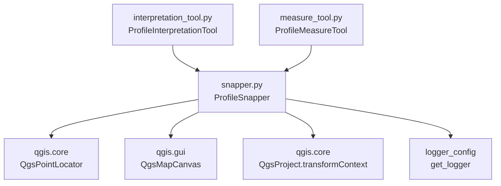

---
tags:
  - secinterp
  - code-walkthrough
  - gui
  - tools
aliases:
  - snapper.py
  - ProfileSnapper
cssclass: secinterp-note
---

# `gui/tools/snapper.py`

> [!abstract] One-line summary
> Snapping helper shared by the profile map tools: turns mouse pixels into `QgsPointXY` snapped to the nearest vertex or edge (12 px tolerance) with a per-layer `QgsPointLocator` cache.

**Path**: `gui/tools/snapper.py` (112 lines)
**Main class**: `ProfileSnapper`
**Layer**: GUI · Tools (uses `QgsPointLocator`, `QgsProject`, and the canvas; no geological logic)
**Tags**: #secinterp #gui #tools

---

## 🎯 Why does this file exist?

Both profile tools (`ProfileInterpretationTool` and `ProfileMeasureTool`) need identical geometry snapping, and duplicating it would drift over time.

| Problem | Solution |
|---------|----------|
| Both tools must "snap" the cursor to existing vertices and edges | `ProfileSnapper.snap(QPoint) -> QgsPointXY` centralizes the best-candidate search |
| Building a `QgsPointLocator` per layer on every move is expensive | `_locators: dict[layer_id, QgsPointLocator]` cache with eviction of vanished layers |
| Non-vector or destroyed layers must not break sketching | `_is_snappable()` filters by vector type; per-layer `try/except` with `continue` |
| Snapping must degrade gracefully when nothing matches | With no valid match, return the raw map point |

> [!important] Architectural note
> Composition over inheritance: tools **contain** a `ProfileSnapper(canvas)` instead of inheriting snapping. The snapper knows nothing of polygons or measurements; only pixels, layers, and tolerances. It is the only spot in `tools/` touching `QgsProject` (for the locators' `transformContext`).

---

## 🧬 Relationship diagram



> [!tip] How to read
> Solid arrow = imports/delegates. The two tools are the only consumers; the snapper never imports them back (one-way dependency).

---

## 📦 Imports — architectural reading

```python
# gui/tools/snapper.py
from __future__ import annotations

from typing import Any

from qgis.core import (
    QgsMapLayer,
    QgsPointLocator,
    QgsPointXY,
    QgsProject,
    QgsVectorLayer,
)
from qgis.gui import QgsMapCanvas
from qgis.PyQt.QtCore import QPoint

from sec_interp.logger_config import get_logger
```

| # | Observation |
|---|-------------|
| ① | `QgsMapLayer` (type check) + `QgsVectorLayer` (`_get_locator` typing): the vector filter is explicit. |
| ② | `QgsPointLocator` is the real engine: `nearestVertex` + `nearestEdge` with a map-unit tolerance. |
| ③ | `QgsProject.instance().transformContext()` — the only global-singleton call in `tools/`; needed to build locators with the live transform context. |
| ④ | `QPoint` (pixel from `event.pos()`) → `QgsPointXY` (map): the `snap()` signature documents the pixel-to-world conversion. |
| ⑤ | `Any` only for locator matches (`current_best`): QGIS exposes no comfortable public type for `QgsPointLocator.Match`. Pragmatic and honest. |
| ⑥ | Zero core or sibling imports: a dependency leaf besides the logger. |

---

## 🏗️ Structure inventory

**Classes (1):** `ProfileSnapper` — 6 methods.

| Method | Signature | Role |
|--------|-------|------|
| `__init__` | `(canvas: QgsMapCanvas) -> None` | Keeps canvas, starts empty cache |
| `snap` | `(mouse_pos: QPoint) -> QgsPointXY` | Snapped point or raw point |
| `_find_best_match_in_locator` | `(locator, point, tolerance, current_best: Any, current_dist: float) -> tuple[Any, float]` | Vertex-vs-edge contest against the global best |
| `_cleanup_locators` | `(current_ids: set[str]) -> None` | Evicts locators of vanished layers |
| `_is_snappable` | `(layer: QgsMapLayer) -> bool` | Valid vector layers only |
| `_get_locator` | `(layer: QgsVectorLayer, crs, context) -> QgsPointLocator \| None` | Creates or reuses the locator (`warning` on failure) |

---

## 📁 Files in the package

| File | Lines | Role |
|---|--:|---|
| `snapper.py` | 112 | This note: shared snapping |
| `interpretation_tool.py` | 269 | Consumer: polygon vertices |
| `measure_tool.py` | 330 | Consumer: polyline vertices + preview |
| `__init__.py` | — | Package marker |

---

## 📖 Method-by-method walkthrough

### `__init__`

```python
def __init__(self, canvas: QgsMapCanvas) -> None:
    self.canvas = canvas
    self._locators: dict[str, QgsPointLocator] = {}
```

No heavy work in the constructor: locators are built lazily on the first `snap()` meeting vector layers. Each tool owns its snapper (and cache), since each tool lives at a different canvas moment.

### `snap`

```python
def snap(self, mouse_pos: QPoint) -> QgsPointXY:
    point = self.canvas.getCoordinateTransform().toMapCoordinates(mouse_pos)
    tolerance = (self.canvas.mapUnitsPerPixel() or 1.0) * 12

    best_match = None
    best_dist = float("inf")

    layers = self.canvas.layers()
    self._cleanup_locators({layer.id() for layer in layers if layer is not None})

    crs = self.canvas.mapSettings().destinationCrs()
    context = QgsProject.instance().transformContext()

    for layer in layers:
        if not self._is_snappable(layer):
            continue
        try:
            locator = self._get_locator(layer, crs, context)
            if locator:
                best_match, best_dist = self._find_best_match_in_locator(
                    locator, point, tolerance, best_match, best_dist
                )
        except Exception:  # nosec B112
            continue

    if best_match:
        return best_match.point()
    return point
```

Four stages: (1) pixel → map; (2) tolerance = 12 pixels in map units (`mapUnitsPerPixel() or 1.0` guards a scaleless canvas); (3) eviction of stale locators **before** iterating; (4) per-layer contest with an individual safety net: if a layer was deleted or its locator blows up, `continue` and the rest still snap. With no matches, the raw point keeps sketching unblocked.

> [!note] Pixel tolerance, not meters
> Multiplying by `mapUnitsPerPixel()` makes snapping zoom-independent: 12 px feels the same near and far. The `or 1.0` avoids a zero tolerance on mocked-canvas tests.

### `_find_best_match_in_locator`

```python
v_match = locator.nearestVertex(point, tolerance)
if v_match.isValid() and v_match.distance() < best_dist:
    best_match = v_match
    best_dist = v_match.distance()

e_match = locator.nearestEdge(point, tolerance)
if e_match.isValid() and e_match.distance() < best_dist:
    best_match = e_match
    best_dist = e_match.distance()
```

Two-round contest per locator: vertex first, then edge, each only when valid **and** better than the running global best. Order matters on ties: at equal distance the vertex wins (evaluated first, edge requires strict `<`). The global best travels as an accumulator across layers, so the final winner is the closest of **all** vector layers.

### `_cleanup_locators`

```python
def _cleanup_locators(self, current_ids: set[str]) -> None:
    hits_to_remove = [lid for lid in self._locators if lid not in current_ids]
    for lid in hits_to_remove:
        del self._locators[lid]
```

Set-difference eviction: any locator whose layer left the canvas is dropped, releasing the locator reference (and with it, the layer). Runs on every `snap()`, so the cost is O(cache) per mouse move: negligible next to building a locator.

### `_is_snappable`

```python
def _is_snappable(self, layer: QgsMapLayer) -> bool:
    """Check if a layer is valid for snapping."""
    return bool(layer and layer.type() == QgsMapLayer.LayerType.VectorLayer)
```

Minimal filter: non-null layer of vector type. Rasters, meshes, and missing layers are silently skipped. Note it does not check `layer.isValid()`: an invalid vector passes the filter and its locator fails later (covered by `snap()`'s `try/except` and `_get_locator()`'s `warning`).

### `_get_locator`

```python
def _get_locator(self, layer: QgsVectorLayer, crs, context) -> QgsPointLocator | None:
    if layer.id() not in self._locators:
        try:
            self._locators[layer.id()] = QgsPointLocator(layer, crs, context)
        except Exception as e:
            logger.warning(f"Failed to create locator for layer {layer.name()}: {e}")
            return None
    return self._locators[layer.id()]
```

Lazy cache keyed by `layer.id()`: the first snap over a layer pays the spatial indexing, later ones reuse it. On build failure (layer destroyed in between), a `warning` with the layer name and `None`, which `snap()` skips quietly. `crs` and `context` are unannotated (`QgsCoordinateReferenceSystem` and `QgsCoordinateTransformContext` would be the strict types).

## 📐 Tolerance, zoom, and CRS

Tolerance lives in pixels even though the locator demands map units. The conversion is one multiplication:

```python
tolerance = (self.canvas.mapUnitsPerPixel() or 1.0) * 12
```

| Zoom (`mapUnitsPerPixel`) | Resulting tolerance | User feel |
|---|---|---|
| 0.5 m/px (very close) | 6 map units | snaps within 12 px |
| 2.0 m/px (medium) | 24 map units | snaps within 12 px |
| 10.0 m/px (far) | 120 map units | snaps within 12 px |

The on-screen radius is constant: zooming in does not make snapping "stickier" in pixels, only more precise in meters. The `or 1.0` covers a scaleless canvas (mocked tests, freshly created canvas): a 12-unit tolerance instead of 0, which would disable every match.

> [!note] The 12 px are fixed, not configurable
> No setting, no parameter: the `* 12` is hardwired in `snap()`. Twelve pixels is the classic CAD/QGIS radius for snapping without hijacking the cursor.

CRS and transform context resolve on every `snap()`:

```python
crs = self.canvas.mapSettings().destinationCrs()
context = QgsProject.instance().transformContext()
```

| Piece | Origin | Purpose |
|---|---|---|
| `crs` | Canvas destination CRS | The locator indexes the layer in this CRS |
| `context` | `QgsProject` singleton | Live datum transforms when building the locator |

> [!warning] The cache ignores `crs` and `context`
> The key is just `layer.id()`: if the user changes the project CRS mid-digitizing, the snapper reuses locators indexed in the old CRS. In practice the preview uses a fixed CRS, but the risk exists with no CRS-change invalidation.

### `snap()` edge cases

| Case | Where it resolves | Result |
|------|-------------------|-----------|
| Canvas without layers | empty loop | raw point |
| Raster or mesh layer | `_is_snappable()` | skipped |
| `None` layer in the list | set comprehension + filter | skipped |
| Invalid vector layer | `_get_locator()` fails → `warning` | skipped, `None` |
| Locator throwing in `nearest*` | `except Exception: continue` | that layer does not compete |
| No valid match | `if best_match` false | raw point |
| Scaleless canvas | `or 1.0` | 12-unit tolerance |
| Layer deleted between snaps | `_cleanup_locators()` | locator evicted |

## 🥊 Candidate duel: worked example

Say the cursor is at `(100, 50)` with tolerance 12 and two vector layers. The accumulator starts at `(None, inf)`:

| Step | Query | Result | Accumulator |
|---|---|---|---|
| 1 | `nearestVertex` layer A → vertex at `(102, 51)`, dist ≈ 2.2 | valid and `2.2 < inf` | (vertex A, 2.2) |
| 2 | `nearestEdge` layer A → edge at dist 8.0 | valid but `8.0 < 2.2` false | unchanged |
| 3 | `nearestVertex` layer B → vertex at dist 1.1 | valid and `1.1 < 2.2` | (vertex B, 1.1) |
| 4 | `nearestEdge` layer B → edge at dist 1.1 | valid but strict `<` fails on tie | unchanged (vertex wins) |

`snap()` returns `best_match.point()`: layer B's vertex. Three visible rules: the global best spans layers, an edge only wins when strictly closer, and ties go to the vertex by evaluation order.

## 🔁 Call frequency and cost

`snap()` fires on every `canvasMoveEvent` (each movement pixel with existing points) and every `canvasReleaseEvent` of both tools: dozens of calls per second when sketching fast.

| Cost per `snap()` | Magnitude | Note |
|---|---|---|
| `toMapCoordinates()` | O(1) | affine transform |
| `_cleanup_locators()` | O(cache) | set difference |
| Per-layer locator lookup | O(1) amortized | dict by `layer.id()` |
| `nearestVertex` + `nearestEdge` | O(log n) each | locator spatial index |
| New locator build | O(n) once | first time per layer only |

The design pays indexing once and serves the rest from cache: mouse movement never rebuilds indexes unless a new layer appears. That is why the snapper lives as a per-tool object, not a bare function: the cache needs an owner with a lifecycle.

The locator also never hears about geometry edits: moving a layer vertex does **not** refresh the index until the locator is rebuilt. Since the cache only evicts by `layer.id()`, edited geometry leaves stale snapping until the layer leaves and rejoins the canvas. It is the same staleness class [[layer_notification_manager]] solves for the central cache — unsolved here.

> [!tip] How to profile snapping
> If the cursor lags, suspects in order are: a huge layer indexed for the first time (single O(n) spike), dozens of competing vector layers (O(layers) per move), and an anomalous `mapUnitsPerPixel()` blowing up the tolerance.
> With fewer than 10 vector layers and built locators, each `snap()` costs microseconds and is invisible while sketching.

---

## 🔄 Data flow

| Phase | Input | Transformation | Output |
|-------|-------|----------------|--------|
| Conversion | `QPoint` (pixel from `event.pos()`) | `toMapCoordinates()` | raw point in map units |
| Tolerance | `mapUnitsPerPixel()` | `× 12` | search radius in map units |
| Eviction | `canvas.layers()` | id difference | cache without orphan locators |
| Contest | per-layer locators on vector layers | `nearestVertex` + `nearestEdge` vs. global best | best `Match` or `None` |
| Degradation | no valid match | — | raw point (sketching continues) |

---

## 🏛️ Design patterns present

| Pattern | Where | Purpose |
|---------|-------|---------|
| **Composition / Shared helper** | Tools contain `ProfileSnapper` | One snapping for two sketch semantics |
| **Cache / Lazy init** | `_locators` + `_get_locator()` | Index each layer once |
| **Guard filter** | `_is_snappable()` | Exclude non-vectors before expensive work |
| **Per-layer bulkhead** | `try/except: continue` in `snap()` | One broken layer never sinks global snapping |
| **Graceful degradation** | raw-point return | Always draw, snap when possible |

---

## 🧾 API summary

| Symbol | Signature / Inherits | Typical use |
|--------|----------------------|-------------|
| `ProfileSnapper` | helper class (no QGIS base) | `ProfileSnapper(canvas)` once per tool |
| `snap` | `(mouse_pos: QPoint) -> QgsPointXY` | `self.snapper.snap(event.pos())` in `canvasReleaseEvent`/`canvasMoveEvent` |
| `_get_locator` | `(layer, crs, context) -> QgsPointLocator \| None` | Internal; testable by patching `QgsPointLocator` |
| `_is_snappable` | `(layer) -> bool` | Internal; vector gate |
| `_cleanup_locators` | `(set[str]) -> None` | Internal; evicted per `snap()` |

---

## 🛡️ Error handling

| Situation | Behavior |
|-----------|----------|
| Non-vector or `None` layer | Skipped by `_is_snappable()`, no log |
| `QgsPointLocator(layer, ...)` fails | `warning` with `layer.name()`, return `None` |
| Exception during `nearestVertex`/`nearestEdge` | Caught per layer (`nosec B112`), `continue` |
| Scaleless canvas (`mapUnitsPerPixel()` falsy) | `or 1.0`: 12 map-unit tolerance |
| No matches on any layer | Raw point: the tool draws unsnapped |

The `except Exception: continue` carries a `nosec B112` (accepted try-except-continue): intentional, not laziness. The real risk is silence: chronically failing layers leave only a creation-time `warning`, never per-use noise.

---

## 🧪 Associated tests

No file of its own: covered inside its consumers' tests (Mock-first, patched `QgsPointLocator`):

- `tests/gui/test_measure_tool.py` — `test_snapper_no_layers` (no layers returns the point untouched) plus mocked-locator cases (valid/invalid match, failing `_get_locator`, `None` locator).
- `tests/gui/test_interpretation_tool.py` — `test_snapper_skips_and_continues` (raster skipped, invalid locator harmless), vertex/edge cases, and `_get_locator` raising or returning `None`.

Nothing in `tests/core/` applies (uses `QgsPointLocator` and `QgsProject`). The 12 px tolerance and locator eviction are exercised indirectly through the mocked canvas (`mapUnitsPerPixel() == 1.0`, `layers() == []`).

---

## 👀 Observations and notes

> [!success] Strengths
> - One implementation for two tools: snapping cannot diverge.
> - Lazy cache + per-snap eviction: performance without leaks as layers come and go.
> - Total degradation: sketching never blocks for lack of snapping.
> - Pixel tolerance: constant feel at any zoom.

> [!warning] Points of attention
> - `_is_snappable()` does not require `layer.isValid()`: invalid layers pay one locator attempt + `warning` before being dropped.
> - Each tool builds its own snapper: two live locator caches if both tools coexist (in practice only one is active).
> - Cached locators can go **stale** if a layer's geometry changes without changing its `id`: no `dataChanged` invalidation (see [[layer_notification_manager]] as a model).
> - Unannotated `crs`/`context` hinder `_get_locator()` readability.

> [!question] Open questions
> - Wire `layer.dataChanged` to invalidate that layer's locator, as the central cache invalidates buckets?
> - Share a single `ProfileSnapper` instance between both tools via `ToolManager`?

---

## 🔗 Related notes

- [[Index]] — vault index
- [[gui_tools]] — family note for tools
- [[interpretation_tool]] — consumer: digitized polygon vertices
- [[measure_tool]] — consumer: polyline vertices + metric preview
- [[dialog_tool_manager]] — owns the tools (and with them, their snappers)
- [[layer_notification_manager]] — `dataChanged` invalidation: model for stale locators
- [[preview_layer_factory]] — builds the layers the snapper snaps onto

---

*Note of the SecInterp Code Walkthrough v2 vault — v3.8.0*
