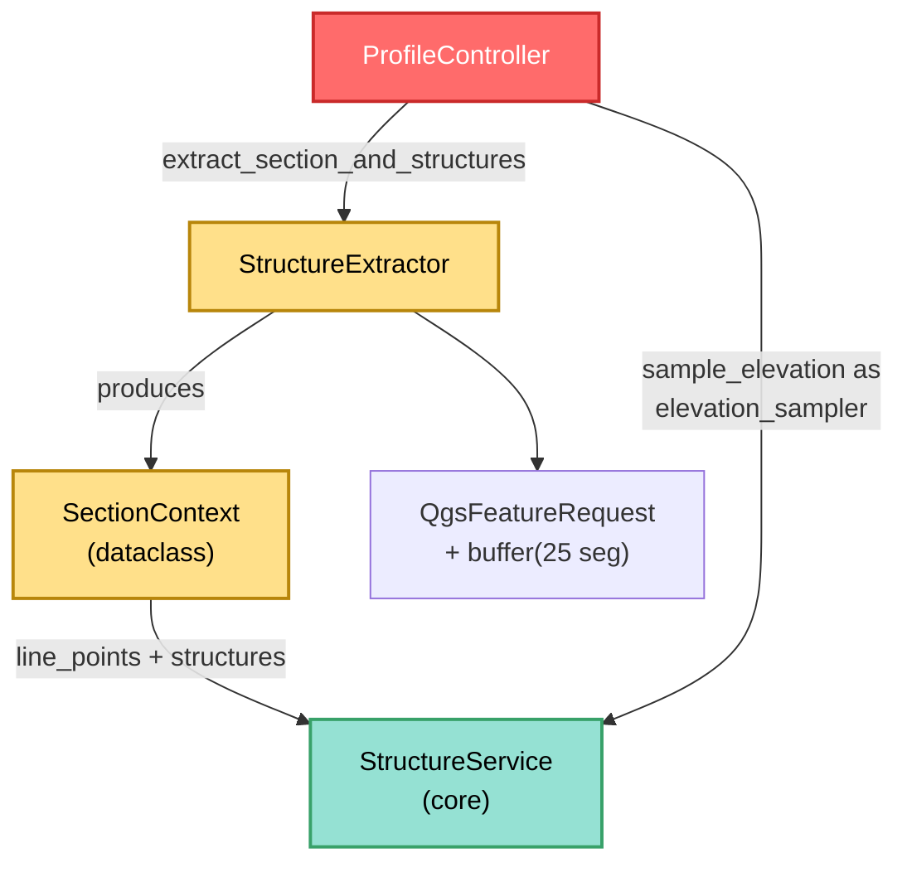

---
tags:
  - secinterp
  - code-walkthrough
  - gui
  - adapters
aliases:
  - structure_extractor.py
  - StructureExtractor
  - SectionContext
cssclass: secinterp-note
---

# `gui/adapters/structure_extractor.py`

> [!abstract] One-line summary
> **Extract** adapter for structures that reads the section line and the measurement layer, filters by buffer, detaches points and attributes to primitives (`SectionContext`), and samples DEM elevations so `StructureService` never touches QGIS.

**Path**: `gui/adapters/structure_extractor.py` (226 lines)
**Main class**: `StructureExtractor` (+ `SectionContext` dataclass)
**Layer**: GUI · Adapter (Extract side, depends on QGIS)
**Tags**: #secinterp #gui #adapters

---

## 🎯 Why does this file exist?

Projecting a structural measurement (strike/dip) onto the section requires
knowing where it falls relative to the line, with which attributes and at which
elevation. Those three pieces live in QGIS objects the core cannot import:

| Problem | Solution |
|---------|----------|
| The core cannot read `QgsVectorLayer` or `QgsFeatureRequest` | `extract_section_and_structures` returns a pure `SectionContext` |
| Only measurements near the section matter | `detach_structures` filters by buffer + exact `intersects` |
| Geometries may be points, lines or polygons | `_feature_point` unifies: direct point or centroid |
| Elevation must come from the DEM at projection time | `sample_elevation(raster_lyr, x, y, band)` + callback into the core |

> [!important] Architectural note
> **Extract Adapter** with its own DTO (`SectionContext`, not reusing
> `task_inputs.py`): `line_points`, `line_start`, `line_azimuth` and `structures`
> as `{"point": (x, y), "attributes": {...}}`. The `controller` additionally uses
> `sample_elevation` as the **`elevation_sampler`** (`Callable`) injected into
> `StructureService.project_structures` — see [[structure_service]].

---

## 🧬 Relationship diagram



> [!tip] How to read
> Double delivery to `StructureService`: the `SectionContext` (data) and the
> `sample_elevation` callback (on-demand DEM sampling). This module produces both.

---

## 📦 Imports — architectural reading

```python
# gui/adapters/structure_extractor.py
from __future__ import annotations

import math
from dataclasses import dataclass, field
from typing import Any

from qgis.core import (
    QgsFeature,
    QgsFeatureRequest,
    QgsGeometry,
    QgsRaster,
    QgsRasterLayer,
    QgsVectorLayer,
    QgsWkbTypes,
)
```

| # | Observation |
|---|-------------|
| ① | Seven `qgis.core` classes but **no** `QgsProject`, `QgsDistanceArea` or module-level `QgsPointXY` (`QgsPointXY` is lazily imported inside `sample_elevation`). |
| ② | No `qgis.PyQt` and no `self.tr()`: the only large extractor **without i18n** — no user messages, failures are silent `None`/`[]`/`0.0`. |
| ③ | No core imports (no DTOs, no exceptions, no `scu`): the most self-contained module of the package; in exchange it duplicates attribute sanitizing (see `_extract_attributes`). |
| ④ | `dataclass` + `field` for `SectionContext` (with `default_factory=list`: avoids the classic mutable-default bug). |
| ⑤ | `QgsWkbTypes` distinguishes `PointGeometry` (direct point) from the rest (centroid). |
| ⑥ | `math` again only for the azimuth (`atan2`), identical to drillholes and geology. |

---

## 🏗️ Structure inventory

**Dataclass:** `SectionContext` — 4 defaulted fields.

| Field | Type | Default | Meaning |
|-------|------|---------|---------|
| `line_points` | `list[tuple[float, float]]` | `[]` | section vertices |
| `line_start` | `tuple[float, float]` | `(0.0, 0.0)` | first vertex |
| `line_azimuth` | `float` | `0.0` | compass bearing |
| `structures` | `list[dict[str, Any]]` | `[]` | detached `{"point", "attributes"}` |

**Class:** `class StructureExtractor` — 9 methods (4 public + 5 private).

**Public methods:**
- `extract_section_and_structures(line_lyr, struct_lyr, buffer_m)` — orchestrator → `SectionContext | None`.
- `extract_line(line_geom)` — `(line_points, line_start, line_azimuth)` from a geometry (reusable without a layer).
- `detach_structures(struct_lyr, line_geom, buffer_m)` — buffer + detach → dict list.
- `sample_elevation(raster_lyr, x, y, band_number=1)` — point elevation or `0.0`.

**Private methods:**
- `_read_line_geometry(line_lyr)` — first feature; `None` when missing or null.
- `_extract_line_points(geometry)` — tuples from single/multipart (first part).
- `_calculate_azimuth(points)` — bearing from the first two vertices (`0.0` when < 2).
- `_feature_point(feature)` — representative `(x, y)` (point or centroid).
- `_extract_attributes(feature)` — sanitized dict (`None`/`NULL` → `None`, rest to primitives or `str`).

---

## 📁 Files in the package

The extractor lives in the `gui/adapters/` package (the full Extract phase):

| File | Lines | Role |
|---|--:|---|
| `__init__.py` | 7 | Package docstring: Extract-then-Compute contract |
| `drillhole_extractor.py` | 369 | `DrillholeExtractor` → `DrillholeContext` |
| `geology_extractor.py` | 235 | `GeologyExtractor` → `GeologyContext` |
| `geometry.py` | 226 | QGIS geometry helpers and DEM sampling |
| `layer_resolver.py` | 113 | `LayerResolver` + `resolve_layer` (layer cache) |
| `structure_extractor.py` | 226 | `SectionContext` + `StructureExtractor` (this note) |
| `validation_extractor.py` | 176 | `resolve_layer_metadata`, `build_validation_params` |
| `feature_fetcher.py` | 84 | `DataFetcher` (bulk child reads) |
| `profile_extractor.py` | 86 | `ProfileExtractor` → `ProfileData` |

---

## 📖 Method-by-method walkthrough

### `extract_section_and_structures` — Extract orchestrator

```python
def extract_section_and_structures(self, line_lyr, struct_lyr, buffer_m):
    line_geom = self._read_line_geometry(line_lyr)
    if line_geom is None:
        return None
    line_points, line_start, line_azimuth = self.extract_line(line_geom)
    structures = self.detach_structures(struct_lyr, line_geom, buffer_m)
    return SectionContext(
        line_points=line_points,
        line_start=line_start,
        line_azimuth=line_azimuth,
        structures=structures,
    )
```

Three steps with no field validation (measurements are validated later in the
core, level 3): line → decomposed line → structures. Without a valid line,
`None`. The structure layer may be `None`/invalid: `detach_structures` returns
`[]` without error.

### `extract_line` — reusable decomposition

```python
def extract_line(self, line_geom):
    line_points = self._extract_line_points(line_geom)
    line_start = line_points[0] if line_points else (0.0, 0.0)
    line_azimuth = self._calculate_azimuth(line_points)
    return line_points, line_start, line_azimuth
```

Operates on an already-read geometry (not on the layer): testable with a mocked
`QgsGeometry` and reusable by anyone already holding the line. Defensive against
empty lines (`(0.0, 0.0)`, `0.0`).

### `detach_structures` — buffer and detach

```python
def detach_structures(self, struct_lyr, line_geom, buffer_m):
    if not struct_lyr or not struct_lyr.isValid():
        return []
    buffer_geom = line_geom.buffer(buffer_m, 25)
    request = QgsFeatureRequest().setFilterRect(buffer_geom.boundingBox())
    detached: list[dict[str, Any]] = []
    for feature in struct_lyr.getFeatures(request):
        if not feature.hasGeometry() or not feature.geometry().intersects(buffer_geom):
            continue
        point = self._feature_point(feature)
        if point is None:
            continue
        detached.append(
            {
                "point": point,
                "attributes": self._extract_attributes(feature),
            }
        )
    return detached
```

Same double filter as drillholes (cheap bbox + exact `intersects`) but with
**25 buffer segments** (smoother than drillholes' 8: structures are projected
visually and the edge matters). No CRS reprojection here (unlike drillholes'
`_prepare_feature_request`): same-CRS is assumed.

### `sample_elevation` — on-demand DEM elevation

```python
def sample_elevation(self, raster_lyr, x, y, band_number=1):
    if not raster_lyr or not raster_lyr.isValid():
        return 0.0
    try:
        from qgis.core import QgsPointXY
        ident = raster_lyr.dataProvider().identify(
            QgsPointXY(x, y), QgsRaster.IdentifyFormat.IdentifyFormatValue
        )
        if ident.isValid():
            val = ident.results().get(band_number)
            if val is not None:
                return float(val)
    except (AttributeError, ValueError, TypeError):
        pass
    return 0.0
```

Twin of `geometry.sample_point_elevation` (same `identify` API, same failure
`0.0`) but as an **injectable method**: the `controller` passes it as
`elevation_sampler` to the core (`controller.py:327`, inside
`_process_structures`). The deferred `QgsPointXY` import avoids loading it at
module level.

### `_read_line_geometry` — first feature

```python
def _read_line_geometry(self, line_lyr):
    line_feat = next(line_lyr.getFeatures(), None)
    if not line_feat:
        return None
    line_geom = line_feat.geometry()
    if not line_geom or line_geom.isNull():
        return None
    return line_geom
```

Same spirit as drillholes', but here the empty layer is also a silent `None`
(no `DataMissingError`): this module imports no core exceptions.

### `_extract_line_points` / `_calculate_azimuth` — vertices and bearing

```python
def _extract_line_points(self, geometry):
    if geometry.isMultipart():
        parts = geometry.asMultiPolyline()
        polyline = parts[0] if parts else []
    else:
        polyline = geometry.asPolyline()
    return [(p.x(), p.y()) for p in polyline]

def _calculate_azimuth(self, points):
    MIN_REQUIRED_POINTS = 2
    if len(points) < MIN_REQUIRED_POINTS:
        return 0.0
    p1, p2 = points[0], points[1]
    azimuth = math.degrees(math.atan2(p2[0] - p1[0], p2[1] - p1[1]))
    if azimuth < 0:
        azimuth += 360
    return azimuth
```

Third copy of the same line→tuples + azimuth pair (drillholes, geology,
structures): the trio shares the shape but not the code — a candidate to factor
into `geometry.py`.

### `_feature_point` — representative point

```python
def _feature_point(self, feature: QgsFeature) -> tuple[float, float] | None:
    geom = feature.geometry()
    if not geom or geom.isNull():
        return None
    if geom.type() == QgsWkbTypes.GeometryType.PointGeometry:
        pt = geom.asPoint()
    else:
        centroid = geom.centroid()
        if centroid.isNull():
            return None
        pt = centroid.asPoint()
    return (pt.x(), pt.y())
```

Points → direct coordinates; lines/polygons → centroid (a measurement drawn as a
short segment stays projectable). Null centroid → `None` and the feature is
skipped.

### `_extract_attributes` — own sanitizing

```python
def _extract_attributes(self, feature: QgsFeature) -> dict[str, Any]:
    if not hasattr(feature, "fields"):
        return {}
    names = feature.fields().names()
    raw_values = feature.attributes()
    sanitized: dict[str, Any] = {}
    for name, val in zip(names, raw_values, strict=False):
        if val is None or str(val) == "NULL":
            sanitized[name] = None
        elif isinstance(val, int | float | str | bool):
            sanitized[name] = val
        else:
            sanitized[name] = str(val)
    return sanitized
```

Replicates what `scu.extract_feature_attributes` does for the other extractors
(QGIS `NULL` → `None`, primitives untouched, rest to `str`), but hand-rolled
here instead of reusing `scu`. The `zip(..., strict=False)` tolerates
field/value misalignments.

---

## 🔄 Data flow

| Phase | Input | Transformation | Output |
|-------|-------|----------------|--------|
| Line | 1st feature | `_read_line_geometry` → `extract_line` | `line_points`, `line_start`, `line_azimuth` |
| Buffer | `line_geom` + `buffer_m` | `buffer(buffer_m, 25)` + bbox | `QgsFeatureRequest` |
| Filter | candidate features | `hasGeometry` + `intersects` | nearby features |
| Point | feature | point or centroid | `(x, y)` or drop |
| Attributes | feature | `_extract_attributes` | sanitized dict |
| Context | all of the above | dataclass | pure `SectionContext` |
| Elevation (deferred) | `(x, y)` + DEM | `identify` via callback | `float` to the core |

---

## 🏛️ Design patterns present

| Pattern | Where | Purpose |
|---------|-------|---------|
| **Adapter (Extract)** | whole module | QGIS in, primitives out |
| **Own DTO** | `SectionContext` | Typed contract without depending on `task_inputs` |
| **Strategy (callback)** | `sample_elevation` as `elevation_sampler` | The core samples without knowing the raster |
| **Double spatial filter** | bbox + `intersects` | Performance + precision |

---

## 🧾 API summary

| Symbol | Signature / Inherits | Typical use |
|--------|----------------------|-------------|
| `SectionContext` | `@dataclass` (`line_points`, `line_start`, `line_azimuth`, `structures`) | Extract→Compute DTO |
| `StructureExtractor` | dependency-free GUI class | `StructureExtractor()` |
| `extract_section_and_structures` | `(line_lyr, struct_lyr, buffer_m) -> SectionContext \| None` | Entry point |
| `extract_line` | `(line_geom) -> tuple[list, tuple, float]` | Reusable decomposition |
| `detach_structures` | `(struct_lyr, line_geom, buffer_m) -> list[dict]` | Filtered detach |
| `sample_elevation` | `(raster_lyr, x, y, band_number=1) -> float` | `elevation_sampler` callback |

---

## 🛡️ Error handling

| Situation | Behaviour |
|-----------|-----------|
| Line without features or null geometry | `return None` (silent) |
| Missing/invalid structure layer | `[]` (silent) |
| Feature without geometry or outside buffer | `continue` |
| Geometry with no representable point | skipped |
| Invalid raster / invalid `identify` / `None` value | `0.0` |
| Feature without `fields` | `{}` |

> [!warning] Total silence
> No failure raises or logs: a `SectionContext` with `structures=[]` may mean
> "no layer", "empty layer" or "nothing in the buffer". The GUI cannot tell them
> apart without extra instrumentation.

---

## 🧪 Associated tests

No dedicated unit tests under `tests/gui/`; indirect coverage:

- `tests/integration/test_geology_structure_workflow.py` — integrated structure flow (extract + `StructureService`).
- `tests/integration/test_3d_integration_advanced.py` — structures in the 3D pipeline.
- `tests/core/test_structure_service.py` — core consumer with a mocked `elevation_sampler` (a lambda, not this method).
- `tests/core/test_structural_parsing_advanced.py` — strike/dip parsing over attributes like these.
- `tests/base_test.py` — QGIS mocks for a future `test_structure_extractor.py`.

> [!warning] Coverage gap
> `_feature_point` (point vs centroid vs null), `_extract_attributes`
> (`NULL` conversion) and `detach_structures` (buffer filter) are textbook
> mock-first cases with no covering test.

---

## 🧵 Thread-safety and i18n

| Aspect | Detail |
|--------|--------|
| **Thread** | Main thread: `getFeatures`, `buffer`, `intersects`, `identify` use live objects. Only `SectionContext` and the callback travel to the `QgsTask`. |
| **Callback** | `sample_elevation` runs wherever the core invokes it: it must be called from the main thread or with a thread-safe DEM (see [[structure_service]]). |
| **i18n** | Absent by design: no `qgis.PyQt`, no `tr()`, no messages. When adding validation with messages, follow the sibling pattern `QCoreApplication.translate("StructureExtractor", ...)` |

---

## 📐 `SectionContext` vs the `task_inputs` DTOs

| Aspect | `SectionContext` (here) | `DrillholeContext` / `GeologyContext` (`task_inputs.py`) |
|--------|-------------------------|-----------------------------------------------------------|
| Defined | dataclass in the GUI adapter | dataclasses in `core/domain` |
| Dependency | importable only with QGIS | QGIS-agnostic |
| `line_start` | `(x, y)` tuple | `GeologyContext` omits it (uses internal QGIS `line_start`) |
| Consumer | `StructureService.project_structures` (via controller) | `DrillholeService` / `GeologyService` |

> [!note] Why not in the core?
> `SectionContext` holds only primitives and *could* live in `task_inputs.py`
> next to its siblings. Keeping it here couples the contract to the adapter;
> moving it to the core would unify the Extract DTOs in one package.

---

## 👀 Observations and notes

> [!success] Strengths
> - Separable, layer-free `extract_line` (geometry only).
> - `_feature_point` tolerates non-point layers via centroid.
> - 25-segment buffer: smooth edge for visual projection.
> - Injectable `sample_elevation` callback (clean boundary with the core).

> [!warning] Points of attention
> - Third duplicate of `_extract_line_points` + `_calculate_azimuth`: factor into `geometry.py`.
> - `_extract_attributes` duplicates `scu.extract_feature_attributes` without reusing it.
> - No CRS reprojection (drillholes has it): layers in a different CRS filter silently wrong.
> - Zero i18n and zero logging: failures indistinguishable from each other.

> [!question] Open questions
> - Move `SectionContext` to `core/domain/task_inputs.py`?
> - Reuse `scu.extract_feature_attributes` in `_extract_attributes`?
> - Add `target_crs` like drillholes for multi-CRS layers?

---

## 🔗 Related notes

- [[Index]] — vault index
- [[gui_adapters]] — Extract adapters package note
- [[structure_service]] — core consumer + `elevation_sampler` contract
- [[controller]] — `ProfileController._process_structures` (lines ~316-327)
- [[task_inputs]] — sibling DTOs (`DrillholeContext`, `GeologyContext`)
- [[drillhole_extractor]] — sibling extractor (analogous double filter + buffer)
- [[core_validation]] — level-3 validation the core applies afterwards
- [[measurement]] — structural measurement domain entity

---

*Note of the SecInterp Code Walkthrough v2 vault — v3.8.0*
