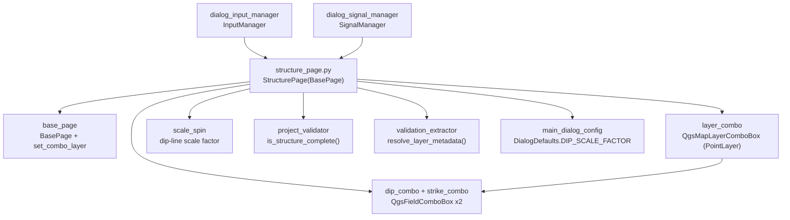

---
tags:
  - secinterp
  - code-walkthrough
  - gui
  - pages
aliases:
  - structure_page.py
  - StructurePage
cssclass: secinterp-note
---

# `gui/ui/pages/structure_page.py`

> [!abstract] One-line summary
> Structural measurements page: point layer with modern/classic filter, dip and strike combos with joint refresh, dip-line scale factor, and a `dataChanged` signal.

**Path**: `gui/ui/pages/structure_page.py` (166 lines)
**Main class**: `StructurePage(BasePage)`
**Layer**: GUI (programmatic presentation · Extract into `ValidationParams`)
**Tags**: #secinterp #gui #pages

---

## 🎯 Why does this file exist?

Strike-and-dip measurements are projected onto the section as dip lines. The page
concentrates the Extract phase of that domain: which point layer and which
dip/strike fields feed the core `StructureService`.

| Problem | Solution |
|---------|----------|
| Users must pick a point layer and the two angular fields (dip 0–90, strike 0–360) | `layer_combo` + `dip_combo` + `strike_combo` with range tooltips |
| Switching layers must refresh **both** field combos at once | `_on_layer_changed` pins the layer on both combos in one step |
| Drawn dip-line size must be adjustable | `scale_spin` (0.1–100, default `DIP_SCALE_FACTOR`) |
| The dialog must revalidate on any change | Dedicated `dataChanged` signal from layer and both fields |

> [!important] Architectural note
> Extract with a deferred callback: the page delivers layer and fields, and the core
> additionally receives a GUI-injected `elevation_sampler` (see `IStructureService`).
> Nothing is sampled here: only the measurement source is configured.

---

## 🧬 Relationship diagram



> [!tip] How to read
> Solid arrow = imports/delegates; `LC → DC` is `_on_layer_changed` (one step, two combos).

---

## 📦 Imports — architectural reading

```python
# gui/ui/pages/structure_page.py
from __future__ import annotations

import contextlib
from typing import Any

from qgis.core import QgsMapLayerProxyModel
from qgis.gui import QgsDoubleSpinBox, QgsFieldComboBox, QgsMapLayerComboBox
from qgis.PyQt.QtCore import QCoreApplication, pyqtSignal
from qgis.PyQt.QtWidgets import QGridLayout, QLabel

from sec_interp.core.validation.project_validator import ProjectValidator, ValidationParams
from sec_interp.gui.adapters.validation_extractor import resolve_layer_metadata
from sec_interp.gui.main_dialog_config import DialogDefaults

from .base_page import BasePage, set_combo_layer
```

| # | Observation |
|---|-------------|
| ① | `QgsMapLayerProxyModel` as the point-filter fallback (consistent trio with [[geology_page]] and [[section_page]]). |
| ② | Two `QgsFieldComboBox` widgets (`dip_combo`, `strike_combo`): the only simple page with two fields to refresh. |
| ③ | `pyqtSignal` for `dataChanged`; mixed `contextlib` + `try/except` in `disconnect_signals`. |
| ④ | `DialogDefaults.DIP_SCALE_FACTOR` (`"4"`) for the spin: no hardcoded default on this page. |
| ⑤ | Complete Extract boundary: validator + extractor + centralised default. |

---

## 🏗️ Structure inventory

**`StructurePage(BasePage)` class:**

- `dataChanged = pyqtSignal()` signal and `layer_keys = frozenset({"struct_layer"})`
- `__init__(self, parent: Any = None) -> None`
- `_setup_ui(self) -> None` — 4-row grid + direct wiring
- `_on_layer_changed(self, layer: Any) -> None`
- `get_data(self) -> dict[str, Any]` — `structural_layer/dip_field/strike_field/dip_scale_factor`
- `dump(self) -> dict[str, Any]` — `struct_layer/struct_dip_field/struct_strike_field/dip_scale_factor`
- `load(self, data: dict[str, Any]) -> None`
- `reset(self) -> None`
- `is_complete(self) -> bool` — via `is_structure_complete`
- `disconnect_signals(self) -> None` (no custom `connect_signals`)

**Widgets:**

| Widget | Type | Role |
|--------|------|------|
| `layer_combo` | `QgsMapLayerComboBox` | Point layer (`PointLayer` filter, empty allowed) |
| `dip_combo` | `QgsFieldComboBox` | Dip field (0–90) |
| `strike_combo` | `QgsFieldComboBox` | Strike field (0–360) |
| `scale_spin` | `QgsDoubleSpinBox` 0.1–100, step 0.5 | Dip-line length factor |
| `group_layout` | `QGridLayout` (spacing 6) | 4-row grid |

---

## 📖 Method-by-method walkthrough

### `__init__` — structural title

```python
def __init__(self, parent: Any = None) -> None:
    super().__init__(
        QCoreApplication.translate("StructurePage", "Structural Measurements"),
        parent,
    )
```

No `iface`, no own state. The `"StructurePage"` context groups the title with all
four row labels.

### `_setup_ui` — four rows plus immediate wiring

```python
def _setup_ui(self) -> None:
    super()._setup_ui()

    self.group_layout = QGridLayout(self.group_box)
    self.group_layout.setSpacing(6)

    # Row 0: Structural Layer
    self.group_layout.addWidget(QLabel(self.tr("Structural Layer")), 0, 0)

    self.layer_combo = QgsMapLayerComboBox()

    # Use modern flags if available (QGIS 3.32+)
    try:
        from qgis.core import Qgis  # noqa: PLC0415

        self.layer_combo.setFilters(Qgis.LayerFilters(Qgis.LayerFilter.PointLayer))
    except (ImportError, AttributeError, TypeError):
        self.layer_combo.setFilters(QgsMapLayerProxyModel.Filter.PointLayer)

    # ... allow-empty + tooltip + index 0 ...
    # Row 1: "Dip Field" + dip_combo ("dip values (0-90)")
    # Row 2: "Strike Field" + strike_combo ("strike values (0-360)")
    # Row 3: "Dip Line Scale" + scale_spin (0.1-100, DIP_SCALE_FACTOR, step 0.5)

    # Connections: update fields when layer changes
    self.layer_combo.layerChanged.connect(self._on_layer_changed)

    # Emit dataChanged when selections change
    self.layer_combo.layerChanged.connect(self.dataChanged.emit)
    self.dip_combo.fieldChanged.connect(self.dataChanged.emit)
    self.strike_combo.fieldChanged.connect(self.dataChanged.emit)
```

The page quirk: it connects its four signals **here**, not in `connect_signals`
(which inherits the base `pass`). Consequence: if `SignalManager` calls
`connect_signals()` expecting wiring, nothing happens; and re-running `_setup_ui`
duplicates the connections. See observations.

### `_on_layer_changed` — joint field refresh

```python
def _on_layer_changed(self, layer: Any) -> None:
    """Update both field combos when layer changes."""
    self.dip_combo.setLayer(layer)
    self.strike_combo.setLayer(layer)
```

One slot for two combos: guarantees dip and strike always describe the same layer
(two separate `setLayer` connections could diverge if one failed). Takes the
`layerChanged`-emitted layer as an argument, never reading the combo.

### `get_data` — four keys

```python
def get_data(self) -> dict[str, Any]:
    """Get structural configuration."""
    return {
        "structural_layer": self.layer_combo.currentLayer(),
        "dip_field": self.dip_combo.currentField(),
        "strike_field": self.strike_combo.currentField(),
        "dip_scale_factor": self.scale_spin.value(),
    }
```

Live layer + two fields + numeric factor. `InputManager` maps them to the
`ValidationParams` `struct_layer/struct_dip_field/struct_strike_field/dip_scale_factor`;
the core additionally receives the `elevation_sampler` from the orchestrator (not
from this page).

### `dump` / `load` — `structural_` → `struct_` renaming

```python
def dump(self) -> dict[str, Any]:
    return {
        "struct_layer": self.layer_combo.currentLayer(),
        "struct_dip_field": self.dip_combo.currentField(),
        "struct_strike_field": self.strike_combo.currentField(),
        "dip_scale_factor": self.scale_spin.value(),
    }

def load(self, data: dict[str, Any]) -> None:
    struct_layer = data.get("struct_layer")
    if struct_layer is not None:
        set_combo_layer(self.layer_combo, struct_layer)
        self.dip_combo.setLayer(struct_layer)
        self.strike_combo.setLayer(struct_layer)
    dip = data.get("struct_dip_field")
    if dip:
        self.dip_combo.setField(dip)
    # ... same for struct_strike_field ...
    dip_scale = data.get("dip_scale_factor")
    if dip_scale is not None:
        self.scale_spin.setValue(float(dip_scale))
```

As in [[geology_page]], `load` pins the layer silently and propagates to **both**
combos in the same step (never waiting for the blocked `layerChanged`). Fields
apply only when non-empty; the factor only when not `None`.

### `reset` — empty plus default factor

```python
def reset(self) -> None:
    self.layer_combo.setLayer(None)
    self.dip_combo.setField("")
    self.strike_combo.setField("")
    self.scale_spin.setValue(float(DialogDefaults.DIP_SCALE_FACTOR))
```

Empties layer and both fields, restoring the factor to `"4"`. `setLayer(None)`
fires `layerChanged` → `_on_layer_changed(None)` clears both combos: a welcome
cleanup cascade, as in [[dem_page]] and [[geology_page]].

### `is_complete` — layer plus two fields

```python
def is_complete(self) -> bool:
    data = self.get_data()
    params = ValidationParams(
        struct_layer=resolve_layer_metadata(data["structural_layer"]),
        struct_dip_field=data["dip_field"],
        struct_strike_field=data["strike_field"],
    )
    return ProjectValidator.is_structure_complete(params)
```

`is_structure_complete` requires layer + dip + strike before validating with
`StructureValidator`. The [[dialog_input_manager]] rule mirrors it:
`is_structure_complete(p) if p.struct_layer else True` — no layer means the block
is skipped.

### `disconnect_signals` — mixed `try` + `suppress`

```python
def disconnect_signals(self) -> None:
    try:
        self.layer_combo.layerChanged.disconnect(self._on_layer_changed)
        self.layer_combo.layerChanged.disconnect(self.dataChanged.emit)
    except (TypeError, RuntimeError):
        pass
    with contextlib.suppress(TypeError, RuntimeError):
        self.dip_combo.fieldChanged.disconnect(self.dataChanged.emit)
    with contextlib.suppress(TypeError, RuntimeError):
        self.strike_combo.fieldChanged.disconnect(self.dataChanged.emit)
    with contextlib.suppress(TypeError, RuntimeError):
        self.dataChanged.disconnect()
```

Mixes the global `try/except` ([[dem_page]] style) for `layerChanged` with
per-line `suppress` ([[geology_page]] style) for the rest, plus the global
`dataChanged.disconnect()`. It reverts exactly the four `_setup_ui` connections.

---

## 🗂️ Read keys vs session keys

| Source | Layer | Fields | Factor |
|--------|-------|--------|--------|
| `get_data` | `structural_layer` (live) | `dip_field / strike_field` | `dip_scale_factor` |
| `dump` / `load` | `struct_layer` | `struct_dip_field / struct_strike_field` | `dip_scale_factor` (same) |
| `layer_keys` | `{"struct_layer"}` | — (primitives) | — (primitive) |
| `InputManager` | `struct_layer` (`LayerMetadata`) | `struct_dip/strike_field` | `dip_scale_factor` |

---

## 🧩 Dialog lifecycle

| Moment | Who | What it does with the page |
|--------|-----|----------------------------|
| Construction | [[main_window]] / dialog | `StructurePage()` in the `QStackedWidget`, "Structural" entry in [[sidebar]] |
| Wiring | — (page self-wired in `_setup_ui`) | inherited `connect_signals()` does nothing |
| Editing | user | layer or fields → `dataChanged` → dialog revalidates |
| Preview | `InputManager` | optional block: skipped with no layer |
| Full validation | `validate_inputs` | `struct_*/dip_scale_factor` to the `StructureValidator` |
| Session | persistence | `dump()` stores `struct_*`; silent `load()` restore |
| Teardown | `SignalManager` | mixed `disconnect_signals()` |

---

## 🔄 Data flow

| Phase | Input | Transformation | Output |
|-------|-------|----------------|--------|
| Selection | QGIS project | point filter + empty allowed | `layer_combo.currentLayer()` |
| Cascade | `layerChanged` | `_on_layer_changed` + `dataChanged.emit` | two fresh combos + notice |
| Fields | active layer | `fieldChanged → dataChanged.emit` (×2) | dialog revalidates |
| Factor | user | 0.1–100 spin | `dip_scale_factor` |
| Reading | widgets | `get_data()` | 4 keys with live layer |
| Completeness | layer + 2 fields | `resolve_layer_metadata` + `is_structure_complete` | `bool` (skipped with no layer) |
| Persistence | widgets | `dump()` | `struct_*/dip_scale_factor` |
| Restoration | dict + resolved layer | `set_combo_layer` + `setLayer/setField/setValue` | restored widgets |

---

## 🏛️ Design patterns present

| Pattern | Where | Purpose |
|---------|-------|---------|
| **Observer (Qt signals)** | `layerChanged` → 2 slots | Joint refresh + notice |
| **Compat / fallback** | modern → classic filter | QGIS < 3.32 without forking |
| **Signal relay** | `dataChanged.emit` as slot (×3) | Re-emission with no middle methods |
| **Extract-then-Compute** | `is_complete` + external `elevation_sampler` | Core projects without QGIS |

---

## 🧾 API summary

| Symbol | Signature / Inherits | Typical use |
|--------|----------------------|-------------|
| `StructurePage` | `(BasePage)` | "Structural" tab of the `QStackedWidget` |
| `dataChanged` | `pyqtSignal()` | dialog revalidates on emit |
| `layer_keys` | `frozenset({"struct_layer"})` | persistence namespace |
| `get_data` | 4 keys with live layer | reading for `InputManager` |
| `dump` | `struct_*/dip_scale_factor` | session |
| `is_complete` | via `is_structure_complete` | optional-but-coherent |
| `_on_layer_changed` | `(layer) -> None` | joint field refresh |

---

## 🛡️ Error handling

- No layer: optional block (`… if p.struct_layer else True` rule); with a layer but no fields, `is_complete` is `False`.
- `load` with empty fields: never touches the combos; with a `None` factor: keeps the current one.
- `scale_spin` clamped to 0.1–100: no zero/negative factors collapsing the drawing.
- Mixed shielded disconnection: global `try` for the layer + per-field `suppress` + `dataChanged` global.

---

## 🧪 Associated tests

No dedicated `tests/gui/test_structure_page.py` exists; coverage is indirect:

- `tests/gui/test_dialog_input_manager.py` — `get_validation_params()` includes `struct_layer/struct_dip_field/struct_strike_field/dip_scale_factor`; `structure` rule.
- `tests/gui/test_main_dialog_validation_manager.py` — `"Structure configuration is incomplete"` message.
- `tests/gui/test_main_dialog_core.py` — dialog construction with the structural page.
- `tests/gui/test_multi_session_persistence.py` — round-trip with `struct_*` + `dip_scale_factor`.
- `tests/gui/test_signal_restoration.py` — all four connections survive rewires.

| Aspect to test | Status |
|----------------|--------|
| `get_data/dump/load/reset` | no dedicated test; covered via dialog |
| `_on_layer_changed` refreshes both | no dedicated test (2-line slot, easy) |
| Wiring in `_setup_ui` (not in `connect`) | no test pinning the asymmetry as intentional |
| `is_complete` without strike | covered via `StructureValidator` in `tests/core/` |

---

## 🌐 i18n and migration notes

- Labels with `self.tr("Structural Layer"/"Dip Field"/"Strike Field"/"Dip Line Scale")`, range tooltips, and a `"StructurePage"`-context title.
- Ranges `(0-90)` / `(0-360)` travel inside tooltip `tr`: translatable as a unit.
- Same modern/classic filter as geology and section: a consistent trio for QGIS 4.x.

---

## 👀 Observations and notes

> [!success] Strengths
> - `_on_layer_changed` as the single slot for two combos: dip and strike never diverge layers.
> - `load` propagates to both combos in the same step: atomic restore with no signal dependence.
> - Spin default from `DialogDefaults` at build and reset: no duplication (contrast [[section_page]]).

> [!warning] Points of attention
> - Wiring in `_setup_ui` instead of `connect_signals`: breaks the `SignalManager` contract (rewiring connects nothing; rebuilding duplicates).
> - `disconnect_signals` mixes a global `try` and per-line `suppress`: two styles in one method.
> - No dedicated test: the `structural_*`/`struct_*` renaming and the wiring asymmetry are only pinned by dialog tests.
> - No custom `validate()`: a layer without fields passes Level 1 (as in [[geology_page]]).

> [!question] Open questions
> - Move all four connections into `connect_signals()` to honour the contract (as [[geology_page]] does)?
> - Unify `disconnect_signals` to per-line `suppress` throughout?
> - Add `tests/gui/test_structure_page.py` (key contract + `_on_layer_changed` + toggles)?

---

## 🔗 Related notes

- [[Index]] — vault index
- [[base_page]] — protocol and `set_combo_layer`
- [[gui_ui_pages]] — pages package
- [[main_window]] — "Structural" tab of the `QStackedWidget`
- [[sidebar]] — "Structural" entry (`mIconPointLayer.svg`)
- [[dialog_input_manager]] — `structure` rule and `ValidationParams`
- [[project_validator]] — `is_structure_complete` / `StructureValidator`
- [[validation_extractor]] — `resolve_layer_metadata`
- [[structure_service]] — projection configured by these fields (+ `elevation_sampler`)
- [[core_interfaces]] — `IStructureService` and its elevation callback
- [[geology_page]] — sibling page (one field + `dataChanged`)
- [[section_page]] — supplies `buffer_dist` for nearby structures

---

*Note of the SecInterp Code Walkthrough v2 vault — v3.9.1*
