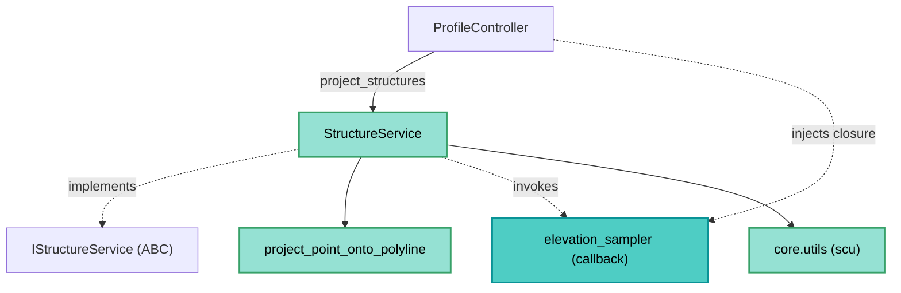

---
tags:
  - secinterp
  - code-walkthrough
  - core
  - services
aliases:
  - structure_service.py
  - StructureService
  - IStructureService
cssclass: secinterp-note
---

# `core/services/structure_service.py`

> [!abstract] One-line summary
> Service that **projects structural measurements** (planes/lines) onto the section plane, computing station, elevation (via the injected `elevation_sampler` callback) and apparent dip, without importing QGIS.

**Path**: `core/services/structure_service.py` (187 lines)
**Main class**: `StructureService(IStructureService, TranslatableMixin)`
**Layer**: Core (QGIS-agnostic)
**Tags**: #secinterp #core #services

---

## 🎯 Why does this file exist?

A structural measurement on the map (strike/dip) must be projected onto the section to
show its apparent dip. The calculation is pure math, but **elevation sampling** requires
accessing a raster — and the core must not touch QGIS:

| Problem | Solution |
|---------|----------|
| Project structures onto the section | `project_point_onto_polyline` (planar math) |
| Obtain elevation without coupling to the raster | injected `elevation_sampler` (callback/Strategy) |
| Compute apparent dip | `scu.calculate_apparent_dip` |
| Parse strike/dip robustly | `scu.parse_strike` / `scu.parse_dip` |

> [!important] Architectural note
> **QGIS-agnostic** with **real dependency inversion**: the service calls
> `elevation_sampler(x, y)` without knowing what is behind it. The GUI injects a closure
> that accesses the raster (see [[controller]]). The rich `IStructureService` contract
> fixes this signature.

---

## 🧬 Relationship diagram



> [!tip] How to read
> The dashed `SS -.->|invokes| SAMPLER` is the key point: the core **consumes** a
> callback whose origin is the GUI. The rest are pure-math imports.

---

## 📦 Imports — architectural reading

```python
# core/services/structure_service.py
from collections.abc import Callable
from typing import Any

from sec_interp.core import utils as scu
from sec_interp.core.domain import StructureData, StructureMeasurement
from sec_interp.core.interfaces.structure_interface import IStructureService
from sec_interp.core.utils.geometry_utils.measurement import project_point_onto_polyline
from sec_interp.core.utils.i18n import TranslatableMixin
from sec_interp.logger_config import get_logger
```

| # | Observation |
|---|-------------|
| ① | **Zero `qgis.*`**: only stdlib, domain, interfaces and pure utilities. |
| ② | `from sec_interp.core import utils as scu` groups parsing (`parse_strike`, `parse_dip`) and geology (`calculate_apparent_dip`). |
| ③ | `Callable[[float, float], float]` types the `elevation_sampler` (the callback contract). |
| ④ | `project_point_onto_polyline` from `geometry_utils/measurement.py` (planar math). |
| ⑤ | `TranslatableMixin` provides `self.tr()` for the localized log message. |

---

## 🏗️ Structure inventory

**Classes:** `class StructureService(IStructureService, TranslatableMixin)` — 3 methods

**Methods:**
- `project_structures(line_points, struct_data, elevation_sampler, line_az, dip_field, strike_field) -> StructureData`
- `_process_single_structure(data, line_points, elevation_sampler, line_az, dip_field, strike_field) -> StructureMeasurement | None`
- `_parse_structural_data(attributes, strike_field, dip_field, line_az) -> tuple[float, float, float] | None`

---

## 📖 Method-by-method walkthrough

### `project_structures` — Orchestration

```python
def project_structures(
    self,
    line_points: list[tuple[float, float]],
    struct_data: list[dict[str, Any]],
    elevation_sampler: Callable[[float, float], float],
    line_az: float,
    dip_field: str,
    strike_field: str,
) -> StructureData:
    projected_structs = []
    for item in struct_data:
        measurement = self._process_single_structure(
            item, line_points, elevation_sampler, line_az, dip_field, strike_field,
        )
        if measurement:
            projected_structs.append(measurement)

    projected_structs.sort(key=lambda x: x.distance)
    logger.info(self.tr("Processed {0} structural measurements").format(len(projected_structs)))
    return projected_structs
```

Iterates over detached structures (`{"point", "attributes"}`), delegates to
`_process_single_structure`, drops the `None` (out-of-range/parse failure) and sorts by
distance. Logs a localized summary at the end.

> [!note] Flat, explicit signature
> The method receives everything via parameters (vertices, data, callback, azimuth,
> fields), without a context DTO: it is the richest contract in the `interfaces` package.

### `_process_single_structure` — Projection of one structure

```python
def _process_single_structure(self, data, line_points, elevation_sampler, line_az, dip_field, strike_field):
    point = data.get("point")
    if point is None:
        return None

    proj_dist, proj_pt = project_point_onto_polyline(point, line_points)
    elev = elevation_sampler(proj_pt[0], proj_pt[1])

    parsed_data = self._parse_structural_data(
        data.get("attributes", {}), strike_field, dip_field, line_az
    )
    if not parsed_data:
        return None

    strike, dip_angle, app_dip = parsed_data
    return StructureMeasurement(
        distance=round(proj_dist, 1),
        elevation=round(elev, 1),
        apparent_dip=round(app_dip, 1),
        original_dip=dip_angle,
        original_strike=strike,
        attributes=data.get("attributes", {}),
    )
```

| Step | Detail |
|------|--------|
| **Point** | `data.get("point")`; if missing → `None` |
| **Station** | `project_point_onto_polyline` → `(proj_dist, proj_pt)` |
| **Elevation** | `elevation_sampler(proj_pt[0], proj_pt[1])` (injected callback) |
| **Parse** | `_parse_structural_data` → `(strike, dip_angle, app_dip)` |
| **DTO** | `StructureMeasurement` with `round(..., 1)` values |

> [!important] The callback crosses the boundary without violating it
> The service does not import the raster: it only asks for `elevation_sampler(x, y)`. The
> GUI decides **how** to sample (closure over `sample_elevation`). Dependency inversion.

### `_parse_structural_data` — Parsing and validation

```python
def _parse_structural_data(self, attributes, strike_field, dip_field, line_az):
    try:
        strike_raw = attributes.get(strike_field)
        dip_raw = attributes.get(dip_field)
    except (AttributeError, KeyError):
        return None

    strike = scu.parse_strike(strike_raw)
    dip_angle, _ = scu.parse_dip(dip_raw)

    if strike is None or dip_angle is None:
        return None

    MAX_STRIKE = 360
    MAX_DIP_ANGLE = 90
    if not (0 <= strike <= MAX_STRIKE) or not (0 <= dip_angle <= MAX_DIP_ANGLE):
        return None

    app_dip = scu.calculate_apparent_dip(strike, dip_angle, line_az)
    return strike, dip_angle, app_dip
```

| Detail | Reason |
|--------|--------|
| `try/except AttributeError, KeyError` | `attributes` may not be a dict with those keys |
| `parse_strike`/`parse_dip` | Accept cardinal strings ("N45E") and numerics |
| Range `[0,360]` / `[0,90]` | Validates strike and dip before computing |
| `calculate_apparent_dip` | Apparent dip relative to the section azimuth |

---

## 🔄 Data flow

| Phase | Input | Transformation | Output |
|-------|-------|----------------|--------|
| Projection | `point`, `line_points` | `project_point_onto_polyline` | `(proj_dist, proj_pt)` |
| Elevation | `(x, y)` | `elevation_sampler` | `float` |
| Parse | `attributes` | `parse_strike`/`parse_dip`/`calculate_apparent_dip` | `(strike, dip, app_dip)` |
| DTO | values | `StructureMeasurement` | measurement sorted by distance |

---

## 🏛️ Design patterns present

| Pattern | Where | Purpose |
|---------|-------|---------|
| **Strategy (callback)** | `elevation_sampler` | Injected elevation sampling |
| **Template (contract)** | `IStructureService` | Fixes the rich `project_structures` signature |
| **Extract-then-Compute** | detached `struct_data` | The extractor produces, the service computes |
| **Null Object (guard)** | `None` returns | Failed projection/parse → discarded |

---

## 🧾 API summary

| Symbol | Signature / Inherits | Typical use |
|--------|----------------------|-------------|
| `StructureService` | `IStructureService, TranslatableMixin` | Structural service |
| `project_structures` | `(line_points, struct_data, elevation_sampler, line_az, dip_field, strike_field) -> StructureData` | Main projection |
| `_process_single_structure` | `(data, ...) -> StructureMeasurement | None` | One structure |
| `_parse_structural_data` | `(attributes, strike_field, dip_field, line_az) -> tuple | None` | strike/dip parsing |

---

## 🛡️ Error handling

| Situation | Behaviour |
|-----------|-----------|
| Missing `point` | `return None` |
| Invalid `attributes` | `except (AttributeError, KeyError)` → `None` |
| Unreadable strike/dip | `parse_*` → `None` → discarded |
| Out of range (0-360 / 0-90) | `return None` |

> [!tip] Fail-soft parsing
> No exceptions are raised: any invalid structure becomes `None` and is omitted. The
> final result is the list of **valid** measurements, with no noise.

---

## 🧪 Associated tests

Mapped to `tests/core/test_structure_service.py` (mock-first, no QGIS):

- `test_structure_service.py` — projection with a **mocked** `elevation_sampler`.
- Apparent dip computation and discarding of invalid structures are verified.
- `tests/core/test_structural_parsing_advanced.py` — strike/dip parsing.

---

## 👀 Observations and notes

> [!success] Strengths
> - Clean dependency inversion: the core ignores the raster entirely.
> - Robust parsing (cardinal + numeric) and range validation.
> - `round(..., 1)` produces presentable, stable values.
> - Stateless; thread-safe for `QgsTask`.

> [!warning] Points of attention
> - `_process_single_structure` accumulates 5 responsibilities (project, sample, parse, validate, build) → cyclomatic complexity at the limit.
> - Parsing uses `MAX_STRIKE`/`MAX_DIP_ANGLE` as local constants instead of module constants.
> - `data.get("point")` assumes `point` is always a tuple/object with coordinates.

> [!question] Open questions
> - Extract sampling+parsing into a collaborator (`StructureProcessor`) to lighten `_process_single_structure`?
> - Promote `MAX_STRIKE`/`MAX_DIP_ANGLE` to module constants?

---

## 🔬 Strike and dip parsing

`_parse_structural_data` delegates to the utilities in `core/utils/parsing.py` (exposed
via `scu`):

| Function | Accepted input | Output |
|----------|----------------|--------|
| `parse_strike(raw)` | numeric or cardinal ("N45E", "N 45 E") | `float` (degrees) or `None` |
| `parse_dip(raw)` | numeric (degrees) | `(dip, _)` or `None` |
| `calculate_apparent_dip(strike, dip, line_az)` | degrees | `float` (apparent dip) |

> [!tip] Cardinal vs numeric
> `parse_strike` supports azimuths written as cardinal bearings (geological convention) or
> as degrees. The resulting `None` becomes a discard (fail-soft).

## 🧮 The apparent dip

The apparent dip is the angle a structural plane shows on the section plane. It depends on:

| Factor | Variable | How it enters |
|--------|----------|---------------|
| Real strike | `strike` | plane orientation in plan view |
| Real dip | `dip_angle` | maximum inclination of the plane |
| Section azimuth | `line_az` | cut orientation |

`calculate_apparent_dip(strike, dip_angle, line_az)` applies the standard trigonometric
formula (projection of the dip vector onto the section direction). The service does not
reimplement the formula: it delegates to `scu` to keep the geological logic in one place.

## 🎯 The `elevation_sampler` callback contract

The signature `Callable[[float, float], float]` fixes the sampling contract:

| Aspect | Detail |
|--------|--------|
| **Input** | `(x, y)` of the projected point (`proj_pt`) |
| **Output** | elevation `float` |
| **Origin** | GUI closure over `sample_elevation` |
| **Why** | the core cannot import the raster (QGIS-agnostic rule) |

> [!important] Projected point vs original point
> The elevation is sampled at `proj_pt` (the point **on** the polyline), not at the
> original feature point. This makes the station (`proj_dist`) and the elevation coherent.

## 📐 The `StructureMeasurement` DTO

`_process_single_structure` returns a `StructureMeasurement` (`core/domain/entities.py`):

| Field | Type | Value produced |
|-------|------|----------------|
| `distance` | `float` | `round(proj_dist, 1)` — station |
| `elevation` | `float` | `round(elev, 1)` — sampled elevation |
| `apparent_dip` | `float` | `round(app_dip, 1)` — apparent dip |
| `original_dip` | `float` | `dip_angle` — real dip (unrounded) |
| `original_strike` | `float` | `strike` — real strike |
| `attributes` | `dict` | original feature attributes |

> [!tip] Presentation rounding vs raw data
> `distance`/`elevation`/`apparent_dip` are rounded to 1 decimal (for drawing);
> `original_dip`/`original_strike` are kept raw (for export/query).

## 🔄 Lifecycle and composition

The service is instantiated by `ProfileController` (via `SafeLoader.lazy_load`) and is
invoked from `_process_structures`:

```python
self.structure_service = SafeLoader.lazy_load("...structure_service", "StructureService")
```

| Phase | Detail |
|-------|--------|
| **Composition root** | `controller` loads the service lazily |
| **Preparation** | `structure_extractor.extract_section_and_structures` → `ctx` |
| **Injection** | `elevation_sampler` closure over `sample_elevation` |
| **Execution** | `project_structures(...)` → `StructureData` |

> [!note] No state between calls
> The class stores no data between invocations; everything is passed via parameters. It is
> thread-safe and reusable in `QgsTask`.

## 🧭 Consistency with `preview_service`

`StructureService.project_structures` is invoked from **two** sites with the same signature
and the same callback injection:

| Caller | How it injects `elevation_sampler` |
|--------|-----------------------------------|
| `ProfileController._process_structures` | closure over `structure_extractor.sample_elevation` |
| `PreviewService._generate_structures_step` | closure over `extractor.sample_elevation` |

> [!tip] Two paths, same contract
> Both orchestrators close over the extractor's `sample_elevation`. The service does not
> distinguish where the callback comes from: it only respects `Callable[[float, float], float]`.

## 🔗 Related notes

- [[Index]] — vault index
- [[controller]] — injects the `elevation_sampler` closure over `sample_elevation`
- [[preview_service]] — repeats the `elevation_sampler` injection in the structures step
- [[core_interfaces]] — `IStructureService` contract
- [[entities]] — `StructureMeasurement`, `StructureData`
- [[structures]] — structural domain notes
- [[measurement]] — `project_point_onto_polyline`
- [[core_utils_geometry_utils]] — geometry utilities

---

*Note of the SecInterp Code Walkthrough v2 vault — v3.9.0*
