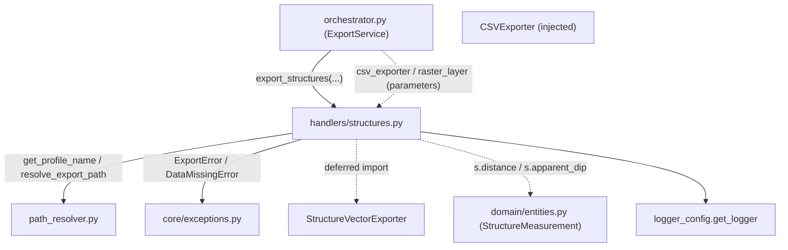

---
tags:
  - secinterp
  - code-walkthrough
  - core
  - export
  - handlers
aliases:
  - structures.py
  - export_structures
cssclass: secinterp-note
---

# `core/services/export/handlers/structures.py`

> [!abstract] One-line summary
> **Structures** export handler: dumps structural measurements to CSV (dist, apparent dip) and to a vector layer, reading the raster resolution to scale the dip.

**Path**: `core/services/export/handlers/structures.py` (77 lines)
**Main function**: `export_structures`
**Layer**: Core (QGIS-agnostic, with duck-typed access to the raster)
**Tags**: #secinterp #core #export #handlers

---

## 🎯 Why does this file exist?

Projected structural measurements (`StructureMeasurement`) are exported in two formats.
The vector variant needs two derived magnitudes: a **dip scale factor** (the user's
visual option) and the **raster resolution** (to size symbols in map units).

| Problem | Solution |
|---------|----------|
| Export measurements to CSV and to vector | Two chained export blocks |
| Scale the dip per user preference | `options.get("dip_scale", 4)` |
| Size symbols with the raster resolution | `raster_layer.rasterUnitsPerPixelX()` |

> [!important] Architectural note
> QGIS-agnostic: `raster_layer` is a QGIS object typed `Any` and accessed by duck-typing
> (`isValid()`, `rasterUnitsPerPixelX()`). The resolution falls back to a default (`1.0`)
> if the raster is unavailable — degradation without exception.

---

## 🧬 Relationship diagram



> [!tip] How to read
> `csv_exporter` and `raster_layer` arrive injected; `s.distance`/`s.apparent_dip` are
> real fields of `StructureMeasurement`. The vector exporter is imported deferred.

---

## 📦 Imports — architectural reading

```python
# core/services/export/handlers/structures.py
from __future__ import annotations

from pathlib import Path
from typing import Any

from sec_interp.core.exceptions import DataMissingError, ExportError
from sec_interp.core.services.export.path_resolver import get_profile_name, resolve_export_path
from sec_interp.logger_config import get_logger
```

```python
# deferred import (inside export_structures)
from sec_interp.exporters import StructureVectorExporter
```

| # | Observation |
|---|-------------|
| ① | `DataMissingError`/`ExportError` from the project's own hierarchy; no `qgis.*` import. |
| ② | `raster_layer` and `csv_exporter` are `Any` parameters (not imported here). |
| ③ | `StructureVectorExporter` deferred import: loaded only with structures. |
| ④ | The `data: list[Any]` hides `StructureData` (`list[StructureMeasurement]`). |

---

## 🏗️ Structure inventory

**Functions/Methods:**
- `export_structures(folder, data, raster_layer, crs, csv_exporter, msg, options, controller, settings, ext) -> None`

**Domain dependencies:**
- `StructureMeasurement` (fields `distance`, `apparent_dip`) — accessed by duck-typing.
- `StructureVectorExporter` (from `sec_interp.exporters`)

One public function. Key difference from other handlers: it receives `options` (for
`dip_scale`) and `raster_layer` (for `rasterUnitsPerPixelX`).

---

## 📖 Method-by-method walkthrough

### `export_structures`

```python
def export_structures(
    folder: Path,
    data: list[Any] | None,
    raster_layer: Any | None,
    crs: Any,
    csv_exporter: Any,
    msg: list[str],
    options: dict[str, Any],
    controller: Any | None,
    settings: Any | None,
    ext: str,
) -> None:
    """Export structural data."""
    if not data:
        return
    from sec_interp.exporters import StructureVectorExporter

    logger.info("✓ Saving structural profile...")
```

**Guard + deferred import**: early exit without structures; the vector exporter loads
only when there is data.

```python
    try:
        profile_name = get_profile_name(controller)
        pattern = getattr(settings, "naming_pattern", None) if settings else None
        rows = [(s.distance, s.apparent_dip) for s in data]

        csv_path, csv_layer = resolve_export_path(
            folder, "structural_profile", profile_name, pattern, ".csv"
        )
        csv_ok = csv_exporter.export(
            csv_path,
            {"headers": ["dist", "apparent_dip"], "rows": rows},
            layer_name=csv_layer,
        )
        if csv_ok:
            msg.append(f"  - {csv_path.relative_to(folder)}")
```

**CSV**: the comprehension `[(s.distance, s.apparent_dip) for s in data]` extracts the
two key magnitudes from each `StructureMeasurement`. Payload `{"headers": ["dist",
"apparent_dip"], "rows": rows}` with extension `.csv`.

```python
        raster_res = 1.0
        if raster_layer and raster_layer.isValid():
            raster_res = raster_layer.rasterUnitsPerPixelX()

        vec_path, vec_layer = resolve_export_path(
            folder, "structural_measurements", profile_name, pattern, ext
        )
        vector_exporter = StructureVectorExporter({})
        vec_ok = vector_exporter.export(
            vec_path,
            {
                "structural_data": data,
                "crs": crs,
                "dip_scale_factor": options.get("dip_scale", 4),
                "raster_res": raster_res,
            },
            layer_name=vec_layer,
        )
        if vec_ok:
            msg.append(f"  - {vec_path.relative_to(folder)}")
        else:
            logger.warning(f"Failed to write vector structures to {vec_path}")
```

**Raster resolution + vector**: `raster_res` starts at `1.0` and is only overwritten if
`raster_layer` is valid. The vector payload includes `dip_scale_factor` (from
`options.get("dip_scale", 4)`) and `raster_res`.

```python
    except (OSError, ValueError, TypeError, DataMissingError) as e:
        logger.exception(f"Structure export failed: {e}")
        raise ExportError(f"Structure export failed: {e!s}") from e
    except Exception as e:
        logger.exception("Unexpected system error during structure export")
        raise ExportError(f"Critical error exporting structures: {e}") from e
```

**Normalization**: the same double-`except` contract as `drillholes.py`/`geology.py`.

---

## 🔄 Data flow

| Phase | Input | Transformation | Output |
|-------|-------|----------------|--------|
| Guard | `data` (`None`/empty) | early return | — |
| CSV | `list[StructureMeasurement]` | `[(s.distance, s.apparent_dip) ...]` | `structural_profile.csv` |
| Raster | `raster_layer` | `rasterUnitsPerPixelX()` (or `1.0`) | `raster_res` |
| Vector | `data`, `crs`, `dip_scale`, `raster_res` | `StructureVectorExporter.export` | structure layer + `msg` |

---

## 🏛️ Design patterns present

| Pattern | Where | Purpose |
|---------|-------|---------|
| **Guard clause** | `if not data: return` | early exit |
| **Lazy import (deferred)** | `StructureVectorExporter` | save loading without data |
| **Dependency injection** | `csv_exporter`, `raster_layer` | decouple from concrete exporters/raster |
| **Default value (null object)** | `raster_res = 1.0` | degradation without exception |
| **Exception translation** | `except → ExportError` | normalize failures |

---

## 🧾 API summary

| Symbol | Signature / Inherits | Typical use |
|--------|----------------------|-------------|
| `export_structures` | `(folder, data, raster_layer, crs, csv_exporter, msg, options, controller, settings, ext) -> None` | Export structures CSV + vector |
| `rows` (internal) | `list[tuple[float, float]]` | `(dist, apparent_dip)` rows |
| `raster_res` (internal) | `float` | Raster X resolution or `1.0` |
| `StructureVectorExporter` | `BaseExporter` (deferred import) | Write measurements as vector |

---

## 📐 Handler signature contract

It is the longest signature in the subpackage (10 parameters): adds `raster_layer`,
`csv_exporter` and `options` to the base silhouette:

| Parameter | Type | Role |
|-----------|------|------|
| `folder` | `Path` | Base output directory |
| `data` | `list[Any] \| None` | `StructureData` (`list[StructureMeasurement]`) |
| `raster_layer` | `Any \| None` | DEM raster for `rasterUnitsPerPixelX()` |
| `crs` | `Any` | Section CRS |
| `csv_exporter` | `Any` | Injected `CSVExporter` |
| `msg` | `list[str]` | Message accumulator |
| `options` | `dict[str, Any]` | Settings (`dip_scale`) |
| `controller` | `Any \| None` | Profile-name source |
| `settings` | `Any \| None` | Settings (`naming_pattern`) |
| `ext` | `str` | Output extension |

## 🔁 Invocation from the orchestrator

```python
"exp_struct": lambda: struct_h.export_structures(
    folder, struct_data, raster_layer, line_crs, csv_exporter, msg,
    options, self.controller, export_settings, format_ext,
),
```

`raster_layer` comes from `PreviewParams.raster_layer` and `options` is the same
flags/settings dict used by the rest of the orchestration (here to read `dip_scale`).

---

## 🛡️ Error handling

| Caught type | Action | Result |
|-------------|--------|--------|
| `OSError`, `ValueError`, `TypeError`, `DataMissingError` | `logger.exception` + `raise ExportError(...) from e` | domain error |
| `Exception` (rest) | `logger.exception` + `raise ExportError(...) from e` | critical error |

> [!note] `raster_layer` never raises
> If the raster is `None` or invalid, `raster_res` stays `1.0` and the export proceeds.
> The dip is scaled with the user factor without depending on the raster.

---

## 🧪 Associated tests

- `tests/core/test_export_service.py::test_export_structures_error` — exporter failure
  → `ExportError`.
- `tests/core/test_profile_exporters.py::test_structure_exporter_success` — real logic
  of `StructureVectorExporter`.
- `tests/core/test_profile_exporters.py::test_structure_exporter_missing_data` — no data
  (edge case).
- `tests/integration/test_export_service_e2e.py::test_export_structures_with_string_fields` —
  attribute fields as strings.

---

## 👀 Observations and notes

> [!success] Strengths
> - Graceful raster degradation (`1.0`) without `try/except` blocks.
> - `dip_scale_factor` decoupled via `options` with a sensible default (`4`).
> - Uniform error contract with `ExportError`.

> [!warning] Points of attention
> - `data: list[Any]` hides `StructureData`; `raster_layer: Any` hides a QGIS raster.
> - `raster_res` as the magic float `1.0` is a literal with no semantic name.
> - `rasterUnitsPerPixelX()` only reads the X resolution, ignoring Y.

> [!question] Open questions
> - Type `data` as `StructureData` to document the contract?
> - Name the constant `DEFAULT_RASTER_RESOLUTION = 1.0`?

---

## 🔗 Related notes

- [[Index]] — vault index
- [[core_services_export_handlers]] — `handlers/` package it belongs to
- [[orchestrator]] — delegates to `export_structures` under the `exp_struct` flag
- [[structure_service]] — service producing the exported `StructureMeasurement`s
- [[path_resolver]] — `get_profile_name` / `resolve_export_path`
- [[compat]] — `_export_structures` compatibility wrapper
- [[entities]] — `StructureMeasurement` (`.distance`, `.apparent_dip`)

---

*Note of the SecInterp Code Walkthrough v2 vault — v3.9.0*
