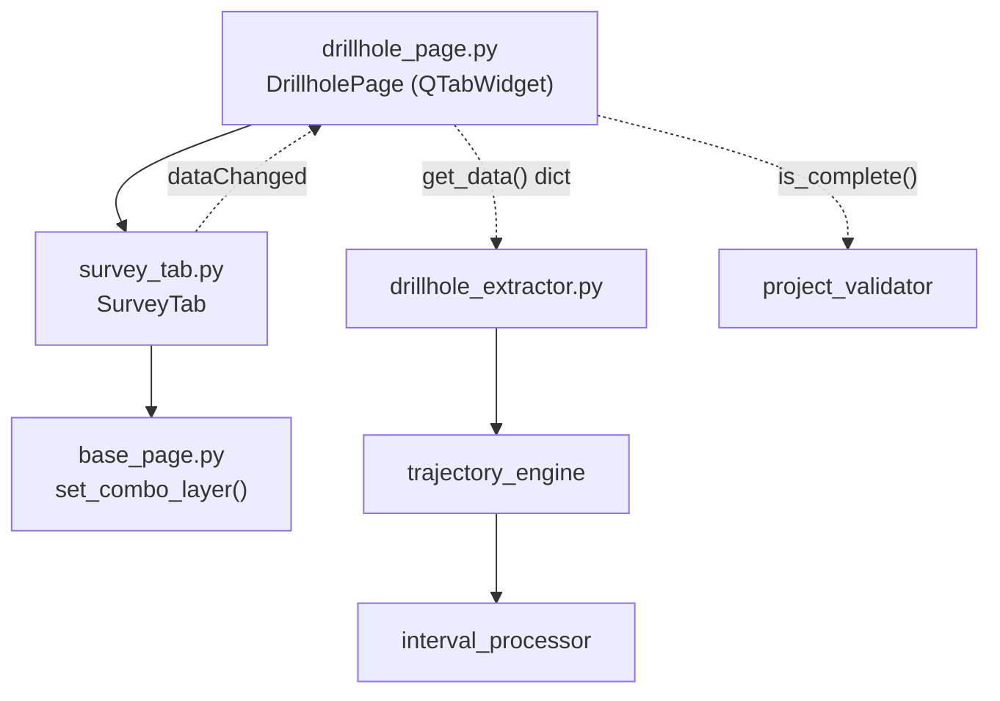

---
tags:
  - secinterp
  - code-walkthrough
  - gui
  - pages
aliases:
  - survey_tab.py
  - SurveyTab
cssclass: secinterp-note
---

# `gui/ui/pages/drillhole/survey_tab.py`

> [!abstract] One-line summary
> Drillhole deviation configuration tab: tabular-layer selector plus field mapping (ID, depth, azimuth, inclination), feeding the Extract-side `DrillholeContext`.

**Path**: `gui/ui/pages/drillhole/survey_tab.py` (144 lines)
**Main class**: `SurveyTab`
**Layer**: GUI (QGIS-dependent · sub-page / tab)
**Tags**: #secinterp #gui #pages

---

## 🎯 Why does this file exist?

Without deviations (azimuth/inclination per depth) a drillhole is vertical;
with them, [[trajectory_engine]] rebuilds the true 3D trajectory. This tab
encapsulates the mapping of those four fields onto an auxiliary table.

| Problem | Solution |
|---------|----------|
| The survey lives in a table that may lack geometry | `PointLayer \| NoGeometry` filter |
| Four fields must follow the chosen layer | `layerChanged` wired to all four `setLayer` |
| The parent page aggregates three uniform forms | Same contract as `CollarTab`/`IntervalTab` |
| `Qgis.LayerFilters` is missing on older QGIS | `try/except` fallback to `QgsMapLayerProxyModel` |

> [!important] Architectural note
> **Extract**-phase tab: it exposes field names (`survey_azim`,
> `survey_incl`); the core interprets units and rebuilds the deviation without
> the GUI knowing the algorithm.

---

## 🧬 Relationship diagram



> [!tip] How to read
> Solid arrow = imports/delegates; dashed = callback/data flow toward the parent
> or toward the core.

---

## 📦 Imports — architectural reading

```python
# gui/ui/pages/drillhole/survey_tab.py
from __future__ import annotations
import contextlib
from typing import Any
from qgis.core import Qgis, QgsMapLayerProxyModel
from qgis.gui import QgsFieldComboBox, QgsMapLayerComboBox
from qgis.PyQt.QtCore import QCoreApplication, pyqtSignal
from qgis.PyQt.QtWidgets import QGridLayout, QLabel, QWidget
from sec_interp.gui.ui.pages.base_page import set_combo_layer
from sec_interp.logger_config import get_logger
```

| # | Observation |
|---|-------------|
| ① | Import block twin of `interval_tab`: same shape, different fields. |
| ② | `QgsMapLayerProxyModel` is only used in the compatibility `except`. |
| ③ | No `QCheckBox`: no alternative modes, no conditional widgets. |
| ④ | `QGridLayout` with an incrementing `row` counter. |
| ⑤ | Identical `dataChanged`: the parent wires all three tabs in a loop. |

---

## 🏗️ Structure inventory

**Class:** `SurveyTab(QWidget)` — 1 signal, 8 methods.

| Member | Type | Role |
|--------|------|------|
| `dataChanged` | `pyqtSignal()` | Notifies the parent that some field changed |
| `s_layer` | `QgsMapLayerComboBox` | Deviation layer/table |
| `s_id` | `QgsFieldComboBox` | Hole ID field (link to collar) |
| `s_depth` | `QgsFieldComboBox` | Station depth |
| `s_azim` | `QgsFieldComboBox` | Station azimuth |
| `s_incl` | `QgsFieldComboBox` | Station inclination |

**Methods:**

| Method | Signature | Purpose |
|--------|-----------|---------|
| `__init__` | `(parent=None) -> None` | Builds and calls `_setup_ui` |
| `tr` | `(message: str) -> str` | Translates with the `"SurveyTab"` context |
| `_setup_ui` | `() -> None` | 5-row grid + stretch |
| `get_data` | `() -> dict[str, Any]` | Live values for validation/extract |
| `dump` | `() -> dict[str, Any]` | Persistable state (`dh_survey_*` keys) |
| `load` | `(data: dict) -> None` | Applies persisted state |
| `reset` | `() -> None` | Clears the layer |
| `connect_signals` | `() -> None` | Wires layer and fields |
| `disconnect_signals` | `() -> None` | Unwires everything without raising |

---

## 📁 Files in the package

| File | Lines | Role |
|---|---|---|
| `drillhole/__init__.py` | 9 | Re-exports `CollarTab`, `IntervalTab`, `SurveyTab` |
| `collar_tab.py` | 180 | Collar form (see [[collar_tab]]) |
| `interval_tab.py` | 144 | Interval form (see [[interval_tab]]) |
| `survey_tab.py` | 144 | This note: deviation form |
| `../drillhole_page.py` | 130 | Parent with `QTabWidget` (see [[drillhole_page]]) |

---

## 📖 Method-by-method walkthrough

### `__init__` + `tr`

```python
def __init__(self, parent: QWidget | None = None) -> None:
    super().__init__(parent)
    self._setup_ui()

def tr(self, message: str) -> str:
    return QCoreApplication.translate("SurveyTab", message)
```

Delegated construction and its own translation context (`"SurveyTab"`),
symmetric with the siblings.

### `_setup_ui` — dual layer filter

```python
layout = QGridLayout(self)
row = 0

layout.addWidget(QLabel(self.tr("Survey Layer:")), row, 0)
self.s_layer = QgsMapLayerComboBox()
try:
    self.s_layer.setFilters(
        Qgis.LayerFilters(Qgis.LayerFilter.PointLayer | Qgis.LayerFilter.NoGeometry)
    )
except (AttributeError, TypeError):
    self.s_layer.setFilters(
        QgsMapLayerProxyModel.Filter.PointLayer | QgsMapLayerProxyModel.Filter.NoGeometry
    )
self.s_layer.setAllowEmptyLayer(True)
self.s_layer.setCurrentIndex(0)
```

| Row | Widgets | Detail |
|-----|---------|--------|
| 0 | Label + `s_layer` | `PointLayer \| NoGeometry` filter with fallback |
| 1 | Label + `s_id` | Hole ID to join with collar |
| 2 | Label + `s_depth` | Station depth |
| 3 | Label + `s_azim` | Azimuth |
| 4 | Label + `s_incl` | Inclination + `setRowStretch` |

> [!note] Survey optional by design
> The layer allows empty (`setAllowEmptyLayer(True)`): with no survey table
> the drillhole is treated as vertical. `DrillholePage.is_complete()` reflects
> that optionality in validation.

### `get_data` — live values

```python
def get_data(self) -> dict[str, Any]:
    return {
        "survey_layer": self.s_layer.currentLayer(),
        "survey_id": self.s_id.currentField(),
        "survey_depth": self.s_depth.currentField(),
        "survey_azim": self.s_azim.currentField(),
        "survey_incl": self.s_incl.currentField(),
    }
```

Five unprefixed keys the parent merges with collar and intervals. Azimuth /
inclination values stay as field names: units and conversion belong to the
core.

### `dump` — persistable state

```python
def dump(self) -> dict[str, Any]:
    return {
        "dh_survey_layer": self.s_layer.currentLayer(),
        "dh_survey_id": self.s_id.currentField(),
        "dh_survey_depth": self.s_depth.currentField(),
        "dh_survey_azim": self.s_azim.currentField(),
        "dh_survey_incl": self.s_incl.currentField(),
    }
```

`dh_survey_*` keys aligned with `DrillholeSettings` (`survey_id_field`,
`survey_depth_field`, `survey_azim_field`, `survey_incl_field`) via
`ConfigService` (see [[config]] and [[settings_model]]).

### `load` — apply persisted state

```python
def load(self, data: dict[str, Any]) -> None:
    s_layer = data.get("dh_survey_layer")
    if s_layer is not None:
        set_combo_layer(self.s_layer, s_layer)
        for w in (self.s_id, self.s_depth, self.s_azim, self.s_incl):
            w.setLayer(s_layer)

    for key, combo in [
        ("dh_survey_id", self.s_id),
        ("dh_survey_depth", self.s_depth),
        ("dh_survey_azim", self.s_azim),
        ("dh_survey_incl", self.s_incl),
    ]:
        field = data.get(key)
        if field:
            combo.setField(field)
```

Layer first (signals blocked), then non-empty fields. If no survey was saved,
the tab stays on an empty layer: a valid vertical state.

### `reset`

```python
def reset(self) -> None:
    self.s_layer.setLayer(None)
```

Back to the "no survey" state (vertical drillhole). Combos empty themselves
once the layer is gone.

### `connect_signals`

```python
def connect_signals(self) -> None:
    self.s_layer.layerChanged.connect(self.s_id.setLayer)
    self.s_layer.layerChanged.connect(self.s_depth.setLayer)
    self.s_layer.layerChanged.connect(self.s_azim.setLayer)
    self.s_layer.layerChanged.connect(self.s_incl.setLayer)
    self.s_layer.layerChanged.connect(self.dataChanged.emit)

    self.s_id.fieldChanged.connect(self.dataChanged.emit)
    self.s_depth.fieldChanged.connect(self.dataChanged.emit)
    self.s_azim.fieldChanged.connect(self.dataChanged.emit)
    self.s_incl.fieldChanged.connect(self.dataChanged.emit)
```

Four `setLayer` plus `dataChanged` re-emission on every change. The parent
forwards that signal to the dialog to refresh preview and validation.

### `disconnect_signals`

```python
def disconnect_signals(self) -> None:
    with contextlib.suppress(TypeError, RuntimeError):
        self.s_layer.layerChanged.disconnect(self.s_id.setLayer)
        ...  # 4 more
    with contextlib.suppress(TypeError, RuntimeError):
        self.s_id.fieldChanged.disconnect(self.dataChanged.emit)
    ...  # one block per combo
```

Five `suppress` blocks: grouped for `layerChanged`, individual for each
`fieldChanged`. Idempotent disconnection as required by the GUI layer.

---

## 🔄 Data flow

| Phase | Input | Transformation | Output |
|-------|-------|----------------|--------|
| Setup | `parent` | `_setup_ui` with dual filter | Widgets ready |
| Editing | User click | `layerChanged`/`fieldChanged` | `dataChanged` to parent |
| Extract | Widgets | `get_data()` reads layer + fields | `dict` with `survey_*` keys |
| Aggregation | Three tabs | `DrillholePage.get_data()` merges | Full drillhole `dict` |
| Validation | Merged `dict` | `resolve_layer_metadata` + `ProjectValidator.is_drillhole_complete` | `bool` in `is_complete()` |
| Compute | Context | [[trajectory_engine]] rebuilds deviation | True 3D trajectory |
| Persistence | Widgets | `dump()` with `dh_survey_*` keys | `QgsSettings` via `ConfigService` |
| Restore | `QgsSettings` | `load()` with `set_combo_layer` | Widgets restored |

---

## 🏛️ Design patterns present

| Pattern | Where | Purpose |
|---------|-------|---------|
| **Composite (tab)** | `DrillholePage` + 3 tabs | Uniform contract across siblings |
| **Observer** | `dataChanged` | Propagation tab → page → dialog |
| **Extract** | `get_data` | Field names only; core interprets |
| **Memento** | `dump` / `load` | Persistable and restorable state |
| **Compatibility adapter** | Filter `try/except` | Supports QGIS with and without `Qgis.LayerFilters` |
| **Guarded disconnect** | `contextlib.suppress` | Idempotent unwiring |

---

## 🧾 API summary

| Symbol | Signature / Inherits | Typical use |
|--------|----------------------|-------------|
| `SurveyTab` | `QWidget` | `DrillholePage.tab_widget.addTab(SurveyTab(), ...)` |
| `dataChanged` | `pyqtSignal()` | `tab.dataChanged.connect(self.dataChanged.emit)` |
| `get_data()` | `-> dict[str, Any]` | Live read for validation/extract |
| `dump()` | `-> dict[str, Any]` | Persistence (`dh_survey_*` keys) |
| `load(data)` | `(dict) -> None` | Restore session |
| `reset()` | `-> None` | Back to vertical drillhole |
| `connect_signals()` | `-> None` | Wire when the page is shown |
| `disconnect_signals()` | `-> None` | Unwire on close |

---

## 🛡️ Error handling

Defensive strategy with no domain exceptions:

- `load` ignores missing keys and empty fields: partial survey ⇒ valid empty tab.
- `set_combo_layer` blocks signals while restoring the layer.
- The filter `try/except (AttributeError, TypeError)` absorbs QGIS API
  differences across versions.
- `disconnect_signals` suppresses `TypeError`/`RuntimeError`.

---

## 🧪 Associated tests

No dedicated `tests/gui/test_survey_tab.py`; coverage via the parent page
with QGIS mocks:

- `tests/gui/test_drillhole_page.py::TestDrillholePage::test_tabs_are_composed` — the survey tab exists.
- `test_get_data_contract` — `survey_*` keys present.
- `test_dump_contract` — `dh_survey_*` keys present.
- `test_load_reset_roundtrip` — `load` + `reset` raise nothing.
- `test_connect_disconnect_signals` — idempotent wiring.
- `test_is_complete_returns_bool` — completeness with resolved metadata.

---

## 🌐 i18n and migration notes

- Labels translated with the `"SurveyTab"` context: `"Survey Layer:"`,
  `"Hole ID:"`, `"Depth:"`, `"Azimuth:"`, `"Inclination:"`.
- The `QgsMapLayerProxyModel.Filter` fallback keeps older QGIS working.
- Structurally twin to `interval_tab`: any compatibility improvement should
  be applied to both (candidate shared helper).

---

## 👀 Observations and notes

> [!success] Strengths
> - Genuinely optional survey: empty layer = vertical drillhole, no edge cases.
> - Total symmetry with `interval_tab`: parent and tests treat them alike.
> - No conditional state: the tab always shows the same 5 widgets.

> [!warning] Points of attention
> - No validation of azimuth/inclination units or depth ordering.
> - Near-literal duplication with `interval_tab` (filter, load, signals).
> - `reset` does not document that it means "vertical".

> [!question] Open questions
> - Extract the dual filter + wiring into a common `BaseDrillholeTab`?
> - Early station validation (increasing depths)?

---

## 🔗 Related notes

- [[Index]] — vault index
- [[drillhole_page]] — parent page with the `QTabWidget`
- [[gui_ui_pages_drillhole]] — drillhole tab package
- [[collar_tab]] — sibling collar tab
- [[interval_tab]] — sibling interval tab
- [[trajectory_engine]] — rebuilds the trajectory from the survey
- [[interval_processor]] — positions intervals along the trajectory
- [[drillhole_extractor]] — Extract adapter toward `DrillholeContext`
- [[project_validator]] — `is_drillhole_complete` used by the parent
- [[settings_model]] — core `DrillholeSettings`

---

*Note of the SecInterp Code Walkthrough v2 vault — v3.9.1*
