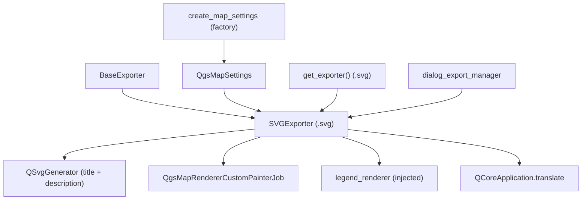

---
tags:
  - secinterp
  - code-walkthrough
  - exporters
  - graphics
aliases:
  - svg_exporter.py
  - SVGExporter
cssclass: secinterp-note
---

# `exporters/svg_exporter.py`

> [!abstract] One-line summary
> Scalable SVG graphics exporter: renders a `QgsMapSettings` with `QgsMapRendererCustomPainterJob` onto `QSvgGenerator` with translatable title and description, plus an optional legend.

**Path**: `exporters/svg_exporter.py` (85 lines)
**Main class**: `SVGExporter(BaseExporter)`
**Layer**: Exporters (coupled to `qgis.core` + `QtSvg`: scalable drawing)
**Tags**: #secinterp #exporters #graphics

---

## 🎯 Why does this file exist?

SVG is the only output format that is **vector, scalable and editable**: it opens in
a browser, Inkscape or Illustrator and lets editors retouch the profile for
publication without losing sharpness at any zoom:

| Problem | Solution |
|---------|----------|
| Publication figure that never pixelates | `QSvgGenerator`: real vectors, not pixels |
| Metadata-less SVG ("untitled" drawing) | `setTitle` / `setDescription` with translatable values |
| Fixed-language SVG strings | `QCoreApplication.translate("SVGExporter", …)` as settings defaults |
| Legend detached from the drawing | `legend_renderer.draw_legend()` on the same painter |
| Unclosed painter on failure | `try/finally: painter.end()` as in `pdf_exporter` |

> [!important] Architectural note
> Third member of the render triptych (`image`/`pdf`/`svg`). Its `data` is a
> `QgsMapSettings` cooked upstream; the quirk is that the signature declares
> `map_settings` **unannotated** (unlike image/pdf, which require `QgsMapSettings`) —
> a typing detail to unify.

---

## 🧬 Relationship diagram



> [!tip] How to read
> The generator defines file, size, viewBox and metadata; the job paints over it as
> in the twins. This is the only render exporter translating its own metadata.

---

## 📦 Imports — architectural reading

```python
# exporters/svg_exporter.py
from __future__ import annotations

from pathlib import Path

from qgis.core import QgsMapRendererCustomPainterJob
from qgis.PyQt.QtCore import QCoreApplication, QRectF, QSize
from qgis.PyQt.QtGui import QPainter
from qgis.PyQt.QtSvg import QSvgGenerator

from sec_interp.logger_config import get_logger

from .base_exporter import BaseExporter
```

| # | Observation |
|---|-------------|
| ① | `QtSvg.QSvgGenerator`: the device is a vector XML document. |
| ② | `QCoreApplication` for `translate()`: default title and description follow the QGIS language. |
| ③ | Imports `QgsMapRendererCustomPainterJob` but **not** `QgsMapSettings` (the signature leaves it unannotated): asymmetry with image/pdf. |
| ④ | `QRectF`/`QSize` pin identical size and viewBox: 1 SVG unit = 1 logical px. |
| ⑤ | `get_logger`: render exceptions logged with `logger.exception`. |

---

## 🏗️ Structure inventory

**Classes:** `class SVGExporter(BaseExporter)` — 1 class, 2 methods.

**Methods:**

- `get_supported_extensions() -> list[str]` — `[".svg"]`
- `export(output_path: Path, map_settings) -> bool` — full drawing (`map_settings` unannotated)

**Consumed settings:**

| Key | Default | Role |
|-----|---------|------|
| `width` | `800` | Width in SVG units |
| `height` | `600` | Height in SVG units |
| `title` | `tr("Section Interpretation Preview")` | SVG `<title>` |
| `description` | `tr("Generated by SecInterp QGIS Plugin")` | SVG `<desc>` |
| `show_legend` | `True` | Legend switch |
| `legend_renderer` | `None` | Object with `draw_legend(painter, rect)` |

---

## 📁 Files in the package

| File | Lines | Role |
|---|--:|---|
| `__init__.py` | 81 | `get_exporter()`: `.svg` → `SVGExporter` |
| `base_exporter.py` | 137 | Inherited contract (see [[base_exporter]]) |
| `svg_exporter.py` | 85 | `SVGExporter` (this note) |
| `image_exporter.py` | 72 | Raster twin (fixed pixels) |
| `pdf_exporter.py` | 79 | Document twin (page + DPI) |

> [!note] SVG vs PDF: which when
> PDF for delivery and printing (fixed page, 300 DPI); SVG for **editing and
> publishing** (retouchable vectors, infinite zoom). Both come from the same
> `QgsMapSettings`.

---

## 📖 Method-by-method walkthrough

### `get_supported_extensions`

```python
def get_supported_extensions(self) -> list[str]:
    """Get supported SVG extension."""
    return [".svg"]
```

A single extension. SVG is XML text: it can be versioned in git and diffed, unlike
binary PNG/JPG/PDF.

### `export` — full drawing

```python
def export(self, output_path: Path, map_settings) -> bool:
    """Export map to SVG.

    Args:
        output_path: Output file path
        map_settings: QgsMapSettings instance configured for rendering

    Returns:
        True if export successful, False otherwise

    """
    try:
        width = self.get_setting("width", 800)
        height = self.get_setting("height", 600)
        title = self.get_setting(
            "title",
            QCoreApplication.translate("SVGExporter", "Section Interpretation Preview"),
        )
        description = self.get_setting(
            "description",
            QCoreApplication.translate("SVGExporter", "Generated by SecInterp QGIS Plugin"),
        )

        # Setup SVG generator
        generator = QSvgGenerator()
        generator.setFileName(str(output_path))
        generator.setSize(QSize(width, height))
        generator.setViewBox(QRectF(0, 0, width, height))
        generator.setTitle(title)
        generator.setDescription(description)

        # Setup painter
        painter = QPainter()
        if not painter.begin(generator):
            return False

        try:
            painter.setRenderHint(QPainter.RenderHint.Antialiasing)

            # Render map
            job = QgsMapRendererCustomPainterJob(map_settings, painter)
            job.start()
            job.waitForFinished()

            # Draw legend if available
            show_legend = self.get_setting("show_legend", True)
            legend_renderer = self.get_setting("legend_renderer")
            if legend_renderer and show_legend:
                legend_renderer.draw_legend(painter, QRectF(0, 0, width, height))

            return True

        finally:
            painter.end()

    except Exception:
        logger.exception(f"SVG export failed for {output_path}")
        return False
```

| Step | Detail |
|------|--------|
| Metadata | `title`/`description` from settings or `translate()`: the SVG declares its origin in the active language |
| Generator | `setFileName` + `setSize` + `setViewBox(0, 0, w, h)`: viewBox matches size (no surprise scaling) |
| `begin` | On failure → silent `return False` (asymmetry with pdf, which logs) |
| Render | Synchronous job with antialiasing; lines come out as editable SVG paths |
| Legend | Same `(0, 0, width, height)` box as image; returns `True` inside the `try` |
| Close | `finally: painter.end()` closes the XML document even if the job fails |
| Failure | `logger.exception` + `False` |

> [!tip] Configurable `title`/`description`
> Because they travel via settings, the GUI or a script can sign them
> (`"Section A-A', site X"`) without touching code: they surface as the SVG
> `<title>`/`<desc>`.

> [!warning] Silent failed `begin()`
> Unlike `pdf_exporter` (`logger.error("Failed to begin painting…")`), the
> `return False` here is silent. Unifying the log would ease diagnosis.

---

## 🔄 Data flow

| Phase | Input | Transformation | Output |
|-------|-------|----------------|--------|
| Metadata | `title`, `description` (+ `tr()` defaults) | configured `QSvgGenerator` | empty XML document |
| Geometry | `QSize` + viewBox | 1:1 canvas in SVG units | drawing coordinate system |
| Render | `QgsMapSettings` + optional legend | synchronous job + `draw_legend` | SVG paths and texts |
| Close | open painter | `finally: painter.end()` | `.svg` + `bool` |

---

## 🧩 SVG against its twins

| Aspect | `image` (PNG/JPG) | `pdf` | `svg` (this one) |
|--------|-------------------|-------|------------------|
| Nature | Fixed pixels | Fixed 300-DPI page | Scalable vectors |
| Editable | No | No | Yes (Inkscape/Illustrator/browser) |
| i18n metadata | No | No | Yes (translated `title`/`desc`) |
| Annotated `map_settings` | Yes | Yes | **No** (detail to unify) |
| Logged `begin()` | n/a | Yes | No |
| `finally: painter.end()` | No | Yes | Yes |

---

## 🏛️ Design patterns present

| Pattern | Where | Purpose |
|---------|-------|---------|
| **Template Method** | `export()` over [[base_exporter]] | Drawing with `bool` return |
| **Dependency Injection** | `map_settings` + `legend_renderer` + `title`/`description` | Configurable content and signature |
| **Guaranteed cleanup** | `try/finally` with `painter.end()` | Always well-formed XML |
| **i18n in metadata** | `QCoreApplication.translate` | Self-titling SVG in the active language |

---

## 🧾 API summary

| Symbol | Signature / Inherits | Typical use |
|--------|----------------------|-------------|
| `SVGExporter` | `(BaseExporter)` | `SVGExporter({"title": "Section A-A'"})` |
| `export` | `(output_path: Path, map_settings) -> bool` | `export(path, map_settings)` |
| `get_supported_extensions` | `() -> list[str]` | `[".svg"]` |

---

## 🛡️ Error handling

| Situation | Behaviour |
|-----------|-----------|
| `painter.begin(generator)` fails | Silent `return False` (improvement: log as in pdf) |
| Exception in render or legend | `logger.exception` + `False`; `finally` still closes |
| Empty `map_settings` | Valid but empty SVG → `True` |
| `QtSvg` missing from the environment | `ImportError` at module load (not caught: import failure, not export failure) |

---

## 🧪 Associated tests

Mock-first in `tests/exporters/test_svg_exporter.py` (generator, painter and job mocked):

- `test_get_supported_extensions` — declares `[".svg"]`.
- `test_export_success` — job + `begin() == True` → `True`.
- `test_export_exception_handling` — job failure → `False`.

Integration:

- `tests/exporters/test_exporters.py` — `BaseExporter` contract.
- `tests/integration/test_export_workflow.py` — full run with SVG.
- `tests/integration/test_qgis_smoke.py` — smoke with real QGIS.

---

## 👀 Observations and notes

> [!success] Strengths
> - Only editable, scalable format: closes the publishing loop with no re-export.
> - Translatable, configurable metadata: the file describes itself.
> - `finally` guarantees well-formed XML under mid-flight failures.
> - 1:1 viewBox: no surprise scaling when opened in another viewer.

> [!warning] Points of attention
> - Unannotated `map_settings`: breaks type symmetry with image/pdf.
> - Unlogged failed `begin()`: poorer diagnosis than pdf.
> - No georeference or guaranteed graphic scale: the SVG is a drawing, not a survey plan.
> - `QtSvg` dependency: the module does not import where the QGIS build lacks it.

> [!question] Open questions
> - Annotate `map_settings: QgsMapSettings` (import already used in image/pdf)?
> - Add `logger.error` to the failed `begin()` for pdf symmetry?
> - Expose `title`/`description` in the GUI export dialog?

---

## 🔗 Related notes

- [[Index]] — vault index
- [[base_exporter]] — inherited contract
- [[image_exporter]] / [[pdf_exporter]] — render twins
- [[exporters]] — package layer note
- [[orchestrator]] — `get_map_settings` cooking the `QgsMapSettings`
- [[dialog_export_manager]] — GUI requesting the SVG
- [[preview_renderer]] — view frozen into the drawing
- [[dtos]] — displayed `PreviewResult`
- [[exceptions]] — upstream `ExportError`

---

*Note of the SecInterp Code Walkthrough v2 vault — v3.9.0*
