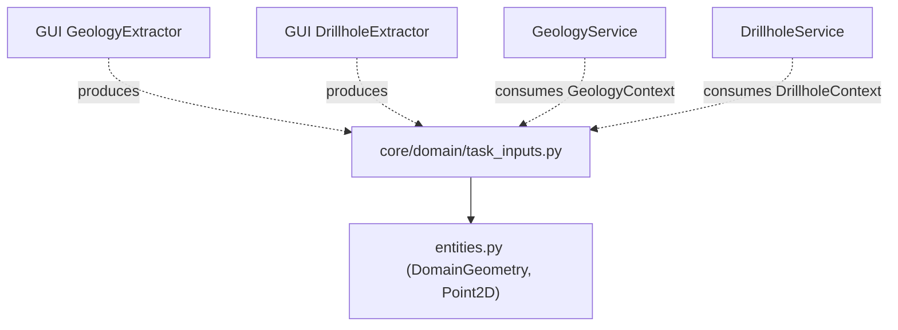
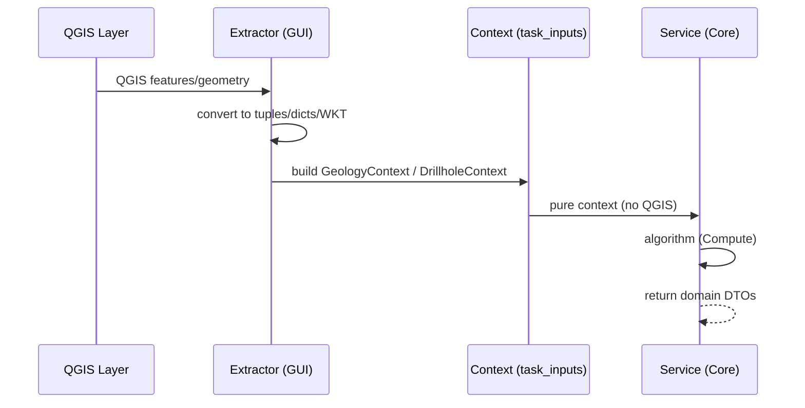

---
tags:
  - secinterp
  - code-walkthrough
  - core
  - domain
aliases:
  - task_inputs.py
  - DrillholeContext
  - GeologyContext
  - OutcropSegments
cssclass: secinterp-note
---

# `core/domain/task_inputs.py`

> [!abstract] One-line summary
> Defines the **detached input DTOs** the GUI hands to the core for asynchronous processing: `OutcropSegments`, `GeologyContext` and `DrillholeContext`, all free of live QGIS objects.

**Path**: `core/domain/task_inputs.py` (79 lines)
**Main class/function**: `DrillholeContext`, `GeologyContext`, `OutcropSegments`
**Layer**: Core (QGIS-agnostic)
**Tags**: #secinterp #core #domain

---

## 🎯 Why does this file exist?

The geological services (`GeologyService`, `DrillholeService`) run in `QgsTask`
(background threads) and **cannot touch QGIS**. The GUI must "extract" everything the core
needs from the layers and package it into pure DTOs. `task_inputs.py` defines exactly those
packages:

| Problem | Solution |
|---------|----------|
| Services cannot access QGIS layers | The GUI extracts and hands pure contexts |
| Passing dozens of loose parameters | Group into semantic dataclasses |
| Geology and drillholes have different inputs | `GeologyContext` vs `DrillholeContext` |
| An outcrop can cross the section line several times | `OutcropSegments.segments` (list of spans) |

> [!important] Architectural note — Extract-then-Compute
> These DTOs are the **output of the Extract phase** (GUI adapters) and the **input of the
> Compute phase** (core services). They are the exact boundary across which **no
> `QgsVectorLayer` or `QgsGeometry` passes**: everything arrives as tuples, dicts and
> primitives.

---

## 🧬 Relationship diagram



> [!tip] How to read
> Solid = imports (`task_inputs` reuses `DomainGeometry` and `Point2D` from `entities`).
> Dashed = producers (GUI extractors) and consumers (services) around the DTO.

---

## 📦 Imports — architectural reading

```python
# core/domain/task_inputs.py
from __future__ import annotations

from dataclasses import dataclass, field
from typing import Any

from .entities import DomainGeometry, Point2D
```

| # | Observation |
|---|-------------|
| ① | `dataclass` + `field` — the 3 DTOs are dataclasses; `pre_sampled_z` uses `default_factory`. |
| ② | `DomainGeometry` (WKT as `str`) — geometry travels as text. |
| ③ | `Point2D` (`tuple[float, float]`) — points as tuples, not `QgsPointXY`. |

---

## 🏗️ Structure inventory

**Classes (3 dataclasses):**

| Class | Fields | Role |
|-------|-------:|------|
| `OutcropSegments` | 3 | Intersection spans of one outcrop |
| `GeologyContext` | 4 | Detached geology input |
| `DrillholeContext` | 9 | Detached drillhole input |

---

## 📁 Files in the package

- `task_inputs.py` — individual note for this file (the `core/domain/` package index is in [[domain]] and [[core_domain]]).

---

## 📖 Class-by-class walkthrough

### `OutcropSegments` — spans of one outcrop

```python
@dataclass
class OutcropSegments:
    unit_name: str
    attributes: dict[str, Any]
    segments: list[tuple[float, float, DomainGeometry]]
```

Represents **one** detached outcrop feature. `segments` is a list of
`(dist_start, dist_end, wkt)` tuples: a polygonal outcrop can cross the section line in
several spans, each carrying its WKT geometry.

| Field | Meaning |
|-------|---------|
| `unit_name` | geological unit name |
| `attributes` | original feature attributes |
| `segments` | spans `(dist_start, dist_end, wkt)` |

### `GeologyContext` — geology input

```python
@dataclass
class GeologyContext:
    master_profile_data: list[Point2D]
    master_grid_dists: list[tuple[float, Point2D, float]]
    outcrops: list[OutcropSegments]
    tolerance: float = 0.001
```

Produced by `GeologyExtractor` (GUI) and consumed by `GeologyService` (core). No live QGIS
objects:

| Field | Meaning |
|-------|---------|
| `master_profile_data` | sampled topography elevations `(dist, elev)` |
| `master_grid_dists` | grid `(dist, (x, y), elev)` for interpolation |
| `outcrops` | detached outcrops (`OutcropSegments`) |
| `tolerance` | intersection sampling tolerance (default `0.001`) |

### `DrillholeContext` — drillhole input

```python
@dataclass
class DrillholeContext:
    line_points: list[Point2D]
    section_azimuth: float
    buffer_width: float
    collar_id_field: str
    collar_z_field: str
    collar_depth_field: str
    collar_data: list[dict[str, Any]]
    survey_data: dict[Any, list[tuple[float, float, float]]]
    interval_data: dict[Any, list[tuple[float, float, str]]]
    pre_sampled_z: dict[Any, float] = field(default_factory=dict)
```

Produced by `DrillholeExtractor` (GUI) and consumed by `DrillholeService` (core). The
richest of the three: 9 fields packaging collars, surveys and intervals already detached.

| Field | Meaning |
|-------|---------|
| `line_points` | section line vertices `(x, y)` |
| `section_azimuth` | section orientation in degrees |
| `buffer_width` | maximum horizontal projection buffer |
| `collar_id_field` / `collar_z_field` / `collar_depth_field` | field names |
| `collar_data` | detached collars `{"id", "point", "attributes"}` |
| `survey_data` | `hole_id -> [(depth, azim, incl)]` |
| `interval_data` | `hole_id -> [(from, to, lith)]` |
| `pre_sampled_z` | `hole_id -> pre-sampled collar elevation` |

> [!note] `survey_data`/`interval_data` use `Any` as key
> `dict[Any, ...]` allows heterogeneous id keys (int or str, depending on the layer). It is
> a small typing cost in exchange for flexibility with the data source.

---

## 🔄 Data flow

| Phase | Input | Transformation | Output |
|-------|-------|----------------|--------|
| Extract (GUI) | QGIS layers | extractor → tuples/dicts/WKT | `GeologyContext` / `DrillholeContext` |
| Compute (Core) | pure context | service → algorithm | `GeologySegment` / `DrillholeProjection` |

---

## 🏛️ Design patterns present

| Pattern | Where | Purpose |
|---------|-------|---------|
| **DTO** | the 3 dataclasses | Transport detached data |
| **Extract-then-Compute** | whole module | Separate extraction (GUI) from compute (core) |
| **WKT-as-string** | `DomainGeometry` | Geometry without QGIS objects |
| **Composition** | `GeologyContext.outcrops` | `list[OutcropSegments]` |

---

## 🧾 API summary

| Symbol | Signature / Inherits | Typical use |
|--------|----------------------|-------------|
| `OutcropSegments` | dataclass | Detached outcrop span |
| `GeologyContext` | dataclass | Input of `GeologyService.build_segments` |
| `DrillholeContext` | dataclass | Input of `DrillholeService.process_context` |

---

## 🛡️ Error handling

No own validation: they are data containers. Validation that the extracted data is correct
happens **before**, in the GUI extractors (and layer validation). `pre_sampled_z` uses
`default_factory=dict` to avoid sharing the dict between instances.

---

## 🧪 Associated tests

There is no dedicated `test_task_inputs.py`; the DTOs are exercised through the services
that consume them, with mocked contexts (Mock-first):

- `tests/core/test_geology_service.py` — mock of `GeologyContext` (no QGIS).
- `tests/core/test_drillhole_service.py` — mock of `DrillholeContext`.

> [!note] Mock-first
> Being pure dataclasses, constructing a `GeologyContext`/`DrillholeContext` in a test
> requires no QGIS: just tuples and dicts. See `tests/base_test.py`.

---

## 👀 Observations and notes

> [!success] Strengths
> - Very clean Extract-then-Compute boundary: nothing QGIS crosses the core.
> - Geometry as WKT (`DomainGeometry`) and points as tuples.
> - `default_factory` for the mutable `pre_sampled_z` field.

> [!warning] Points of attention
> - `dict[Any, ...]` in `survey_data`/`interval_data` dilutes the key typing.
> - `collar_data` as `list[dict[str, Any]]` (no schema) — consumers know keys by convention.

> [!question] Open questions
> - Type the keys of `survey_data`/`interval_data` as `str` (or a `TypeVar`)?
> - Turn `collar_data` into a typed `CollarData` dataclass?

---

## 🔢 Example — constructing a context

Since the DTOs are pure dataclasses, constructing one in a test (or in a GUI extractor)
requires no QGIS:

```python
# Geology: sampled topography + detached outcrops
geo_ctx = GeologyContext(
    master_profile_data=[(0.0, 100.0), (50.0, 120.0), (100.0, 90.0)],
    master_grid_dists=[
        (0.0, (500000.0, 4000000.0), 100.0),
        (50.0, (500050.0, 4000000.0), 120.0),
    ],
    outcrops=[
        OutcropSegments(
            unit_name="Cuarcita",
            attributes={"code": "QC"},
            segments=[(10.0, 20.0, "LINESTRING(10 100, 20 105)")],
        ),
    ],
    tolerance=0.001,
)

# Drillholes: collars + surveys + detached intervals
drill_ctx = DrillholeContext(
    line_points=[(500000.0, 4000000.0), (500100.0, 4000100.0)],
    section_azimuth=45.0,
    buffer_width=50.0,
    collar_id_field="hole_id",
    collar_z_field="collar_z",
    collar_depth_field="total_depth",
    collar_data=[{"id": "DH-01", "point": (500020.0, 4000020.0), "attributes": {}}],
    survey_data={"DH-01": [(0.0, 45.0, -60.0), (50.0, 45.0, -60.0)]},
    interval_data={"DH-01": [(0.0, 30.0, "granite"), (30.0, 80.0, "schist")]},
)
```

> [!tip] WKT in `segments`
> Note that the outcrop geometry travels as **WKT** (`"LINESTRING(10 100, 20 105)"`),
> honoring the `DomainGeometry = str` rule. See [[entities]].

---

## 📐 Extract-then-Compute in sequence



> [!important] The boundary is the context
> To the left of the `Context` everything is QGIS; to the right everything is pure core.
> `task_inputs.py` defines exactly the object that **crosses** that boundary. A
> `QgsVectorLayer` never crosses it.

---

## 🌐 i18n and migration notes

- **No user strings**: the docstrings are the only documentation; there are no messages to
  translate.
- **`Any` as key**: `survey_data`/`interval_data` type keys as `Any` to accept heterogeneous
  ids; migrating to `str` would require normalization in the extractors.
- **Stability**: adding a field to a context breaks its constructor in the extractors; it is
  a boundary to evolve carefully (with integration tests).

---

## 🔗 Related notes

- [[Index]] — vault index
- [[entities]] — `DomainGeometry` and `Point2D` (imported)
- [[domain]] — facade that re-exports these DTOs
- [[core_interfaces]] — `IDrillholeService` / `IGeologyService` (the contracts that consume them)
- [[geology_service]] / [[drillhole_service]] — the Compute services
- [[dtos]] — the other side: `PreviewParams`/`PreviewResult`

---

*Note of the SecInterp Code Walkthrough v2 vault — v3.9.1*
