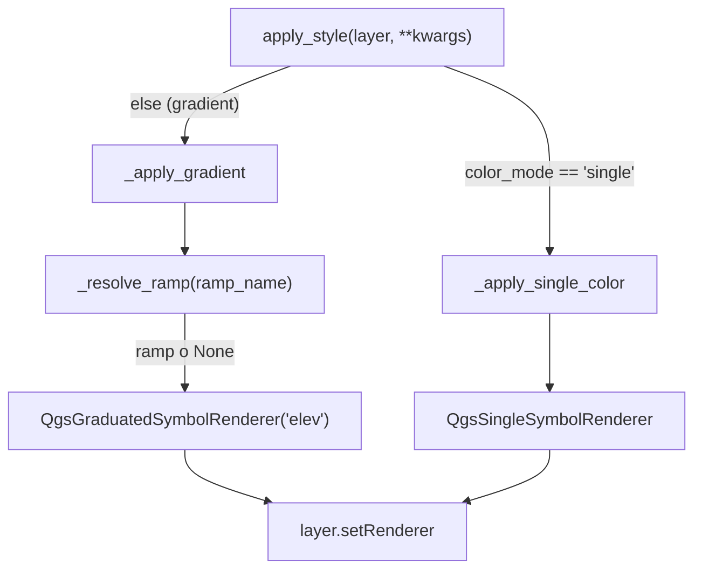

---
tags:
  - secinterp
  - code-walkthrough
  - gui
  - renderers
aliases:
  - topo_renderer.py
  - TopoRenderer
cssclass: secinterp-note
---

# `gui/renderers/topo_renderer.py`

> [!abstract] One-line summary
> Specialized renderer that dresses the preview's topographic profile with elevation polychromy (a graduated ramp over the `elev` field) or a single flat color, resolving the ramp with a fallback and never touching geometry or data.

**Path**: `gui/renderers/topo_renderer.py` (71 lines)
**Main class**: `TopoRenderer`
**Layer**: GUI (Present · QGIS renderer)
**Tags**: #secinterp #gui #renderers

---

## 🎯 Why does this file exist?

The topographic profile needs symbology that expresses **elevation**, not
geological unit. `ColorManager` is designed for units (colors by name, see
[[gui_renderers]]), so topography needs its own renderer. This module concentrates
the knowledge of QGIS symbology classes in a single place, so that neither
[[preview_layer_factory]] nor [[preview_renderer]] has to know about
`QgsGraduatedSymbolRenderer` or `QgsSingleSymbolRenderer`.

| Problem | Solution |
|---------|----------|
| Topography must be colored by elevation, not by category | `_apply_gradient` graduates the `elev` field with `QgsGraduatedSymbolRenderer` |
| The user may prefer a single flat color | `apply_style` diverts to `_apply_single_color` when `color_mode == "single"` |
| The chosen ramp may not exist in the project style | `_resolve_ramp` falls back to `DEFAULT_RAMPS` (`Spectral`, `RdYlGn`) before giving up |
| QGIS symbology classes would scatter across the factory | The renderer encapsulates renderer and symbol creation |

> [!important] Architectural note
> This is the **Present** phase of the Extract → Compute → Present pattern. The
> renderer does **not** compute elevations: it receives them already materialized
> in the memory layer as the `elev` field (`"field=elev:double"`). Here only *how
> the factory's output is painted* is decided. It is therefore a deliberately
> QGIS-coupled module: unlike a core service, its entire contract is the symbology
> API.

---

## 🧬 Relationship diagram

```mermaid
graph TD
    SP["SectionPage.get_data<br/>(gui/ui/pages/section_page.py)"]
    RP["RenderPipelineMixin.draw_preview<br/>(plugin/render_pipeline.py)"]
    PR["PreviewRenderer.render<br/>(gui/preview_renderer.py)"]
    LF["PreviewLayerFactory.create_topo_layer<br/>(gui/preview_layer_factory.py)"]
    TR["TopoRenderer.apply_style<br/>(gui/renderers/topo_renderer.py)"]
    GR["QgsGraduatedSymbolRenderer"]
    SSR["QgsSingleSymbolRenderer"]
    ST["QgsStyle.defaultStyle()"]

    SP --> RP
    RP --> PR
    PR --> LF
    LF -->|apply_style(color_mode, ramp_name, single_color)| TR
    TR -->|gradient| GR
    TR -->|single| SSR
    TR -->|_resolve_ramp| ST
```

> [!tip] How to read
> Solid arrow = calls/delegates. The decision chain descends from the section page
> to the factory; the renderer only receives three `kwargs` and picks one of its
> two branches. `QgsStyle` is queried only in the gradient branch.

---

## 📦 Imports — architectural reading

```python
# gui/renderers/topo_renderer.py
from __future__ import annotations

from qgis.core import (
    QgsClassificationFixedInterval,
    QgsGraduatedSymbolRenderer,
    QgsLineSymbol,
    QgsSingleSymbolRenderer,
    QgsStyle,
    QgsVectorLayer,
)
from qgis.PyQt.QtGui import QColor

from sec_interp.gui.renderers.base_renderer import BasePreviewRenderer
```

| # | Observation |
|---|-------------|
| ① | **Nine QGIS imports** and not one from core: it is a presentation renderer, not a service. Its dependency on `qgis.core` is the contract, not an accident. |
| ② | `QgsVectorLayer` appears only as an annotation, but since `from __future__ import annotations` is active it is not evaluated at runtime. |
| ③ | `QColor` comes from `qgis.PyQt.QtGui`, not directly from `PyQt5.QtGui`: it follows the project's agnostic Qt import standard (see the `qgis-migration-4x` skill). |
| ④ | Only internal import: `BasePreviewRenderer` (see [[base_renderer]]), which fixes the `apply_style(layer, **kwargs)` contract. |
| ⑤ | No `logger`: the renderer does not log; if something fails, the logging responsibility belongs to the caller (the factory). |

---

## 🏗️ Structure inventory

**Classes:** `class TopoRenderer(BasePreviewRenderer)` — 4 methods, no `__init__`.

**Module constants:**

- `DEFAULT_RAMPS = ("Spectral", "RdYlGn")` — fallback ramps, in preference order.
- `LINE_STYLE = {"width": "0.8", "capstyle": "round"}` — line style shared by both branches.

**Methods:**

- `apply_style(layer, **kwargs) -> None` — entry point; branches gradient vs. single color.
- `_apply_gradient(layer, ramp_name) -> None` — graduated renderer over `elev`.
- `_apply_single_color(layer, single_color) -> None` — single-symbol renderer.
- `_resolve_ramp(ramp_name) -> <ramp>` *(static)* — requested ramp, fallback, or `None`.

**Inherits:** the abstract `apply_style` from `BasePreviewRenderer`.

---

## 📁 Files in the package

| File | Role relative to this renderer |
|---|---|
| `gui/renderers/base_renderer.py` | Defines `BasePreviewRenderer.apply_style`, the contract implemented here |
| `gui/renderers/color_manager.py` | Colors per geological unit; topography does **not** use it (see [[gui_renderers]]) |
| `gui/renderers/drillhole_renderer.py` | Sibling with the `"trace"` / `"interval"` role (see [[drillhole_renderer]]) |
| `gui/preview_layer_factory.py` | Builds the layer and calls `apply_style` (see [[preview_layer_factory]]) |

All four renderers in the subpackage share the same polymorphic contract: the
factory treats them uniformly even though their symbology logic differs.

---

## 📖 Method-by-method walkthrough

### `apply_style` — the brancher

```python
def apply_style(self, layer: QgsVectorLayer, **kwargs) -> None:
    """Apply the selected topographic profile style.

    Args:
        layer: The preview topography memory layer.
        **kwargs: Style options: ``color_mode`` (``"gradient"`` or
            ``"single"``), ``ramp_name`` and ``single_color``.

    """
    if kwargs.get("color_mode") == "single":
        self._apply_single_color(layer, kwargs.get("single_color"))
        return
    self._apply_gradient(layer, kwargs.get("ramp_name"))
```

The method validates neither the layer nor the mode: it is a **total selector**.
Any value other than `"single"` (including `None`) falls through to gradient, the
default mode. `**kwargs` keeps the signature compatible with the other renderers
and with `BasePreviewRenderer`, which cannot know domain-specific options.

| Input | Branch chosen | Parameter passed |
|-------|---------------|------------------|
| `color_mode="single"` | `_apply_single_color` | `kwargs.get("single_color")` |
| `color_mode="gradient"` | `_apply_gradient` | `kwargs.get("ramp_name")` |
| No `color_mode` (e.g. the base test) | `_apply_gradient` | `kwargs.get("ramp_name") → None` |

### `_apply_gradient` — elevation polychromy

```python
def _apply_gradient(self, layer: QgsVectorLayer, ramp_name: str | None) -> None:
    """Apply graduated elevation styling, falling back to a known ramp."""
    renderer = QgsGraduatedSymbolRenderer("elev")
    renderer.setSourceSymbol(QgsLineSymbol.createSimple(LINE_STYLE))

    ramp = self._resolve_ramp(ramp_name)
    if ramp is not None:
        renderer.updateColorRamp(ramp)

    renderer.setClassificationMethod(QgsClassificationFixedInterval())
    renderer.updateClasses(layer, 8)
    layer.setRenderer(renderer)
```

Details that matter:

1. The graduation field is literal: `"elev"`. This is the contract with the
   factory, which creates the layer with `"field=elev:double"` and assigns each
   segment's average elevation (`avg_elev`).
2. The **source symbol** is created once with `LINE_STYLE`; the ramp only
   distributes colors over it.
3. If `_resolve_ramp` returned `None`, `updateColorRamp` is not called: the
   renderer keeps its internal default ramp instead of failing.
4. `QgsClassificationFixedInterval` with `updateClasses(layer, 8)` splits the
   elevation range into **8 equal intervals**. It uses neither quantiles nor
   Jenks: elevation is a continuous, uniform magnitude, so fixed intervals are
   predictable and cheap.
5. `layer.setRenderer(renderer)` is the only effect on the layer; features and
   extents are untouched (the factory does that afterwards).

### `_apply_single_color` — flat color

```python
def _apply_single_color(self, layer: QgsVectorLayer, single_color: str | None) -> None:
    """Apply a single-color line style."""
    symbol = QgsLineSymbol.createSimple(LINE_STYLE)
    color = QColor(single_color) if single_color else QColor()
    if color.isValid():
        symbol.setColor(color)
    layer.setRenderer(QgsSingleSymbolRenderer(symbol))
```

Defense against invalid input: `QColor(...)` can build an invalid color if the
string is not parseable. In that case the color `createSimple` assigned to the
symbol is **kept**, instead of painting the layer with an invalid color. A
`single_color=None` also results in `QColor()` (invalid) and therefore does not
alter the symbol.

### `_resolve_ramp` — resolution with fallback

```python
@staticmethod
def _resolve_ramp(ramp_name: str | None):
    """Return the requested ramp, or a default fallback, or None."""
    style = QgsStyle.defaultStyle()
    candidates = ([ramp_name] if ramp_name else []) + list(DEFAULT_RAMPS)
    for name in candidates:
        try:
            ramp = style.colorRamp(name)
        except (AttributeError, KeyError, RuntimeError, TypeError):
            ramp = None
        if ramp is not None:
            return ramp
    return None
```

| Decision | Detail |
|----------|--------|
| Candidate list | The requested ramp first (if any), then `Spectral`, `RdYlGn` |
| Broad `try/except` | `colorRamp` may return `None` or raise depending on the QGIS version; both are normalized to `ramp = None` |
| First non-`None` wins | It stops at the first available ramp; the order of `DEFAULT_RAMPS` is the priority |
| Total `None` return | If neither `Spectral` nor `RdYlGn` exist, the gradient keeps its default ramp |
| `@staticmethod` | It does not use `self`: it is a pure query function over `QgsStyle` |

> [!note] Requested ramp equals the fallback
> If `ramp_name == "Spectral"` or `"RdYlGn"`, the name appears twice in
> `candidates`. It is a redundant but harmless attempt: the first hit breaks the
> loop. There is no deduplication because the cost is negligible.

---

## 🔄 Data flow

| Phase | Input | Transformation | Output |
|-------|-------|----------------|--------|
| Mode selection | `kwargs["color_mode"]` | `== "single"`? | gradient or single-color branch |
| Symbol construction | `LINE_STYLE` | `QgsLineSymbol.createSimple` | base line symbol |
| Ramp resolution | `ramp_name` + `DEFAULT_RAMPS` | `_resolve_ramp` | `QgsColorRamp` or `None` |
| Graduation | layer with `elev` field | `updateClasses(layer, 8)` | 8 classes with ramp colors |
| Application | finished renderer | `layer.setRenderer(renderer)` | layer ready to draw |
| Single color | `single_color` (hex) | `QColor` + `isValid` | single-color layer |



---

## 🎨 Color mode: from the Section Page to the renderer

`TopoRenderer` does not decide the color mode: **it receives it**. The decision is
born in the UI and travels through three hops, always as primitives (`str`), never
as Qt objects.

```python
# gui/ui/pages/section_page.py — get_data()
return {
    ...
    "color_mode": self._color_mode(),          # "gradient" | "single"
    "ramp_name": self.ramp_button.colorRampName(),
    "single_color_hex": self.color_button.color().name(),
}
```

```python
# plugin/render_pipeline.py — draw_preview()
style = self.dlg.page_section.get_data()
...
canvas, layers = self.preview_renderer.render(
    ...
    topo_color_mode=style.get("color_mode", "gradient"),
    topo_ramp_name=style.get("ramp_name"),
    topo_single_color=style.get("single_color_hex"),
)
```

```python
# gui/preview_renderer.py → gui/preview_layer_factory.py
topo_layer = self.layer_factory.create_topo_layer(
    topo_data, vert_exag, max_points, use_adaptive,
    topo_color_mode, topo_ramp_name, topo_single_color,
)
```

```python
# gui/preview_layer_factory.py — create_topo_layer()
self.topo_renderer.apply_style(
    layer,
    color_mode=color_mode,
    ramp_name=ramp_name,
    single_color=single_color,
)
```

| Hop | Source | Name | Target |
|-----|--------|------|--------|
| 1 | `SectionPage` | `color_mode`, `ramp_name`, `single_color_hex` | `RenderPipelineMixin.draw_preview` |
| 2 | `draw_preview` | `topo_color_mode`, `topo_ramp_name`, `topo_single_color` | `PreviewRenderer.render` |
| 3 | `PreviewRenderer` | same three positional arguments | `PreviewLayerFactory.create_topo_layer` |
| 4 | `create_topo_layer` | `color_mode`, `ramp_name`, `single_color` | `TopoRenderer.apply_style` |

> [!important] Contract with the factory
> The factory is the only caller of `apply_style`, **after** creating the features
> and **before** `layer.updateExtents()`. It hands over a layer whose `elev` field
> is already populated; the renderer only dresses it. Reversing that order (styling
> before adding features) would leave the graduation computed over zero classes.

---

## 🏛️ Design patterns present

| Pattern | Where | Purpose |
|---------|-------|---------|
| **Strategy** | `apply_style` → `_apply_gradient` / `_apply_single_color` | Two symbology algorithms behind one facade |
| **Template Method** | `BasePreviewRenderer.apply_style` | The factory invokes the contract without knowing the domain |
| **Chain of responsibility** | `_resolve_ramp` over `candidates` | The first available ramp responds |
| **Graceful degradation** | `ramp is None` / invalid color | Never leave the layer without a valid renderer |
| **Static helper** | `_resolve_ramp` | Stateless query over `QgsStyle` |

---

## 🧾 API summary

| Symbol | Signature / Inherits | Typical use |
|--------|----------------------|-------------|
| `TopoRenderer` | `BasePreviewRenderer` (no `__init__`) | Instantiated by `PreviewLayerFactory` |
| `apply_style` | `(layer: QgsVectorLayer, **kwargs) -> None` | After creating the topography layer |
| `_apply_gradient` | `(layer, ramp_name: str \| None) -> None` | Gradient mode (default) |
| `_apply_single_color` | `(layer, single_color: str \| None) -> None` | Single-color mode |
| `_resolve_ramp` | `(ramp_name: str \| None) -> QgsColorRamp \| None` (actually unannotated) | Resolve ramp with fallback |
| `DEFAULT_RAMPS` | `tuple[str, str]` | `("Spectral", "RdYlGn")` |
| `LINE_STYLE` | `dict[str, str]` | `{"width": "0.8", "capstyle": "round"}` |

---

## 🛡️ Error handling

| Situation | Behavior |
|-----------|----------|
| `single_color` unparseable or `None` | `QColor.isValid()` is false → the symbol's default color is kept |
| Unknown `ramp_name` | `_resolve_ramp` falls back to `Spectral`, then `RdYlGn` |
| `QgsStyle.colorRamp` raises | It is caught and treated as `None`; the chain continues |
| All ramps missing | `_resolve_ramp` returns `None`; the gradient uses its internal ramp |
| Unexpected `color_mode` | It is treated as gradient (the `single` branch is explicit) |

> [!note] No `try/except` in `apply_style`
> The method neither guards the layer nor catches `setRenderer` errors. This is not
> an omission: project policy is that presentation failures bubble up to the caller
> (the factory / the pipeline), which can decide whether to surface them to the user.

---

## 🧪 Associated tests

`tests/gui/renderers/test_renderers.py` contains `TestTopoRenderer`, with a mocked
layer (`MagicMock`) and the real renderer:

- `test_apply_style` — no kwargs: requires `setRenderer` called once (gradient branch).
- `test_gradient_mode_uses_graduated_renderer` — patches `QgsGraduatedSymbolRenderer`
  and `QgsSingleSymbolRenderer`; verifies that in gradient mode only the former is used.
- `test_single_mode_uses_single_symbol_renderer` — the inverse: `color_mode="single"`
  uses the single symbol and not the graduated one.
- `test_unknown_ramp_does_not_crash` — `ramp_name="NotARealRamp"` must not raise and
  must end with `setRenderer` called.

| Case | Input | Expected |
|------|-------|----------|
| Explicit gradient | `color_mode="gradient", ramp_name="Spectral"` | `QgsGraduatedSymbolRenderer` |
| Single color | `color_mode="single", single_color="#ff0000"` | `QgsSingleSymbolRenderer` |
| Default | no `color_mode` | gradient branch |
| Nonexistent ramp | `ramp_name="NotARealRamp"` | does not raise; uses fallback |

> [!note] Honest coverage gap
> The tests do not verify the number of classes (8), the classification method
> (`QgsClassificationFixedInterval`), or that the field is exactly `elev`. Those
> would be cheap assertions on `renderer.updateClasses` / `renderer.classAttribute()`.

---

## 👀 Observations and notes

> [!success] Strengths
> - Encapsulates the entire QGIS symbology API of the topographic profile in 71 lines.
> - Robust ramp fallback: normalizes `None` and exceptions to a single path.
> - Both branches share `LINE_STYLE`, so the width does not change when switching mode.
> - Does not mutate data: only `layer.setRenderer`.

> [!warning] Points of attention
> - The `"elev"` field and the number `8` are magic constants coupled to
>   `create_topo_layer`; a rename in the factory would silently break the graduation.
> - `_resolve_ramp` has no return annotation (the rest of the module does), so it
>   violates the strict typing standard.
> - `_apply_gradient` does not validate that the layer has the `elev` field; if
>   missing, `updateClasses` could graduate over an empty set.
> - The symbol's default color when `single_color` is invalid is not explicit: it
>   depends on the internals of `QgsLineSymbol.createSimple`.

> [!question] Open questions
> - Extract `"elev"` and `8` into constants (`ELEV_FIELD`, `CLASS_COUNT`) to
>   document the contract with the factory?
> - Accept a configurable ramp list instead of the fixed `DEFAULT_RAMPS`?
> - Color by real elevation range (min/max) instead of 8 fixed intervals?

---

## 🔗 Related notes

- [[Index]] — vault index
- [[base_renderer]] — `BasePreviewRenderer`, the `apply_style` contract
- [[preview_layer_factory]] — builds the layer and calls `apply_style`
- [[preview_renderer]] — orchestrator that invokes the factory
- [[render_pipeline]] — the `draw_preview` → `render` chain
- [[section_page]] — source of `color_mode`, `ramp_name`, `single_color_hex`
- [[drillhole_renderer]] — sibling renderer in the subpackage
- [[gui_renderers]] — group note of the renderers package
- [[preview_state]] — preview state after render

---

*Note of the SecInterp Code Walkthrough v2 vault — v3.9.0*
