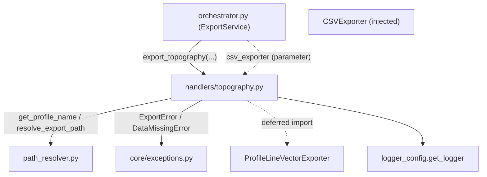

---
tags:
  - secinterp
  - code-walkthrough
  - core
  - export
  - handlers
aliases:
  - topography.py
  - export_topography
cssclass: secinterp-note
---

# `core/services/export/handlers/topography.py`

> [!abstract] One-line summary
> **Topography** export handler: dumps the topographic profile to CSV (dist, elev) and to a vector profile-line layer, as the first step of the export pipeline.

**Path**: `core/services/export/handlers/topography.py` (63 lines)
**Main function**: `export_topography`
**Layer**: Core (QGIS-agnostic)
**Tags**: #secinterp #core #export #handlers

---

## 🎯 Why does this file exist?

The topographic profile (`ProfileData`, a list of `(dist, elev)`) is the base dataset of
the whole section: it is the vertical reference on which geology, structures and
drillholes are drawn. Exporting it is, therefore, the first step and the one that
**must always** exist.

| Problem | Solution |
|---------|----------|
| Persist the topographic profile as CSV and vector | Two chained export blocks |
| It is the mandatory dataset of every export | The orchestrator validates its existence before calling |
| Report each generated file | `msg.append(...)` after each successful export |

> [!important] Architectural note
> QGIS-agnostic: `data` is `list[tuple]` (already-decoupled `(dist, elev)` pairs). It is
> the **only** handler without a `if not data` guard clause — because the orchestrator
> already raises `DataMissingError` if `profile_data` is empty (see Observations).

---

## 🧬 Relationship diagram



> [!tip] How to read
> `csv_exporter` is injected; `ProfileLineVectorExporter` is imported deferred. The
> handler trusts that the orchestrator already validated that `data` is not empty.

---

## 📦 Imports — architectural reading

```python
# core/services/export/handlers/topography.py
from __future__ import annotations

from pathlib import Path
from typing import Any

from sec_interp.core.exceptions import DataMissingError, ExportError
from sec_interp.core.services.export.path_resolver import get_profile_name, resolve_export_path
from sec_interp.logger_config import get_logger
```

```python
# deferred import (inside export_topography)
from sec_interp.exporters import ProfileLineVectorExporter
```

| # | Observation |
|---|-------------|
| ① | `DataMissingError`/`ExportError` from the project's own hierarchy; no `qgis.*` import. |
| ② | `data: list[tuple]` is the most "concrete" type in the package: `(dist, elev)` pairs. |
| ③ | `ProfileLineVectorExporter` deferred import, after the orchestrator's logical guard. |
| ④ | `csv_exporter` injected (shared across handlers by the orchestrator). |

---

## 🏗️ Structure inventory

**Functions/Methods:**
- `export_topography(folder, data, crs, csv_exporter, msg, controller, settings, ext) -> None`

**Domain dependencies:**
- `ProfileData` (`list[tuple[float, float]]`) — distance/elevation pairs.
- `ProfileLineVectorExporter` (from `sec_interp.exporters`)

One public function. The simplest signature in the package: no `raster_layer`, no
`options`, no `line_layer`, no `access_control`.

---

## 📖 Method-by-method walkthrough

### `export_topography`

```python
def export_topography(
    folder: Path,
    data: list[tuple],
    crs: Any,
    csv_exporter: Any,
    msg: list[str],
    controller: Any | None,
    settings: Any | None,
    ext: str,
) -> None:
    """Export topographic data (CSV + vector)."""
    from sec_interp.exporters import ProfileLineVectorExporter

    logger.info("✓ Saving topographic profile...")
```

**No guard clause**: the first instruction is the deferred import (no `if not data`).
The guarantee that `data` is non-empty lives in the orchestrator, which raises
`DataMissingError` before invoking the handlers.

```python
    try:
        profile_name = get_profile_name(controller)
        pattern = getattr(settings, "naming_pattern", None) if settings else None

        csv_path, csv_layer = resolve_export_path(
            folder, "topo_profile", profile_name, pattern, ".csv"
        )
        csv_ok = csv_exporter.export(
            csv_path,
            {"headers": ["dist", "elev"], "rows": data},
            layer_name=csv_layer,
        )
        if csv_ok:
            msg.append(f"  - {csv_path.relative_to(folder)}")
        else:
            logger.warning(f"Failed to write CSV topography to {csv_path}")
```

**CSV**: the payload uses `data` directly as `rows` (no transformation, since they are
already `(dist, elev)` pairs). Headers `["dist", "elev"]`, extension `.csv`.

```python
        vec_path, vec_layer = resolve_export_path(
            folder, "profile_line", profile_name, pattern, ext
        )
        vector_exporter = ProfileLineVectorExporter({})
        vec_ok = vector_exporter.export(
            vec_path, {"profile_data": data, "crs": crs}, layer_name=vec_layer
        )
        if vec_ok:
            msg.append(f"  - {vec_path.relative_to(folder)}")
        else:
            logger.warning(f"Failed to write vector topography to {vec_path}")
```

**Vector**: `base_name="profile_line"` (the profile line), payload
`{"profile_data": data, "crs": crs}`.

```python
    except (OSError, ValueError, TypeError, DataMissingError) as e:
        logger.exception(f"Topography export failed: {e}")
        raise ExportError(f"Topography export failed: {e!s}") from e
    except Exception as e:
        logger.exception("Unexpected system error during topography export")
        raise ExportError(f"Critical error exporting topography: {e}") from e
```

**Normalization**: the standard double `except` → `ExportError` with cause.

---

## 🔄 Data flow

| Phase | Input | Transformation | Output |
|-------|-------|----------------|--------|
| CSV | `data` (dist/elev pairs) | passthrough as `rows` | `topo_profile.csv` + `msg` |
| Vector | `data`, `crs` | `ProfileLineVectorExporter.export` | profile line + `msg` |
| Errors | raw exception | `except → ExportError` | domain exception |

---

## 🏛️ Design patterns present

| Pattern | Where | Purpose |
|---------|-------|---------|
| **Lazy import (deferred)** | `ProfileLineVectorExporter` | save loading when unnecessary |
| **Dependency injection** | `csv_exporter` as parameter | share the exporter |
| **Facade** | single function | hide CSV + vector behind one signature |
| **Exception translation** | `except → ExportError` | normalize failures |

---

## 🧾 API summary

| Symbol | Signature / Inherits | Typical use |
|--------|----------------------|-------------|
| `export_topography` | `(folder, data, crs, csv_exporter, msg, controller, settings, ext) -> None` | Export topographic profile CSV + vector |
| `ProfileLineVectorExporter` | `BaseExporter` (deferred import) | Write the profile line |

---

## 📐 Handler signature contract

Eight parameters, with an injected `csv_exporter`:

| Parameter | Type | Role |
|-----------|------|------|
| `folder` | `Path` | Base output directory |
| `data` | `list[tuple]` | Decoupled `ProfileData` (`(dist, elev)` pairs) |
| `crs` | `Any` | Section CRS |
| `csv_exporter` | `Any` | `CSVExporter` injected by the orchestrator |
| `msg` | `list[str]` | Message accumulator |
| `controller` | `Any \| None` | Profile-name source |
| `settings` | `Any \| None` | Settings (`naming_pattern`) |
| `ext` | `str` | Output extension |

> [!note] `data` is not transformed
> Unlike `geology.py` (flattening) or `structures.py` (field extraction), topography
> already arrives in the exact shape the CSV needs: `rows = data` with no mapping.

## 🔁 Invocation from the orchestrator

The orchestrator groups topography and axes into one composite handler:

```python
def topo_handler(settings=export_settings, ext=format_ext) -> None:
    topo_h.export_topography(
        folder, profile_data, line_crs, csv_exporter, msg,
        self.controller, settings, ext,
    )
    axes_h.export_axes(
        folder, profile_data, line_crs, msg,
        self.controller, settings, ext,
    )

handlers = {"exp_topo": topo_handler, ...}
```

The `profile_data` comes from the direct parameter of `export_data` (not from a DTO),
and is the same `ProfileData` that `export_axes` consumes.

---

## 🛡️ Error handling

| Caught type | Action | Result |
|-------------|--------|--------|
| `OSError`, `ValueError`, `TypeError`, `DataMissingError` | `logger.exception` + `raise ExportError(...) from e` | domain error |
| `Exception` (rest) | `logger.exception` + `raise ExportError(...) from e` | critical error |

> [!note] Empty-data validation lives in the orchestrator
> `ExportService.export_data` raises `DataMissingError` if `profile_data` is empty
> **before** delegating. Hence this handler omits the `if not data: return`.

---

## 🧪 Associated tests

- `tests/core/test_export_service.py::test_export_data_minimal` — topography as the
  minimal export case (topo + axes only).
- `tests/core/test_export_service.py::test_export_topography_error` — exporter failure
  → `ExportError`.
- `tests/core/test_export_service.py::test_export_data_missing_profile` — the
  orchestrator raises `DataMissingError` without a profile.
- `tests/core/test_profile_exporters.py::test_profile_line_exporter_success` — real
  logic of `ProfileLineVectorExporter`.
- `tests/integration/test_export_service_e2e.py::test_export_topography_creates_csv` —
  real CSV export.

---

## 👀 Observations and notes

> [!success] Strengths
> - Minimal and clear signature: the topographic dataset needs no extra options.
> - `data` passes through to the CSV unchanged, zero friction.
> - Uniform error contract with `ExportError`.

> [!warning] Points of attention
> - The missing guard clause couples the handler to the orchestrator's contract (fragile
>   if called directly).
> - `data: list[tuple]` does not specify the pair shape (should be `list[tuple[float, float]]`).

> [!question] Open questions
> - Add a defensive `if not data: return` in case the handler is reused outside the
>   orchestrator?
> - Type `data` as `ProfileData` (alias already defined in `entities.py`)?

---

## 🔗 Related notes

- [[Index]] — vault index
- [[core_services_export_handlers]] — `handlers/` package it belongs to
- [[orchestrator]] — delegates to `export_topography` and `export_axes` under `exp_topo`
- [[path_resolver]] — `get_profile_name` / `resolve_export_path`
- [[compat]] — `_export_topography` compatibility wrapper
- [[preview_service]] — produces the exported topographic profile (`ProfileData`)
- [[entities]] — `ProfileData` (`list[tuple[float, float]]`)

---

*Note of the SecInterp Code Walkthrough v2 vault — v3.9.0*
