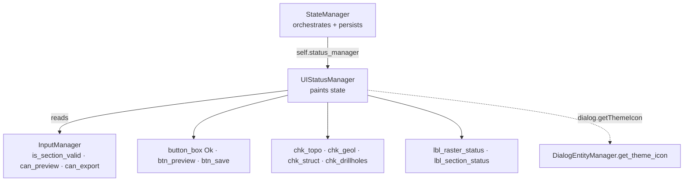

---
tags:
  - secinterp
  - code-walkthrough
  - gui
  - dialog
aliases:
  - ui_status_manager.py
  - UIStatusManager
cssclass: secinterp-note
---

# `gui/ui_status_manager.py`

> [!abstract] One-line summary
> `UIStatusManager`: owns the dialog's visual state (per-section validity icons, button enablement, preview checkboxes) by reading `InputManager` without touching input widgets.

**Path**: `gui/ui_status_manager.py` (85 lines)
**Main class**: `UIStatusManager(dialog)`
**Layer**: GUI (presentation · delegated by `StateManager`)
**Tags**: #secinterp #gui #dialog

---

## 🎯 Why does this file exist?

Buttons and validity traffic lights must react to every input change. Without this module, that logic would live in `StateManager` mixed with persistence — or worse, scattered across pages:

| Problem | Solution |
|---------|----------|
| Visual state mixed with settings save/load | `UIStatusManager` only paints; `StateManager` orchestrates and persists |
| Each page enabling buttons on its own | Central `update_button_state()` with `can_preview()` / `can_export()` |
| Preview checkboxes active with no valid data | `update_preview_checkbox_states()` with per-section gates |
| "Required" icons built on every page | `setup_indicators()` resolves them once via `dialog.getThemeIcon` |
| Circular dialog ↔ manager import | `TYPE_CHECKING` + reference to the already-built dialog |

> [!important] Architectural note
> The manager **reads inputs, never writes them**: it queries `dialog.input_manager.is_section_valid(...)` / `can_preview()` / `can_export()` and only mutates presentation (icons, `setEnabled`, tooltips). Validity truth lives in [[dialog_input_manager]]; here it is only mirrored.

---

## 🧬 Relationship diagram



> [!tip] How to read
> Solid arrow = delegates/reads/mutates; dashed = icon resolution through the dialog. The manager never imports the dialog at runtime.

---

## 📦 Imports — architectural reading

```python
# gui/ui_status_manager.py
from __future__ import annotations

from typing import TYPE_CHECKING

from qgis.PyQt.QtWidgets import QDialogButtonBox

if TYPE_CHECKING:
    from sec_interp.gui.main_dialog import SecInterpDialog  # type: ignore
```

| # | Observation |
|---|-------------|
| ① | `TYPE_CHECKING` for `SecInterpDialog`: typing sees the dialog, runtime never imports it — a deliberate break of the dialog ↔ manager cycle. |
| ② | `QDialogButtonBox` only for the `StandardButton.Ok` enum: locating the OK button without keeping references. |
| ③ | No imports of pages, layers or `core/`: everything arrives via `self.dialog` (already-built dialog). |

---

## 🏗️ Structure inventory

**Classes:** `class UIStatusManager` — 6 methods, 2 icon attributes (`_warning_icon`, `_success_icon`, both `None` until `setup_indicators`).

| Method | Role |
|---|---|
| `__init__(dialog)` | Stores the dialog; icons to `None` |
| `setup_indicators()` | Resolves icons and paints the initial DEM + section state |
| `update_all()` | Full refresh: buttons + checkboxes + 2 traffic lights |
| `update_preview_checkbox_states()` | Per-section gates for the 4 checkboxes |
| `update_button_state()` | `btn_preview` + OK button on `can_preview()`; `btn_save` on `can_export()` |
| `update_raster_status()` / `update_section_status()` | Single-label traffic light: 16px pixmap + tooltip |

---

## 📁 Where it lives inside `gui/`

| Neighbor | Relationship with this module |
|---|---|
| [[dialog_state_manager]] | Composes it as `self.status_manager`, delegates the 5 state methods |
| [[dialog_input_manager]] | Source of truth: `is_section_valid`, `can_preview`, `can_export`, `get_section_error` |
| [[main_dialog]] | `state_manager.setup_indicators()` in `_init_managers`; `update_all()` on boot |
| [[main_dialog_utils]] | Icons resolved via `dialog.getThemeIcon` → `DialogEntityManager` |
| [[dem_page]] / [[section_page]] | Owners of `lbl_raster_status` / `lbl_section_status` |
| [[preview_page]] | Owner of `btn_preview` and the governed `chk_*` |

---

## 📖 Method-by-method walkthrough

### `__init__` and `setup_indicators` — lazy icons

```python
def __init__(self, dialog: SecInterpDialog) -> None:
    """Initialize UI status manager."""
    self.dialog = dialog
    self._warning_icon = None
    self._success_icon = None

def setup_indicators(self) -> None:
    """Set up required field indicators with warning icons."""
    self._warning_icon = self.dialog.getThemeIcon("mMessageLogCritical.svg")
    self._success_icon = self.dialog.getThemeIcon("mIconSuccess.svg")

    # Initial update
    self.update_raster_status()
    self.update_section_status()
```

Icons resolve once (not per refresh) and by theme name, so they follow the QGIS theme. `StateManager.setup_indicators()` calls this during `_init_managers`, before `load_settings()`: on open, traffic lights already show the real state, with no later flicker.

### `update_all` — a single refresh point

```python
def update_all(self) -> None:
    """Update all visual status components."""
    self.update_button_state()
    self.update_preview_checkbox_states()
    self.update_raster_status()
    self.update_section_status()
```

Four calls, fixed order: actionable things first (buttons, checkboxes), informational second (traffic lights). `StateManager.load_settings()` calls it after restoring values, so a bulk settings change ends in one coherent refresh.

### `update_preview_checkbox_states` — per-section gates

```python
def update_preview_checkbox_states(self) -> None:
    """Enable or disable preview checkboxes based on input validity."""
    im = self.dialog.input_manager
    has_section = im.is_section_valid("section")
    has_dem = im.is_section_valid("dem")

    pw = self.dialog.preview_widget
    pw.chk_topo.setEnabled(has_dem and has_section)
    pw.chk_geol.setEnabled(im.is_section_valid("geology") and has_section)
    pw.chk_struct.setEnabled(im.is_section_valid("structure") and has_section)
    pw.chk_drillholes.setEnabled(im.is_section_valid("drillhole") and has_section)
```

The section line is the **master switch**: with no valid section, no checkbox enables even if its own section is valid. Topography additionally requires a valid DEM; geology, structures and drillholes require their own section plus the line. `has_section`/`has_dem` are cached in locals to avoid repeated queries.

### `update_button_state` — act only when possible

```python
def update_button_state(self) -> None:
    """Enable or disable buttons based on input validity."""
    im = self.dialog.input_manager
    can_preview = im.can_preview()

    self.dialog.preview_widget.btn_preview.setEnabled(can_preview)
    self.dialog.button_box.button(QDialogButtonBox.StandardButton.Ok).setEnabled(can_preview)

    if hasattr(self.dialog, "btn_save"):
        self.dialog.btn_save.setEnabled(im.can_export())
```

`btn_preview` and the `button_box` OK share `can_preview()`: accepting what cannot be previewed is impossible. `btn_save` is guarded by `hasattr` because it only exists on dialog variants with explicit saving; its gate is `can_export()`, stricter (requires an output folder).

### `update_raster_status` / `update_section_status` — traffic lights

```python
def update_raster_status(self) -> None:
    """Update raster layer status icon."""
    if not self._warning_icon:
        return
    im = self.dialog.input_manager
    label = self.dialog.page_dem.lbl_raster_status
    if im.is_section_valid("dem"):
        label.setPixmap(self._success_icon.pixmap(16, 16))
        label.setToolTip(self.dialog.tr("Raster layer selected"))
    else:
        label.setPixmap(self._warning_icon.pixmap(16, 16))
        label.setToolTip(im.get_section_error("dem"))
```

Early guard while icons are unresolved (`setup_indicators` still due): no crash on partial boots. On success, a fixed translated tooltip; on failure, the exact `get_section_error("dem")` text, so the light explains as well as signals. `update_section_status` mirrors it with `page_section.lbl_section_status` and `"Section line selected"`. Pixmaps scale to 16×16: a detail preventing giant lights under large-icon themes.

---

## 📊 Full gate matrix

| Widget | Gate | Source | Severity |
|---|---|---|---|
| `chk_topo` | Valid DEM AND valid section | `is_section_valid × 2` | No base, no topo |
| `chk_geol` | Valid geology AND valid section | `is_section_valid × 2` | No line, no projection |
| `chk_struct` | Valid structure AND valid section | `is_section_valid × 2` | No line, no projection |
| `chk_drillholes` | Valid drillholes AND valid section | `is_section_valid × 2` | No line, no projection |
| `btn_preview` + OK | `can_preview()` | Aggregated in `InputManager` | Acceptable equals previewable |
| `btn_save` | `can_export()` (if present) | Aggregated + output folder | Export requires a target |
| `lbl_raster_status` | `is_section_valid("dem")` | Light + tooltip | Informs, never blocks |
| `lbl_section_status` | `is_section_valid("section")` | Light + tooltip | Informs, never blocks |

> [!tip] Two severities, two widgets
> Checkboxes and buttons **block** (hard gate); traffic lights **inform** (light + tooltip with the exact error). Users always know what is missing and where.

---

## 🔄 Data flow

| Phase | Input | Transformation | Output |
|---|---|---|---|
| Boot | `setup_indicators()` via `StateManager` | Resolution of 2 icons + 2 traffic lights | Real initial state |
| Input change | Page signal → `update_all()` | `InputManager` read | Buttons + checkboxes + lights |
| Restore | `load_settings()` | Bulk values → `update_all()` | Coherent UI in one pass |
| Partial failure | Icons still `None` | Early `if not self._warning_icon` guard | No crash, no painting |

---

## 🏛️ Design patterns present

| Pattern | Where | Purpose |
|---|---|---|
| **Delegation chain** | `StateManager` → `status_manager` | Separate orchestration/persistence from painting |
| **Read-only observer** | Whole module | Mirror validity without owning it |
| **Lazy icon resolution** | `setup_indicators` | One `getThemeIcon` per icon, not per refresh |
| **Guard clause** | `if not self._warning_icon: return` | Tolerate partial boot |
| **Feature check** | `hasattr(self.dialog, "btn_save")` | Support dialog variants |

---

## 🧾 API summary

| Symbol | Signature | Typical use |
|---|---|---|
| `UIStatusManager` | `(dialog)` | `UIStatusManager(dialog)` in `StateManager.__init__` |
| `setup_indicators` | `() -> None` | Once in `_init_managers` |
| `update_all` | `() -> None` | After any input or settings change |
| `update_preview_checkbox_states` | `() -> None` | Gates for `chk_topo/geol/struct/drillholes` |
| `update_button_state` | `() -> None` | Gates for `btn_preview`, OK and `btn_save` |
| `update_raster_status` / `update_section_status` | `() -> None` | DEM and section traffic lights |

---

## 🛡️ Error handling

No `try/except`: the defenses are the icon guard (`None` → return) and the `btn_save` `hasattr`. It assumes `input_manager`, `preview_widget`, `page_dem` and `page_section` exist — an invariant `_init_managers` guarantees before any `update_all`. If a page renames `lbl_raster_status`, it fails loudly with `AttributeError`: preferable to a silently dead light.

---

## 🧪 Associated tests

No dedicated `tests/gui/test_ui_status_manager.py`; honest, indirect coverage:

- `tests/gui/test_main_dialog_core.py` — `update_all()` runs at dialog construction.
- `tests/gui/test_main_dialog_settings.py` — refresh after `load_settings()`.
- `tests/gui/test_main_dialog_validation_manager.py` — `can_preview`/`can_export` gates under validation.
- `tests/gui/test_dialog_state_manager.py` — `StateManager` → `status_manager` delegation.

---

## 👀 Observations and notes

> [!success] Strengths
> - Clean split: paints without owning the truth (it lives in `InputManager`).
> - Icons resolved once, by theme: cheap and consistent.
> - Section as master switch rules out impossible previews by construction.
> - `TYPE_CHECKING` breaks the cycle without losing typing.

> [!warning] Points of attention
> - Hardcoded widget names (`lbl_raster_status`, `chk_topo`…): renaming in a page breaks here.
> - Only DEM and section get lights; geology/structures/drillholes merely disable their checkbox, never explaining why.
> - `btn_save` behind `hasattr`: two dialog variants with undocumented different surfaces.

> [!question] Open questions
> - Traffic lights for geology, structure and drillholes with their `get_section_error` too?
> - Constants for icon names instead of `"m*.svg"` literals?

---

## 🔗 Related notes

- [[Index]] — vault index
- [[dialog_state_manager]] — composes this manager as `status_manager`
- [[dialog_input_manager]] — validity source of truth
- [[main_dialog]] — `_init_managers` and `update_all` on boot
- [[dialog_facade_mixin]] — `update_button_state` / `update_preview_checkbox_states` as proxies
- [[main_dialog_utils]] — `get_theme_icon`, final icon resolution
- [[main_dialog_config]] — ✓/✗/⚠ glyphs coherent with the lights
- [[dem_page]] / [[section_page]] — governed status labels
- [[preview_page]] — governed buttons and checkboxes

---

*Note of the SecInterp Code Walkthrough v2 vault — v3.8.0*
