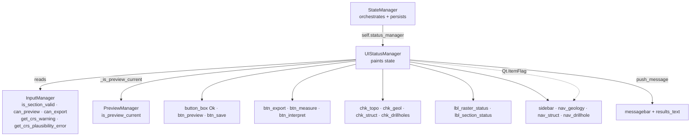
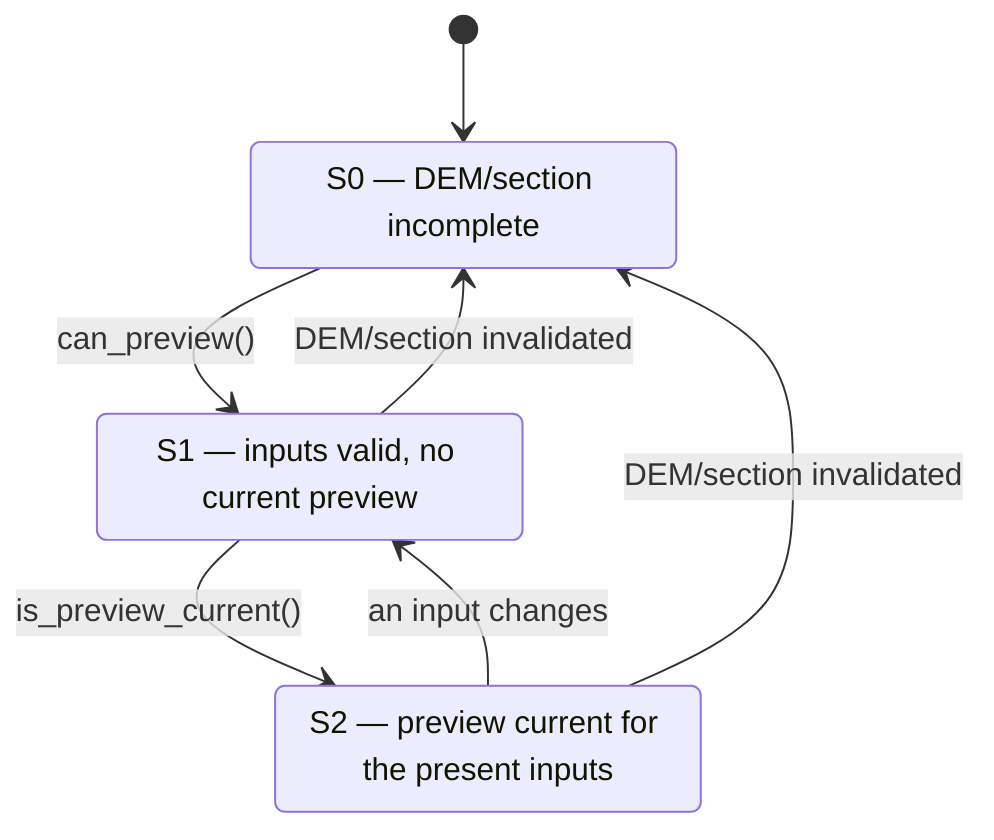

---
tags:
  - secinterp
  - code-walkthrough
  - gui
  - dialog
aliases:
  - ui_status_manager.py
  - UIStatusManager
cssclass: secinterp-note
---

# `gui/ui_status_manager.py`

> [!abstract] One-line summary
> `UIStatusManager`: paints the dialog's visual state (validity traffic lights, CRS warnings, page gating, preview checkboxes and S0/S1/S2 buttons) by reading `InputManager` and `PreviewManager`, without ever touching input widgets.

**Path**: gui/ui_status_manager.py (221 lines)
**Main class**: `UIStatusManager(dialog)`
**Layer**: GUI (presentation · delegated by `StateManager`)
**Tags**: #secinterp #gui #dialog

---

## 🎯 Why does this file exist?

Buttons, checkboxes and traffic lights must react to every input change. Without this module, that logic would live in `StateManager` mixed with persistence — or worse, duplicated across pages. In v3.9.0 the assignment grew: besides enabling/disabling, the manager **explains** why something is blocked (tooltip, CRS notice) and **guides** the user across pages:

| Problem | Solution |
|---------|----------|
| Visual state mixed with settings save/load | `UIStatusManager` only paints; `StateManager` orchestrates and persists |
| Each page enabling buttons on its own | Central `update_button_state()` with `can_preview()` / `can_export()` |
| Preview checkboxes active with no valid data | `update_preview_checkbox_states()` with per-section gates |
| Geology/structural/drillhole pages with no base inputs | `update_page_states()` disables them and falls back to the DEM page |
| User not knowing why Preview is off | `_preview_blocked_reason()` paints the exact error in the tooltip |
| Repeated CRS complaints on every refresh | `_announce_crs_warnings()` dedupes by signature and warns once |
| Mislabelled CRS treated as a mere notice | Red traffic light + blocking `Critical` message |
| Theme icons whose names/sizes change | Stylesheet colour lights (`background-color` + `border-radius`) |

> [!important] Architectural note
> The manager **reads inputs, never writes them**: it queries `dialog.input_manager.is_section_valid(...)` / `can_preview()` / `can_export()` / `get_crs_warning()` / `get_crs_plausibility_error()` and only mutates presentation (colours, tooltips, `setEnabled`, `QListWidgetItem` flags). Validity truth lives in [[dialog_input_manager]]; here it is only mirrored.

---

## 🧬 Relationship diagram



> [!tip] How to read
> Solid arrow = delegates/reads/mutates; dashed = the mutation is done through Qt flags, not a `QWidget`'s `setEnabled`. The manager never imports the dialog at runtime; everything arrives via `self.dialog`.

---

## 📦 Imports — architectural reading

```python
from __future__ import annotations
from typing import TYPE_CHECKING, Any
from qgis.core import Qgis
from qgis.PyQt.QtCore import Qt
from qgis.PyQt.QtWidgets import QDialogButtonBox

if TYPE_CHECKING:
    from sec_interp.gui.main_dialog import SecInterpDialog  # type: ignore
```

| # | Observation |
|---|-------------|
| ① | `TYPE_CHECKING` for `SecInterpDialog`: typing sees the dialog, runtime never imports it — a deliberate break of the dialog ↔ manager cycle. |
| ② | `Qgis` only for message levels (`MessageLevel.Critical` / `.Warning`) used by the CRS notices. |
| ③ | `Qt` only for `Qt.ItemFlag.ItemIsEnabled`: enabling/disabling `QListWidget` items goes through flags, not `setDisabled`. |
| ④ | `QDialogButtonBox` only for the `StandardButton.Ok` enum: locating the OK button of `button_box`. |
| ⑤ | No imports of pages, layers or `core/`: everything arrives via `self.dialog` (already-built dialog). |

---

## 🏗️ Structure inventory

**Module:** 3 style constants (`_STATUS_OK_STYLE`, `_STATUS_ERROR_STYLE`, `_STATUS_WARNING_STYLE`) — fixed colours, independent of theme and Qt style.

**Class:** `class UIStatusManager` — 13 methods, 2 instance attributes (`self.dialog`, `self._last_crs_signature` only after the first announcement).

| Method | Role |
|---|---|
| `__init__(dialog)` | Stores the dialog; `_last_crs_signature` not yet created |
| `setup_indicators()` | Paints the initial DEM + section state (once) |
| `_apply_status(label, ok, ...)` | Single brush: green / amber / red + tooltip |
| `update_all()` | Full refresh: buttons + pages + checkboxes + 2 lights + CRS notices |
| `_announce_crs_warnings()` | Pushes a CRS notice once per distinct signature |
| `update_page_states()` | Disables geology/structure/drillholes when DEM or section is missing |
| `_set_item_enabled(item, enabled)` | Enables/disables a `QListWidgetItem` via flags (static) |
| `update_preview_checkbox_states()` | Per-section gates for the 4 checkboxes |
| `update_button_state()` | S0/S1/S2 gating of Preview, OK and the Export/Measure/Interpret trio |
| `_preview_blocked_reason()` | Human-readable reason why Preview is off |
| `_is_preview_current()` | Preview current for the present inputs (fail-closed) |
| `update_raster_status()` | DEM light: red on mislabelled CRS, amber on mismatch, green/red when valid |
| `update_section_status()` | Section-line traffic light |

---

## 📁 Where it lives inside `gui/`

| Neighbor | Relationship with this module |
|---|---|
| [[dialog_state_manager]] | Composes it as `self.status_manager` and delegates the state methods |
| [[dialog_input_manager]] | Source of truth: `is_section_valid`, `can_preview`, `can_export`, `get_crs_warning`, `get_crs_plausibility_error` |
| [[dialog_preview_manager]] | `is_preview_current()` decides whether the dependent trio enables (S2) |
| [[dialog_message_mixin]] | `push_message()` receives the CRS notices and colourises them in the results area |
| [[main_dialog]] | `setup_indicators()` in `_init_managers`; `update_all()` and `load_settings()` on boot |
| [[dem_page]] / [[section_page]] | Owners of `lbl_raster_status` / `lbl_section_status`; the section page is tagged "Mandatory" |
| [[preview_page]] | Owner of `btn_preview`, `btn_export`, `btn_measure`, `btn_interpret` and the governed `chk_*` |
| [[sidebar]] / [[main_window]] | Creates `nav_geology`, `nav_struct`, `nav_drillhole` and the 0–6 row order |
| [[crs_plausibility]] / [[project_validator]] | In `core/`, they compute the message this manager announces |
| [[dialog_signal_manager]] | Triggers `update_all()` after every relevant signal |

---

## 📖 Method-by-method walkthrough

### Constants and `__init__` — style without theme

```python
# Generic traffic-light styles: no dependency on theme icon names or Qt style.
_STATUS_OK_STYLE = "background-color: #2e7d32; border-radius: 8px;"
_STATUS_ERROR_STYLE = "background-color: #c62828; border-radius: 8px;"
_STATUS_WARNING_STYLE = "background-color: #f9a825; border-radius: 8px;"

def __init__(self, dialog: SecInterpDialog) -> None:
    """Initialize UI status manager."""
    self.dialog = dialog
```

Unlike v3.8.0, there are **no theme icons nor a `setup_indicators` resolving pixmaps**. Colour is painted with a stylesheet on the 16×16 label, so the light never depends on `mIconSuccess.svg` or on the active theme's icon size. It is the direct answer to the previous version's points of attention.

### `_apply_status` — one brush for three states

```python
def _apply_status(self, label: Any, ok: bool, ok_tooltip: str,
                  error_tooltip: str, warning_tooltip: str = "") -> None:
    """Paint a status indicator as a colored dot."""
    label.clear()
    if not ok:
        label.setStyleSheet(_STATUS_ERROR_STYLE)
        label.setToolTip(error_tooltip)
    elif warning_tooltip:
        label.setStyleSheet(_STATUS_WARNING_STYLE)
        label.setToolTip(warning_tooltip)
    else:
        label.setStyleSheet(_STATUS_OK_STYLE)
        label.setToolTip(ok_tooltip)
```

Strict precedence: **red beats everything** (invalid), then **amber** (valid but degraded, e.g. unmatched CRS) and finally **green** (valid). `label.clear()` wipes any pixmap inherited from the theme, and the label uses `border-radius: 8px` to look like a dot. The green tooltip is fixed and translated ("Raster layer selected" / "Section line selected"); in amber/red it is the validator's real message, so the light **explains** as well as signals. Centralising the rule here keeps the two lights from drifting apart.

### `setup_indicators` and `update_all` — one refresh point

```python
def setup_indicators(self) -> None:
    self.update_raster_status()
    self.update_section_status()

def update_all(self) -> None:
    self.update_button_state()
    self.update_page_states()
    self.update_preview_checkbox_states()
    self.update_raster_status()
    self.update_section_status()
    self._announce_crs_warnings()
```

`setup_indicators()` is deliberately minimal: only the two lights, so on open the dialog already shows the real state. `update_all()` is the full refresh and its **order matters**: actionable things first (buttons, pages, checkboxes), informational second (lights) and the CRS notice last, which only emits a message when the signature changed. [[main_dialog]] calls `setup_indicators()` inside `_init_managers` and `update_all()` before `load_settings()`.

### `_announce_crs_warnings` — warn once per signature

```python
def _announce_crs_warnings(self) -> None:
    im = self.dialog.input_manager
    plausibility = im.get_crs_plausibility_error()
    mismatch = im.get_crs_warning()
    signature = (plausibility, mismatch)
    if signature == getattr(self, "_last_crs_signature", None):
        return
    self._last_crs_signature = signature
    if plausibility:
        self.dialog.push_message(
            self.dialog.tr("Possible CRS mislabel"), plausibility,
            level=Qgis.MessageLevel.Critical, duration=10)
    elif mismatch:
        self.dialog.push_message(
            self.dialog.tr("CRS mismatch"), mismatch,
            level=Qgis.MessageLevel.Warning, duration=10)
```

`update_all()` runs on a great many signals; without dedupe, every keystroke would repeat the same notice. The **signature** is the tuple `(plausibility, mismatch)`: `_last_crs_signature` updates only when the text changes (clearing included). If both strings are empty, the method returns silently — no "all good" is pushed. Priority is clear: a mislabelled CRS (`Critical`) overrides a plain mismatch (`Warning`) through the `elif`. `getattr(..., None)` tolerates the attribute not existing on the very first refresh.

### `update_page_states` and `_set_item_enabled` — page gating

```python
def update_page_states(self) -> None:
    im = self.dialog.input_manager
    ready = bool(im.is_section_valid("dem") and im.is_section_valid("section"))
    for attr in ("nav_geology", "nav_struct", "nav_drillhole"):
        item = getattr(self.dialog, attr, None)
        if item is None:
            continue
        self._set_item_enabled(item, ready)
    if not ready:
        sidebar = getattr(self.dialog, "sidebar", None)
        if sidebar is not None and sidebar.currentRow() in (2, 3, 4):
            sidebar.setCurrentRow(0)

@staticmethod
def _set_item_enabled(item: Any, enabled: bool) -> None:
    flags = item.flags()
    if enabled:
        flags |= Qt.ItemFlag.ItemIsEnabled
    else:
        flags &= ~Qt.ItemFlag.ItemIsEnabled
    item.setFlags(flags)
```

DEM and section are mandatory; without both, the geology, structure and drillhole pages make no sense. The `for` with `getattr` tolerates dialog variants lacking those pages. If the user is sitting on one of them (rows 2–4 of the [[sidebar]]) when inputs become invalid, the manager returns them to row 0 (DEM). A commonly missed detail: a `QListWidgetItem` has **no** `setDisabled` (that is a `QWidget` method); interactivity is controlled by the `Qt.ItemFlag.ItemIsEnabled` flag, and `test_ui_gating.py` verifies it against a real `MockQListWidgetItem`.

### `update_preview_checkbox_states` — per-section gates

```python
def update_preview_checkbox_states(self) -> None:
    im = self.dialog.input_manager
    has_section = im.is_section_valid("section")
    has_dem = im.is_section_valid("dem")
    pw = self.dialog.preview_widget
    pw.chk_topo.setEnabled(has_dem and has_section)
    pw.chk_geol.setEnabled(im.is_section_valid("geology") and has_section)
    pw.chk_struct.setEnabled(im.is_section_valid("structure") and has_section)
    pw.chk_drillholes.setEnabled(im.is_section_valid("drillhole") and has_section)
```

The section line is the **master switch**: with no valid section, no checkbox enables even if its own section is valid. Topography additionally requires a valid DEM; geology, structures and drillholes require their own section plus the line. `has_section`/`has_dem` are cached in locals to avoid repeated queries.

### `update_button_state` — act only when possible (S0/S1/S2)

```python
def update_button_state(self) -> None:
    im = self.dialog.input_manager
    can_preview = im.can_preview()
    preview_current = bool(can_preview) and self._is_preview_current()
    pw = self.dialog.preview_widget
    pw.btn_preview.setEnabled(can_preview)
    pw.btn_preview.setToolTip(
        self.dialog.tr("Generate preview") if can_preview else self._preview_blocked_reason())
    self.dialog.button_box.button(QDialogButtonBox.StandardButton.Ok).setEnabled(can_preview)
    pw.btn_export.setEnabled(preview_current)
    pw.btn_measure.setEnabled(preview_current)
    pw.btn_interpret.setEnabled(preview_current)
    if hasattr(self.dialog, "btn_save"):
        self.dialog.btn_save.setEnabled(im.can_export())
```

Two distinct truths govern the buttons: **can it be previewed?** (`can_preview()`) and **is the preview current for the present inputs?** (`_is_preview_current()`). Preview and OK follow the first; Export/Measure/Interpret require both. `btn_save` is guarded by `hasattr` because it only exists on variants with explicit saving, and its gate is `can_export()`, stricter still (requires an output folder). The Preview tooltip is rewritten on every refresh: when off, it always explains why.

### `_preview_blocked_reason` and `_is_preview_current` — explain and fail closed

```python
def _preview_blocked_reason(self) -> str:
    im = self.dialog.input_manager
    return (
        im.get_section_error("section") or im.get_section_error("dem")
        or im.get_crs_plausibility_error()
        or self.dialog.tr("Complete the required inputs"))

def _is_preview_current(self) -> bool:
    pm = getattr(self.dialog, "preview_manager", None)
    is_current = getattr(pm, "is_preview_current", None)
    if not callable(is_current):
        return False
    try:
        return bool(is_current())
    except Exception:
        return False
```

The first is an `or` priority chain: the first non-empty reason is shown, and the mislabelled CRS comes before the generic "Complete the required inputs". The second is **fail-closed**: without a `preview_manager`, without the method or on any exception it returns `False` and the dependent trio stays off. [[dialog_preview_manager]] compares the assembled-params hash and the vertical exaggeration; any input change invalidates the preview.

### `update_raster_status` and `update_section_status` — traffic lights

```python
def update_raster_status(self) -> None:
    im = self.dialog.input_manager
    ok = im.is_section_valid("dem")
    plausibility = im.get_crs_plausibility_error()
    if plausibility:
        self._apply_status(self.dialog.page_dem.lbl_raster_status, False,
                           self.dialog.tr("Raster layer selected"), plausibility)
        return
    warning = im.get_crs_warning() if ok else ""
    self._apply_status(self.dialog.page_dem.lbl_raster_status, ok,
                       self.dialog.tr("Raster layer selected"),
                       im.get_section_error("dem"), warning_tooltip=warning)
```

The DEM light is the richest: **hard red** if the CRS looks mislabelled (it wins even over a valid DEM), **amber** if the DEM is valid but its CRS does not match the other layers, and **green/red** per `is_section_valid("dem")`. The `if plausibility: ... return` explicitly implements the red > amber precedence. `update_section_status` mirrors it with `page_section.lbl_section_status` and `"Section line selected"`, with no CRS layer.

---

## 🚦 S0/S1/S2 state machine

`update_button_state()` formalises three scenarios that used to be implicit:

| State | Condition | Preview + OK | Export / Measure / Interpret |
|---|---|---|---|
| **S0** | `can_preview()` = `False` | Disabled | Disabled |
| **S1** | `can_preview()` = `True`, no current preview | Enabled | Disabled |
| **S2** | `can_preview()` = `True` and `_is_preview_current()` = `True` | Enabled | Enabled |



> [!important] Golden rule
> `preview_current = bool(can_preview) and self._is_preview_current()`. The conjunction guarantees the trio is **never** enabled without valid inputs, even if the preview manager returns a stale value. `btn_save` stays outside the machine: it depends only on `can_export()`.

---

## 🛰️ CRS notices: what is announced and how severely

| Detection | `core/` origin | DEM light | Message | Severity |
|---|---|---|---|---|
| Mislabelled CRS | `ProjectValidator.crs_plausibility_error` → [[crs_plausibility]] | Red | "Possible CRS mislabel" | `Critical` (blocks `can_preview`) |
| Unmatched CRS across layers | `ProjectValidator.crs_compatibility_warning` | Amber | "CRS mismatch" | `Warning` (non-blocking) |
| All coherent | — | Green/red by validity | (none) | — |

`crs_compatibility_warning()` uses the **first valid configured layer** as reference, so the DEM (if present) leads the comparison. `crs_plausibility_error()` scans the metadata of every configured layer and joins the reasons with a newline. The heuristic is conservative: it only fires when the extent (or pixel) contradicts the declared CRS.

> [!tip] Why the notice is `Critical` and lasts 10 seconds
> A mislabelled CRS produces silently wrong profiles; [[dialog_input_manager]] folds it into `can_preview()`, so blocking is proportionate. `push_message()` also leaves an HTML trace in the results area via [[dialog_message_mixin]].

---

## 📊 Full gate matrix

| Widget | Gate | Source | Severity |
|---|---|---|---|
| `nav_geology` / `nav_struct` / `nav_drillhole` | Valid DEM AND valid section | `is_section_valid × 2` | Page disabled + fallback to DEM |
| `chk_topo` | Valid DEM AND valid section | `is_section_valid × 2` | No base, no topo |
| `chk_geol` | Valid geology AND valid section | `is_section_valid × 2` | No line, no projection |
| `chk_struct` | Valid structure AND valid section | `is_section_valid × 2` | No line, no projection |
| `chk_drillholes` | Valid drillholes AND valid section | `is_section_valid × 2` | No line, no projection |
| `btn_preview` + OK | `can_preview()` | Aggregated in `InputManager` | Acceptable equals previewable |
| `btn_export` / `btn_measure` / `btn_interpret` | `can_preview() ∧ is_preview_current()` | Aggregated + current hash | S2 only |
| `btn_save` | `can_export()` (if present) | Aggregated + output folder | Export requires a target |
| `lbl_raster_status` | `is_section_valid("dem")` + CRS | 3-state light + tooltip | Informs, never blocks (except CRS) |
| `lbl_section_status` | `is_section_valid("section")` | Light + tooltip | Informs, never blocks |

> [!tip] Two severities, two widgets
> Pages, checkboxes and buttons **block** (hard gate); traffic lights **inform** (colour + tooltip with the exact error). The only exception is a mislabelled CRS, which paints the light red *and* blocks the preview.

---

## 🔄 Data flow

| Phase | Input | Transformation | Output |
|---|---|---|---|
| Boot | `setup_indicators()` via `StateManager` | 2 initial lights | Real state, no flicker |
| Input change | Page signal → `update_all()` | `InputManager` + `PreviewManager` read | Buttons + pages + checkboxes + lights + CRS notice |
| Preview generated | `is_preview_current()` = `True` | S1 → S2 transition | Export/Measure/Interpret enabled |
| Input changed | Preview hash no longer matches | S2 → S1 transition | Trio off, Preview still available |
| Restore | `load_settings()` | Bulk values → `update_all()` | Coherent UI in one pass |
| Repeated CRS | Same `(plausibility, mismatch)` signature | `_announce_crs_warnings` returns early | No duplicate message |
| Preview manager failure | `_is_preview_current` raises | `except: return False` | Trio disabled (fail-closed) |

---

## 🏛️ Design patterns present

| Pattern | Where | Purpose |
|---|---|---|
| **Delegation chain** | `StateManager` → `status_manager` | Separate orchestration/persistence from painting |
| **State machine** | `update_button_state` (S0/S1/S2) | Derive enablement from two truths |
| **Fail-closed default** | `_is_preview_current` | When in doubt, turn the dependents off |
| **Memoization / dedupe** | `_last_crs_signature` | One notice per distinct signature |
| **Guard clause** | `getattr(..., None)` / `if item is None: continue` | Tolerate variants and partial boots |
| **Feature check** | `hasattr(self.dialog, "btn_save")` | Support dialog variants |
| **Strategy via stylesheet** | `_STATUS_*_STYLE` + `_apply_status` | Theme-independent traffic lights |

---

## 🧾 API summary

| Symbol | Signature | Typical use |
|---|---|---|
| `UIStatusManager` | `(dialog)` | `UIStatusManager(dialog)` in `StateManager.__init__` |
| `setup_indicators` | `() -> None` | Once in `_init_managers` |
| `update_all` | `() -> None` | After any input or settings change |
| `update_page_states` | `() -> None` | Gates for the geology/structure/drillhole pages |
| `update_preview_checkbox_states` | `() -> None` | Gates for `chk_topo/geol/struct/drillholes` |
| `update_button_state` | `() -> None` | S0/S1/S2 gating of Preview, OK and the trio |
| `_preview_blocked_reason` | `() -> str` | Tooltip when Preview is off |
| `_is_preview_current` | `() -> bool` | "Preview current" truth (fail-closed) |
| `update_raster_status` / `update_section_status` | `() -> None` | DEM and section traffic lights |
| `_announce_crs_warnings` | `() -> None` | Deduplicated CRS notice |

---

## 🛡️ Error handling

No `try/except` across most of the module: the defenses are `getattr(..., None)` in `_announce_crs_warnings` and `update_page_states`, `hasattr` on `btn_save`, and the deliberate **single** `try/except` in `_is_preview_current` (fail-closed). It assumes `input_manager`, `preview_widget`, `page_dem` and `page_section` exist — an invariant `_init_managers` guarantees before any `update_all`. If a page renames `lbl_raster_status`, it fails loudly with `AttributeError`: preferable to a silently dead light.

---

## 🧪 Associated tests

There is now dedicated coverage for the v3.9.0 additions:

- `tests/gui/test_ui_gating.py` — S0/S1/S2 (`TestButtonGating`), page gates and DEM fallback (`TestPageStates`), "Mandatory" labels (`TestMandatoryLabels`), stylesheet lights (`TestStatusIndicatorFallback`), one-shot CRS mismatch (`TestCrsMismatchWarning`) and blocking mislabelled CRS (`TestCrsPlausibilityBlocking`).
- `tests/core/test_crs_plausibility.py` — CRS plausibility heuristic in `core/`.
- `tests/gui/test_dialog_input_manager.py` — `can_preview` with `get_crs_plausibility_error`.
- `tests/gui/test_dialog_state_manager.py` and `tests/gui/test_main_dialog_core.py` — delegation and `update_all()` at dialog construction.

---

## 👀 Observations and notes

> [!success] Strengths
> - Clean split: paints without owning the truth (it lives in `InputManager` and `PreviewManager`).
> - Stylesheet lights: immune to icon-name or Qt-theme changes.
> - The S0/S1/S2 machine rules out exports without a preview and impossible previews by construction.
> - CRS dedupe turns a noisy signal into a single, actionable notice.

> [!warning] Points of attention
> - Hardcoded widget names (`lbl_raster_status`, `chk_topo`, sidebar rows 2–4): renaming in a page breaks here.
> - Only DEM and section get lights; geology/structures/drillholes merely disable their checkbox or page, never explaining why.
> - The CRS heuristic is conservative: it may miss subtle mislabels and is no substitute for human review.
> - `btn_save` behind `hasattr`: two dialog variants with undocumented different surfaces.

> [!question] Open questions
> - Traffic lights for geology, structure and drillholes with their `get_section_error` too?
> - Persist already-shown CRS notices across sessions to avoid repeating them on reopen?

---

## 🔗 Related notes

- [[Index]] — vault index
- [[dialog_state_manager]] — composes this manager as `status_manager`
- [[dialog_input_manager]] — validity and CRS-message source of truth
- [[dialog_preview_manager]] — `is_preview_current`, the truth of S2
- [[dialog_message_mixin]] — `push_message`, destination of the CRS notices
- [[main_dialog]] — `_init_managers` and `update_all` on boot
- [[dialog_facade_mixin]] — state proxies towards the dialog
- [[dem_page]] / [[section_page]] — governed status labels; "Mandatory"
- [[preview_page]] — governed buttons and checkboxes
- [[sidebar]] — rows 0–6 and the geology/structure/drillhole pages
- [[crs_plausibility]] / [[project_validator]] — CRS heuristic and orchestration in `core/`

---

*Note of the SecInterp Code Walkthrough v2 vault — v3.9.0*
