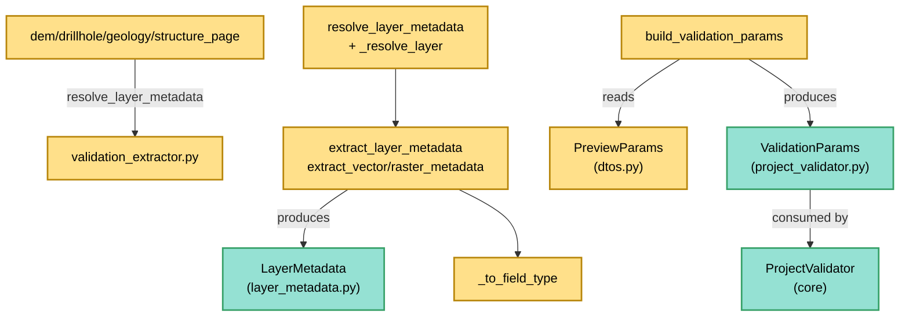

---
tags:
  - secinterp
  - code-walkthrough
  - gui
  - adapters
aliases:
  - validation_extractor.py
  - resolve_layer_metadata
  - extract_layer_metadata
  - build_validation_params
cssclass: secinterp-note
---

# `gui/adapters/validation_extractor.py`

> [!abstract] One-line summary
> **Extract** adapter for validation (functions only, no classes) converting QGIS references and layers into detached `LayerMetadata` records and building pure `ValidationParams` so the core `ProjectValidator` validates without importing QGIS.

**Path**: `gui/adapters/validation_extractor.py` (176 lines)
**Main function**: `build_validation_params(params)` (assembles everything); `resolve_layer_metadata` (resolution + extraction)
**Layer**: GUI · Adapter (Extract side, depends on QGIS)
**Tags**: #secinterp #gui #adapters

---

## 🎯 Why does this file exist?

The core `ProjectValidator` validates layer neighbourhoods, bands and fields,
but it is forbidden from importing `qgis.core`. Something must translate "the
combo's layer" into "pure metadata" before calling the validator:

| Problem | Solution |
|---------|----------|
| The core cannot receive `QgsVectorLayer`/`QgsRasterLayer` | `extract_*_metadata` produces `LayerMetadata` (name, validity, fields, CRS) |
| Dialogs store references (ID, name, object) | `_resolve_layer` accepts all three shapes via `QgsProject` |
| `PreviewParams` carries 20+ live QGIS references | `build_validation_params` converts them all into pure `ValidationParams` |
| Field types are `QVariant` (Qt) | `_to_field_type` maps them to the domain `FieldType` |

> [!important] Architectural note
> It is the **pre-Extract of validation**: runs before any data extractor and
> decides whether the pipeline executes at all. Everything crossing into
> `ProjectValidator` is `str`, `float`, `bool` and `LayerMetadata` — not one
> `QgsMapLayer` survives `build_validation_params`.

---

## 🧬 Relationship diagram



> [!tip] How to read
> Two consumers: the settings pages call `resolve_layer_metadata` to validate one
> layer on the fly; the full pipeline calls `build_validation_params` to validate
> the whole project before processing.

---

## 📦 Imports — architectural reading

```python
# gui/adapters/validation_extractor.py
from __future__ import annotations

from typing import Any

from qgis.core import (
    QgsMapLayer,
    QgsProject,
    QgsRasterLayer,
    QgsVectorLayer,
    QgsWkbTypes,
)

from sec_interp.core.domain import FieldType
from sec_interp.core.validation.layer_metadata import (
    GEOMETRY_LINE,
    GEOMETRY_POINT,
    GEOMETRY_POLYGON,
    GEOMETRY_UNKNOWN,
    KIND_RASTER,
    KIND_UNKNOWN,
    KIND_VECTOR,
    LayerMetadata,
)
```

| # | Observation |
|---|-------------|
| ① | Five `qgis.core` classes with runtime `QgsMapLayer` (unlike `layer_resolver`, which hides it behind `TYPE_CHECKING`): `isinstance` needs the real class here. |
| ② | `QgsProject` is only used in `_resolve_layer` (ID/name fallback). |
| ③ | Imports **eight** symbols from `core/validation/layer_metadata.py` (`KIND_*` and `GEOMETRY_*` constants + `LayerMetadata`): the output vocabulary is 100% core. |
| ④ | `FieldType` comes from `core/domain`: the QVariant→domain bridge stays typed. |
| ⑤ | `ValidationParams` is **lazily** imported inside `build_validation_params` (avoids module-import cost/cycles). |
| ⑥ | No `qgis.PyQt`, no `tr()`, no logger: silent functions returning `None`/defaults for the unresolvable. |

---

## 🏗️ Structure inventory

**Module constant:**
- `_GEOMETRY_MAP` — `dict[QgsWkbTypes.GeometryType, str]`: point/line/polygon → core `GEOMETRY_*` constants.

**Public functions (4):**
- `resolve_layer_metadata(layer_ref)` — resolves the reference and extracts metadata (`LayerMetadata | None`).
- `extract_layer_metadata(layer)` — dispatches vector/raster/unknown.
- `extract_vector_metadata(layer)` — `LayerMetadata` with count, geometry type, fields + types and CRS.
- `extract_raster_metadata(layer)` — `LayerMetadata` with bands and CRS.
- `build_validation_params(params)` — `PreviewParams` → `ValidationParams` (20 fields converted).

**Private functions (2):**
- `_resolve_layer(layer_ref)` — object/ID/name → `QgsMapLayer | None` (no cache).
- `_to_field_type(qvariant_type)` — `int(QVariant)` → `FieldType` (`NULL` on failure).

---

## 📁 Files in the package

The adapter lives in the `gui/adapters/` package (the full Extract phase):

| File | Lines | Role |
|---|--:|---|
| `__init__.py` | 7 | Package docstring: Extract-then-Compute contract |
| `drillhole_extractor.py` | 369 | `DrillholeExtractor` → `DrillholeContext` |
| `geology_extractor.py` | 235 | `GeologyExtractor` → `GeologyContext` |
| `geometry.py` | 226 | QGIS geometry helpers and DEM sampling |
| `layer_resolver.py` | 113 | `LayerResolver` + `resolve_layer` (layer cache) |
| `structure_extractor.py` | 226 | `SectionContext` + `StructureExtractor` |
| `validation_extractor.py` | 176 | `resolve_layer_metadata`, `build_validation_params` (this note) |
| `feature_fetcher.py` | 84 | `DataFetcher` (bulk child reads) |
| `profile_extractor.py` | 86 | `ProfileExtractor` → `ProfileData` |

---

## 📖 Function-by-function walkthrough

### `resolve_layer_metadata` — resolve + extract

```python
def resolve_layer_metadata(layer_ref: Any) -> LayerMetadata | None:
    layer = _resolve_layer(layer_ref)
    if layer is None:
        return None
    return extract_layer_metadata(layer)
```

Two phases in two lines: reference → object → metadata. An unresolvable
reference → `None` (a missing optional layer is a normal case, not an error).
Used directly by all four settings pages (`dem_page`, `drillhole_page`,
`geology_page`, `structure_page`) for on-the-fly validation.

### `extract_layer_metadata` — type dispatch

```python
def extract_layer_metadata(layer: QgsMapLayer) -> LayerMetadata:
    if isinstance(layer, QgsVectorLayer):
        return extract_vector_metadata(layer)
    if isinstance(layer, QgsRasterLayer):
        return extract_raster_metadata(layer)
    return LayerMetadata(name=layer.name(), is_valid=layer.isValid(), kind=KIND_UNKNOWN)
```

Three branches: vector, raster and "anything else" (e.g. mesh or plugin layer),
which comes out as `KIND_UNKNOWN` with just name and validity. Never raises:
even an unknown type produces a valid record for the validator.

### `extract_vector_metadata` — vector metadata

```python
def extract_vector_metadata(layer: QgsVectorLayer) -> LayerMetadata:
    metadata = LayerMetadata(
        name=layer.name(),
        is_valid=layer.isValid(),
        kind=KIND_VECTOR,
        feature_count=layer.featureCount(),
    )
    if not layer.isValid():
        return metadata
    metadata.geometry_type = _GEOMETRY_MAP.get(
        QgsWkbTypes.geometryType(layer.wkbType()), GEOMETRY_UNKNOWN
    )
    for f in layer.fields():
        metadata.field_names.append(f.name())
        metadata.field_types[f.name()] = _to_field_type(f.type())
    crs = layer.crs()
    if crs.isValid():
        metadata.crs_authid = crs.authid()
    return metadata
```

Invalid layer → minimal record (early, without touching `fields()` or `crs()`
which could fail). The geometry type derives from `wkbType()` via
`QgsWkbTypes.geometryType()` and `_GEOMETRY_MAP`, defaulting to
`GEOMETRY_UNKNOWN` (null or no geometry). Each field contributes name +
`FieldType`. The CRS travels as `authid` (`"EPSG:25830"`), never as a `QgsCRS`
object.

### `extract_raster_metadata` — raster metadata

```python
def extract_raster_metadata(layer: QgsRasterLayer) -> LayerMetadata:
    metadata = LayerMetadata(
        name=layer.name(),
        is_valid=layer.isValid(),
        kind=KIND_RASTER,
        band_count=layer.bandCount(),
    )
    if not layer.isValid():
        return metadata
    crs = layer.crs()
    if crs.isValid():
        metadata.crs_authid = crs.authid()
    return metadata
```

Minimalist mirror of the vector one: bands instead of fields (`bandCount()` is
what the validator contrasts with `band_number`). Same early guard and same CRS
as `authid`.

### `_resolve_layer` — cache-less resolution

```python
def _resolve_layer(layer_ref: Any) -> QgsMapLayer | None:
    if isinstance(layer_ref, QgsMapLayer):
        return layer_ref
    if not layer_ref:
        return None
    if isinstance(layer_ref, str):
        project = QgsProject.instance()
        layer = project.mapLayer(layer_ref)
        if layer is not None:
            return layer
        for lyr in project.mapLayers().values():
            if lyr.name() == layer_ref:
                return lyr
    return None
```

Accepts object (via `isinstance`, stricter than `LayerResolver` duck-typing), ID
(`mapLayer`) and name (manual `mapLayers().values()` iteration instead of
`mapLayersByName`). Falsy reference (`None`, `""`) → `None` without touching the
project. No cache: every call re-asks the project (see comparison with
[[layer_resolver]]).

### `_to_field_type` — QVariant → domain

```python
def _to_field_type(qvariant_type: Any) -> FieldType:
    try:
        return FieldType(int(qvariant_type))
    except (ValueError, TypeError):
        return FieldType.NULL
```

`f.type()` returns a `QVariant.Type` enum convertible to `int`; on a weird value,
`FieldType.NULL` instead of an exception. The only spot where Qt crosses into
the domain, and it comes out as a core enum.

### `build_validation_params` — full assembly

```python
def build_validation_params(params: Any) -> Any:
    from sec_interp.core.validation.project_validator import ValidationParams
    return ValidationParams(
        raster_layer=resolve_layer_metadata(params.raster_layer),
        band_number=params.band_num,
        line_layer=resolve_layer_metadata(params.line_layer),
        buffer_dist=float(params.buffer_dist),
        outcrop_layer=resolve_layer_metadata(params.outcrop_layer),
        outcrop_field=params.outcrop_name_field,
        struct_layer=resolve_layer_metadata(params.struct_layer),
        struct_dip_field=params.dip_field,
        struct_strike_field=params.strike_field,
        dip_scale_factor=params.dip_scale_factor,
        collar_layer=resolve_layer_metadata(params.collar_layer),
        collar_id=params.collar_id_field,
        collar_use_geom=params.collar_use_geometry,
        collar_x=params.collar_x_field,
        collar_y=params.collar_y_field,
        survey_layer=resolve_layer_metadata(params.survey_layer),
        survey_id=params.survey_id_field,
        survey_depth=params.survey_depth_field,
        survey_azim=params.survey_azim_field,
        survey_incl=params.survey_incl_field,
        interval_layer=resolve_layer_metadata(params.interval_layer),
        interval_id=params.interval_id_field,
        interval_from=params.interval_from_field,
        interval_to=params.interval_to_field,
        interval_lith=params.interval_lith_field,
    )
```

Translates the 25 `PreviewParams` attributes (see [[dtos]]) renaming into the
validator vocabulary (`raster_layer→raster_layer`, `band_num→band_number`,
`line_layer→line_layer`, `dip_field→struct_dip_field`...). Each layer reference
goes through `resolve_layer_metadata` (missing optional layers → `None`, which
`ValidationParams` accepts). `buffer_dist` is coerced to `float`. The deferred
`ValidationParams` import keeps the module importable without loading the
validator.

---

## 🔄 Data flow

| Phase | Input | Transformation | Output |
|-------|-------|----------------|--------|
| Resolution | ID / name / object / falsy | `_resolve_layer` | `QgsMapLayer` or `None` |
| Dispatch | QGIS layer | `isinstance` vector/raster/other | extraction branch |
| Vector | `QgsVectorLayer` | count + `_GEOMETRY_MAP` + fields + `authid` | `LayerMetadata` |
| Raster | `QgsRasterLayer` | bands + `authid` | `LayerMetadata` |
| Fields | `QVariant.Type` | `_to_field_type` | `FieldType` |
| Assembly | `PreviewParams` (25 attrs) | 7× `resolve_layer_metadata` + renaming | pure `ValidationParams` |
| Validation | `ValidationParams` | `ProjectValidator` (core) | errors or go-ahead |

---

## 🏛️ Design patterns present

| Pattern | Where | Purpose |
|---------|-------|---------|
| **Adapter (Extract)** | whole module | QGIS in, pure metadata out |
| **Type dispatch** | `extract_layer_metadata` | vector / raster / unknown |
| **Early guard** | `isValid()` in both extractions | broken layers → minimal record |
| **Deferred import** | `ValidationParams` in function | light module, no cycles |
| **Mapping table** | `_GEOMETRY_MAP`, `_to_field_type` | Qt → core vocabulary |

---

## 🧾 API summary

| Symbol | Signature | Typical use |
|--------|-----------|-------------|
| `resolve_layer_metadata` | `(layer_ref: Any) -> LayerMetadata \| None` | on-the-fly validation in pages |
| `extract_layer_metadata` | `(layer: QgsMapLayer) -> LayerMetadata` | type dispatch |
| `extract_vector_metadata` | `(layer: QgsVectorLayer) -> LayerMetadata` | count, geometry, fields, CRS |
| `extract_raster_metadata` | `(layer: QgsRasterLayer) -> LayerMetadata` | bands and CRS |
| `build_validation_params` | `(params: Any) -> Any` (`ValidationParams`) | `PreviewParams` → validator |
| `_GEOMETRY_MAP` | `dict` point/line/polygon | geometry translation |

---

## 🛡️ Error handling

| Situation | Behaviour |
|-----------|-----------|
| Unresolvable / falsy reference | `None` (no exception) |
| Unknown layer type | `LayerMetadata(kind=KIND_UNKNOWN)` |
| Invalid layer | minimal record (no fields, no CRS) |
| Unrecognizable geometry | `GEOMETRY_UNKNOWN` |
| Weird QVariant type | `FieldType.NULL` |
| Non-`str` non-layer name | `None` (no `isinstance` branch matches) |

> [!tip] Never raises
> No function in this module raises: failure is expressed as `None`,
> `KIND_UNKNOWN` or minimal records, and `ProjectValidator` decides what counts
> as a showable error. Validation judges; extraction does not.

---

## 🧪 Associated tests

No dedicated GUI tests (there is no `test_validation_extractor.py`); the
coverage net is the densest of the adapters because the validator itself is
tested:

- `tests/core/validation/test_service_validation.py` — service validation over metadata like this.
- `tests/core/test_project_validator.py` — the direct `ValidationParams` consumer.
- `tests/core/test_layer_validator.py` and `test_field_validator.py` — layer and field validators.
- `tests/core/test_validation.py` and `test_validation_refactor.py` — general framework.
- `tests/gui/test_main_dialog_validation_manager.py` — the GUI manager orchestrating validation.
- `tests/integration/test_geology_structure_workflow.py` — pipeline with prior validation.

> [!warning] Coverage gap
> The dispatch (`KIND_UNKNOWN`), the geometry mapping and `build_validation_params`
> (25-field renaming) have no direct test: a mock-first `test_validation_extractor.py`
> with `tests/base_test.py` would cover them without real QGIS.

---

## 🧵 Thread-safety and i18n

| Aspect | Detail |
|--------|--------|
| **Thread** | Reads live `QgsProject`, `fields()`, `crs()`, `featureCount()` → main thread, before the `QgsTask`. The resulting `LayerMetadata` is thread-safe (str/int/bool/lists). |
| **`featureCount()`** | Can be expensive on huge layers (scan); acceptable because it runs once per validation, not per feature. |
| **i18n** | Nothing to translate: generates no messages (`ProjectValidator` already translates its own via `TranslatableMixin`). |

---

## 📐 What travels in a `LayerMetadata`

| Field | QGIS origin | Example |
|-------|-------------|---------|
| `name` | `layer.name()` | `"geology_outcrops"` |
| `is_valid` | `layer.isValid()` | `True` |
| `kind` | dispatch (`KIND_VECTOR`/`KIND_RASTER`/`KIND_UNKNOWN`) | `"vector"` |
| `feature_count` | `layer.featureCount()` (vector only) | `1240` |
| `geometry_type` | `wkbType()` → `_GEOMETRY_MAP` | `"polygon"` |
| `field_names` / `field_types` | `layer.fields()` + `_to_field_type` | `{"SHEET": FieldType.STRING}` |
| `crs_authid` | `layer.crs().authid()` | `"EPSG:25830"` |
| `band_count` | `layer.bandCount()` (raster only) | `1` |

> [!note] CRS as string
> Converting the CRS to `authid` is the same idea as WKT in geology: the live
> object cannot cross into the core or the background thread; the string can.

---

## 👀 Observations and notes

> [!success] Strengths
> - Total `PreviewParams` coverage: 25 attributes translated, none forgotten.
> - Three degradation levels (`None` → `KIND_UNKNOWN` → minimal record) without exceptions.
> - CRS and geometry as core strings/enums: clean boundary.
> - Reused by all 4 settings pages for on-the-fly validation.

> [!warning] Points of attention
> - `_resolve_layer` duplicates `LayerResolver` with no cache: 7 resolutions per full validation (one per layer) repeat `mapLayer`.
> - `build_validation_params` types `params: Any` and returns `Any`: no type-checker help when `PreviewParams` is renamed.
> - `featureCount()` on every validation may hurt on large PostGIS/WFS layers.
> - No own `tr()`: if it ever generates messages it will need an i18n context.

> [!question] Open questions
> - Delegate `_resolve_layer` to `LayerResolver.resolve` and inherit the cache?
> - Type as `build_validation_params(params: PreviewParams) -> ValidationParams` with a `TYPE_CHECKING` import?
> - Cache `featureCount()` or request it only when the validator demands it?

---

## 🔗 Related notes

- [[Index]] — vault index
- [[gui_adapters]] — Extract adapters package note
- [[layer_resolver]] — cached resolution (parallel logic to `_resolve_layer`)
- [[project_validator]] — direct `ValidationParams` consumer
- [[layer_validator]] — layer validator over `LayerMetadata`
- [[core_validation]] — QGIS-agnostic validation framework
- [[dtos]] — `PreviewParams` (`build_validation_params` input)
- [[domain]] — `FieldType` and domain entities

---

*Note of the SecInterp Code Walkthrough v2 vault — v3.8.0*
