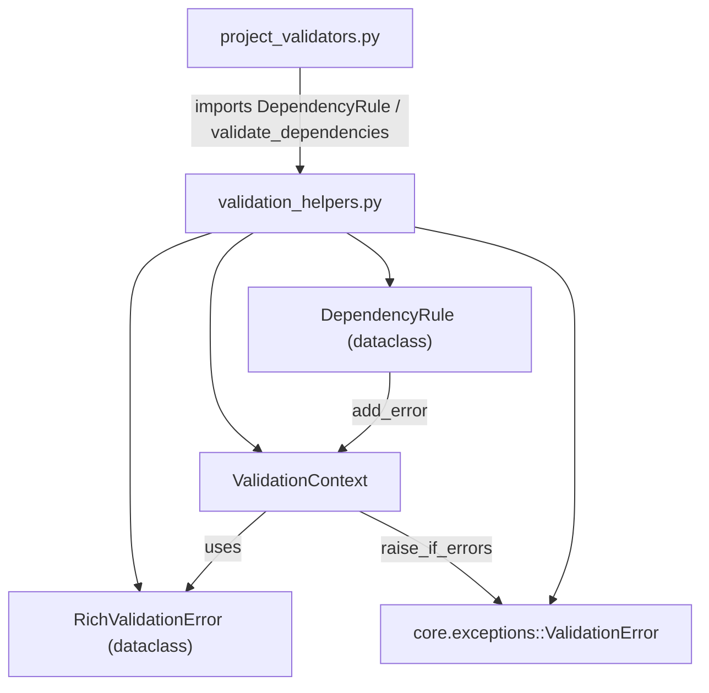

---
tags:
  - secinterp
  - code-walkthrough
  - core
  - validation
aliases:
  - validation_helpers.py
  - ValidationContext
  - RichValidationError
  - DependencyRule
  - validate_dependencies
  - validate_reasonable_ranges
cssclass: secinterp-note
---

# `core/validation/validation_helpers.py`

> [!abstract] One-line summary
> Level 2 (business validation) helpers: `ValidationContext` to **accumulate** errors/warnings instead of failing fast, `RichValidationError` as a context-carrying error, `DependencyRule` for conditional rules, and `validate_reasonable_ranges` to warn about extreme values.

**Path**: `core/validation/validation_helpers.py` (195 lines)
**Main classes**: `RichValidationError`, `ValidationContext`, `DependencyRule`
**Layer**: Core (QGIS-agnostic)
**Tags**: #secinterp #core #validation

---

## 🎯 Why does this file exist?

Business validation should not fail on the first error: it is better to **accumulate all**
problems and show them together. This module provides the infrastructure for that:

| Problem | Solution |
|---------|----------|
| Show all errors at once, not one by one | `ValidationContext` accumulates into lists |
| Attach context (field, severity, data) to an error | `RichValidationError` (dataclass) |
| Model "if layer selected ⇒ field required" | `DependencyRule` (condition + check) |
| Warn about extreme values without blocking | `validate_reasonable_ranges` (warnings only) |
| Turn accumulation into a single exception | `ValidationContext.raise_if_errors()` |

> [!important] Architectural note
> **QGIS-agnostic.** It only imports the domain `ValidationError` and the stdlib
> (`dataclasses`, `collections.abc`, `typing`). It is the layer connecting the
> `IValidator` validators with the final `ValidationError`: accumulate, decide severity,
> and fire.

---

## 🧬 Relationship diagram



> [!tip] How to read
> Solid = imports/uses. `ValidationContext` is the heart: `DependencyRule` writes into
> it, and `raise_if_errors()` turns it into `ValidationError`. `project_validators`
> consumes the rules and the reasonable-range check.

---

## 📦 Imports — architectural reading

```python
# core/validation/validation_helpers.py
from __future__ import annotations

from collections.abc import Callable
from dataclasses import dataclass, field
from typing import Any

from sec_interp.core.exceptions import ValidationError
```

| # | Observation |
|---|-------------|
| ① | `Callable` from `collections.abc` — for the `DependencyRule` callbacks. |
| ② | `dataclass` + `field` — `RichValidationError` and `DependencyRule` are dataclasses. |
| ③ | `ValidationError` — the only domain dependency, raised by `raise_if_errors`. |
| ④ | An explicit `__all__` at the end (5 public symbols) controls the exported API. |
| ⑤ | No QGIS or Qt: business validation is pure. |

---

## 🏗️ Structure inventory

**Classes (3):**

- `@dataclass RichValidationError` — error with severity/context + `__str__`.
- `class ValidationContext` — accumulator with 5 properties and 3 methods.
- `@dataclass DependencyRule` — conditional rule + `validate`.

**Functions (5):**

- `validate_dependencies(rules, context) -> None`
- `validate_reasonable_ranges(values) -> list[str]`
- `_validate_vert_exag(value) -> list[str]`
- `_validate_buffer(value) -> list[str]`
- `_validate_dip_scale(value) -> list[str]`

**Local constants (thresholds):**

- `MAX_VE_THRESHOLD = 10`, `MIN_VE_THRESHOLD = 0.1`
- `MAX_BUFFER_DIST = 5000`
- `MAX_DIP_SCALE = 5`

---

## 📁 Files in the package

`validation_helpers.py` is the accumulation infrastructure of the package:

| File | Role |
|------|------|
| `validation_helpers.py` | `ValidationContext`, `RichValidationError`, `DependencyRule` (this file) |
| `project_validator.py` | `ProjectValidator` + `ValidationParams` |
| `project_validators.py` | Specialized validators that use `DependencyRule` and `validate_reasonable_ranges` |
| `pipeline.py` | `ValidationPipeline` |
| `base_validator.py` | `IValidator` (ABC) |
| `field_validator.py` | Field validation |
| `layer_validator.py` | Spatial validation |
| `path_validator.py` | Path validation |
| `validators.py` | Dataclass validator factories |
| `layer_metadata.py` | `LayerMetadata` + constants |

---

## 📖 Method-by-method walkthrough

### `RichValidationError`

```python
@dataclass
class RichValidationError:
    message: str
    field_name: str | None = None
    severity: str = "error"  # error, warning, info
    context: dict[str, Any] = field(default_factory=dict)

    def __str__(self) -> str:
        prefix = f"[{self.severity.upper()}] " if self.severity != "error" else ""
        ctx_str = f" ({self.field_name})" if self.field_name else ""
        return f"{prefix}{self.message}{ctx_str}"
```

A "rich" error with severity and context. `__str__` composes: a `[WARNING]` prefix (only
when not `error`), the message and `(field)` when present. `context` is a free dict with
`default_factory` so instances do not share it.

| Field | Role |
|-------|------|
| `message` | Readable message |
| `field_name` | Associated field (key to highlight in the GUI) |
| `severity` | `"error"`, `"warning"` or `"info"` |
| `context` | Free dict with technical details |

### `ValidationContext`

```python
class ValidationContext:
    def __init__(self) -> None:
        self._errors: list[RichValidationError] = []
        self._warnings: list[RichValidationError] = []

    def add_error(self, message: str, field_name: str | None = None, **kwargs) -> None:
        self._errors.append(RichValidationError(message, field_name, severity="error", context=kwargs))

    def add_warning(self, message: str, field_name: str | None = None, **kwargs) -> None:
        self._warnings.append(RichValidationError(message, field_name, severity="warning", context=kwargs))

    @property
    def has_errors(self) -> bool: ...
    @property
    def has_warnings(self) -> bool: ...
    @property
    def errors(self) -> list[RichValidationError]: ...
    @property
    def warnings(self) -> list[RichValidationError]: ...

    def merge(self, other: ValidationContext) -> None:
        self._errors.extend(other.errors)
        self._warnings.extend(other.warnings)

    def raise_if_errors(self) -> None:
        if self.has_errors:
            msg = "\n".join(str(e) for e in self._errors)
            raise ValidationError(msg, details={"errors": self._errors, "warnings": self._warnings})
```

The central accumulator. Separates **errors** (hard) from **warnings** (soft). `merge`
combines contexts. `raise_if_errors` joins all errors with `"\n"` and raises **one**
`ValidationError` with `details` including both lists.

> [!tip] `**kwargs` → `context`
> `add_error(msg, "field", extra="info")` stores `extra="info"` in `RichValidationError.context`.
> Thus any technical data (e.g. `{"layer": "geology"}`) travels with the error.

### `DependencyRule`

```python
@dataclass
class DependencyRule:
    condition: Callable[[], bool]
    check: Callable[[], bool]
    error_message: str
    target_field: str | None = None

    def validate(self, context: ValidationContext) -> None:
        if self.condition() and not self.check():
            context.add_error(self.error_message, self.target_field)
```

Declarative rule: **if** `condition()` is true and `check()` fails, the error is added.
The callback pair expresses "if the layer is selected, the field must be filled" without
an explicit `if` in the consumer.

| Field | Role |
|-------|------|
| `condition` | Gate of the rule (e.g. "a survey layer exists") |
| `check` | Condition that must hold (e.g. "survey_id exists") |
| `error_message` | Message when the rule fails |
| `target_field` | Field to associate the error with |

### `validate_dependencies`

```python
def validate_dependencies(rules: list[DependencyRule], context: ValidationContext) -> None:
    for rule in rules:
        rule.validate(context)
```

Evaluates a list of rules in batch over the same context. This is the helper used by
`DrillholeValidator` for the survey and interval rules.

### `validate_reasonable_ranges`

```python
def validate_reasonable_ranges(values: dict[str, Any]) -> list[str]:
    warnings = []
    warnings.extend(_validate_vert_exag(values.get("vert_exag", 1.0)))
    warnings.extend(_validate_buffer(values.get("buffer", 0)))
    warnings.extend(_validate_dip_scale(values.get("dip_scale", 1.0)))
    return warnings
```

Entry point to warn about extreme values. It does not raise errors; it returns a list of
warning strings. Delegates to three private helpers (`_validate_vert_exag`,
`_validate_buffer`, `_validate_dip_scale`).

### Private range helpers

```python
def _validate_vert_exag(value: Any) -> list[str]:
    try:
        val = float(value)
        MAX_VE_THRESHOLD = 10
        MIN_VE_THRESHOLD = 0.1
        if val > MAX_VE_THRESHOLD:
            return [f"⚠ Vertical exaggeration ({val}) is very high. ..."]
        if val < MIN_VE_THRESHOLD:
            return [f"⚠ Vertical exaggeration ({val}) is very low. ..."]
        if val <= 0:
            return [f"❌ Vertical exaggeration ({val}) must be positive."]
    except (ValueError, TypeError):
        pass
    return []
```

Each helper converts to `float` (catching `ValueError`/`TypeError`), compares against
local thresholds and returns a warning or an empty list. `_validate_buffer` uses
`MAX_BUFFER_DIST = 5000`; `_validate_dip_scale` uses `MAX_DIP_SCALE = 5`.

| Helper | High threshold | Low threshold | Invalid value |
|--------|----------------|---------------|---------------|
| `_validate_vert_exag` | `> 10` → "very high" | `< 0.1` → "very low" | `<= 0` → `❌ must be positive` |
| `_validate_buffer` | `> 5000` → "very large" | — | `< 0` → `❌ cannot be negative` |
| `_validate_dip_scale` | `> 5` → "very high" | — | `<= 0` → `❌ must be positive` |

> [!note] Emojis in messages
> The warnings embed `⚠` and `❌` in the text itself (an i18n boundary: no
> `TranslatableMixin`, unlike `OutputValidator`).

---

## 🔄 Data flow

| Phase | Input | Transformation | Output |
|-------|-------|----------------|--------|
| Accumulation | `context.add_error/add_warning` | append to `_errors`/`_warnings` | lists |
| Rules | `list[DependencyRule]` | `rule.validate(context)` | conditional errors |
| Ranges | `dict` of values | `float()` + thresholds | `list[str]` warnings |
| Close | `context` | `raise_if_errors()` | `ValidationError` or nothing |

---

## 🏛️ Design patterns present

| Pattern | Where | Purpose |
|---------|-------|---------|
| **Accumulator** | `ValidationContext` | Gather errors before failing |
| **Rule object** | `DependencyRule` | Encapsulate condition/check/message |
| **Value object** | `RichValidationError` | Error with severity + context |
| **Collecting parameter** | `context` in `validate` | Pass the accumulator through the validators |
| **Null/empty object** | `[]` return | "no warnings" as an empty list |

---

## 🧾 API summary

| Symbol | Signature / Inherits | Typical use |
|--------|----------------------|-------------|
| `RichValidationError` | `@dataclass` | Error with severity/context |
| `ValidationContext.add_error` | `(message, field_name=None, **kwargs) -> None` | Add a hard error |
| `ValidationContext.add_warning` | `(message, field_name=None, **kwargs) -> None` | Add an advisory |
| `ValidationContext.raise_if_errors` | `() -> None` | Raise `ValidationError` if errors exist |
| `DependencyRule.validate` | `(context) -> None` | Evaluate a conditional rule |
| `validate_dependencies` | `(rules, context) -> None` | Evaluate rules in batch |
| `validate_reasonable_ranges` | `(values) -> list[str]` | Extreme-value warnings |

---

## 🛡️ Error handling

The only exception is raised in `raise_if_errors()`:

| Situation | Behaviour |
|-----------|-----------|
| Warnings only | `raise_if_errors()` does **not** raise |
| One or more errors | raises `ValidationError` with `"\n".join(...)` |
| Exception `details` | `{"errors": [...], "warnings": [...]}` |
| `float(value)` fails in ranges | `except (ValueError, TypeError): pass` → `[]` |

> [!important] Severity separated from the exception
> `ValidationContext` keeps error vs warning in separate lists, but `raise_if_errors`
> only looks at `has_errors`. Warnings travel in the exception `details` and the GUI can
> decide whether to show them as advisories.

---

## 🧪 Associated tests

Cases mapped to `tests/core/validation/test_validation_helpers.py` (plus
`tests/core/test_project_validator.py::test_validate_reasonable_ranges`):

- `test_add_error` — accumulates an error with `field_name` and `context` (`extra="info"`).
- `test_add_warning` — warning with `severity="warning"` and no `has_errors`.
- `test_raise_if_errors` — with errors, raises `ValidationError`.
- `test_no_raise_if_only_warnings` — warnings only do not raise.
- `test_rule_passed` / `test_rule_failed` / `test_rule_ignored` — `DependencyRule`.
- `test_valid_ranges` / `test_extreme_values` — `validate_reasonable_ranges`.
- `test_manual_ve_above_auto_clamp_still_warns` — manual VE `30.0` warns (threshold 10) but the adaptive clamp stays `[0.5, 20]`.

---

## 🔢 Example — accumulation and close

Typical flow of a domain validator using `ValidationContext` and `DependencyRule`:

```python
ctx = ValidationContext()

# Direct error
ctx.add_error("Buffer distance is required", "buffer_dist")

# Conditional rule: if a survey exists, require survey_id
rules = [
    DependencyRule(
        condition=lambda: bool(params.survey_layer),
        check=lambda: bool(params.survey_id),
        error_message="Survey ID field is required",
        target_field="survey_id",
    ),
]
validate_dependencies(rules, ctx)

# Extreme-value warning
for w in validate_reasonable_ranges({"vert_exag": 15.0}):
    ctx.add_warning(w)

# Close: raises ValidationError with all errors (warnings travel in details)
ctx.raise_if_errors()
```

The result is a single `ValidationError` whose `message` is the newline-joined union of
all errors, and whose `details` contains `{"errors": [...], "warnings": [...]}`. The GUI
can inspect `details["errors"]` to highlight specific fields via `field_name`.

## 🧪 Relationship with the exception hierarchy

`raise_if_errors` is the **only** point in the package that connects to `exceptions.py`:

| Component | Exception | When |
|-----------|-----------|------|
| `ValidationContext.raise_if_errors` | `ValidationError` | ≥1 error |
| `validators.py` (factories) | `ValidationError` | dataclass validation fails |
| `field_validator` / `layer_validator` | (none) | use `(bool, str)` tuples |
| `path_validator` | (none) | uses `(bool, str, Path)` tuples |

> [!important] Layer coherence
> The whole project-validation framework converges on `ValidationError` (a subclass of
> `SecInterpError`). Low-level components avoid raising and delegate to the accumulator;
> only the dataclass validators (`validators.py`) raise directly.

---

## 👀 Observations and notes

> [!success] Strengths
> - Clean error vs warning accumulation (two separate lists).
> - `DependencyRule` expresses dependencies declaratively and testably.
> - `raise_if_errors` concentrates the exception in a single point.

> [!warning] Points of attention
> - Thresholds (`MAX_VE_THRESHOLD`, `MAX_BUFFER_DIST`, …) are **hardcoded** and local to each helper.
> - Warning messages with `⚠`/`❌` emojis and no i18n.
> - `RichValidationError.context` is a schema-less `dict` (consumers must know the keys).

> [!question] Open questions
> - Centralize thresholds as module constants (or in config) to make them adjustable?
> - Type `context` with a `TypedDict` to document the expected keys?

---

## 🔗 Related notes

- [[Index]] — vault index
- [[core_validation]] — package note for the `validation/` directory
- [[exceptions]] — `ValidationError` raised by `raise_if_errors`
- [[project_validators]] — consumer of `DependencyRule` and `validate_reasonable_ranges`
- [[project_validator]] — `ValidationContext` in `validate_all`/`validate_preview_requirements`
- [[core_validation]] — package that includes `base_validator.py` (`IValidator`)
- [[validators]] — validation factories (exception-based style)

---

*Note of the SecInterp Code Walkthrough v2 vault — v3.9.0*
