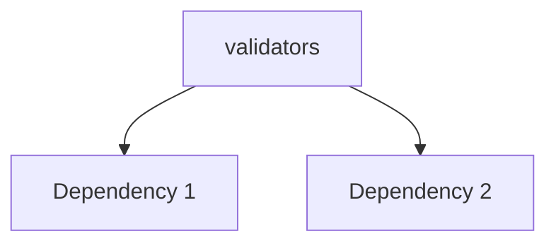

---
tags:
  - secinterp
  - code-walkthrough
  - core      # core | gui | exporters
  - validation     # services | managers | renderers | adapters | validation | etc.
aliases:
  - validators.py  # e.g. path_resolver.py
  - validators     # e.g. resolve_export_path
cssclass: secinterp-note
# note_lines: 700      # optional: ceiling > 500 for high-importance modules (max 700)
---

# `core/validation/validators.py`

> [!abstract] One-line summary
> Reusable validators for dataclass fields. — what this module does in one sentence, without touching QGIS if it is core.

**Path**: `core/validation/validators.py` (252 lines)
**Main class/function**: `validators`
**Layer**: core (QGIS-agnostic / GUI · Type)
**Tags**: #secinterp #core #validation

---

## 🎯 Why does this file exist?

| Problem | Solution |
|---------|----------|
| (pending) | (pending) |
| (pending) | (pending) |

> [!important] Architectural note
> QGIS-agnóstico (e.g. "QGIS-agnostic", "Extract Adapter", "Factory").

---

## 🧬 Relationship diagram



> [!tip] How to read
> Solid arrow = imports/delegates; dashed = callback/injected.

---

## 📦 Imports — architectural reading

```python
# validators.py
from __future__ import annotations
from collections.abc import Callable
from typing import Any, TypeVar
from sec_interp.core.exceptions import ValidationError
```

| # | Observation |
|---|-------------|
| ① | (pending) |
| ② | (pending) |

---

## 🏗️ Structure inventory

**Clases:** `class FieldValidator` — 2 métodos
**Constantes:** `T`
**Funciones/Métodos:**
- `validate_range(def validate_range(min_val: float, max_val: float, field_name: str='') -> Callable[[float], float]:)`
- `validate_positive(def validate_positive(field_name: str='') -> Callable[[float], float]:)`
- `validate_non_negative(def validate_non_negative(field_name: str='') -> Callable[[float], float]:)`
- `validate_non_empty(def validate_non_empty(field_name: str='') -> Callable[[str], str]:)`
- `coerce_type(def coerce_type(target_type: type, field_name: str='') -> Callable[[Any], Any]:)`
- `validate_and_clamp(def validate_and_clamp(min_val: float, max_val: float) -> Callable[[float], float]:)`
- `FieldValidator.__init__(def __init__(self, *validators: Callable[[Any], Any]) -> None:)`
- `FieldValidator.__call__(def __call__(self, value: Any) -> Any:)`
- `validate_percentage(def validate_percentage(field_name: str='') -> FieldValidator:)`
- `validate_probability(def validate_probability(field_name: str='') -> FieldValidator:)`
- `validate_positive_int(def validate_positive_int(field_name: str='') -> FieldValidator:)`

---

## 📁 Files in the package

- `validators.py` — individual note for this file.

---

## 📖 Method-by-method walkthrough

### `method_1`

```python
# (enriquecer)
```

_(enriquecer leyendo el fuente)_

### `method_2`

```python
# (enriquecer)
```

_(enriquecer leyendo el fuente)_

<!-- Add one subsection per public method of the module -->

---

## 🔄 Data flow

| Phase | Input | Transformation | Output |
|-------|-------|----------------|--------|
| - | - | - | - |
| - | - | - | - |

---

## 🏛️ Design patterns present

| Pattern | Where | Purpose |
|---------|-------|---------|
| - | - | - |

---

## 🧾 API summary

| Symbol | Signature / Inherits | Typical use |
|--------|----------------------|-------------|
| `validate_range`, `validate_positive`, `validate_non_negative`, `validate_non_empty`, `coerce_type`, `validate_and_clamp`, `validate_percentage`, `validate_probability`, `validate_positive_int` | `-` | - |

---

## 🛡️ Error handling

_(pending)_

---

## 🧪 Associated tests

_(pending)_

---

## 👀 Observations and notes

> [!success] Strengths
> - (skeleton)

> [!warning] Points of attention
> - (skeleton)

> [!question] Open questions
> - (skeleton)

---

## 🔗 Related notes

- [[Index]] — vault index
- [[Index]] — index
- [[controller]] — orchestrator

---

*Note of the SecInterp Code Walkthrough v2 vault — v3.8.0*
