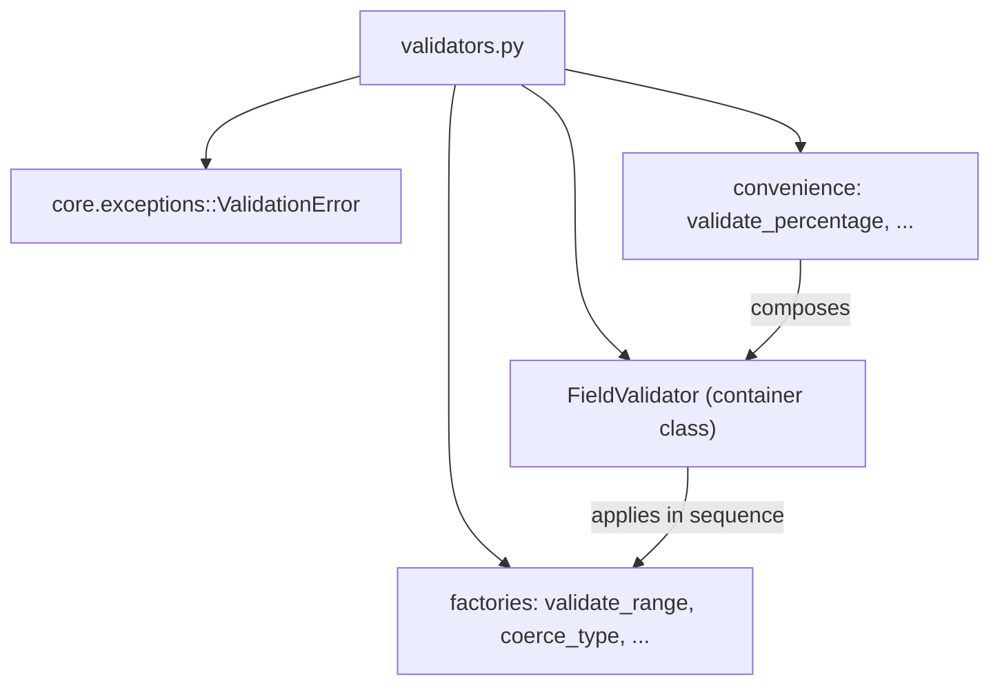

---
tags:
  - secinterp
  - code-walkthrough
  - core
  - validation
aliases:
  - validators.py
  - FieldValidator
  - validate_range
  - validate_positive
  - coerce_type
  - validate_and_clamp
  - validate_percentage
cssclass: secinterp-note
---

# `core/validation/validators.py`

> [!abstract] One-line summary
> Reusable **validator factories** for dataclass fields: higher-order functions that validate/coerce values and raise `ValidationError`, composed via the `FieldValidator` class (chaining) plus convenience helpers (percentage, probability, positive integer).

**Path**: `core/validation/validators.py` (252 lines)
**Main class**: `FieldValidator`
**Layer**: Core (QGIS-agnostic)
**Tags**: #secinterp #core #validation

---

## 🎯 Why does this file exist?

Validating and coercing dataclass fields often repeats the same `if`/`raise` pattern.
This module encapsulates it in composable validator **factories** with no external
dependencies:

| Problem | Solution |
|---------|----------|
| Validate range, positivity, non-negativity… | `validate_range` / `validate_positive` / `validate_non_negative` factories |
| Coerce types (`"42"` → `42`) while validating | `coerce_type` |
| Chain several validators in order | `FieldValidator(*validators)` (callable) |
| Clamp to a range without raising | `validate_and_clamp` |
| Common patterns (0-100, 0-1, int>0) | `validate_percentage` / `validate_probability` / `validate_positive_int` |

> [!important] Architectural note
> **QGIS-agnostic** (only `collections.abc`, `typing` and `ValidationError`). Unlike
> `field_validator.py` (which uses `(bool, str, value)` tuples), this module **raises
> `ValidationError`**. It is the dataclass-oriented style: each validator is a
> `Callable[[T], T]` returning the (possibly transformed) value or raising.

---

## 🧬 Relationship diagram



> [!tip] How to read
> Solid = imports/composes. The factories return `Callable`s; `FieldValidator` applies
> them in a chain; the convenience ones build a ready-made `FieldValidator`.

---

## 📦 Imports — architectural reading

```python
# core/validation/validators.py
from __future__ import annotations

from collections.abc import Callable
from typing import Any, TypeVar

from sec_interp.core.exceptions import ValidationError

T = TypeVar("T")
```

| # | Observation |
|---|-------------|
| ① | `Callable` from `collections.abc` — the factories return `Callable[[float], float]`, etc. |
| ② | `TypeVar("T")` — nominal generic type (though rarely used in practice). |
| ③ | `ValidationError` — the only domain dependency; each validator raises it. |
| ④ | No QGIS or Qt: pure, reusable dataclass validation. |

---

## 🏗️ Structure inventory

**Classes (1):**

- `class FieldValidator` — chainable container with `__init__` and `__call__`.

**Validator factories (6):**

- `validate_range(min_val, max_val, field_name="") -> Callable[[float], float]`
- `validate_positive(field_name="") -> Callable[[float], float]`
- `validate_non_negative(field_name="") -> Callable[[float], float]`
- `validate_non_empty(field_name="") -> Callable[[str], str]`
- `coerce_type(target_type, field_name="") -> Callable[[Any], Any]`
- `validate_and_clamp(min_val, max_val) -> Callable[[float], float]`

**Convenience composite validators (3):**

- `validate_percentage(field_name="") -> FieldValidator`
- `validate_probability(field_name="") -> FieldValidator`
- `validate_positive_int(field_name="") -> FieldValidator`

**Generic type:** `T = TypeVar("T")`

---

## 📁 Files in the package

`validators.py` is the reusable-factory set of the `core/validation/` package:

| File | Role |
|------|------|
| `validators.py` | Dataclass field factories (this file) |
| `field_validator.py` | Layer field validation (tuple style) |
| `layer_validator.py` | Spatial validation |
| `path_validator.py` | Path validation |
| `validation_helpers.py` | `ValidationContext`, `DependencyRule` |
| `project_validator.py` | `ProjectValidator` + `ValidationParams` |
| `project_validators.py` | Specialized validators |
| `layer_metadata.py` | `LayerMetadata` + constants |
| `base_validator.py` | `IValidator` (ABC) |
| `pipeline.py` | `ValidationPipeline` |

---

## 📖 Method-by-method walkthrough

### `validate_range`

```python
def validate_range(min_val: float, max_val: float, field_name: str = "") -> Callable[[float], float]:
    def validator(value: float) -> float:
        if not (min_val <= value <= max_val):
            raise ValidationError(
                f"{field_name or 'Value'} must be between {min_val} and {max_val}, got {value}"
            )
        return value
    return validator
```

Factory returning an **inclusive** range validator. The closure captures
`min_val`/`max_val`/`field_name`. If the value is outside, it raises `ValidationError`;
otherwise it returns the value unchanged.

### `validate_positive` / `validate_non_negative`

```python
def validate_positive(field_name: str = "") -> Callable[[float], float]:
    def validator(value: float) -> float:
        if value <= 0:
            raise ValidationError(f"{field_name or 'Value'} must be positive, got {value}")
        return value
    return validator


def validate_non_negative(field_name: str = "") -> Callable[[float], float]:
    def validator(value: float) -> float:
        if value < 0:
            raise ValidationError(f"{field_name or 'Value'} must be non-negative, got {value}")
        return value
    return validator
```

Two nuances of positivity: `validate_positive` requires `> 0` (`0` fails);
`validate_non_negative` allows `0` (only negatives fail). Both use the default
`field_name` → `"Value"` in the message.

### `validate_non_empty`

```python
def validate_non_empty(field_name: str = "") -> Callable[[str], str]:
    def validator(value: str) -> str:
        if not value or not value.strip():
            raise ValidationError(f"{field_name or 'Field'} cannot be empty")
        return value.strip()
    return validator
```

Validates non-empty strings and **trims** the value (`return value.strip()`). Unlike the
numeric ones, it transforms the output (normalizes whitespace). Note the name default:
`"Field"` instead of `"Value"`.

### `coerce_type`

```python
def coerce_type(target_type: type, field_name: str = "") -> Callable[[Any], Any]:
    def validator(value: Any) -> Any:
        if isinstance(value, target_type):
            return value
        try:
            return target_type(value)
        except (ValueError, TypeError) as e:
            raise ValidationError(
                f"{field_name or 'Field'} must be {target_type.__name__}, "
                f"got {type(value).__name__}: {e}"
            ) from e
    return validator
```

Coerces the value to the target type. If it is already that type, returns it; otherwise
tries `target_type(value)` and translates `ValueError`/`TypeError` into `ValidationError`
with `from e` (exception chaining). It is the base of the composite validators.

### `validate_and_clamp`

```python
def validate_and_clamp(min_val: float, max_val: float) -> Callable[[float], float]:
    def validator(value: float) -> float:
        return max(min_val, min(max_val, float(value)))
    return validator
```

Unlike `validate_range`, it **does not raise**: it clamps to the nearest boundary. It
also forces `float(value)`, so it accepts numeric strings (`"50"` → `50.0`). Useful for
normalizing values instead of rejecting them.

### `FieldValidator`

```python
class FieldValidator:
    def __init__(self, *validators: Callable[[Any], Any]) -> None:
        self.validators = validators

    def __call__(self, value: Any) -> Any:
        for validator in self.validators:
            value = validator(value)
        return value
```

Container that chains validators. Being **callable** (`__call__`), an instance
`FieldValidator(coerce_type(float, "price"), validate_positive("price"))` behaves like a
function: applies each validator in sequence and propagates the transformed value. The
first validator that raises cuts the chain.

> [!tip] Chained composition
> ```python
> validator = FieldValidator(
>     coerce_type(float, "price"),
>     validate_positive("price"),
>     validate_range(0.0, 1000.0, "price"),
> )
> validated_value = validator("42.5")
> ```

### Convenience validators

```python
def validate_percentage(field_name: str = "") -> FieldValidator:
    return FieldValidator(coerce_type(float, field_name), validate_range(0.0, 100.0, field_name))

def validate_probability(field_name: str = "") -> FieldValidator:
    return FieldValidator(coerce_type(float, field_name), validate_range(0.0, 1.0, field_name))

def validate_positive_int(field_name: str = "") -> FieldValidator:
    return FieldValidator(coerce_type(int, field_name), validate_positive(field_name))
```

Three pre-assembled `FieldValidator`s: percentage (`0..100`), probability (`0..1`) and
positive integer (`int` + `> 0`). Note `validate_positive_int` uses `coerce_type(int)`,
which **truncates** (`5.9` → `5`) before validating positivity.

| Helper | Coercion | Rule |
|--------|----------|------|
| `validate_percentage` | `float` | `0.0..100.0` |
| `validate_probability` | `float` | `0.0..1.0` |
| `validate_positive_int` | `int` | `> 0` |

---

## 🔄 Data flow

| Phase | Input | Transformation | Output |
|-------|-------|----------------|--------|
| Factory | parameters (`min_val`, `field_name`…) | `validator` closure | `Callable` |
| Validation | raw value | check or coercion | value (or `ValidationError`) |
| Chaining | value + `FieldValidator` | apply in sequence | final value |

---

## 🏛️ Design patterns present

| Pattern | Where | Purpose |
|---------|-------|---------|
| **Factory function** | all `validate_*` | Create parameterized validators |
| **Closure** | inner validators | Capture configuration without an object |
| **Composite / Chain** | `FieldValidator` | Chain validators in order |
| **Callable object** | `__call__` | Use an instance as a function |
| **Coercer** | `coerce_type`, `validate_and_clamp` | Normalize/transform the value |
| **Exception chaining** | `raise ... from e` | Preserve cause in `coerce_type` |

---

## 🧾 API summary

| Symbol | Signature / Inherits | Typical use |
|--------|----------------------|-------------|
| `validate_range` | `(min_val, max_val, field_name="") -> Callable[[float], float]` | Inclusive range |
| `validate_positive` | `(field_name="") -> Callable[[float], float]` | Value `> 0` |
| `validate_non_negative` | `(field_name="") -> Callable[[float], float]` | Value `>= 0` |
| `validate_non_empty` | `(field_name="") -> Callable[[str], str]` | Non-empty (and trimmed) string |
| `coerce_type` | `(target_type, field_name="") -> Callable[[Any], Any]` | Type coercion |
| `validate_and_clamp` | `(min_val, max_val) -> Callable[[float], float]` | Clamp without raising |
| `FieldValidator` | `(*validators) -> callable` | Chain validators |
| `validate_percentage` | `(field_name="") -> FieldValidator` | `0..100` |
| `validate_probability` | `(field_name="") -> FieldValidator` | `0..1` |
| `validate_positive_int` | `(field_name="") -> FieldValidator` | Positive integer |

---

## 🛡️ Error handling

Unlike the rest of the package (which accumulates in `ValidationContext`), this module
**raises `ValidationError`** immediately:

| Situation | Behaviour |
|-----------|-----------|
| Out of range | `ValidationError("... must be between ...")` |
| `value <= 0` in `validate_positive` | `ValidationError("... must be positive ...")` |
| Empty string | `ValidationError("... cannot be empty")` |
| Failed coercion | `ValidationError("... must be {type} ...") from e` |
| Clamping | **does not raise** (adjusts to the boundary) |

> [!important] Two philosophies in the package
> `field_validator.py`/`layer_validator.py` use `(bool, str, value)` tuples; `validators.py`
> uses exceptions. The choice depends on context: tuples for project validation
> (accumulate), exceptions for **dataclass** validation (fail fast).

---

## 🧪 Associated tests

Cases mapped to `tests/core/validation/test_validators.py`:

- `TestValidateRange` — inside/outside range, without `field_name`.
- `TestValidatePositive` — positive ok; `0` and negative raise.
- `TestValidateNonNegative` — `0` ok; negative raises.
- `TestValidateNonEmpty` — whitespace trimming; empty/whitespace raise.
- `TestCoerceType` — already correct type, successful coercion, failed coercion, to string.
- `TestValidateAndClamp` — inside, below/above (clamped), string.
- `TestFieldValidator` — one/multiple validators, chain order.
- `TestConvenienceValidators` — `validate_percentage`, `validate_probability`, `validate_positive_int`.

---

## 🔢 Example — full field validation

Combining coercion + positivity + range in a single `FieldValidator`:

```python
price_validator = FieldValidator(
    coerce_type(float, "price"),
    validate_positive("price"),
    validate_range(0.0, 1000.0, "price"),
)

price_validator("42.5")   # -> 42.5  (str -> float -> positive -> in range)
price_validator("abc")    # -> ValidationError: "price must be float, got str: ..."
price_validator("-3")     # -> ValidationError: "price must be positive, got -3.0"
price_validator("2000")   # -> ValidationError: "price must be between 0.0 and 1000.0"
```

Order matters: `coerce_type` converts the string to `float` **before**
`validate_positive`/`validate_range` compare. If the order were inverted, comparing a
string against a `float` would fail with `TypeError` (or confusing messages).

## ⚖️ `(bool, str)` tuples vs exceptions

Within `core/validation/` two error conventions coexist. This table summarizes when to
use each:

| Criterion | Tuple (`field_validator`, `layer_validator`) | Exception (`validators.py`) |
|-----------|----------------------------------------------|-----------------------------|
| Return | `(bool, str, value?)` | value or `ValidationError` |
| Fail fast | No (accumulates if `context`) | Yes |
| Purpose | Project validation / Level 1-2 | Dataclass validation |
| Composability | Manual (chain `if not is_valid`) | `FieldValidator` (chain) |
| Success message | `""` in second slot | n/a |
| Transformation | Only parsing (`float`/`int`) | Yes (`coerce_type`, `strip`, `clamp`) |

> [!tip] Practical rule
> If you need to **show all errors at once** to the user, use tuples + `ValidationContext`.
> If you need to **fail fast when building an object** (dataclass), use the
> `validators.py` factories.

## 📋 Docstring reference

Each factory documents its parameters, return and exception in Google style:

| Function | Documented `Raises` | Transforms output |
|----------|---------------------|-------------------|
| `validate_range` | `ValidationError` if out of range | no |
| `validate_positive` | `ValidationError` if `<= 0` | no |
| `validate_non_negative` | `ValidationError` if `< 0` | no |
| `validate_non_empty` | `ValidationError` if empty | yes (`strip`) |
| `coerce_type` | `ValidationError` if conversion fails | yes (`target_type(value)`) |
| `validate_and_clamp` | (none) | yes (clamping) |

> [!note] `validate_and_clamp` is the exception
> It is the only validator that does **not** document `Raises`: it clamps instead of failing.

---

## 👀 Observations and notes

> [!success] Strengths
> - Composable factories with no external dependencies.
> - `FieldValidator` offers elegant chaining via `__call__`.
> - `coerce_type` + `validate_positive_int` cover the most common dataclass patterns.

> [!warning] Points of attention
> - `validate_positive_int` truncates floats (`5.9` → `5`), which can surprise.
> - `T = TypeVar("T")` declared but barely used (loose `Any` typing).
> - Two error styles coexist in the package (tuples vs exceptions), with no explicit rule.

> [!question] Open questions
> - Make `validate_positive_int` reject non-integers instead of truncating?
> - Type the factories better with `TypeVar`/`ParamSpec` to lose less information?

---

## 🔗 Related notes

- [[Index]] — vault index
- [[core_validation]] — package note for the `validation/` directory
- [[exceptions]] — `ValidationError` raised by each validator
- [[field_validator]] — layer validators (tuple style, complementary)
- [[validation_helpers]] — `ValidationContext` (accumulator style)
- [[dtos]] — potential consumers to validate dataclass fields
- [[domain]] — `FieldType` and domain types

---

*Note of the SecInterp Code Walkthrough v2 vault — v3.9.0*
