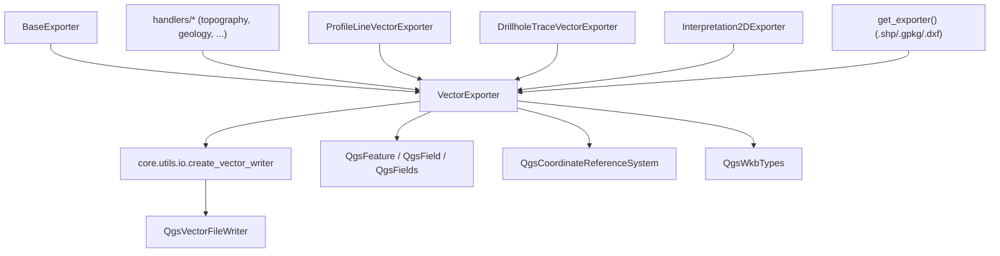

---
tags:
  - secinterp
  - code-walkthrough
  - exporters
  - vector
aliases:
  - vector_exporter.py
  - VectorExporter
cssclass: secinterp-note
---

# `exporters/vector_exporter.py`

> [!abstract] One-line summary
> Generic SHP/GPKG/DXF vector exporter: turns lists of `{geometry, attributes}` into real OGR layers through `QgsVectorFileWriter` created by the `core.utils.io` helper, with field types inferred from the first feature.

**Path**: `exporters/vector_exporter.py` (122 lines)
**Main class**: `VectorExporter(BaseExporter)`
**Layer**: Exporters (coupled to `qgis.core`: the "Write" side after the core's Compute)
**Tags**: #secinterp #exporters #vector

---

## 🎯 Why does this file exist?

The orchestrator handlers work with already-computed data (domain DTOs, QGIS
geometries extracted in the GUI). One step is missing: **writing** them as real
on-disk layers with correct CRS, fields and geometry type:

| Problem | Solution |
|---------|----------|
| Write SHP, GPKG and DXF with one class | `VectorExporter` + `format_ext` (`.shp`/`.gpkg`/`.dxf`) decided by settings |
| Configure `QgsVectorFileWriter` without repeating its 6+ parameters | Delegation to `scu_io.create_vector_writer(...)` from `core/utils/io` |
| OGR fields with no prior schema | `_prepare_fields()` infers `Int`/`Double`/`QString` from the first feature |
| `QgsFeature` rows misaligned with fields | `_write_features()` maps by field **name**, not position |
| OGR failures crashing the GUI | Every exception is logged and `False` is returned |

> [!important] Architectural note
> This module lives **deliberately** outside the core: it imports `qgis.core` because
> its job is geospatial I/O, not computation. The core never imports it; the
> orchestrator reaches it via lazy imports (see [[orchestrator]]) and the handlers
> translate `False` into `ExportError`.

---

## 🧬 Relationship diagram



> [!tip] How to read
> `VectorExporter` is the vector **hub**: four families of specialised exporters
> inherit from it and the factory picks it for three extensions. All real OGR work
> goes through `create_vector_writer` (see [[io]]).

---

## 📦 Imports — architectural reading

```python
# exporters/vector_exporter.py
from __future__ import annotations

from pathlib import Path
from typing import Any

from qgis.core import (
    QgsCoordinateReferenceSystem,
    QgsFeature,
    QgsField,
    QgsFields,
    QgsVectorFileWriter,
    QgsWkbTypes,
)
from qgis.PyQt.QtCore import QMetaType

from sec_interp.core.utils import io as scu_io
from sec_interp.logger_config import get_logger

from .base_exporter import BaseExporter
```

| # | Observation |
|---|-------------|
| ① | Six `qgis.core` symbols: this module **requires initialised QGIS** (not importable in pure tests without mocks). |
| ② | `QMetaType` (Qt, not QGIS) for field typing: `Int` / `Double` / `QString`. |
| ③ | `core.utils.io as scu_io`: writer creation lives in core-utils for reuse (see [[io]]). |
| ④ | `get_logger(__name__)`: OGR errors and exceptions are logged here, never raised. |
| ⑤ | Inherits from `.base_exporter`: `export()`, `validate_path()`, `get_setting()` contract. |

---

## 🏗️ Structure inventory

**Classes:** `class VectorExporter(BaseExporter)` — 1 class, 4 methods.

**Methods:**

- `get_supported_extensions() -> list[str]` — `[".shp", ".gpkg", ".dxf"]`
- `export(output_path: Path, features_data: list[dict[str, Any]], layer_name: str | None = None) -> bool` — full write
- `_write_features(writer: QgsVectorFileWriter, features_data: list[dict[str, Any]], fields: QgsFields) -> None` — write loop
- `_prepare_fields(features_data: list[dict[str, Any]]) -> QgsFields` — schema inference

**Consumed settings (via inherited `get_setting`):**

| Key | Default | Role |
|-----|---------|------|
| `geometry_type` | `QgsWkbTypes.Type.LineString` | Output layer WKB type |
| `crs` | `QgsCoordinateReferenceSystem("EPSG:4326")` | CRS when the caller does not set one |
| `symbology_export` | `QgsVectorFileWriter.SymbologyExport.NoSymbology` | Whether to export symbology (DXF) |

---

## 📁 Files in the package

| File | Lines | Role |
|---|--:|---|
| `__init__.py` | 81 | `get_exporter()`: `.shp`/`.gpkg`/`.dxf` → `VectorExporter` |
| `base_exporter.py` | 137 | Inherited contract (see [[base_exporter]]) |
| `vector_exporter.py` | 122 | `VectorExporter` — vector hub (this note) |
| `csv_exporter.py` | 58 | Tabular twin: every vector export has a CSV sibling |
| `dxf_exporter.py` | 126 | CAD twin with defensive `_prepare_fields` |
| `profile_exporters.py` | — | Four subclasses pinning `geometry_type`/`crs` per entity |
| `drillhole_exporters.py` | — | Traces and intervals as lines/points |
| `interpretation_exporters.py` | — | `Interpretation2DExporter` |

> [!note] Handler usage pattern
> Each handler (`topography`, `geology`, `structures`, …) builds `features_data`
> from domain DTOs and calls `export()` with the section line's `crs`
> (see [[orchestrator]] and [[core_services_export_handlers]]).

---

## 📖 Method-by-method walkthrough

### `get_supported_extensions`

```python
def get_supported_extensions(self) -> list[str]:
    """Get supported vector format extensions."""
    return [".shp", ".gpkg", ".dxf"]
```

Three OGR formats, one implementation. The `format_ext` (`.shp` by default,
`.gpkg`/`.dxf` per `settings.export.default_format`) is decided by the orchestrator;
this class just writes what it is asked. `.gpkg` honours `layer_name` (multi-layer
container); `.shp` ignores it.

### `export` — full write

```python
def export(
    self,
    output_path: Path,
    features_data: list[dict[str, Any]],
    layer_name: str | None = None,
) -> bool:
    if not features_data:
        return False

    try:
        geometry_type = self.get_setting("geometry_type", QgsWkbTypes.Type.LineString)
        crs = self.get_setting("crs", QgsCoordinateReferenceSystem("EPSG:4326"))
        symb_mode = self.get_setting(
            "symbology_export", QgsVectorFileWriter.SymbologyExport.NoSymbology
        )

        fields = self._prepare_fields(features_data)
        writer = scu_io.create_vector_writer(
            output_path,
            crs,
            fields,
            geometry_type,
            layer_name=layer_name,
            symbology_export=symb_mode,
        )

        if writer.hasError() != QgsVectorFileWriter.WriterError.NoError:
            logger.error(f"Failed to create writer: {writer.errorMessage()}")
            return False

        self._write_features(writer, features_data, fields)

        # Note: writer is closed when object is deleted or goes out of scope
        del writer

    except Exception:
        logger.exception(f"Vector export failed for {output_path}")
        return False
    else:
        return True
```

| Step | Detail |
|------|--------|
| Guard | Empty `features_data` → immediate `False` (the handler decides whether that is an error or a legitimate early return) |
| Settings | Reads `geometry_type`, `crs` and `symbology_export` with safe defaults |
| Schema | `_prepare_fields()` infers `QgsField` list from the first item |
| Writer | `create_vector_writer` encapsulates the OGR driver, encoding and GPKG `layer_name` |
| OGR check | `hasError()` is verified **before** writing; the OGR message stays in the log |
| Close | `del writer` forces the flush: without it, the file may be left incomplete |

> [!warning] `del writer` is load-bearing
> `QgsVectorFileWriter` writes on destruction. If a refactor stores the writer in an
> attribute or extends its lifetime, the file may end up half-written.

> [!tip] Skeleton shared with DXF
> `DXFExporter.export()` replicates these steps one by one; see [[dxf_exporter]] for
> the defensive `_prepare_fields` comparison against this one.

### `_write_features` — name-based field mapping

```python
def _write_features(
    self,
    writer: QgsVectorFileWriter,
    features_data: list[dict[str, Any]],
    fields: QgsFields,
) -> None:
    for data in features_data:
        feature = QgsFeature(fields)
        if "geometry" in data:
            feature.setGeometry(data["geometry"])
        if "attributes" in data:
            attrs = data["attributes"]
            feature.setAttributes([attrs.get(field.name()) for field in fields])
        writer.addFeature(feature)
```

Each dict contributes `geometry` (a `QgsGeometry` already built by the handler) and
`attributes` (name→value dict). Mapping by **name** (`attrs.get(field.name())`)
tolerates dicts with extra keys or different ordering; a missing attribute writes
`NULL`. No null-geometry validation here: OGR accepts it or the writer logs it.

### `_prepare_fields` — type inference

```python
def _prepare_fields(self, features_data: list[dict[str, Any]]) -> QgsFields:
    """Create fields based on first feature's attributes."""
    fields = QgsFields()
    if features_data and "attributes" in features_data[0]:
        first_attrs = features_data[0]["attributes"]
        for key, value in first_attrs.items():
            if isinstance(value, int):
                fields.append(QgsField(key, QMetaType.Type.Int))
            elif isinstance(value, float):
                fields.append(QgsField(key, QMetaType.Type.Double))
            else:
                fields.append(QgsField(key, QMetaType.Type.QString))
    return fields
```

| Python type | OGR type | Note |
|-------------|----------|------|
| `int` | `Int` | Includes `bool` (an `int` subclass): stored as 0/1 |
| `float` | `Double` | Elevations, distances, dips |
| rest (`str`, `None`, …) | `QString` | `None` → text field with `NULL` |

> [!warning] First feature only
> If the second feature brings a new key, it is silently **lost** (no field exists).
> And if a value is `int` in the first but `str` later, OGR attempts a conversion that
> may truncate. Handlers must homogenise before calling.

---

## 🔄 Data flow

| Phase | Input | Transformation | Output |
|-------|-------|----------------|--------|
| DTOs | `PreviewResult` / domain lists | handlers extract `geometry` + `attributes` | `features_data: list[dict]` |
| Schema | first `attributes` | `int/float/str` inference → `QgsField` | `QgsFields` |
| Writing | `(writer, features_data, fields)` | one `QgsFeature` per dict, name mapping | `.shp`/`.gpkg`/`.dxf` file |
| Result | success/failure | `bool` (+ handler `ExportError` on `False`) | message in `result_msg` |

---

## 🧩 Per-format limitations

| Format | Limitation | Mitigation in code |
|--------|------------|--------------------|
| **Shapefile** | Field names truncated to 10 characters; no 64-bit types, no real `NULL` in DBF | Short names defined in handlers; `QString` as fallback type |
| **Shapefile** | One geometry per file; no curves | `geometry_type` pinned per entity in `profile_exporters.py` |
| **DXF** | Essentially 2D: Z is flattened by the OGR driver | 3D exports use `drillhole_3d_exporter` / `interpretation_3d_exporter`, not this path |
| **DXF** | Text field widths and layers limited by the driver | Configurable `symbology_export` (`NoSymbology` by default) |
| **GPKG** | `layer_name` required for multi-entity containers | `layer_name` parameter propagated to `create_vector_writer` |

---

## 🏛️ Design patterns present

| Pattern | Where | Purpose |
|---------|-------|---------|
| **Template Method** | `export()` implements the [[base_exporter]] contract | Write with guards and `bool` return |
| **Strategy (format)** | `format_ext` + `get_exporter()` | Same class, three OGR drivers |
| **Schema inference** | `_prepare_fields()` | Derive `QgsFields` with no declared schema |
| **Name-based mapping** | `_write_features()` | Decouple key order from field order |
| **Fail-soft** | `except Exception → False` | Never propagate OGR failures to the GUI |

---

## 🧾 API summary

| Symbol | Signature / Inherits | Typical use |
|--------|----------------------|-------------|
| `VectorExporter` | `(BaseExporter)` | `VectorExporter({"crs": line_crs, "geometry_type": …})` |
| `export` | `(output_path: Path, features_data: list[dict[str, Any]], layer_name: str \| None = None) -> bool` | SHP/GPKG/DXF writing |
| `get_supported_extensions` | `() -> list[str]` | `[".shp", ".gpkg", ".dxf"]` |
| `_write_features` | `(writer, features_data, fields) -> None` | Internal write loop |
| `_prepare_fields` | `(features_data) -> QgsFields` | First-feature inference |

---

## 🛡️ Error handling

| Situation | Behaviour |
|-----------|-----------|
| Empty or `None` `features_data` | `return False` without touching disk |
| `writer.hasError()` after creation | `logger.error` with the OGR `errorMessage()` + `return False` |
| Any exception (bad CRS, full disk, missing driver) | `logger.exception` with traceback + `return False` |
| `False` upstream | The handler raises `ExportError("… export failed")` (see [[compat]]) |
| Null geometry in one item | The feature is written without geometry; OGR decides |

---

## 🧪 Associated tests

Mock-first in `tests/exporters/test_vector_exporter.py` (`QgsVectorFileWriter` mocked):

- `test_get_supported_extensions` — the three declared extensions.
- `test_export_success` — error-free writer + written features → `True`.
- `test_export_empty_data` — empty list → `False` without creating a writer.
- `test_export_writer_error` — `hasError() != NoError` → `False` plus OGR message log.
- `test_export_exception_handling` — exception in `create_vector_writer` → `False`.

Cross coverage:

- `tests/exporters/test_exporters.py` — shared `BaseExporter` contract.
- `tests/integration/test_export_service_e2e.py` — real SHP/GPKG writes (`test_export_topography_creates_shp`, geology and interpretations).
- `tests/integration/test_vector_drivers_integration.py` — OGR drivers available in the QGIS environment.
- `tests/integration/test_export_workflow.py` — full orchestrator → handlers → writer flow.

---

## 👀 Observations and notes

> [!success] Strengths
> - One hub for three formats: adding GPKG meant changing `format_ext`, not duplicating classes.
> - Name-based field mapping: robust against heterogeneous handler dicts.
> - Writer creation delegated to `core/utils/io`: testable and reused by DXF.
> - Per-entity subclasses (`profile_exporters`, `drillhole_exporters`) pin `geometry_type` without touching this class.

> [!warning] Points of attention
> - First-feature-only inference: late keys are silently dropped.
> - `bool` is `int`: a `True` flag creates an `Int` field, not text.
> - Default `EPSG:4326` CRS when the caller forgets `crs`: handlers always set it from `line_layer.crs()`, but the default is risky.
> - `del writer` as a flush mechanism is implicit and fragile under refactors.

> [!question] Open questions
> - Unify the inferred schema by scanning **all** features (key union)?
> - Require `crs` in settings instead of the `EPSG:4326` default?
> - Close the writer with a context manager if `create_vector_writer` ever supports it?

---

## 🔗 Related notes

- [[Index]] — vault index
- [[base_exporter]] — implemented `BaseExporter` contract
- [[exporters]] — package layer note
- [[io]] — `create_vector_writer`, the real OGR writer factory
- [[dxf_exporter]] — CAD twin with defensive `_prepare_fields`
- [[csv_exporter]] — tabular twin of every vector write
- [[profile_exporters]] / [[drillhole_exporters]] — per-entity subclasses
- [[orchestrator]] — decides `format_ext` and dispatches to handlers
- [[compat]] — translates `False` into `ExportError`
- [[dialog_export_manager]] — GUI picking format and folder
- [[dtos]] — `PreviewResult`, source of the exported data

---

*Note of the SecInterp Code Walkthrough v2 vault — v3.9.0*
