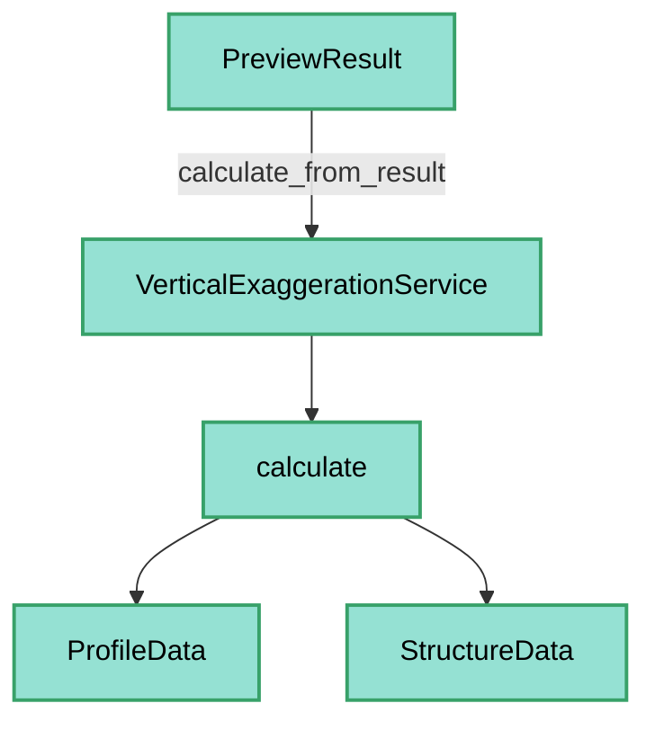
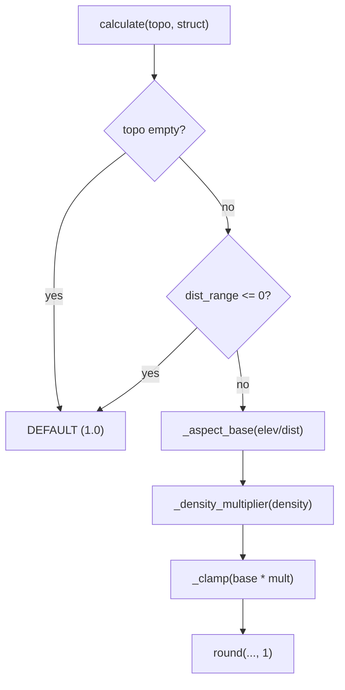

---
tags:
  - secinterp
  - code-walkthrough
  - core
  - services
aliases:
  - vertical_exaggeration_service.py
  - VerticalExaggerationService
cssclass: secinterp-note
---

# `core/services/vertical_exaggeration_service.py`

> [!abstract] One-line summary
> **Stateless** service that calculates the adaptive vertical exaggeration (VE) of a section from its aspect ratio (elevation range / distance range) modulated by structural measurement density.

**Path**: `core/services/vertical_exaggeration_service.py` (186 lines)
**Main class**: `VerticalExaggerationService`
**Layer**: Core (QGIS-agnostic)
**Tags**: #secinterp #core #services

---

## 🎯 Why does this file exist?

A fixed VE distorts flat or cluttered sections. This service adapts it automatically to
the relief and data density, deterministically and testably:

| Problem | Solution |
|---------|----------|
| Flat profiles invisible with VE=1 | increasing base VE by aspect ratio |
| Sections overloaded with structures | density multiplier (x0.7 / x1.0 / x1.3) |
| Extreme or unstable values | clamp to `[0.5, 20.0]` + `round(..., 1)` |
| Stability across sync/async renders | only topo + structures (excludes geology/drillholes) |

> [!important] Architectural note
> **QGIS-agnostic and thread-safe**: primitive inputs (`ProfileData`, `StructureData`),
> stateless and with class constants. Implements the algorithm from the plan
> `docs/plans/implementation_plan_adaptive_ve_v3.8.0.md`.

---

## 🧬 Relationship diagram



> [!tip] How to read
> `calculate_from_result` is a thin adapter over `calculate`; both share the same private
> helpers (`_distance_range`, `_aspect_base`, etc.).

---

## 📦 Imports — architectural reading

```python
# core/services/vertical_exaggeration_service.py
from sec_interp.core.domain import ProfileData, StructureData
from sec_interp.core.domain.dtos import PreviewResult
from sec_interp.logger_config import get_logger
```

| # | Observation |
|---|-------------|
| ① | **Zero `qgis.*` and zero extra stdlib**: no `math`, no `typing`. |
| ② | `ProfileData`/`StructureData` are aliases of lists of tuples/entities from the domain. |
| ③ | `PreviewResult` (consolidated DTO) is the input of `calculate_from_result`. |
| ④ | Only `get_logger` for debug traces of the computation. |

---

## 🏗️ Structure inventory

**Classes:** `class VerticalExaggerationService` — 8 methods + 15 class constants

**Constants (thresholds and multipliers):**
- `DEFAULT_VERT_EXAG=1.0`, `MIN_VERT_EXAG=0.5`, `MAX_VERT_EXAG=20.0`
- Aspect: `ASPECT_EXPRESSIVE=0.5`, `ASPECT_MODERATE=0.1`, `ASPECT_FLAT=0.02`
- Base: `BASE_EXPRESSIVE=1.0`, `BASE_MODERATE=2.0`, `BASE_LOW=5.0`, `BASE_FLAT=10.0`
- Density: `DENSITY_DENSE=0.1`, `DENSITY_SPARSE=0.01`
- Multipliers: `MULT_DENSE=0.7`, `MULT_NEUTRAL=1.0`, `MULT_SPARSE=1.3`

**Methods:**
- `calculate(topo, struct) -> float`
- `calculate_from_result(result) -> float`
- `_distance_range(topo)`, `_elevation_range(topo, struct)`, `_structural_density(struct, dist_range)`
- `_aspect_base(aspect_ratio)`, `_density_multiplier(density)`, `_clamp(value)`

---

## 📖 Method-by-method walkthrough

### `calculate` — Main algorithm

```python
def calculate(self, topo: ProfileData | None, struct: StructureData | None) -> float:
    if not topo:
        logger.debug("Adaptive VE: empty topo, using default %.1f", self.DEFAULT_VERT_EXAG)
        return self.DEFAULT_VERT_EXAG

    dist_range = self._distance_range(topo)
    if dist_range <= 0:
        logger.debug("Adaptive VE: zero distance range, using default")
        return self.DEFAULT_VERT_EXAG

    elev_range = self._elevation_range(topo, struct)
    base = self._aspect_base(elev_range / dist_range)
    mult = self._density_multiplier(self._structural_density(struct, dist_range))

    ve = round(self._clamp(base * mult), 1)
    logger.debug("Adaptive VE: ... base=%.1f mult=%.1f -> %.1f", base, mult, ve)
    return ve
```

| Step | Detail |
|------|--------|
| **Guard** | `not topo` or `dist_range <= 0` → `DEFAULT_VERT_EXAG` (1.0) |
| **Aspect ratio** | `elev_range / dist_range` |
| **Base** | `_aspect_base` maps the ratio to 1.0 / 2.0 / 5.0 / 10.0 |
| **Density** | `_structural_density` (measurements per map unit) |
| **Multiplier** | `_density_multiplier` (x0.7 / x1.0 / x1.3) |
| **Clamp + round** | `round(_clamp(base * mult), 1)` |

> [!important] Core formula
> `VE = clamp(base(aspect) × mult(density), 0.5, 20.0)`, rounded to 1 decimal.

### `calculate_from_result` — Adapter over `PreviewResult`

```python
def calculate_from_result(self, result: PreviewResult) -> float:
    return self.calculate(result.topo, result.struct)
```

Only considers **synchronous layers** (topography and structures); geology and drillholes
(asynchronous) are excluded to keep the VE stable across re-renders.

### `_distance_range` — Horizontal range

```python
def _distance_range(self, topo: ProfileData) -> float:
    return topo[-1][0] - topo[0][0]
```

Uses the first and last sampled points as authoritative bounds, consistent with
`PreviewResult.get_distance_range()`.

### `_elevation_range` — Vertical range

```python
def _elevation_range(self, topo, struct) -> float:
    elevations = [p[1] for p in topo]
    if struct:
        elevations.extend(m.elevation for m in struct)
    return max(elevations) - min(elevations)
```

Includes the elevations of the projected structures, in addition to the relief.

### `_structural_density` — Density

```python
def _structural_density(self, struct, dist_range) -> float | None:
    if not struct:
        return None
    return len(struct) / dist_range
```

Measurements per map unit; `None` if there are no structures.

### `_aspect_base` — Aspect ratio → base VE

```python
def _aspect_base(self, aspect_ratio: float) -> float:
    if aspect_ratio > self.ASPECT_EXPRESSIVE:   # > 0.5
        return self.BASE_EXPRESSIVE              # 1.0
    if aspect_ratio > self.ASPECT_MODERATE:     # > 0.1
        return self.BASE_MODERATE                # 2.0
    if aspect_ratio > self.ASPECT_FLAT:         # > 0.02
        return self.BASE_LOW                     # 5.0
    return self.BASE_FLAT                        # 10.0
```

A nearly flat profile (ratio ≤ 0.02) needs high VE (10); an already expressive profile
(ratio > 0.5) needs no exaggeration (1).

### `_density_multiplier` — Density → multiplier

```python
def _density_multiplier(self, density: float | None) -> float:
    if density is None:
        return self.MULT_NEUTRAL
    if density > self.DENSITY_DENSE:
        return self.MULT_DENSE
    if density > self.DENSITY_SPARSE:
        return self.MULT_NEUTRAL
    return self.MULT_SPARSE
```

| Density | Multiplier | Effect |
|---------|------------|--------|
| `None` (no structures) | 1.0 | neutral |
| `> 0.1` (dense) | 0.7 | dampens (avoids clutter) |
| `0.01–0.1` (medium) | 1.0 | neutral |
| `≤ 0.01` (sparse) | 1.3 | boosts (highlights detail) |

### `_clamp` — Bounding

```python
def _clamp(self, value: float) -> float:
    return max(self.MIN_VERT_EXAG, min(self.MAX_VERT_EXAG, value))
```

Confines the VE to `[0.5, 20.0]`.

---

## 🔄 Data flow

| Phase | Input | Transformation | Output |
|-------|-------|----------------|--------|
| Guard | `topo` | `not topo` / `dist_range <= 0` | `DEFAULT_VERT_EXAG` |
| Base | `elev_range / dist_range` | `_aspect_base` | 1.0 / 2.0 / 5.0 / 10.0 |
| Multiplier | `len(struct) / dist_range` | `_density_multiplier` | 0.7 / 1.0 / 1.3 |
| Result | `base * mult` | `_clamp` + `round` | `float` (VE) |

---

## 🏛️ Design patterns present

| Pattern | Where | Purpose |
|---------|-------|---------|
| **Stateless service** | `VerticalExaggerationService` | No `__init__`, thread-safe |
| **Threshold strategy** | `_aspect_base`, `_density_multiplier` | Decision table by ranges |
| **Guard clause** | `calculate` | Fallback to default |
| **Adapter** | `calculate_from_result` | Adapts `PreviewResult` to `calculate` |

---

## 🧾 API summary

| Symbol | Signature / Inherits | Typical use |
|--------|----------------------|-------------|
| `VerticalExaggerationService` | — | Adaptive VE calculation |
| `calculate` | `(topo, struct) -> float` | Main algorithm |
| `calculate_from_result` | `(result: PreviewResult) -> float` | From a consolidated result |
| `_distance_range` | `(topo) -> float` | Horizontal range |
| `_elevation_range` | `(topo, struct) -> float` | Vertical range |
| `_structural_density` | `(struct, dist_range) -> float | None` | Density |
| `_aspect_base` | `(aspect_ratio) -> float` | Base VE |
| `_density_multiplier` | `(density) -> float` | Multiplier |
| `_clamp` | `(value) -> float` | Bounding |

---

## 🛡️ Error handling

| Situation | Behaviour |
|-----------|-----------|
| `topo` empty / `None` | `DEFAULT_VERT_EXAG` (1.0) |
| `dist_range <= 0` | `DEFAULT_VERT_EXAG` |
| `struct` empty / `None` | neutral multiplier (1.0) |

> [!tip] No exceptions
> There is no `try/except`: every degenerate case is resolved with deterministic
> fallbacks. Ideal for calls from render threads.

---

## 🧪 Associated tests

Mapped to `tests/core/test_vertical_exaggeration_service.py` (mock-first, no QGIS):

- Verifies the aspect-ratio mapping (flat → high VE).
- Verifies the density multiplier (dense → x0.7, sparse → x1.3).
- Verifies the clamp to `[0.5, 20.0]` and rounding to 1 decimal.

---

## 👀 Observations and notes

> [!success] Strengths
> - **Zero QGIS**, stateless and deterministic: highly testable.
> - Readable class constants, well grouped by domain.
> - Clear fallbacks for empty data.
> - Stability across renders (excludes async layers).

> [!warning] Points of attention
> - `calculate` mixes 3 decision steps into a single method (not decomposed into `_stepN_`).
> - `_aspect_base` uses cascading `if/elif` comparisons that are order-sensitive.
> - `_structural_density` returns `None` instead of a value (implicit contract).

> [!question] Open questions
> - Expose the `(base, mult)` pair to debug/visualize the decision?
> - Parameterize the thresholds via settings instead of class constants?

---

## 📐 Step-by-step algorithm

The full decision can be read as a threshold tree:



## 🧮 Worked example

| Case | elev_range | dist_range | aspect | base | struct | density | mult | Final VE |
|------|-----------|-----------|--------|------|--------|---------|------|----------|
| Flat section | 2 m | 1000 m | 0.002 | 10.0 | 0 | None | 1.0 | **10.0** |
| Moderate relief | 100 m | 1000 m | 0.1 | 5.0 | 30 | 0.03 | 1.0 | **5.0** |
| Expressive relief | 600 m | 1000 m | 0.6 | 1.0 | 120 | 0.12 | 0.7 | **0.7** |
| Sparse | 100 m | 1000 m | 0.1 | 5.0 | 8 | 0.008 | 1.3 | **6.5** |

> [!note] Range decision rule
> `_aspect_base` and `_density_multiplier` are **decision tables**: the first threshold
> surpassed defines the value. The cascading `if/elif` is order-sensitive (from highest to
> lowest threshold).

## 🗂️ Constant hierarchy

The 15 class constants define the behaviour without `__init__`:

| Group | Constants | Role |
|-------|-----------|------|
| Limits | `MIN`/`MAX`/`DEFAULT_VERT_EXAG` | Clamp and fallback |
| Aspect | `ASPECT_*` + `BASE_*` | ratio → base VE mapping |
| Density | `DENSITY_*` + `MULT_*` | density → multiplier mapping |

> [!tip] Easy to tune
> As class constants, a future settings could expose them without touching the logic (see
> open question in observations).

## 🔄 Logging and debugging

The service emits `debug` traces at the decision points:

| Moment | Message |
|--------|---------|
| `topo` empty | `"Adaptive VE: empty topo, using default %.1f"` |
| `dist_range <= 0` | `"Adaptive VE: zero distance range, using default"` |
| Final calculation | `"Adaptive VE: elev_range=... base=... mult=... -> ..."` |

> [!tip] Traceability
> The last log prints the intermediate values (`elev_range`, `dist_range`, `base`, `mult`)
> before rounding, allowing reconstruction of *why* a VE was chosen without debugging the
> code.

## 📚 Algorithm reference

The docstring cites the implementation plan:
`docs/plans/implementation_plan_adaptive_ve_v3.8.0.md`. Section §5.1 of the plan fixes the
stability rule: **only synchronous layers** (topo + structures) determine the VE, so async
re-renders do not make the vertical scale jump.

> [!note] v3.8.0
> The service was introduced in version v3.8.0 as an adaptive improvement over the previous
> fixed VE. The constants (`MIN/MAX`, thresholds) reflect the values agreed in the plan.

## 🔗 Related notes

- [[Index]] — vault index
- [[preview_service]] — produces the `PreviewResult` (topo + struct) it consumes
- [[dtos]] — `PreviewResult` and `get_distance_range` / `get_elevation_range`
- [[domain]] — `ProfileData`, `StructureData`
- [[entities]] — `StructureMeasurement` (used in the density)
- [[structures]] — structural domain

---

*Note of the SecInterp Code Walkthrough v2 vault — v3.9.1*
