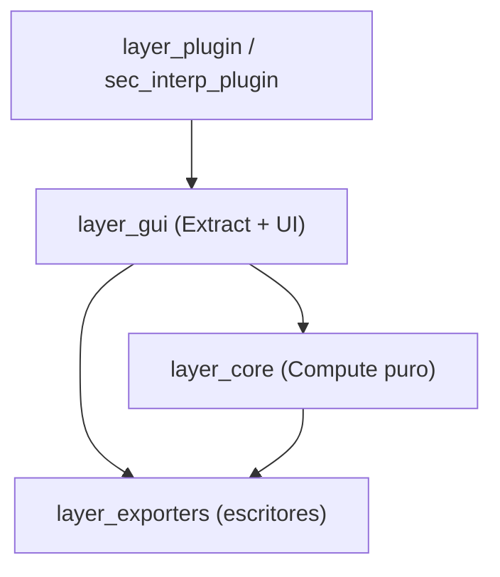

---
tags:
  - secinterp
  - code-walkthrough
  - moc
aliases:
  - SecInterp Code Walkthrough v2
  - Guía de Código SecInterp v2
cssclass: secinterp-moc
---

# 🗺️ SecInterp — Code Walkthrough v2 (MOC)

> [!abstract] Propósito
> Bóveda **completa y autónoma** (v2) que documenta archivo-por-archivo la
> implementación de SecInterp: **151 notas sustantivas + 23 hubs `layer_*` por idioma**
> (ES en `code_walkthrough_v2/`, EN en `code_walkthrough_en_v2/`), con recorrido
> método-por-método, flujo de datos, patrones, manejo de errores y tests.
> La bóveda v1 (`code_walkthrough/`) se mantiene intacta.

> [!info] Contexto
> - **Plugin**: SecInterp — QGIS ≥ 3.28, QGIS 4.x ready
> - **Arquitectura**: Clean Architecture (separación Core/GUI, Extract-then-Compute)
> - **Versión documentada**: 3.8.0
> - **Estado**: ✅ Completa — 302 notas sustantivas + 46 hubs (ambos idiomas), 0 esqueletos

---

## 📚 Mapa por capas (hubs `layer_*`)

| Hub | Capa / paquete | Notas | Qué cubre |
|---|---|---:|---|
| [[layer_core]] | `core/` | 5 + 6 sub-hubs | Fachada del núcleo QGIS-agnóstico |
| [[layer_core_services]] | `core/services/` | 6 + 2 sub-hubs | Servicios de dominio |
| [[layer_core_services_drillhole]] | `core/services/drillhole/` | 4 | Procesadores de sondajes |
| [[layer_core_services_export]] | `core/services/export/` | 4 + 1 sub-hub | Orquestación de exportación |
| [[layer_core_services_export_handlers]] | `core/services/export/handlers/` | 7 | Un handler por entidad |
| [[layer_core_validation]] | `core/validation/` | 8 | Framework de validación |
| [[layer_core_utils]] | `core/utils/` | 8 + 1 sub-hub | Utilidades puras |
| [[layer_core_utils_geometry_utils]] | `core/utils/geometry_utils/` | 4 | Medición/optimización/procesado |
| [[layer_core_domain]] | `core/domain/` | 6 | DTOs y entidades |
| [[layer_core_models]] | `core/models/` | 2 | Modelo de settings |
| [[layer_core_interfaces]] | `core/interfaces/` | 2 | Puertos (contratos) |
| [[layer_gui]] | `gui/` | 31 + 6 sub-hubs | Diálogo, managers y preview |
| [[layer_gui_adapters]] | `gui/adapters/` | 9 | Lado Extract (QGIS → DTOs) |
| [[layer_gui_renderers]] | `gui/renderers/` | 3 | Familia de renderers |
| [[layer_gui_tasks]] | `gui/tasks/` | 3 | QgsTasks en segundo plano |
| [[layer_gui_tools]] | `gui/tools/` | 4 | Map tools interactivos |
| [[layer_gui_ui]] | `gui/ui/` | 3 + 1 sub-hub | Ventana y sidebar |
| [[layer_gui_ui_pages]] | `gui/ui/pages/` | 10 + 2 sub-hubs | Páginas del diálogo |
| [[layer_gui_ui_pages_drillhole]] | `gui/ui/pages/drillhole/` | 4 | Tabs collar/interval/survey |
| [[layer_gui_ui_pages_settings]] | `gui/ui/pages/settings/` | 4 | Tabs de ajustes |
| [[layer_gui_dialogs]] | `gui/dialogs/` | 1 + relacionados | Diálogo de propiedades |
| [[layer_exporters]] | `exporters/` | 13 | Escritores de ficheros |
| [[layer_plugin]] | `plugin/` | 4 | Entrada y ciclo de vida |
| — | raíz + `resources/` | 5 | [[sec_interp_plugin]], [[logger_config]], [[resources]], [[resources_pkg]], [[root]] |

---

## 🧭 Rutas de lectura sugeridas

| Perfil | Ruta |
|---|---|
| **Recién llegado** | [[layer_core]] → [[controller]] → [[layer_gui]] → [[main_dialog]] |
| **Flujo Extract-then-Compute** | [[layer_gui_adapters]] → [[domain]] → [[layer_core_services]] |
| **Preview** | [[dialog_preview_manager]] → [[preview_task_orchestrator]] → [[preview_service]] → [[preview_renderer]] → [[topo_renderer]] |
| **Exportación** | [[dialog_export_manager]] → [[orchestrator]] → [[layer_exporters]] |
| **Validación** | [[layer_core_validation]] → [[layer_metadata]] → [[crs_plausibility]] → [[project_validator]] → [[layer_validator]] |
| **Entrada del plugin** | [[sec_interp_plugin]] → [[lifecycle]] → [[main_dialog]] |

---

## 🧬 Diagrama de capas

> [!tip] Cómo leer
> Las dependencias apuntan hacia el núcleo: la GUI extrae DTOs de QGIS, el core
> computa sin QGIS, los exporters escriben ficheros. Ver [[controller]] y
> [[core_interfaces]] para los contratos que sostienen la frontera.

---

## 📖 Cómo leer estas notas

Cada nota sustantiva sigue la plantilla v2 (`_template.md`):

1. **Frontmatter** — tags y aliases.
2. **Resumen + ¿por qué existe?** — problema/solución.
3. **Diagrama** — Mermaid de relaciones.
4. **Imports** — lectura arquitectónica.
5. **Inventario** — clases/funciones/constantes.
6. **Recorrido método-por-método** — el núcleo de profundidad.
7. **Flujo de datos** — entrada → transformación → salida.
8. **Patrones / API / Errores / Tests / Observaciones**.
9. **Notas relacionadas** — wikilinks (todos resuelven).

Los hubs `layer_*` son notas cortas de navegación: tabla de miembros con rol,
mini-mapa y cómo encajan. Niveles: Tier A/C 400–500 líneas, Tier B 300–400,
hubs 150–260.

> [!tip] Documentos de estructura
> Ver [[project_structure]] (árbol), [[project_structure_table]] (vista tabular por
> profundidad) y [[project_structure_links]] (mapa archivo → nota) para el mapa
> completo del plugin.

---

## 🔖 Tags usados

`#secinterp` · `#code-walkthrough` · `#moc` · `#layer` · `#core` · `#gui` · `#exporters` · `#plugin` · `#interfaces` · `#services` · `#utils` · `#validation` · `#pages` · `#renderers` · `#tasks` · `#tools` · `#adapters` · `#managers`

---

*Nota raíz de la bóveda v2 — bóveda completa (Fases 1–4), v3.9.1.*
