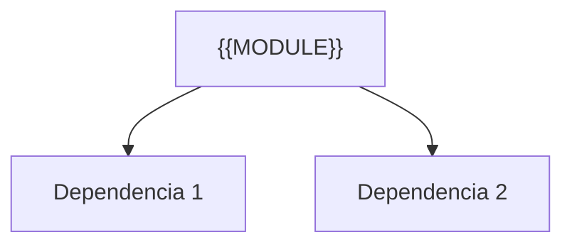

---
tags:
  - secinterp
  - code-walkthrough
  - {{LAYER_TAG}}      # core | gui | exporters
  - {{DOMAIN_TAG}}     # services | managers | renderers | adapters | validation | etc.
aliases:
  - {{FILE_BASENAME}}  # ej. path_resolver.py
  - {{CLASS_NAME}}     # ej. resolve_export_path
cssclass: secinterp-note
{{NOTE_LINES}}
---

# `{{REL_PATH}}`

> [!abstract] Resumen en una línea
> {{ONE_LINE_SUMMARY}} — qué hace este módulo en una frase, sin tocar QGIS si es core.

**Ruta**: `{{REL_PATH}}` ({{LINES}} líneas)
**Clase/Función principal**: `{{CLASS_NAME}}`
**Capa**: {{LAYER}} (QGIS-agnóstico / GUI · Tipo)
**Tags**: #secinterp #{{LAYER_TAG}} #{{DOMAIN_TAG}}

---

## 🎯 ¿Por qué existe este archivo?

| Problema | Solución |
|----------|----------|
| {{PROBLEM_1}} | {{SOLUTION_1}} |
| {{PROBLEM_2}} | {{SOLUTION_2}} |

> [!important] Nota arquitectónica
> {{ARCH_NOTE}} (p. ej. "QGIS-agnóstico", "Adapter Extract", "Factory").

---

## 🧬 Diagrama de relaciones



> [!tip] Cómo leer
> Flecha sólida = importa/delega; punteada = callback/injectado.

---

## 📦 Imports — lectura arquitectónica

```python
# {{FILE}}
{{IMPORT_BLOCK}}
```

| # | Observación |
|---|-------------|
| ① | {{OBS_1}} |
| ② | {{OBS_2}} |

---

## 🏗️ Inventario de estructura

{{STRUCTURE_INVENTORY}}

---

## 📁 Archivos del paquete

{{FILE_INVENTORY}}

---

## 📖 Recorrido método por método

### `{{M1_NAME}}`

```python
{{M1_CODE}}
```

{{M1_PROSE}}

### `{{M2_NAME}}`

```python
{{M2_CODE}}
```

{{M2_PROSE}}

<!-- Añade una subsección por cada método público del módulo -->

---

## 🔄 Flujo de datos

| Fase | Entrada | Transformación | Salida |
|------|---------|----------------|--------|
| {{FLOW_PHASE_1}} | {{FLOW_IN_1}} | {{FLOW_TRANSFORM_1}} | {{FLOW_OUT_1}} |
| {{FLOW_PHASE_2}} | {{FLOW_IN_2}} | {{FLOW_TRANSFORM_2}} | {{FLOW_OUT_2}} |

---

## 🏛️ Patrones de diseño presentes

| Patrón | Dónde | Propósito |
|--------|-------|-----------|
| {{PATTERN}} | {{WHERE}} | {{WHY}} |

---

## 🧾 Resumen de la API

| Símbolo | Firma / Hereda | Uso típico |
|---------|----------------|------------|
| {{SYMBOL}} | `{{SIG}}` | {{USE}} |

---

## 🛡️ Manejo de errores

{{ERROR_HANDLING}}

---

## 🧪 Tests asociados

{{TESTS}}

---

## 👀 Observaciones y notas

> [!success] Fortalezas
> - {{STRENGTH}}

> [!warning] Puntos de atención
> - {{RISK}}

> [!question] Preguntas abiertas
> - {{QUESTION}}

---

## 🔗 Notas relacionadas

- [[Index]] — índice de la bóveda
- [[{{RELATED_1}}]] — {{WHY_1}}
- [[{{RELATED_2}}]] — {{WHY_2}}

---

*Nota de la bóveda SecInterp Code Walkthrough v2 — v3.8.0*
