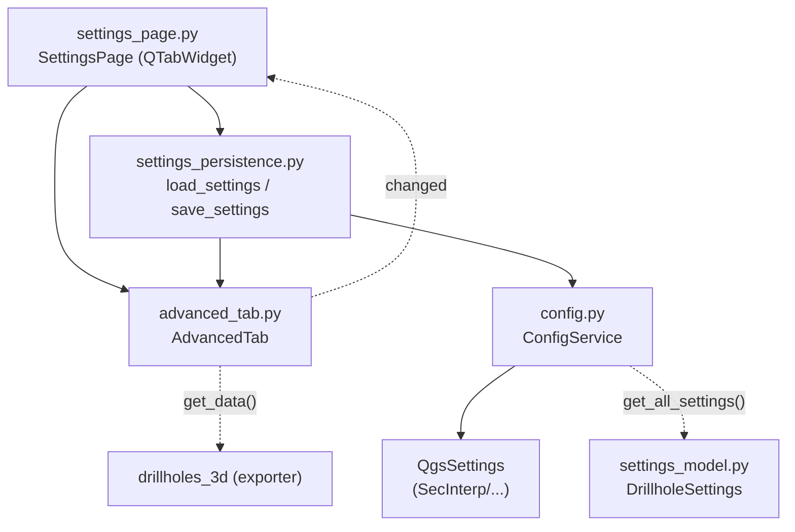

---
tags:
  - secinterp
  - code-walkthrough
  - gui
  - pages
aliases:
  - advanced_tab.py
  - AdvancedTab
cssclass: secinterp-note
---

# `gui/ui/pages/settings/advanced_tab.py`

> [!abstract] Resumen en una línea
> Pestaña avanzada de ajustes: interruptores de exportación 3D (activación general, trazas, intervalos, coordenadas reales vs. proyectadas) que persisten vía `ConfigService` y `QgsSettings`.

**Ruta**: `gui/ui/pages/settings/advanced_tab.py` (106 líneas)
**Clase principal**: `AdvancedTab`
**Capa**: GUI (QGIS-dependiente · página secundaria / tab)
**Tags**: #secinterp #gui #pages

---

## 🎯 ¿Por qué existe este archivo?

Las funciones 3D son restringidas/experimentales: no deben mezclarse con la
selección de exportación del día a día. Este tab las aísla con su propio
`changed` y sus propios valores por defecto.

| Problema | Solución |
|----------|----------|
| El 3D necesita 5 interruptores relacionados | `AdvancedTab` los agrupa en un `QVBoxLayout` |
| Activar 3D sin trazas/intervalos no tiene sentido | Interruptor maestro `chk_enable_3d` + 4 subordinados |
| Hay dos modos de coordenadas excluyentes en espíritu | `chk_3d_original` (defecto) y `chk_3d_projected` como flags |
| El padre debe tratar default y advanced igual | Contrato `get_data` / `reset_to_defaults` / `connect` / `disconnect` |

> [!important] Nota arquitectónica
> Tab de **configuración pura** (sin capas ni campos): sus valores viajan a
> `ConfigService.set()` y de ahí a `QgsSettings` con prefijo `SecInterp/`.
> El modelado tipado vive en `DrillholeSettings.export_3d_*` (ver
> [[settings_model]]).

---

## 🧬 Diagrama de relaciones



> [!tip] Cómo leer
> Flecha sólida = importa/llama; punteada = señal o consumo diferido (export 3D).

---

## 📦 Imports — lectura arquitectónica

```python
# gui/ui/pages/settings/advanced_tab.py
from __future__ import annotations
import contextlib
from typing import Any
from qgis.PyQt.QtCore import QCoreApplication, pyqtSignal
from qgis.PyQt.QtWidgets import QCheckBox, QLabel, QVBoxLayout, QWidget
from sec_interp.logger_config import get_logger
```

| # | Observación |
|---|-------------|
| ① | Sin `qgis.core` ni `qgis.gui`: no hay selectores de capa, solo checkboxes. |
| ② | `QVBoxLayout` vertical simple: cabeceras HTML + 5 checks + stretch. |
| ③ | Señal propia `changed` (no `dataChanged`): vocabulario de settings, no de páginas. |
| ④ | `contextlib` solo para `disconnect_signals`, como en los tabs de sondajes. |
| ⑤ | `get_logger(__name__)` declarado aunque este tab no loguea (simetría de paquete). |

---

## 🏗️ Inventario de estructura

**Clase:** `AdvancedTab(QWidget)` — 1 señal, 6 métodos, 5 checkboxes.

| Miembro | Tipo | Rol |
|---------|------|-----|
| `changed` | `pyqtSignal()` | Aviso al padre para autoguardar |
| `chk_enable_3d` | `QCheckBox` | Maestro: habilita exportación de interpretación 3D |
| `chk_3d_traces` | `QCheckBox` | Exportar trazas 3D de sondajes |
| `chk_3d_intervals` | `QCheckBox` | Exportar intervalos 3D |
| `chk_3d_original` | `QCheckBox` | Usar coordenadas originales (3D real) |
| `chk_3d_projected` | `QCheckBox` | Usar coordenadas proyectadas (plano de sección) |

**Métodos:**

| Método | Firma | Propósito |
|--------|-------|-----------|
| `__init__` | `(parent=None) -> None` | Construye y llama `_setup_ui` |
| `tr` | `(message: str) -> str` | Traduce con contexto `"AdvancedTab"` |
| `_setup_ui` | `() -> None` | Layout vertical con 2 cabeceras |
| `get_data` | `() -> dict[str, Any]` | Lectura defensiva con `hasattr` |
| `reset_to_defaults` | `() -> None` | Restaura defaults vía `getattr` |
| `connect_signals` | `() -> None` | 5 `stateChanged → changed.emit` |
| `disconnect_signals` | `() -> None` | 5 desconexiones suprimidas |

---

## 📁 Archivos del paquete

| Archivo | Líneas | Rol |
|---|---|---|
| `settings/__init__.py` | 9 | Re-exporta `AdvancedTab`, `DefaultTab`, `build_info_tab` |
| `advanced_tab.py` | 106 | Esta nota: funciones 3D / restringidas |
| `default_tab.py` | 178 | Selección de exportación (ver [[default_tab]]) |
| `info_tab.py` | — | Pestaña informativa (`build_info_tab`) |
| `settings_persistence.py` | 75 | `load/save_settings` (ver [[settings_persistence]]) |
| `../settings_page.py` | 124 | Padre con `QTabWidget` (ver [[settings_page]]) |

---

## 📖 Recorrido método por método

### `__init__` + `tr`

```python
def __init__(self, parent: QWidget | None = None) -> None:
    super().__init__(parent)
    self._setup_ui()

def tr(self, message: str) -> str:
    return QCoreApplication.translate("AdvancedTab", message)
```

Construcción delegada y contexto `"AdvancedTab"` para `update-strings.sh`.

### `_setup_ui`

```python
layout = QVBoxLayout(self)

layout.addWidget(QLabel(self.tr("<b>Advanced Features</b>")))

self.chk_enable_3d = QCheckBox(self.tr("Enable 3D Interpretation Export"))
self.chk_enable_3d.setToolTip(
    self.tr("Enables the generation of 3D Shapefiles (.shp) during export.")
)
layout.addWidget(self.chk_enable_3d)

layout.addWidget(QLabel(self.tr("<br><b>Drillhole 3D Export Options</b>")))
self.chk_3d_traces = QCheckBox(self.tr("Export 3D Traces"))
self.chk_3d_intervals = QCheckBox(self.tr("Export 3D Intervals"))
self.chk_3d_original = QCheckBox(self.tr("Use Original Coordinates (Real 3D)"))
self.chk_3d_projected = QCheckBox(self.tr("Use Projected Coordinates (Section Plane)"))

layout.addWidget(self.chk_3d_traces)
layout.addWidget(self.chk_3d_intervals)
layout.addWidget(self.chk_3d_original)
layout.addWidget(self.chk_3d_projected)

layout.addStretch()
```

| Bloque | Contenido |
|--------|-----------|
| Cabecera 1 | `"Advanced Features"` en negrita HTML |
| Maestro | `chk_enable_3d` con tooltip sobre Shapefiles 3D |
| Cabecera 2 | `"Drillhole 3D Export Options"` |
| Subordinados | Trazas, intervalos, originales, proyectadas |
| Cierre | `addStretch()` empuja hacia arriba |

> [!note] Sin estado inicial explícito
> `_setup_ui` no marca ningún check: el estado real lo pone `load_settings`
> (vía `SettingsPage._load_settings`) justo después de crear el tab.

### `get_data` — lectura defensiva

```python
def get_data(self) -> dict[str, Any]:
    return {
        "enable_3d": (self.chk_enable_3d.isChecked() if self.chk_enable_3d else False),
        "drill_3d_traces": (
            self.chk_3d_traces.isChecked() if hasattr(self, "chk_3d_traces") else True
        ),
        "drill_3d_intervals": (
            self.chk_3d_intervals.isChecked() if hasattr(self, "chk_3d_intervals") else True
        ),
        "drill_3d_original": (
            self.chk_3d_original.isChecked() if hasattr(self, "chk_3d_original") else True
        ),
        "drill_3d_projected": (
            self.chk_3d_projected.isChecked() if hasattr(self, "chk_3d_projected") else False
        ),
    }
```

Cada clave tiene un fallback si el atributo no existe (`True` salvo maestro y
proyectadas). Patrón Mock-first: los tests pueden usar dobles parciales sin
los cinco widgets.

| Clave | Default si falta | Clave `QgsSettings` |
|-------|------------------|---------------------|
| `enable_3d` | `False` | `SecInterp/enable_3d` (defecto `True`) |
| `drill_3d_traces` | `True` | `SecInterp/drill_3d_traces` |
| `drill_3d_intervals` | `True` | `SecInterp/drill_3d_intervals` |
| `drill_3d_original` | `True` | `SecInterp/drill_3d_original` |
| `drill_3d_projected` | `False` | `SecInterp/drill_3d_projected` |

### `reset_to_defaults`

```python
def reset_to_defaults(self) -> None:
    defaults = {
        "chk_enable_3d": True,
        "chk_3d_traces": True,
        "chk_3d_intervals": True,
        "chk_3d_original": True,
        "chk_3d_projected": False,
    }
    for attr, value in defaults.items():
        widget = getattr(self, attr, None)
        if widget is not None:
            widget.setChecked(value)
```

Diccionario + `getattr`: añadir un futuro check es una línea. Lo invoca
`SettingsPage._reset_export_defaults()` junto al reset del tab default.
Nótese que dispara `stateChanged` ⇒ `changed` ⇒ autoguardado: resetear
también persiste.

### `connect_signals`

```python
def connect_signals(self) -> None:
    self.chk_enable_3d.stateChanged.connect(self.changed.emit)
    self.chk_3d_traces.stateChanged.connect(self.changed.emit)
    self.chk_3d_intervals.stateChanged.connect(self.changed.emit)
    self.chk_3d_original.stateChanged.connect(self.changed.emit)
    self.chk_3d_projected.stateChanged.connect(self.changed.emit)
```

Cinco conexiones directas a `changed.emit`. El padre escucha `changed` y llama
`_on_settings_changed()` → `save_settings(...)`: cada clic persiste al momento.

### `disconnect_signals`

```python
def disconnect_signals(self) -> None:
    with contextlib.suppress(TypeError, RuntimeError):
        self.chk_enable_3d.stateChanged.disconnect(self.changed.emit)
    ...  # un bloque por checkbox
```

Cinco bloques individuales `suppress(TypeError, RuntimeError)`: idempotente
ante doble desconexión o widgets destruidos.

---

## 🔄 Flujo de datos

| Fase | Entrada | Transformación | Salida |
|------|---------|----------------|--------|
| Setup | `parent` | `_setup_ui` crea 5 checks | Widgets sin estado |
| Hidratación | `QgsSettings` | `load_settings(settings, default_tab, advanced_tab)` | Checks marcados |
| Edición | Clic | `stateChanged → changed.emit` | Señal al padre |
| Autoguardado | `changed` | `SettingsPage._on_settings_changed` → `save_settings` | `ConfigService.set(...)` × 5 |
| Lectura | Widgets | `get_data()` defensivo | `dict` con 5 flags |
| Modelo | `QgsSettings` | `ConfigService._load_from_qgs_settings` | `DrillholeSettings.export_3d_*` |
| Reset | Botón/padre | `reset_to_defaults()` | Defaults + autoguardado en cascada |
| Cierre | Diálogo | `disconnect_signals()` | Sin señales colgadas |

---

## 🏛️ Patrones de diseño presentes

| Patrón | Dónde | Propósito |
|--------|-------|-----------|
| **Composite (tab)** | `SettingsPage` + tabs | Contrato uniforme default/advanced |
| **Observer** | `changed` | Autoguardado reactivo |
| **Memento parcial** | `reset_to_defaults` | Defaults declarativos en diccionario |
| **Programación defensiva** | `hasattr`/`getattr` | Soporta dobles parciales en tests |
| **Guarded disconnect** | `contextlib.suppress` | Desconexión idempotente |
| **Fachada de persistencia** | `settings_persistence` | Tabs sin `QgsSettings` directo |

---

## 🧾 Resumen de la API

| Símbolo | Firma / Hereda | Uso típico |
|---------|----------------|------------|
| `AdvancedTab` | `QWidget` | `SettingsPage.tab_widget.addTab(AdvancedTab(), ...)` |
| `changed` | `pyqtSignal()` | `tab.changed.connect(self._on_settings_changed)` |
| `get_data()` | `-> dict[str, Any]` | 5 flags para exportadores 3D |
| `reset_to_defaults()` | `-> None` | Restaurar defaults 3D |
| `connect_signals()` | `-> None` | Cablear al mostrar la página |
| `disconnect_signals()` | `-> None` | Descablear al cerrar |

---

## 🛡️ Manejo de errores

Sin `try/except` de dominio; defensas puntuales:

- `get_data`/`reset_to_defaults` toleran atributos ausentes (`hasattr`,
  `getattr(..., None)`): un mock parcial no rompe la lectura.
- `disconnect_signals` suprime `TypeError`/`RuntimeError`.
- La validación real (¿3D coherente?) vive en el exportador, no en el tab.

---

## 🧪 Tests asociados

Sin `tests/gui/test_advanced_tab.py` dedicado; cobertura vía la página padre:

- `tests/gui/test_settings_page.py::TestSettingsPage::test_initialization` — tabs creados y widgets expuestos.
- `test_load_settings` — hidratación desde `QgsSettings` con valores `True/False`.
- `test_save_settings` — `save_settings` persiste los 5 flags vía `ConfigService`.
- `test_get_data` — `SettingsPage.get_data()` fusiona default + advanced.
- `tests/gui/test_main_dialog_settings.py` — persistencia global con parseo de booleanos.

---

## 🌐 i18n y notas de migración

- Contexto `"AdvancedTab"`; cabeceras con HTML (`<b>`, `<br>`) traducible.
- Tooltip del maestro también traducido (menciona `.shp` 3D).
- Sin `qgis.core`/`qgis.gui`: inmune a cambios de API de capas entre QGIS 3/4.
- `chk_3d_original` vs `chk_3d_projected` son flags independientes (no
  `QButtonGroup`): la exclusión, si se quiere, debe añadirse.

---

## 📐 Mapeo tab → SettingsModel → QgsSettings

Cada checkbox recorre tres representaciones con nombres distintos:

| Widget | `get_data()` | `QgsSettings` (`SecInterp/…`) | `DrillholeSettings` / `ExportSettings` |
|--------|--------------|-------------------------------|----------------------------------------|
| `chk_enable_3d` | `enable_3d` | `enable_3d` | Sin campo directo (flag global de exportación) |
| `chk_3d_traces` | `drill_3d_traces` | `drill_3d_traces` | `export_3d_traces` (defecto `True`) |
| `chk_3d_intervals` | `drill_3d_intervals` | `drill_3d_intervals` | `export_3d_intervals` (defecto `True`) |
| `chk_3d_original` | `drill_3d_original` | `drill_3d_original` | `export_3d_original` (defecto `True`) |
| `chk_3d_projected` | `drill_3d_projected` | `drill_3d_projected` | `export_3d_projected` (defecto `False`) |

> [!note] Doble lectura de la persistencia
> `load_settings` lee con `settings.value("SecInterp/…", default, type=bool)`
> (acceso directo a `QgsSettings`), mientras `save_settings` escribe con
> `config_service.set(...)` (que añade el prefijo y hace `sync()`). Ambas rutas
> convergen en las mismas claves.

---

## 🧩 Relación con DefaultTab y SettingsPage

| Aspecto | `AdvancedTab` | `DefaultTab` |
|---------|---------------|--------------|
| Señal | `changed` | `changed` (misma firma) |
| Layout | `QVBoxLayout` simple | `QVBoxLayout` + sub-layouts `QHBoxLayout` |
| Reset | `reset_to_defaults()` propio | `reset_to_defaults()` propio |
| Botón propio | No (lo resetea el padre) | Sí (`btn_reset_export`) |
| Exposición | `SettingsPage._expose_tab_widgets` replica los 5 checks | Replica 5 checks + formato + naming + botón |
| Guardado | `save_settings` lee ambos tabs a la vez | Idem, en la misma llamada |

El padre trata ambos tabs de forma simétrica: conecta `changed` de los dos a
`_on_settings_changed` y desconecta con el mismo patrón `suppress`.

---

## 👀 Observaciones y notas

> [!success] Fortalezas
> - Aislar lo 3D/restringido evita contaminar el tab de uso diario.
> - Defaults declarativos en diccionario: fáciles de auditar.
> - Lectura defensiva apta para mocks parciales.

> [!warning] Puntos de atención
> - Original/proyectadas no son excluyentes a nivel UI: se pueden marcar ambas.
> - El maestro no deshabilita a los subordinados (a diferencia de `chk_use_geom` en collar).
> - `logger` importado pero sin uso en este módulo.

> [!question] Preguntas abiertas
> - ¿Grupo excluyente o deshabilitado en cascada para original/proyectadas?
> - ¿Sincronizar `chk_enable_3d` desmarcado con subordinados deshabilitados?

---

## 🔗 Notas relacionadas

- [[Index]] — índice de la bóveda
- [[settings_page]] — página padre con el `QTabWidget`
- [[gui_ui_pages_settings]] — paquete de tabs de ajustes
- [[default_tab]] — tab hermano de exportación
- [[settings_persistence]] — `load/save_settings` que hidratan este tab
- [[settings_model]] — `DrillholeSettings.export_3d_*` y `PluginSettings`
- [[config]] — `ConfigService` (`get`/`set`, prefijo `SecInterp/`)
- [[drillholes_3d]] — exportador consumidor de estos flags

---

*Nota de la bóveda SecInterp Code Walkthrough v2 — v3.9.1*
