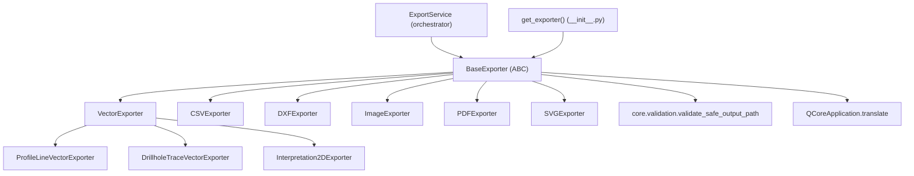

---
tags:
  - secinterp
  - code-walkthrough
  - exporters
  - contracts
aliases:
  - base_exporter.py
  - BaseExporter
cssclass: secinterp-note
---

# `exporters/base_exporter.py`

> [!abstract] Resumen en una línea
> Contrato abstracto de toda la capa de exportación: `BaseExporter` fija el **Template Method** (`export`, `get_supported_extensions`) más validación segura de rutas y acceso a settings, para que cada formato solo implemente su escritura.

**Ruta**: `exporters/base_exporter.py` (137 líneas)
**Clase principal**: `BaseExporter(ABC)`
**Capa**: Exporters (frontera: `QCoreApplication` solo para `tr()`, sin `qgis.core`)
**Tags**: #secinterp #exporters #contracts

---

## 🎯 ¿Por qué existe este archivo?

Sin una base común, cada exporter reinventaría la validación de rutas, el chequeo de
extensiones y la lectura de settings, con firmas incompatibles entre sí:

| Problema | Solución |
|----------|----------|
| Firmas de `export()` divergentes por formato | Método abstracto único `export(output_path, data, layer_name=None) -> bool` |
| Escrituras fuera de la carpeta destino (path traversal) | `validate_export_path()` con `resolve()` + `validate_safe_output_path` |
| Chequeo de extensión repetido en cada exporter | `validate_path()` genérico sobre `get_supported_extensions()` |
| Acceso a settings con `.get()` disperso y sin defecto | `get_setting(key, default)` centralizado |
| Mensajes de error sin traducir | `QCoreApplication.translate("BaseExporter", …)` en esta capa |

> [!important] Nota arquitectónica
> Es el **puerto** de la capa `exporters/`: el orquestador (`ExportService`), los handlers
> de `core/services/export/handlers/` y la factoría `get_exporter()` dependen de esta
> abstracción, nunca de las clases concretas. Patrón Template Method + Dependency Inversion.

---

## 🧬 Diagrama de relaciones



> [!tip] Cómo leer
> Flecha sólida = hereda de / importa. `BaseExporter` es el único nodo que la factoría y
> el orquestador conocen; las subclases concretas cuelgan de él directa o indirectamente.

---

## 📦 Imports — lectura arquitectónica

```python
# exporters/base_exporter.py
from __future__ import annotations

from abc import ABC, abstractmethod
from pathlib import Path
from typing import Any

from qgis.PyQt.QtCore import QCoreApplication

from sec_interp.core.validation import validate_safe_output_path
```

| # | Observación |
|---|-------------|
| ① | `ABC` + `abstractmethod` → tipado **nominal**: cada exporter debe heredar y cumplir el contrato. |
| ② | `pathlib.Path` en todas las firmas: las rutas nunca viajan como `str` crudo. |
| ③ | `QCoreApplication` es el **único** import QGIS y solo se usa para `translate()` — el shim `qgis.PyQt` no toca `qgis.core` ni la GUI. |
| ④ | `validate_safe_output_path` viene de `core/validation`: la seguridad de rutas vive en el core QGIS-agnóstico y se reutiliza aquí. |
| ⑤ | Cero imports de `qgis.core`/`qgis.gui`: este módulo carga sin inicializar QGIS. |

> [!note] Frontera ligera con QGIS
> A diferencia de `vector_exporter.py` o `image_exporter.py` (que sí importan `qgis.core`),
> la base solo necesita traducción. Eso permite importarla y testearla con mocks mínimos.

---

## 🏗️ Inventario de estructura

**Clases:** `class BaseExporter(ABC)` — 1 clase, 6 miembros.

**Métodos abstractos (contrato que cada subclase implementa):**

- `export(output_path: Path, data: Any, layer_name: str | None = None) -> bool`
- `get_supported_extensions() -> list[str]`

**Métodos concretos (lógica compartida heredada tal cual):**

- `__init__(settings: dict[str, Any]) -> None`
- `validate_export_path(output_path: Path, base_dir: Path | None = None) -> tuple[bool, str]`
- `validate_path(path: Path) -> bool`
- `get_setting(key: str, default: Any = None) -> Any`

**Atributos:**

- `self.settings` — `dict[str, Any]` con la configuración de exportación (ancho, alto, DPI, color de fondo, `legend_renderer`, `geometry_type`, `crs`, `symbology_export`…).

---

## 📁 Archivos del paquete

| Archivo | Líneas | Rol |
|---|--:|---|
| `__init__.py` | 81 | Re-exports + factoría `get_exporter(extension, settings)` |
| `base_exporter.py` | 137 | `BaseExporter` — contrato abstracto (esta nota) |
| `vector_exporter.py` | 122 | `VectorExporter` — SHP/GPKG/DXF vía `QgsVectorFileWriter` |
| `csv_exporter.py` | 58 | `CSVExporter` — tabular puro con `csv` estándar |
| `dxf_exporter.py` | 126 | `DXFExporter` — variante CAD dedicada |
| `image_exporter.py` | 72 | `ImageExporter` — PNG/JPG vía `QgsMapRendererCustomPainterJob` |
| `pdf_exporter.py` | 79 | `PDFExporter` — PDF vía `QPdfWriter` a 300 DPI |
| `svg_exporter.py` | 85 | `SVGExporter` — vectorial vía `QSvgGenerator` |
| `profile_exporters.py` | — | `ProfileLineVectorExporter`, `GeologyVectorExporter`, `AxesVectorExporter`, `StructureVectorExporter` |
| `drillhole_exporters.py` | — | `DrillholeTraceVectorExporter`, `DrillholeIntervalVectorExporter` |
| `drillhole_3d_exporter.py` | — | `DrillholeTrace3DExporter`, `DrillholeInterval3DExporter` |
| `interpretation_exporters.py` | — | `Interpretation2DExporter` |
| `interpretation_3d_exporter.py` | — | `Interpretation3DExporter` |

> [!tip] Dónde encaja esta nota
> `base_exporter.py` es la raíz de herencia de **todas** las filas de la tabla. Las notas
> [[vector_exporter]], [[csv_exporter]], [[dxf_exporter]], [[image_exporter]],
> [[pdf_exporter]] y [[svg_exporter]] documentan cada rama concreta.

---

## 📖 Recorrido método por método

### `__init__`

```python
def __init__(self, settings: dict[str, Any]) -> None:
    """Initialize the exporter with settings.

    Args:
        settings: Dictionary containing export settings such as:
            - width: Output width in pixels
            - height: Output height in pixels
            - dpi: Dots per inch for resolution
            - background_color: Background color (QColor)
            - legend_renderer: Optional renderer for legend overlay

    """
    self.settings = settings
```

Constructor mínimo: guarda el dict sin validarlo. La validación perezosa (vía
`get_setting` con defecto) permite que cada subclase lea solo las claves que necesita.

| Clave típica | Consumida por |
|--------------|---------------|
| `width`, `height` | `ImageExporter`, `PDFExporter`, `SVGExporter` |
| `background_color` | `ImageExporter` |
| `legend_renderer`, `show_legend` | `ImageExporter`, `PDFExporter`, `SVGExporter` |
| `geometry_type`, `crs`, `symbology_export` | `VectorExporter`, `DXFExporter` |

### `export` — el método plantilla abstracto

```python
@abstractmethod
def export(self, output_path: Path, data: Any, layer_name: str | None = None) -> bool:
    """Export data to file.

    This method must be implemented by all concrete exporters.

    Args:
        output_path: Destination file path
        data: Data to export (format depends on exporter type)
        layer_name: Optional conceptual name for the layer (e.g. inside a GeoPackage)

    Returns:
        bool: True if export successful, False otherwise

    """
    pass
```

Es el **Template Method**: fija nombre, parámetros y semántica de retorno (`bool`, nunca
excepción hacia el llamador directo). El tipo de `data` varía por familia:

| Exporter | `data` esperado |
|----------|-----------------|
| `VectorExporter` / `DXFExporter` | `list[dict]` con claves `geometry` + `attributes` |
| `CSVExporter` | `dict` con `headers` + `rows` |
| `ImageExporter` / `PDFExporter` / `SVGExporter` | `QgsMapSettings` ya configurado |

> [!important] `bool`, no excepciones
> El contrato devuelve `True`/`False` y **registra** el fallo con `logger.exception`.
> La traducción a `ExportError` ocurre un nivel más arriba, en los handlers de
> `core/services/export/handlers/` (ver [[orchestrator]] y [[compat]]).

### `validate_export_path` — seguridad de rutas

```python
def validate_export_path(
    self, output_path: Path, base_dir: Path | None = None
) -> tuple[bool, str]:
    try:
        # Resolve the absolute path to detect traversal
        resolved_path = output_path.resolve()

        if base_dir:
            resolved_base = base_dir.resolve()
            if not str(resolved_path).startswith(str(resolved_base)):
                return False, QCoreApplication.translate(
                    "BaseExporter",
                    "Path traversal detected: {path} is outside of {base}",
                ).format(path=output_path, base=base_dir)

        # Get parent directory for existence/permissions validation
        parent_dir = output_path.parent

        # Validate parent directory using existing helper
        is_valid, error, _ = validate_safe_output_path(
            str(parent_dir),
            base_dir=base_dir,
            must_exist=False,
            create_if_missing=True,
        )

        if not is_valid:
            return False, QCoreApplication.translate(
                "BaseExporter", "Invalid export path: {error}"
            ).format(error=error)

        return True, ""

    except (OSError, ValueError) as e:
        return False, QCoreApplication.translate(
            "BaseExporter", "Path resolution error: {error}"
        ).format(error=str(e))
```

| Paso | Comportamiento |
|------|----------------|
| 1. Resolución | `output_path.resolve()` disuelve `..` y enlaces simbólicos antes de comparar |
| 2. Jaula (`base_dir`) | Si se da un directorio base, la ruta resuelta debe empezar por él; si no, `False` + mensaje traducido |
| 3. Delegación | El directorio padre se valida con `validate_safe_output_path` del core (`must_exist=False`, `create_if_missing=True`) |
| 4. Blindaje | `OSError`/`ValueError` de resolución se convierten en `(False, mensaje)` — nunca se propagan |

> [!tip] Doble capa de defensa
> La comprobación `startswith` es la guardia rápida local; `validate_safe_output_path`
> (ver [[path_validator]]) es la validación canónica del proyecto. Ambas deben pasar.

### `get_supported_extensions` — abstracto

```python
@abstractmethod
def get_supported_extensions(self) -> list[str]:
    """Get list of supported file extensions.

    Returns:
        List of supported extensions (e.g., ['.png', '.jpg'])

    """
```

Cada subclase declara sus extensiones en minúsculas con punto. Es la pieza que usan
`validate_path()` y la factoría `get_exporter()` para enrutar:

| Exporter | Extensiones |
|----------|-------------|
| `VectorExporter` | `.shp`, `.gpkg`, `.dxf` |
| `CSVExporter` | `.csv` |
| `DXFExporter` | `.dxf` |
| `ImageExporter` | `.png`, `.jpg`, `.jpeg` |
| `PDFExporter` | `.pdf` |
| `SVGExporter` | `.svg` |

### `validate_path`

```python
def validate_path(self, path: Path) -> bool:
    """Validate that the output path has a supported extension.

    Args:
        path: Path to validate

    Returns:
        True if path has a supported extension, False otherwise

    """
    return path.suffix.lower() in self.get_supported_extensions()
```

Comparación insensible a mayúsculas (`.SHP` vale). Es un chequeo **sintáctico** previo a
la escritura; la validación de seguridad (existencia, traversal) vive en
`validate_export_path`.

### `get_setting`

```python
def get_setting(self, key: str, default: Any = None) -> Any:
    """Get a setting value with optional default.

    Args:
        key: Setting key
        default: Default value if key not found

    Returns:
        Setting value or default

    """
    return self.settings.get(key, default)
```

Azúcar sobre `dict.get` que desacopla a las subclases del origen de la configuración
(hoy un dict plano que la GUI construye desde `settings_model`). Todas las lecturas de
`self.get_setting("width", 800)` en image/pdf/svg y de `geometry_type`/`crs` en
vector/dxf pasan por aquí.

---

## 🔄 Flujo de datos

| Fase | Entrada | Transformación | Salida |
|------|---------|----------------|--------|
| Configuración | `settings: dict` | `__init__` lo guarda | `self.settings` |
| Pre-validación | `output_path` | `validate_path()` (extensión) + `validate_export_path()` (seguridad) | `(bool, str)` |
| Escritura | `(output_path, data, layer_name)` | `export()` de la subclase | `bool` éxito/fracaso |
| Lectura perezosa | `key + default` | `get_setting()` | valor o defecto |

---

## 🏛️ Patrones de diseño presentes

| Patrón | Dónde | Propósito |
|--------|-------|-----------|
| **Template Method** | `export` abstracto + helpers concretos | Fijar el esqueleto y delegar el formato |
| **Dependency Inversion** | orquestador/handlers dependen de `BaseExporter` | Sustituir formatos sin tocar llamadores |
| **Factory** | `get_exporter()` en `__init__.py` | Instanciar la subclase por extensión |
| **Guard Clauses** | `return False` tempranos en subclases | Rechazar `data` vacío sin anidar |
| **Secure path validation** | `validate_export_path` + core validation | Prevenir path traversal |

---

## 🧾 Resumen de la API

| Símbolo | Firma / Hereda | Uso típico |
|---------|----------------|------------|
| `BaseExporter` | `(ABC)` | Heredar en cada exporter concreto |
| `__init__` | `(settings: dict[str, Any]) -> None` | `VectorExporter({"crs": crs, …})` |
| `export` | `(output_path: Path, data: Any, layer_name: str \| None = None) -> bool` | `exporter.export(path, features)` |
| `get_supported_extensions` | `() -> list[str]` | `[".shp", ".gpkg", ".dxf"]` |
| `validate_path` | `(path: Path) -> bool` | Chequeo previo de extensión |
| `validate_export_path` | `(output_path: Path, base_dir: Path \| None = None) -> tuple[bool, str]` | Chequeo de seguridad |
| `get_setting` | `(key: str, default: Any = None) -> Any` | `self.get_setting("width", 800)` |

---

## 🛡️ Manejo de errores

| Situación | Comportamiento |
|-----------|----------------|
| `output_path` fuera de `base_dir` | `(False, "Path traversal detected…")` traducido |
| Directorio padre inválido | `(False, "Invalid export path: …")` del helper del core |
| `OSError`/`ValueError` al resolver | `(False, "Path resolution error: …")` |
| Fallo de escritura en subclase | La subclase registra con `logger.exception` y devuelve `False` |
| `False` del exporter | El handler lo convierte en `raise ExportError(…)` (ver [[compat]]) |

> [!note] Dos niveles de error
> `BaseExporter` nunca lanza en la ruta de validación: devuelve tuplas. Las subclases
> tampoco lanzan en `export()`: devuelven `bool`. Solo los handlers traducen el `False`
> a `ExportError` de la jerarquía de [[exceptions]] para que el `dialog_export_manager`
> lo muestre.

---

## 🧪 Tests asociados

La base se ejercita indirectamente en casi todo `tests/exporters/`, más casos directos de
contrato en `tests/exporters/test_exporters.py`:

- `test_get_supported_extensions` — cada exporter declara sus extensiones.
- `test_export_valid_data` — escritura válida según el contrato `bool`.
- `test_export_empty_data` — guardia `False` con `data` vacío.
- `test_export_missing_headers` / `test_export_missing_rows` — CSV rechaza dict incompleto.
- `test_get_setting_with_default` / `test_get_setting_no_default` — lectura de settings heredada.
- `tests/exporters/test_vector_exporter.py` — `test_export_writer_error`, `test_export_exception_handling` (contrato `False` ante fallos OGR).
- `tests/exporters/test_image_exporter.py`, `test_pdf_exporter.py`, `test_svg_exporter.py` — éxito y manejo de excepciones por formato.
- **Integración**: `tests/integration/test_export_workflow.py` y `tests/integration/test_export_service_e2e.py` (escritura real SHP/CSV vía orquestador).

---

## 👀 Observaciones y notas

> [!success] Fortalezas
> - Contrato mínimo y estable: dos abstractos y cuatro helpers cubren siete formatos.
> - Seguridad de rutas centralizada y reutilizando la validación canónica del core.
> - Traducción sin acoplar `qgis.core`: el módulo importa sin QGIS inicializado.
> - Retorno `bool` uniforme que simplifica a los handlers (un `if not ok: raise`).

> [!warning] Puntos de atención
> - `validate_export_path` existe pero **ninguna subclase la llama** en su `export()`: la validación previa depende del llamador (handlers/GUI).
> - El chequeo `startswith` sobre strings de rutas puede dar falsos positivos entre directorios hermanos (`/exp` vs `/exp2`); el helper del core lo compensa, pero la guardia local es frágil.
> - `settings` es un dict sin esquema: una clave mal escrita (`"widht"`) cae silenciosamente al defecto.
> - `data: Any` diluye el tipado; cada subclase redefine el parámetro con su tipo real sin `override` explícito.

> [!question] Preguntas abiertas
> - ¿Llamar a `validate_export_path` dentro del Template Method para blindar todas las escrituras?
> - ¿Tipar `settings` con un `TypedDict` o dataclass para detectar claves erróneas?
> - ¿Comparar rutas con `Path.is_relative_to()` (3.9+) en lugar de `startswith`?

---

## 🔗 Notas relacionadas

- [[Index]] — índice de la bóveda
- [[exporters]] — nota de capa del paquete `exporters/`
- [[orchestrator]] — `ExportService`, consumidor del contrato vía handlers
- [[compat]] — `ExportServiceCompatMixin`, traduce `False` a `ExportError`
- [[vector_exporter]] — rama vectorial del contrato (SHP/GPKG/DXF)
- [[csv_exporter]] — rama tabular pura del contrato
- [[dxf_exporter]] — rama CAD dedicada del contrato
- [[image_exporter]] / [[pdf_exporter]] / [[svg_exporter]] — ramas de render de mapa
- [[profile_exporters]] / [[drillhole_exporters]] — especializaciones por entidad
- [[exceptions]] — `ExportError`, destino final de los fallos
- [[path_validator]] — `validate_safe_output_path` del core
- [[dialog_export_manager]] — GUI que inicia la exportación

---

*Nota de la bóveda SecInterp Code Walkthrough v2 — v3.9.0*
