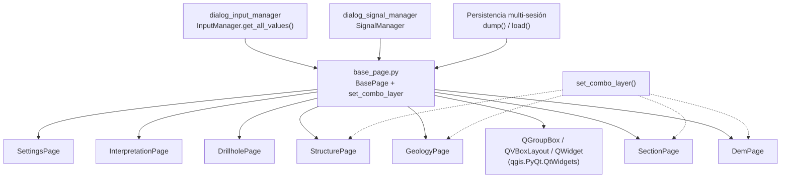

---
tags:
  - secinterp
  - code-walkthrough
  - gui
  - pages
aliases:
  - base_page.py
  - BasePage
  - set_combo_layer
cssclass: secinterp-note
---

# `gui/ui/pages/base_page.py`

> [!abstract] Resumen en una línea
> Contrato visual y de persistencia de todas las páginas del diálogo: `BasePage` fija el esqueleto `get_data/dump/load/reset/validate/connect/disconnect` y `set_combo_layer` permite restaurar combos sin disparar señales.

**Ruta**: `gui/ui/pages/base_page.py` (105 líneas)
**Clase principal**: `BasePage` (`QWidget`) + función `set_combo_layer`
**Capa**: GUI (presentación programática · sin lógica de negocio)
**Tags**: #secinterp #gui #pages

---

## 🎯 ¿Por qué existe este archivo?

Sin una base común, cada página del diálogo (`DemPage`, `SectionPage`, `GeologyPage`,
`StructurePage`, `DrillholePage`, `InterpretationPage`, `SettingsPage`) inventaría su
propia forma de exponer datos, persistir estado y conectar señales, y los managers
(`InputManager`, `SignalManager`, gestor de persistencia) tendrían que tratar cada
página como un caso especial.

| Problema | Solución |
|----------|----------|
| Los managers necesitan leer, guardar, restaurar, validar y (des)conectar cada página de forma uniforme | `BasePage` declara el protocolo `get_data/dump/load/reset/validate/connect_signals/disconnect_signals` |
| Restaurar un `QgsMapLayerComboBox` con `setLayer` dispara `layerChanged` y provoca efectos en cascada (refresco de campos, recálculos) | `set_combo_layer` envuelve `setLayer` con `blockSignals(True/False)` |
| Cada página necesita el mismo contenedor visual (título + widgets arriba) sin repetir `QVBoxLayout` | `_setup_ui` crea `main_layout` + `group_box` + `addStretch()` una sola vez |

> [!important] Nota arquitectónica
> Adapter Extract del lado GUI: la página **extrae** el estado de los widgets QGIS y lo
> entrega como `dict` de primitivos y capas; nunca computa geología. El core
> (`ProjectValidator`, servicios) solo recibe esos dicts ya desacoplados.

---

## 🧬 Diagrama de relaciones



> [!tip] Cómo leer
> Flecha sólida = hereda/importa; punteada = usa el helper o el protocolo sin heredar.

---

## 📦 Imports — lectura arquitectónica

```python
# gui/ui/pages/base_page.py
from __future__ import annotations

from typing import Any

from qgis.PyQt.QtWidgets import QGroupBox, QVBoxLayout, QWidget
```

| # | Observación |
|---|-------------|
| ① | `from __future__ import annotations` — estándar del proyecto para anotaciones diferidas. |
| ② | `typing.Any` es el único tipo importado: los dicts del protocolo mezclan capas, `str`, `bool`, `int` y `float`, así que `dict[str, Any]` es la firma honesta. |
| ③ | Solo importa de `qgis.PyQt.QtWidgets` (contenedores genéricos). No hay `qgis.core` ni `qgis.gui`: la base no conoce combos de capas ni geometrías; eso lo añaden las subclases. |
| ④ | Cero imports de `sec_interp`: la base no depende de nada del plugin, por eso es el fondo del grafo de dependencias de `gui/ui/pages/`. |

---

## 🏗️ Inventario de estructura

**Función de módulo:**

- `set_combo_layer(combo: Any, layer: Any) -> None` — fija la capa seleccionada bloqueando señales.

**Clase `BasePage(QWidget)`:**

- `__init__(self, title: str, parent: QWidget | None = None) -> None`
- `_setup_ui(self) -> None`
- `get_data(self) -> dict[str, Any]` — abstracto por convención (`raise NotImplementedError`)
- `dump(self) -> dict[str, Any]` — base: `return {}`
- `load(self, data: dict[str, Any]) -> None` — base: `pass`
- `reset(self) -> None` — base: `pass`
- `validate(self) -> tuple[bool, str]` — base: `return True, ""`
- `connect_signals(self) -> None` — base: `pass`
- `disconnect_signals(self) -> None` — base: `pass`

**Atributos creados en `_setup_ui`:**

| Atributo | Tipo | Rol |
|----------|------|-----|
| `title` | `str` | Título recibido en el constructor |
| `main_layout` | `QVBoxLayout` | Layout raíz con márgenes a cero |
| `group_box` | `QGroupBox` | Contenedor titulado de la página |
| `group_layout` | `None` | Marcador que cada subclase sustituye por su layout real (`QGridLayout`, `QVBoxLayout`) |

---

## 📁 Páginas que heredan el protocolo

| Página | Título visible | `group_layout` real | Particularidad del protocolo |
|--------|---------------|---------------------|------------------------------|
| [[dem_page]] | Digital Elevation Model | `QGridLayout` | Añade `is_complete()` + `set_auto_ve()` |
| [[section_page]] | Cross Section Line | `QGridLayout` | `is_complete()` sin `ProjectValidator`; sin `connect_signals` |
| [[geology_page]] | Geological Outcrops | `QGridLayout` | Añade señal `dataChanged` |
| [[structure_page]] | Structural Measurements | `QGridLayout` | Conecta señales en `_setup_ui`, no en `connect_signals` |
| [[drillhole_page]] | Drillhole Data | `QVBoxLayout` + `QTabWidget` | Coordina 3 tabs; reemite `dataChanged` |
| [[interpretation_page]] | Interpretation Settings | `QVBoxLayout` | `layer_keys` vacío; valida duplicados |
| [[settings_page]] | Plugin Settings | `QVBoxLayout` + `QTabWidget` | Coordina 2 tabs + info; `validate` siempre ok |

> [!note] `PreviewWidget` ([[preview_page]]) no hereda de `BasePage`
> El widget de preview extiende `QWidget` directamente: no expone `get_data` ni
> `validate`, solo `dump/load/reset` de sus controles. Es un visor, no una página
> de configuración.

---

## 📖 Recorrido método por método

### `set_combo_layer` — restaurar combos sin efectos colaterales

```python
def set_combo_layer(combo: Any, layer: Any) -> None:
    combo.blockSignals(True)
    combo.setLayer(layer)
    combo.blockSignals(False)
```

Rutina de tres líneas que usan los `load()` de [[dem_page]], [[geology_page]],
[[section_page]] y [[structure_page]]. Sin ella, restaurar una sesión dispararía
`layerChanged`, lo que refrescaría los `QgsFieldComboBox` asociados, emitiría
`dataChanged` y podría lanzar recálculos (`_update_resolution` en DEM) con estado
a medio restaurar. El patrón es: bloquear → fijar → desbloquear, sin `try/finally`
porque `setLayer` no lanza en la práctica con capas ya resueltas.

> [!tip] Capas ya resueltas
> El docstring aclara que `load()` recibe objetos `QgsMapLayer` ya resueltos (el
> gestor de persistencia los busca por id antes de llamar a `load`), nunca ids
> crudos. `set_combo_layer` no resuelve nada: solo selecciona en silencio.

### `__init__` — título y construcción diferida

```python
def __init__(self, title: str, parent: QWidget | None = None) -> None:
    super().__init__(parent)
    self.title = title
    self._setup_ui()
```

Guarda el título y delega toda la construcción en `_setup_ui`, que las subclases
extienden llamando a `super()._setup_ui()` primero. Las subclases pasan el título
ya traducido con `QCoreApplication.translate("DemPage", ...)`; la base nunca llama
a `self.tr()` para el título, así cada página controla su contexto de traducción.

### `_setup_ui` — esqueleto visual compartido

```python
def _setup_ui(self) -> None:
    self.main_layout = QVBoxLayout(self)
    self.main_layout.setContentsMargins(0, 0, 0, 0)

    # Main group box
    self.group_box = QGroupBox(self.title)
    self.group_layout = None  # To be set by subclasses

    self.main_layout.addWidget(self.group_box)

    # Add stretch at the bottom to keep widgets at the top
    self.main_layout.addStretch()
```

Crea el layout raíz sin márgenes (la página vive dentro de un `QStackedWidget` que
ya aporta el marco), el `QGroupBox` titulado y un *stretch* final para que los
controles queden anclados arriba. `group_layout = None` es un marcador
intencionado: obliga a cada subclase a instalar su propio layout sobre
`group_box` (`QGridLayout(self.group_box)` lo hace automáticamente).

### `get_data` — lectura (abstracto por convención)

```python
def get_data(self) -> dict[str, Any]:
    raise NotImplementedError("Subclasses must implement get_data()")
```

El único método sin implementación base útil. Cada página devuelve su namespace
plano: DEM usa `raster_layer/selected_band/scale/vertexag/auto_vert_exag`,
geología `outcrop_layer/outcrop_name_field`, etc. `InputManager.get_all_values()`
fusiona esos dicts en el diccionario plano que alimenta a `ValidationParams`.
No usa `abc.ABC` — la abstracción es por convención y mensaje de error, lo que
mantiene la clase instanciable para tests del esqueleto.

### `dump` / `load` — persistencia multi-sesión

```python
def dump(self) -> dict[str, Any]:
    return {}

def load(self, data: dict[str, Any]) -> None:
    pass
```

`dump` devuelve el estado persistible como dict plano: capas como objetos
`QgsMapLayer` (o `None`) y todo lo demás como primitivos. Cada página renombra
sus claves al persistir (`raster_layer` → `dem_layer`, `outcrop_layer` →
`geol_layer`): `get_data` habla el idioma del validador, `dump` el del
almacén de sesiones. `load` aplica con `.get()` defensivo clave por clave y
reaplica efectos derivados (`_on_auto_ve_toggled`, `_update_resolution`).

### `reset` — volver a defecto

```python
def reset(self) -> None:
    pass
```

Cada subclase restaura sus valores iniciales (`setLayer(None)`, spins a
`DialogDefaults`, checkboxes a su defecto) y re-sincroniza toggles derivados.
La base no puede adivinar los defecto, así que es un no-op documentado.

### `validate` — validación ligera por página

```python
def validate(self) -> tuple[bool, str]:
    return True, ""
```

Contrato `(is_valid, error_message)`: DEM y sección exigen su capa
(`"Raster layer is required"`, `"Section line layer is required"`),
interpretación rechaza nombres de campo vacíos o duplicados, y el resto hereda
el ok optimista. Es validación de Nivel 1 (UI); la validación de negocio vive en
`ProjectValidator.validate_all` vía [[dialog_input_manager]].

### `connect_signals` / `disconnect_signals` — higiene de señales

```python
def connect_signals(self) -> None:
    pass

def disconnect_signals(self) -> None:
    pass
```

Toda conexión creada en `connect_signals` debe tener su desconexión espejo: es la
regla anti-fugas que verifica `tests/gui/test_signal_restoration.py`. El patrón
de las subclases es `contextlib.suppress(TypeError, RuntimeError)` alrededor de
cada `disconnect` (desconectar una señal ya desconectada lanza `TypeError` en
PyQt). [[structure_page]] es la excepción: conecta en `_setup_ui` y solo
sobrescribe `disconnect_signals`.

---

## 🔄 Flujo de datos

| Fase | Entrada | Transformación | Salida |
|------|---------|----------------|--------|
| Construcción | `title` traducido + `parent` | `_setup_ui` crea layout + grupo + stretch | Página vacía lista para que la subclase añada widgets |
| Lectura (Extract) | widgets QGIS (`currentLayer()`, `value()`, `isChecked()`) | `get_data()` | `dict[str, Any]` plano por página |
| Agregación | dicts de las 7 páginas | `InputManager.get_all_values()` | dict plano global + `ValidationParams` |
| Persistencia | widgets | `dump()` | dict con capas + primitivos |
| Restauración | dict persistido (capas resueltas) | `load()` + `set_combo_layer` | widgets restaurados sin señales espurias |
| Limpieza | — | `reset()` | widgets a `DialogDefaults` |

---

## 🏛️ Patrones de diseño presentes

| Patrón | Dónde | Propósito |
|--------|-------|-----------|
| **Template Method** | `__init__` → `_setup_ui` | La base fija el esqueleto; la subclase rellena el layout |
| **Contrato / interfaz por convención** | `get_data/dump/load/reset/validate/connect/disconnect` | Uniformidad sin `ABC`; managers polimórficos |
| **Supresión de señales** | `set_combo_layer` (`blockSignals`) | Restaurar estado sin cascadas |
| **Separación Extract/Compute** | `get_data` devuelve datos, nunca calcula | El core valida y computa fuera de la GUI |
| **Null Object** | defaults `{}`, `pass`, `(True, "")` | Páginas simples (settings) heredan lo que no necesitan |

---

## 🧾 Resumen de la API

| Símbolo | Firma / Hereda | Uso típico |
|---------|----------------|------------|
| `set_combo_layer` | `(combo: Any, layer: Any) -> None` | `load()` silencioso en 4 páginas |
| `BasePage` | `(QWidget)` | Base de las 7 páginas de configuración |
| `get_data` | `() -> dict[str, Any]`, lanza `NotImplementedError` | Lectura para `InputManager` |
| `dump` / `load` | `() -> dict` / `(dict) -> None` | Persistencia multi-sesión |
| `reset` | `() -> None` | Restaurar defecto de `DialogDefaults` |
| `validate` | `() -> tuple[bool, str]` | Chequeo ligero por página |
| `connect/disconnect_signals` | `() -> None` | Higiene de señales (anti-fugas) |
| `layer_keys` | `frozenset[str]` (solo subclases) | Claves de capa que persisten por página |

---

## 🛡️ Manejo de errores

La base no lanza ni captura: delega. Tres decisiones defensivas repartidas:

- `get_data` sin implementar falla **fuerte y pronto** con `NotImplementedError` y mensaje que nombra el método, en vez de devolver un dict vacío que corrompería `ValidationParams` en silencio.
- `load` de las subclases usa `data.get(key)` con guarda `is not None` por campo: una sesión antigua sin `auto_vert_exag` se restaura parcialmente en vez de romper.
- `disconnect_signals` traga `TypeError`/`RuntimeError`: desconectar dos veces (reconectar del diálogo + cerrar) es un camino normal, no un error.

---

## 🧪 Tests asociados

No existe un `tests/gui/test_base_page.py` dedicado; el protocolo se verifica a
través de sus consumidoras:

- `tests/gui/test_dem_page.py` — contrato `get_data/dump` de DEM (claves `raster_layer…` / `dem_layer…`) y el toggle Auto/Manual de VE.
- `tests/gui/test_drillhole_page.py` — fusión `get_data/dump/load` de los tres tabs y reemisión de `dataChanged`.
- `tests/gui/test_settings_page.py` — `get_data` fusionado default + advanced y persistencia `QgsSettings`.
- `tests/gui/test_signal_restoration.py` — `test_page_signals_survive_connect_all`: las señales de las páginas sobreviven a reconexiones del diálogo; incluye lógica de conexión del widget de preview.
- `tests/gui/test_dialog_input_manager.py` — `InputManager` consume `get_data()` de cada página sin conocer su clase.
- `tests/gui/test_multi_session_persistence.py` — round-trip `dump/load` a nivel de diálogo.

> [!note] Hueco honesto de cobertura
> `set_combo_layer` no tiene test unitario propio (bloquear señales con mocks de
> `QgsMapLayerComboBox` sería trivial con `blockSignals` espiado). Las páginas sin
> archivo dedicado ([[geology_page]], [[structure_page]], [[section_page]],
> [[interpretation_page]], [[preview_page]]) solo están cubiertas por los tests de
> diálogo e input manager.

---

## 🌐 i18n y notas de migración

- La base no traduce nada: recibe el `title` ya traducido (`QCoreApplication.translate("DemPage", …)`), así el contexto Qt de cada página se conserva.
- Los mensajes de `validate` sí usan `self.tr(...)` en cada subclase (`"Raster layer is required"`…), por lo que aparecen en el catálogo de traducción.
- A QGIS 4.x: solo usa `QGroupBox/QVBoxLayout/QWidget` de `qgis.PyQt`, widgets estables entre versiones; ningún cambio previsto.

---

## 👀 Observaciones y notas

> [!success] Fortalezas
> - Protocolo mínimo y completo: 7 métodos cubren lectura, persistencia, validación y ciclo de señales sin acoplar a ningún manager.
> - `set_combo_layer` elimina una categoría entera de bugs de restauración (cascadas de `layerChanged`) con tres líneas.
> - Cero dependencias del plugin: es el fondo del grafo, imposible de romper por ciclos de importación.

> [!warning] Puntos de atención
> - `get_data` es abstracto por convención, no por `ABC`: instanciar `BasePage` directamente compila y solo falla al leer. Un `@abstractmethod` lo haría explícito.
> - `load` sin `try/finally` en `set_combo_layer`: si `setLayer` lanzara, las señales quedarían bloqueadas. Riesgo bajo con capas resueltas, pero real.
> - Asimetría en [[structure_page]] (conecta en `_setup_ui`, no en `connect_signals`): el `SignalManager` debe conocer la excepción o habrá doble conexión.
> - `DemPage.__init__` asigna `self.iface = iface` dos veces (antes y después de `super().__init__`): inofensivo pero redundante.

> [!question] Preguntas abiertas
> - ¿Migrar el contrato a `ABC` con `get_data` abstracto para fallar en construcción en vez de en lectura?
> - ¿Añadir `is_complete()` a la base (hoy solo existe en 5 páginas con firmas distintas) para unificar el estado del sidebar?

---

## 🔗 Notas relacionadas

- [[Index]] — índice de la bóveda
- [[gui_ui_pages]] — nota del paquete `gui/ui/pages/` y su rol en la ventana
- [[main_window]] — ensambla las 7 páginas en el `QStackedWidget` con el sidebar
- [[sidebar]] — navegación lateral que conmuta las páginas
- [[dialog_input_manager]] — agrega `get_data()` y valida con `ProjectValidator`
- [[project_validator]] — validación de negocio sobre los dicts extraídos
- [[dem_page]] / [[section_page]] / [[geology_page]] / [[structure_page]] — páginas simples del protocolo
- [[drillhole_page]] / [[settings_page]] — páginas coordinadoras del protocolo
- [[preview_page]] — el widget que deliberadamente no hereda de `BasePage`

---

*Nota de la bóveda SecInterp Code Walkthrough v2 — v3.9.0*
