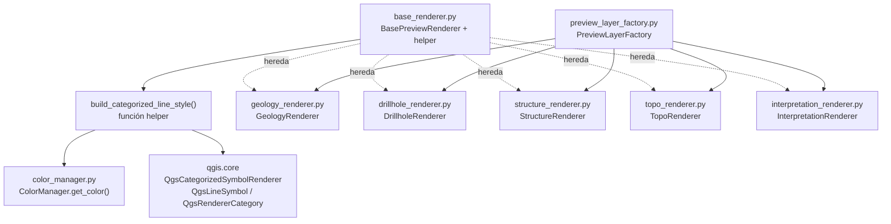

---
tags:
  - secinterp
  - code-walkthrough
  - gui
  - renderers
aliases:
  - base_renderer.py
  - BasePreviewRenderer
  - build_categorized_line_style
cssclass: secinterp-note
---

# `gui/renderers/base_renderer.py`

> [!abstract] Resumen en una línea
> Define el contrato `BasePreviewRenderer.apply_style()` y el helper `build_categorized_line_style()`: la base polimórfica sobre la que los cinco renderers del preview aplican simbología QGIS sin duplicar código.

**Ruta**: `gui/renderers/base_renderer.py` (60 líneas)
**Clase/Función principal**: `BasePreviewRenderer` / `build_categorized_line_style()`
**Capa**: GUI · Present (aplica simbología a `QgsVectorLayer` ya creadas)
**Tags**: #secinterp #gui #renderers

---

## 🎯 ¿Por qué existe este archivo?

Sin una base común, cada renderer del preview (geología, sondajes, estructuras, topo, interpretaciones) construiría su propia simbología categorizada con código copiado.

| Problema | Solución |
|----------|----------|
| Cinco renderers necesitan estilo categorizado por unidad con colores consistentes | `build_categorized_line_style()` centraliza la construcción del `QgsCategorizedSymbolRenderer` |
| `PreviewLayerFactory` debe tratar todos los renderers de forma uniforme | `BasePreviewRenderer` (ABC) fija el contrato `apply_style(layer, **kwargs)` |
| Los colores por unidad deben ser estables entre capas y sesiones | El helper delega en `ColorManager.get_color()` en vez de elegir colores ad hoc |

> [!important] Nota arquitectónica
> Este módulo vive en el lado **Present** del patrón Extract-then-Compute: no calcula nada geológico, solo viste capas de memoria ya construidas por `PreviewLayerFactory`. Es un contrato **Strategy**: la factory conserva una instancia por entidad y la invoca polimórficamente.

---

## 🧬 Diagrama de relaciones



> [!tip] Cómo leer
> Flecha sólida = importa/delega; punteada = herencia del contrato ABC. `PreviewLayerFactory` es el único consumidor directo: instancia un renderer por entidad y lo invoca vía `apply_style()`.

---

## 📦 Imports — lectura arquitectónica

```python
# gui/renderers/base_renderer.py
from __future__ import annotations

from abc import ABC, abstractmethod
from collections.abc import Iterable
from typing import Any

from qgis.core import (
    QgsCategorizedSymbolRenderer,
    QgsLineSymbol,
    QgsRendererCategory,
    QgsVectorLayer,
)
```

| # | Observación |
|---|-------------|
| ① | `from __future__ import annotations` — estándar del proyecto para posponer la evaluación de anotaciones. |
| ② | `ABC` + `abstractmethod` — el contrato es **nominal**: solo se cumple heredando. Contrasta con `ICacheService` del core, que es `Protocol` estructural. |
| ③ | `Iterable[str]` (de `collections.abc`, no `typing`) — acepta `set`, `list` o cualquier iterable de unidades; los llamadores pasan `unique_units: set[str]`. |
| ④ | `color_manager: Any` — tipado intencionalmente laxo para no acoplar el helper a la clase concreta `ColorManager`; basta con que exponga `get_color(name)`. Es duck typing documentado en el docstring. |
| ⑤ | Cuatro imports de `qgis.core` y **ninguno** de `qgis.gui` — estiliza capas de datos, no widgets. Correcto para un renderer del preview. |

---

## 🏗️ Inventario de estructura

**Funciones (1):**

| Función | Firma | Rol |
|---------|-------|-----|
| `build_categorized_line_style` | `(color_manager: Any, unique_units: Iterable[str], field: str = "unit", width: str = "0.7", capstyle: str = "round", joinstyle: str = "round") -> QgsCategorizedSymbolRenderer` | Construye un renderer categorizado de líneas por unidad |

**Clases (1):**

| Clase | Hereda | Miembros |
|-------|--------|----------|
| `BasePreviewRenderer` | `ABC` | `apply_style()` (abstracto) |

**Cómo implementa cada hijo el contrato:**

| Renderer | Usa el helper | Estilo propio |
|----------|:---:|---|
| `GeologyRenderer` | Sí (defaults `field="unit"`, `width="0.7"`) | — |
| `DrillholeRenderer` | Sí, solo para `role="interval"` (`width="2.0"`, `flat`/`bevel`) | Traza: `QgsSingleSymbolRenderer` gris + etiquetas `hole_id` |
| `StructureRenderer` | No | Línea simple roja `204,0,0` |
| `TopoRenderer` | No | Graduado por `elev` con rampa `Spectral`/`RdYlGn`, 8 clases |
| `InterpretationRenderer` | No (categorizado de **relleno** por `id`) | `QgsFillSymbol` con color propio del polígono |

---

## 📁 Archivos del paquete

| Archivo | Líneas | Rol |
|---|--:|---|
| `base_renderer.py` | 60 | Contrato ABC + helper categorizado (esta nota) |
| `color_manager.py` | 48 | `ColorManager`: paleta determinista de 16 colores + caché `_active_units` |
| `geology_renderer.py` | 29 | `GeologyRenderer`: categorizado por `unit` con defaults del helper |
| `drillhole_renderer.py` | 71 | `DrillholeRenderer`: traza gris etiquetada + intervalos categorizados |
| `structure_renderer.py` | 18 | `StructureRenderer`: línea roja simple para buzamientos |
| `topo_renderer.py` | 32 | `TopoRenderer`: graduado policromático por `elev` |
| `interpretation_renderer.py` | 43 | `InterpretationRenderer`: relleno categorizado por `id` con color propio |
| `__init__.py` | — | Marcador de paquete |

---

## 📖 Recorrido método por método

### `build_categorized_line_style(...)`

```python
def build_categorized_line_style(
    color_manager: Any,
    unique_units: Iterable[str],
    field: str = "unit",
    width: str = "0.7",
    capstyle: str = "round",
    joinstyle: str = "round",
) -> QgsCategorizedSymbolRenderer:
    categories = []
    for unit_name in unique_units:
        color = color_manager.get_color(unit_name)
        symbol = QgsLineSymbol.createSimple(
            {
                "color": f"{color.red()},{color.green()},{color.blue()}",
                "width": width,
                "capstyle": capstyle,
                "joinstyle": joinstyle,
            }
        )
        categories.append(QgsRendererCategory(unit_name, symbol, unit_name))
    return QgsCategorizedSymbolRenderer(field, categories)
```

Un bucle por unidad: pide el `QColor` al manager, lo serializa a `"r,g,b"` (el formato que `createSimple` entiende), crea un `QgsLineSymbol` y lo envuelve en `QgsRendererCategory(valor, símbolo, etiqueta)`. Los tres argumentos de la categoría usan `unit_name`, de modo que valor, símbolo y etiqueta de leyenda coinciden. Los parámetros `width`/`capstyle`/`joinstyle` viajan como cadenas porque así los espera el diccionario de propiedades de `createSimple`.

> [!note] Sin orden garantizado
> Si `unique_units` es un `set`, el orden de categorías varía entre ejecuciones. No afecta al render (cada categoría casa por valor de atributo), pero la leyenda puede listar las unidades en distinto orden. `GeologyRenderer` y `DrillholeRenderer` pasan el `set` tal cual.

### `BasePreviewRenderer.apply_style(...)`

```python
class BasePreviewRenderer(ABC):
    """Base class for all preview layer renderers."""

    @abstractmethod
    def apply_style(self, layer: QgsVectorLayer, **kwargs) -> None:
        """Apply symbology and settings to the given layer."""
        pass
```

Contrato mínimo y deliberadamente abierto: la capa más `**kwargs` específicos de cada entidad (`role`, `unique_units`, `interp_data`). Cada hijo interpreta los kwargs que necesita e ignora el resto, lo que permite a `PreviewLayerFactory` llamar a todos con la misma forma sin `isinstance`.

> [!tip] Dónde se invoca
> `PreviewLayerFactory` conserva una instancia por renderer (`self.geol_renderer`, `self.drill_renderer`, …) y llama `apply_style()` justo después de crear cada memory layer. Ver [[preview_layer_factory]] y [[gui_renderers]].

### Lo que la ABC prohíbe (y el error que verás)

```python
>>> from sec_interp.gui.renderers.base_renderer import BasePreviewRenderer
>>> BasePreviewRenderer()
TypeError: Can't instantiate abstract class BasePreviewRenderer
  without an implementation for abstract method 'apply_style'
```

La ABC no es instanciable: cualquier subclase que olvide `apply_style()` falla al crearla, no al estilizar. Es el chequeo más barato del plugin contra renderers incompletos.

| Hijo | Firma real de `apply_style()` | Kwargs que interpreta |
|------|-------------------------------|-----------------------|
| `GeologyRenderer` | `(layer, **kwargs)` | `unique_units` |
| `DrillholeRenderer` | `(layer, **kwargs)` | `role`, `unique_units` |
| `StructureRenderer` | `(layer, **kwargs)` | ninguno (estilo fijo) |
| `TopoRenderer` | `(layer, **kwargs)` | ninguno (lee `elev` de la capa) |
| `InterpretationRenderer` | `(layer, **kwargs)` | `interp_data` |

> [!note] Firmas idénticas, cuerpos distintos
> Todos los hijos repiten literalmente `(self, layer, **kwargs)` para que la factory los llame sin bifurcar. La variación vive dentro, no en la firma.

---

## 🔄 Flujo de datos

| Fase | Entrada | Transformación | Salida |
|------|---------|----------------|--------|
| Petición | `unique_units` + `color_manager` | `get_color()` por unidad → `"r,g,b"` | `QgsLineSymbol` por unidad |
| Categorización | símbolos + `field` | `QgsRendererCategory(valor, símbolo, etiqueta)` por unidad | `QgsCategorizedSymbolRenderer` |
| Aplicación | renderer + `QgsVectorLayer` | hijo invoca `layer.setRenderer(...)` | capa estilizada en el canvas |

---

## 🏛️ Patrones de diseño presentes

| Patrón | Dónde | Propósito |
|--------|-------|-----------|
| **Template / Strategy (contrato ABC)** | `BasePreviewRenderer.apply_style()` | Intercambiar renderers por entidad con una sola interfaz |
| **Helper / Factory function** | `build_categorized_line_style()` | Reutilizar la construcción del renderer categorizado |
| **Dependency Inversion (duck typing)** | `color_manager: Any` | Depender de `get_color()`, no de la clase concreta |
| **Parameter Object (kwargs)** | `apply_style(layer, **kwargs)` | Unificar la llamada aunque cada entidad necesite datos distintos |

---

## 🧾 Resumen de la API

| Símbolo | Firma / Hereda | Uso típico |
|---------|----------------|------------|
| `build_categorized_line_style` | `(manager, units, field="unit", ...) -> QgsCategorizedSymbolRenderer` | `layer.setRenderer(build_categorized_line_style(cm, units))` |
| `BasePreviewRenderer` | `ABC` | Heredar e implementar `apply_style()` |
| `BasePreviewRenderer.apply_style` | `(layer: QgsVectorLayer, **kwargs) -> None` | Punto polimórfico invocado por la factory |

---

## 🛡️ Manejo de errores

El módulo **no contiene `try/except`**: delega los fallos a QGIS y a los llamadores. Casos a conocer:

| Situación | Comportamiento |
|-----------|----------------|
| `unique_units` vacío | Devuelve un `QgsCategorizedSymbolRenderer` sin categorías; la capa queda sin símbolos visibles |
| `unit_name` sin color registrado | `ColorManager.get_color()` asigna uno determinista por hash y lo cachea; nunca devuelve `None` |
| `color_manager` sin método `get_color` | `AttributeError` en tiempo de ejecución (precio del duck typing) |
| Capa inválida en `setRenderer` | El error lo gestiona el llamador (`PreviewLayerFactory` / `PreviewRenderer`) |

> [!warning] Sin validación defensiva
> El helper no comprueba `field` contra los campos reales de la capa. Un `field` inexistente produce un renderer que no casa ninguna entidad (capa vacía visualmente, sin excepción). La factory siempre pasa campos que ella misma creó, así que el riesgo es bajo.

---

## 🧪 Tests asociados

No existe un test dedicado a `build_categorized_line_style()` ni a la ABC; el contrato se verifica a través de sus hijos con mocks (Mock-first, sin QGIS real):

- `tests/gui/renderers/test_renderers.py::TestDrillholeRenderer::test_apply_trace_style` — `apply_style(role="trace")` llama `setRenderer` una vez, más `setLabeling` y `setLabelsEnabled(True)`.
- `tests/gui/renderers/test_renderers.py::TestDrillholeRenderer::test_apply_interval_style` — `apply_style(role="interval", unique_units={"LithA", "LithB"})` llama `setRenderer` una vez y `get_color` exactamente 2 veces (una por unidad).
- `tests/gui/renderers/test_renderers.py::TestTopoRenderer::test_apply_style` — verifica `setRenderer` en el hijo graduado que **no** usa el helper.

En `tests/core/` no hay nada aplicable: este módulo importa `qgis.core` y pertenece a la capa GUI.

---

## 👀 Observaciones y notas

> [!success] Fortalezas
> - Contrato de un solo método: fácil de implementar y de mockear en tests.
> - El helper elimina la duplicación del renderer categorizado en geología y sondajes.
> - `ColorManager` inyectado como dependencia blanda: los hijos reciben el mismo manager desde la factory y los colores quedan consistentes entre capas.

> [!warning] Puntos de atención
> - `width` tipado como `str` (no `float`): coherente con `createSimple`, pero propenso a errores silenciosos si alguien pasa un número.
> - Orden de categorías no determinista cuando `unique_units` es un `set`; la leyenda puede reordenarse entre sesiones.
> - `StructureRenderer`, `TopoRenderer` e `InterpretationRenderer` no reutilizan el helper: cada uno justifica su estilo propio, pero un lector nuevo puede esperar lo contrario.

> [!question] Preguntas abiertas
> - ¿Convendría ordenar `unique_units` dentro del helper para estabilizar la leyenda?
> - ¿Tipar `color_manager` con un `Protocol` con `get_color()` en vez de `Any`, siguiendo el ejemplo de `ICacheService` del core?

---

## 🔗 Notas relacionadas

- [[Index]] — índice de la bóveda
- [[gui_renderers]] — nota de familia de todos los renderers del preview
- [[preview_layer_factory]] — único consumidor: instancia los renderers y los invoca
- [[drillhole_renderer]] — hijo que combina el helper (intervalos) con estilo propio (trazas)
- [[preview_renderer]] — orquesta capas, leyenda y limpieza del preview
- [[controller]] — produce los datos que la factory convierte en capas antes de estilizar

---

*Nota de la bóveda SecInterp Code Walkthrough v2 — v3.8.0*
