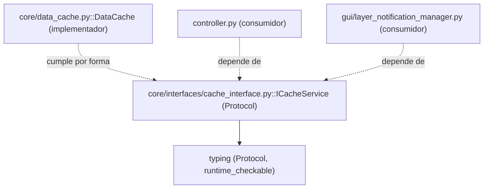

---
tags:
  - secinterp
  - code-walkthrough
  - core
  - interfaces
  - ports
aliases:
  - cache_interface.py
  - ICacheService
cssclass: secinterp-note
---

# `core/interfaces/cache_interface.py`

> [!abstract] Resumen en una línea
> Define `ICacheService`, el **contrato (Protocol) del caché** del core: 5 métodos (`get`, `set`, `invalidate`, `clear`, `get_metadata`) con tipado **estructural** y `runtime_checkable`.

**Ruta**: `core/interfaces/cache_interface.py` (62 líneas)
**Clase/Función principal**: `ICacheService`
**Capa**: Core (QGIS-agnóstico)
**Tags**: #secinterp #core #interfaces #ports

---

## 🎯 ¿Por qué existe este archivo?

El `controller` y el `layer_notification_manager` necesitan un caché, pero no deben
acoplarse a una implementación concreta. `ICacheService` declara **qué** debe saber hacer un
caché, para que consumidores dependan del contrato y no de `DataCache`:

| Problema | Solución |
|----------|----------|
| Acoplar consumidores a `DataCache` | Depender de `ICacheService` (abstracción) |
| Poder sustituir/mockear el caché | `Protocol` (tipado estructural) |
| Verificar en runtime que un objeto cumple el contrato | `@runtime_checkable` |
| Unificar la semántica de invalidación | `invalidate(bucket, key)` granular |

> [!important] Nota arquitectónica — `Protocol`, no `ABC`
> `ICacheService` es el **único** contrato del core que usa `Protocol` (el resto son `ABC`).
> Con `Protocol`, cualquier clase que tenga esos métodos cumple el contrato **sin heredar**.
> `runtime_checkable` habilita `isinstance(obj, ICacheService)` en tiempo de ejecución.

---

## 🧬 Diagrama de relaciones



> [!tip] Cómo leer
> Sólida = importa (`typing`). Punteada = cumplimiento/dependencia: `DataCache` **cumple**
> el contrato sin heredar, y los consumidores dependen del contrato (no de `DataCache`).

---

## 📦 Imports — lectura arquitectónica

```python
# core/interfaces/cache_interface.py
from __future__ import annotations

from typing import Any, Protocol, runtime_checkable
```

| # | Observación |
|---|-------------|
| ① | `Protocol` — base para tipado estructural (no exige herencia). |
| ② | `runtime_checkable` — decorador que permite `isinstance` en runtime. |
| ③ | `Any` — tipos genéricos para claves/datos (sin importar DTOs ni QGIS). |

---

## 🏗️ Inventario de estructura

**Clases:** `class ICacheService(Protocol)` — 5 métodos (todos con cuerpo `...`)

**Métodos:**
- `get(bucket, key)`, `set(bucket, key, data, metadata=None)`
- `invalidate(bucket=None, key=None)`, `clear()`, `get_metadata(bucket, key)`

---

## 📁 Archivos del paquete

- `cache_interface.py` — nota individual de este archivo (el paquete `core/interfaces/` tiene su nota en [[core_interfaces]]).

---

## 📖 Recorrido método por método

### `ICacheService` — declaración

```python
@runtime_checkable
class ICacheService(Protocol):
    """Abstract protocol for the Processing Data Cache Service."""
    ...
```

El decorador `@runtime_checkable` (solo válido sobre `Protocol`) hace que
`isinstance(obj, ICacheService)` compruebe en runtime si `obj` tiene los métodos
requeridos. Los métodos llevan cuerpo `...` (ellipsis): son **firmas**, no implementación.

### `get(bucket, key)`

```python
def get(self, bucket: str, key: str) -> Any | None:
    """Retrieve data from a specific cache bucket.

    Args:
        bucket: The cache category (e.g., 'topo', 'geol').
        key: Unique key for the parameter set.

    Returns:
        The cached data or None if not found or expired.
    """
    ...
```

Recupera datos de un bucket. Devuelve `Any | None` (`None` si no existe o expiró). El
docstring establece el contrato de buckets (`topo`, `geol`, …) y de claves.

### `set(bucket, key, data, metadata=None)`

```python
def set(self, bucket: str, key: str, data: Any, metadata: dict | None = None) -> None:
    """Store data in a specific cache bucket.

    Args:
        bucket: The cache category.
        key: Unique key for the parameter set.
        data: The data to cache.
        metadata: Optional metadata (e.g., TTL, LOD info).
    """
    ...
```

Almacena datos con **metadatos opcionales** (`dict | None`), pensados para TTL e info de
LOD. El contrato no especifica la forma de los metadatos (lo deja a la implementación).

### `invalidate(bucket=None, key=None)`

```python
def invalidate(self, bucket: str | None = None, key: str | None = None) -> None:
    """Invalidate cache entries.

    Args:
        bucket: If provided, only invalidate this bucket.
        key: If provided, only invalidate this specific key.
    """
    ...
```

Invalidación **granular**: sin argumentos limpia todo; con `bucket` limpia un bucket; con
`key` borra una entrada. Es la firma más rica del contrato.

### `clear()`

```python
def clear(self) -> None:
    """Clear the entire cache."""
    ...
```

Atajo para vaciar todo el caché. En la práctica (`DataCache`) delega en `invalidate()`.

### `get_metadata(bucket, key)`

```python
def get_metadata(self, bucket: str, key: str) -> dict[str, Any] | None:
    """Retrieve metadata for a cached entry.

    Args:
        bucket: The cache category.
        key: Unique key for the entry.

    Returns:
        Dictionary containing entry metadata or None if not found.
    """
    ...
```

Lee solo los metadatos de una entrada (sin recuperar los datos). Permite al consumidor
consultar el estado (p. ej. LOD) sin coste de deserialización.

---

## 🔄 Flujo de datos

| Fase | Entrada | Transformación | Salida |
|------|---------|----------------|--------|
| Contrato | — (solo firma) | declaración de forma | — |
| Implementación | `bucket, key, data, metadata` | `DataCache` (`get`/`set`/…) | `data` / `None` |

---

## 🏛️ Patrones de diseño presentes

| Patrón | Dónde | Propósito |
|--------|-------|-----------|
| **Port / Adapter** | `ICacheService` | Desacoplar el caché de su implementación |
| **Protocol (structural typing)** | `typing.Protocol` | Contrato sin herencia obligatoria |
| **Dependency Inversion** | consumidores | Depender de la abstracción |

---

## 🔬 `Protocol` vs `ABC` — criterio de elección

`ICacheService` es el único `Protocol` del core; el resto de contratos (`IDrillholeService`,
etc.) son `ABC`. La diferencia:

| Criterio | `Protocol` (`ICacheService`) | `ABC` (resto) |
|----------|------------------------------|----------------|
| Tipado | Estructural (basta la forma) | Nominal (exige heredar) |
| Herencia | No requerida | Obligatoria |
| `isinstance` | Solo con `runtime_checkable` | Siempre |
| Cuándo usarlo | Sustituibles por composición (caché, mocks) | Contratos de servicio con firma rígida |

> [!note] Por qué el caché es `Protocol`
> Un caché es un **detalle de infraestructura** que conviene poder mockear o sustituir
> trivialmente (p. ej. un `NullCache` en tests). `Protocol` permite que cualquier clase con
> los 5 métodos sea válida, sin forzar una jerarquía de herencia.

---

## 🧾 Resumen de la API

| Símbolo | Firma / Hereda | Uso típico |
|---------|----------------|------------|
| `ICacheService` | `Protocol` (`runtime_checkable`) | Contrato del caché |
| `ICacheService.get` | `(bucket, key) -> Any \| None` | Recuperar datos |
| `ICacheService.set` | `(bucket, key, data, metadata=None) -> None` | Almacenar |
| `ICacheService.invalidate` | `(bucket=None, key=None) -> None` | Invalidar |
| `ICacheService.clear` | `() -> None` | Vaciar todo |
| `ICacheService.get_metadata` | `(bucket, key) -> dict \| None` | Leer metadatos |

---

## 🛡️ Manejo de errores

El contrato **no maneja errores**: solo declara firmas. El contrato implícito es que un
implementador devuelve `None` ante ausencia (en `get`/`get_metadata`) y no lanza ante
bucket/clave inexistentes. `DataCache` cumple esto por diseño (ver [[data_cache]]).

---

## 🧪 Tests asociados

El contrato no se testea directamente, sino su implementación:

- `tests/core/test_data_cache_fix.py` — verifica que `DataCache` cumple el contrato
  (`get`/`set`/`invalidate`).

> [!note] Verificación de conformidad
> La conformidad con el `Protocol` puede verificarse con
> `isinstance(DataCache(), ICacheService)` (gracias a `runtime_checkable`), aunque el test
> actual lo hace de forma indirecta (round-trip de `get`/`set`).

---

## 👀 Observaciones y notas

> [!success] Fortalezas
> - Tipado estructural: mocks y sustitutos triviales sin jerarquía de herencia.
> - `runtime_checkable` habilita `isinstance` en runtime.
> - Docstrings completos con el contrato de buckets y claves.

> [!warning] Puntos de atención
> - Retornos `Any | None` diluyen el tipado (podrían ser tipos más concretos).
> - `metadata: dict | None` sin schema: el consumidor conoce las claves por convención
>   (`ttl`, LOD).
> - Inconsistencia con el resto de contratos (que son `ABC`).

> [!question] Preguntas abiertas
> - ¿Tipar `metadata` como `TypedDict` (`{"ttl": int, "lod": ...}`)?
> - ¿Unificar todos los contratos a `Protocol` (o a `ABC`) para consistencia?

---

## 🔗 Notas relacionadas

- [[Index]] — índice de la bóveda
- [[data_cache]] — `DataCache` (implementador del contrato)
- [[core_interfaces]] — paquete de contratos (el resto son `ABC`)
- [[controller]] — consumidor del caché
- [[layer_core_interfaces]] — nota de capa de interfaces

---

*Nota de la bóveda SecInterp Code Walkthrough v2 — v3.9.1*
