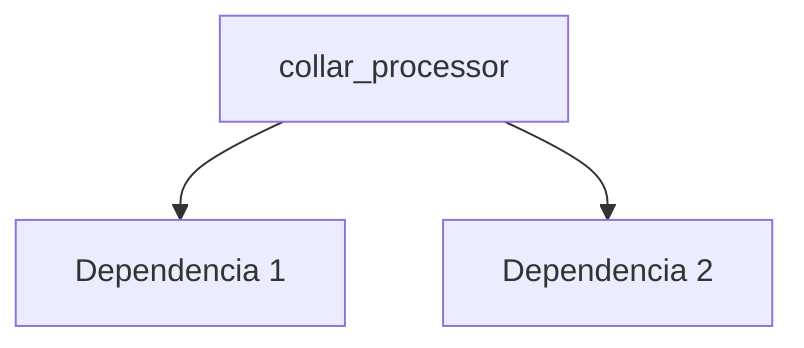

---
tags:
  - secinterp
  - code-walkthrough
  - core      # core | gui | exporters
  - processors     # services | managers | renderers | adapters | validation | etc.
aliases:
  - collar_processor.py  # ej. path_resolver.py
  - collar_processor     # ej. resolve_export_path
cssclass: secinterp-note
# note_lines: 700      # opcional: tope > 500 para módulos de importancia alta (máx 700)
---

# `core/services/drillhole/collar_processor.py`

> [!abstract] Resumen en una línea
> Processing logic for Drillhole Collars (pure computation). — qué hace este módulo en una frase, sin tocar QGIS si es core.

**Ruta**: `core/services/drillhole/collar_processor.py` (100 líneas)
**Clase/Función principal**: `collar_processor`
**Capa**: core (QGIS-agnóstico / GUI · Tipo)
**Tags**: #secinterp #core #processors

---

## 🎯 ¿Por qué existe este archivo?

| Problema | Solución |
|----------|----------|
| (pendiente) | (pendiente) |
| (pendiente) | (pendiente) |

> [!important] Nota arquitectónica
> QGIS-agnóstico (p. ej. "QGIS-agnóstico", "Adapter Extract", "Factory").

---

## 🧬 Diagrama de relaciones



> [!tip] Cómo leer
> Flecha sólida = importa/delega; punteada = callback/injectado.

---

## 📦 Imports — lectura arquitectónica

```python
# collar_processor.py
from __future__ import annotations
import contextlib
from typing import Any
from sec_interp.core.domain import DrillholeProjection
from sec_interp.core.services.drillhole.projection_engine import ProjectionEngine
```

| # | Observación |
|---|-------------|
| ① | (pendiente) |
| ② | (pendiente) |

---

## 🏗️ Inventario de estructura

**Clases:** `class CollarProcessor` — 4 métodos
**Funciones/Métodos:**
- `CollarProcessor.extract_and_project_detached(def extract_and_project_detached(self, collar_data: dict[str, Any], line_points: list[tuple[float, float]], buffer_width: float, collar_id_field: str, collar_z_field: str, collar_depth_field: str, pre_sampled_z: dict[Any, float] | None=None) -> DrillholeProjection | None:)`
- `CollarProcessor.build_coordinate_map(def build_coordinate_map(self, collar_data: list[dict[str, Any]]) -> dict[Any, tuple[float, float]]:)`
- `CollarProcessor._extract_z(def _extract_z(self, attrs: dict[str, Any], z_field: str, hole_id: Any, pre_sampled: dict[Any, float] | None) -> float:)`
- `CollarProcessor._extract_depth(def _extract_depth(self, attrs: dict[str, Any], depth_field: str) -> float:)`

---

## 📁 Archivos del paquete

- `collar_processor.py` — nota individual de este archivo.

---

## 📖 Recorrido método por método

### `método_1`

```python
# (enriquecer)
```

_(enriquecer leyendo el fuente)_

### `método_2`

```python
# (enriquecer)
```

_(enriquecer leyendo el fuente)_

<!-- Añade una subsección por cada método público del módulo -->

---

## 🔄 Flujo de datos

| Fase | Entrada | Transformación | Salida |
|------|---------|----------------|--------|
| - | - | - | - |
| - | - | - | - |

---

## 🏛️ Patrones de diseño presentes

| Patrón | Dónde | Propósito |
|--------|-------|-----------|
| - | - | - |

---

## 🧾 Resumen de la API

| Símbolo | Firma / Hereda | Uso típico |
|---------|----------------|------------|
| (no symbols) | `-` | - |

---

## 🛡️ Manejo de errores

_(pendiente)_

---

## 🧪 Tests asociados

_(pendiente)_

---

## 👀 Observaciones y notas

> [!success] Fortalezas
> - (skeleton)

> [!warning] Puntos de atención
> - (skeleton)

> [!question] Preguntas abiertas
> - (skeleton)

---

## 🔗 Notas relacionadas

- [[Index]] — índice de la bóveda
- [[Index]] — índice
- [[controller]] — orquestador

---

*Nota de la bóveda SecInterp Code Walkthrough v2 — v3.8.0*
