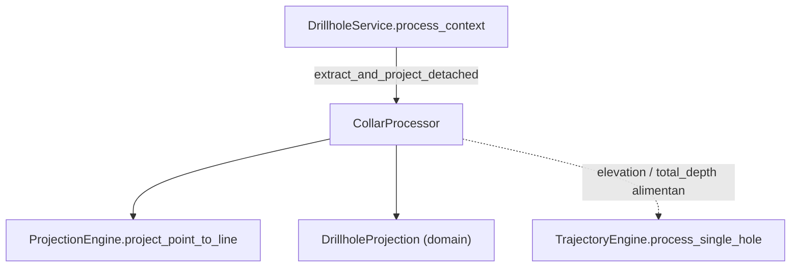

---
tags:
  - secinterp
  - code-walkthrough
  - core
  - processors
aliases:
  - collar_processor.py
  - CollarProcessor
cssclass: secinterp-note
---

# `core/services/drillhole/collar_processor.py`

> [!abstract] Resumen en una línea
> Procesador **puro** que proyecta el *collar* (embocadura) de un sondaje sobre la línea de sección y extrae su elevación y profundidad total desde datos desacoplados, devolviendo un `DrillholeProjection` o `None` si el collar queda fuera del buffer.

**Ruta**: `core/services/drillhole/collar_processor.py` (100 líneas)
**Clase/Función principal**: `CollarProcessor`
**Capa**: Core (QGIS-agnóstico)
**Tags**: #secinterp #core #processors

---

## 🎯 ¿Por qué existe este archivo?

Un collar no llega al core como un objeto QGIS, sino como un diccionario suelto
`{"id", "point", "attributes"}` (salida de la fase Extract). Alguien tiene que
convertir ese dict en una proyección sobre la sección y decidir si el sondaje está
lo bastante cerca como para dibujarse:

| Problema | Solución |
|----------|----------|
| El collar es un dict heterogéneo, no una entidad tipada | `extract_and_project_detached` normaliza a `DrillholeProjection` |
| La elevación puede venir del campo o de un muestreo previo | `_extract_z` con fallback a `pre_sampled_z` |
| Hay que descartar collares lejanos a la sección | comparación `offset <= buffer_width` → `None` |

> [!important] Nota arquitectónica
> **QGIS-agnóstico** y sin estado: la clase no guarda nada entre llamadas y recibe
> todo por parámetros. El `point` se consume por duck-typing (tupla `(x, y)`), así
> que `CollarProcessor` nunca importa `qgis.core`. Es el primer eslabón del pipeline
> `collar → trayectoria → intervalos` orquestado por [[drillhole_service]].

---

## 🧬 Diagrama de relaciones



> [!tip] Cómo leer
> Flecha sólida = importa/delega; punteada = el resultado (`DrillholeProjection`)
> se consume aguas abajo. `CollarProcessor` depende de `ProjectionEngine` y del
> DTO del dominio, pero **nadie depende de él** salvo el servicio orquestador.

---

## 📦 Imports — lectura arquitectónica

```python
# collar_processor.py
from __future__ import annotations

import contextlib
from typing import Any

from sec_interp.core.domain import DrillholeProjection
from sec_interp.core.services.drillhole.projection_engine import ProjectionEngine
```

| # | Observación |
|---|-------------|
| ① | `contextlib.suppress(ValueError, TypeError)` — conversión a `float` tolerante a cadenas sucias o campos ausentes. |
| ② | `DrillholeProjection` importado desde `core.domain`: el retorno es un DTO puro, no un objeto QGIS. |
| ③ | `ProjectionEngine` es la única dependencia interna de servicio: delega la trigonometría, no la duplica. |
| ④ | `Any` aparece en el `dict` de collar y en `hole_id`: el módulo acepta IDs de cualquier tipo (str, int). |

> [!note] Dependencia mínima
> Solo dos imports de dominio y una utilidad propia. Sin `math`, sin `typing` extra
> y, sobre todo, sin `qgis.*`. El cálculo geométrico vive en [[core_services_drillhole]]
> (`projection_engine.py`), no aquí.

---

## 🏗️ Inventario de estructura

**Clases:** `class CollarProcessor` — 4 métodos (2 públicos + 2 privados)

**Funciones/Métodos:**
- `extract_and_project_detached(collar_data, line_points, buffer_width, collar_id_field, collar_z_field, collar_depth_field, pre_sampled_z=None) -> DrillholeProjection | None`
- `build_coordinate_map(collar_data: list[dict]) -> dict[Any, tuple[float, float]]`
- `_extract_z(attrs, z_field, hole_id, pre_sampled) -> float`
- `_extract_depth(attrs, depth_field) -> float`

---

## 📁 Archivos del paquete

| Archivo | Nota |
|---------|------|
| `collar_processor.py` | esta nota |
| `projection_engine.py` | [[core_services_drillhole]] — `ProjectionEngine.project_point_to_line` |
| `survey_processor.py` | [[core_services_drillhole]] — `SurveyProcessor.determine_final_depth` |
| `interval_processor.py` | [[interval_processor]] — interpolación de tramos |
| `trajectory_engine.py` | [[trajectory_engine]] — orquestación por sondaje |

---

## 📖 Recorrido método por método

### `extract_and_project_detached`

```python
def extract_and_project_detached(
    self,
    collar_data: dict[str, Any],
    line_points: list[tuple[float, float]],
    buffer_width: float,
    collar_id_field: str,
    collar_z_field: str,
    collar_depth_field: str,
    pre_sampled_z: dict[Any, float] | None = None,
) -> DrillholeProjection | None:
```

Punto de entrada principal. Flujo de decisiones:

1. `point = collar_data.get("point")` → si no hay punto, `None` (no se puede proyectar).
2. `attrs = collar_data.get("attributes", {})`.
3. `hole_id` se toma de `collar_data["id"]`; si falta, cae al campo `collar_id_field`
   dentro de `attrs`; si sigue ausente, `None`.
4. `z = _extract_z(...)` y `depth = _extract_depth(...)`.
5. `dist_along, offset = ProjectionEngine.project_point_to_line(point, line_points)`.
6. Si `offset <= buffer_width` construye `DrillholeProjection(hole_id=str(hole_id),
   distance=dist_along, elevation=z, offset=offset, total_depth=depth)`; si no, `None`.

> [!warning] `hole_id` se fuerza a `str`
> El DTO `DrillholeProjection.hole_id` está tipado como `str`. El procesador hace
> `str(hole_id)` para normalizar IDs numéricos. Aguas abajo, `context.survey_data`
> y `context.interval_data` se indexan por ese mismo `hole_id` **antes** del cast
> (ver [[drillhole_service]]), lo que exige coherencia de claves entre el collar y
> las tablas de survey/intervalos.

### `build_coordinate_map`

```python
def build_coordinate_map(
    self, collar_data: list[dict[str, Any]]
) -> dict[Any, tuple[float, float]]:
    collar_coords: dict[Any, tuple[float, float]] = {}
    for item in collar_data:
        hid = item.get("id")
        pt = item.get("point")
        if hid is not None and pt is not None:
            collar_coords[hid] = pt
    return collar_coords
```

Construye el mapa `hole_id → (x, y)` filtrando entradas con ID o punto ausentes.
Utilidad de conveniencia para consumidores que quieran la coordenada de collar sin
pasar por la proyección completa.

### `_extract_z`

```python
def _extract_z(
    self,
    attrs: dict[str, Any],
    z_field: str,
    hole_id: Any,
    pre_sampled: dict[Any, float] | None,
) -> float:
    z = 0.0
    if z_field:
        with contextlib.suppress(ValueError, TypeError):
            z = float(attrs.get(z_field, 0.0))
    if z == 0.0 and pre_sampled and hole_id in pre_sampled:
        z = pre_sampled[hole_id]
    return z
```

Doble fuente de elevación: primero el campo `z_field` (convertido con tolerancia a
`ValueError`/`TypeError`); si el resultado es `0.0`, recurre a `pre_sampled_z`
(elevación muestreada desde un DEM, cuando el collar no trae cota propia).

> [!note] `0.0` como centinela
> Un collar con cota real `0.0` (nivel del mar) dispararía igualmente el fallback a
> `pre_sampled_z`. Es un borde sutil: la lógica no distingue "ausente" de "cero real".

### `_extract_depth`

```python
def _extract_depth(self, attrs: dict[str, Any], depth_field: str) -> float:
    depth = 0.0
    if depth_field:
        with contextlib.suppress(ValueError, TypeError):
            depth = float(attrs.get(depth_field, 0.0))
    return depth
```

Extrae la profundidad total declarada. Sin fallback de muestreo: si no hay campo o
no es numérico, devuelve `0.0` (la profundidad real se reconcilia después en
[[core_services_drillhole]] vía `SurveyProcessor.determine_final_depth`).

---

## 🔄 Flujo de datos

| Fase | Entrada | Transformación | Salida |
|------|---------|----------------|--------|
| Extracción de collar | `collar_data` `{"id","point","attributes"}` | `get` + fallback de `hole_id` | `point`, `hole_id`, `attrs` |
| Elevación/profundidad | `attrs` + `pre_sampled_z` | `float()` con `suppress` + fallback | `z`, `depth` |
| Proyección | `point` + `line_points` | `ProjectionEngine.project_point_to_line` | `(dist_along, offset)` |
| Filtro de buffer | `offset`, `buffer_width` | `offset <= buffer_width` | `DrillholeProjection` o `None` |

> [!tip] Encadenamiento canónico
> `DrillholeService.process_context` llama a `extract_and_project_detached` por cada
> collar; si devuelve proyección, inyecta `elevation` y `total_depth` en
> `TrajectoryEngine.process_single_hole`. El `CollarProcessor` solo decide "¿está
> este collar en la sección?" y entrega las coordenadas base del sondaje.

---

## 📐 Contrato del collar desacoplado

`CollarProcessor` espera un dict con una forma concreta, producido por el
`DrillholeExtractor` (GUI) y transportado por `DrillholeContext.collar_data`:

| Clave | Tipo | Significado |
|-------|------|-------------|
| `"id"` | `Any` (str/int) | Identificador del sondaje (clave de survey/intervalos) |
| `"point"` | `(x, y)` | Coordenada de collar en el plano (duck-typed) |
| `"attributes"` | `dict[str, Any]` | Atributos crudos: cota, profundidad, litología… |

> [!note] ¿Por qué `"point"` y no `"geometry"`?
> El nombre `point` subraya que ya se extrajo la geometría a una tupla plana. Nada
> de `QgsGeometry`: la fase Extract ya la aplanó. Esto es lo que mantiene al core
> 100 % agnóstico (ver [[task_inputs]] y [[drillhole_service]]).

### Relación con `DrillholeContext`

Los campos `collar_id_field`, `collar_z_field`, `collar_depth_field` y `pre_sampled_z`
**no** viajan en el dict del collar: son campos del `DrillholeContext` completo y se
pasan como parámetros separados. Es decir, el procesador recibe el contexto
"desmontado", no un objeto contexto.

> [!note] Cohesión con `DrillholeContext`
> La correspondencia exacta entre los parámetros de `extract_and_project_detached` y
> los atributos de `DrillholeContext` (documentado en [[task_inputs]]) es deliberada:
> `collar_id_field`, `collar_z_field` y `collar_depth_field` se leen una sola vez en
> el extractor y se propagan tal cual hasta este método.

---

## 🔢 Ejemplo numérico — collar sobre la línea

Sección `line_points = [(0, 0), (100, 0)]`, collar `{"id": "DH01", "point": (50, 10),
"attributes": {"z": 50.0, "depth": 100.0}}`, `buffer_width = 50.0`:

1. `hole_id = "DH01"`, `attrs = {"z": 50.0, "depth": 100.0}`.
2. `_extract_z` → `z = 50.0`; `_extract_depth` → `depth = 100.0`.
3. `project_point_to_line((50, 10), line)` → `dist_along = 50.0`, `offset = 10.0`.
4. `10.0 <= 50.0` → `DrillholeProjection("DH01", 50.0, 50.0, 10.0, 100.0)`.

Mismo collar con `point = (50, 500)` daría `offset = 500.0 > 50.0` → `None` y el
sondaje se omite (es el caso cubierto por
`test_process_context_collar_outside_buffer_skipped`).

---

## 🏛️ Patrones de diseño presentes

| Patrón | Dónde | Propósito |
|--------|-------|-----------|
| **Adapter (Extract-then-Compute)** | `extract_and_project_detached` | Normalizar dict suelto → DTO de dominio |
| **Guard clause** | `if not point` / `if not hole_id` | Salida temprana ante datos incompletos |
| **Null Object / Sentinel** | retorno `None` | "fuera de buffer" como ausencia, no como error |
| **Duck typing** | `point` como `(x, y)` | Aceptar cualquier tipo puntual sin importar QGIS |
| **Tolerant conversion** | `contextlib.suppress` | No romper el pipeline por un campo no numérico |

---

## 🧾 Resumen de la API

| Símbolo | Firma / Hereda | Uso típico |
|---------|----------------|------------|
| `extract_and_project_detached` | `(collar_data, line_points, buffer_width, collar_id_field, collar_z_field, collar_depth_field, pre_sampled_z=None) -> DrillholeProjection \| None` | Proyectar un collar y filtrar por buffer |
| `build_coordinate_map` | `(collar_data: list[dict]) -> dict[Any, tuple[float, float]]` | Mapa `hole_id → (x, y)` |
| `_extract_z` | `(attrs, z_field, hole_id, pre_sampled) -> float` | Elevación con fallback de muestreo |
| `_extract_depth` | `(attrs, depth_field) -> float` | Profundidad total declarada |

---

## 🛡️ Manejo de errores

No lanza excepciones; prefiere **degradación segura**:

| Caso | Comportamiento |
|------|----------------|
| `point` ausente o `hole_id` ausente | `extract_and_project_detached` → `None` |
| Campo `z_field`/`depth_field` no numérico o inexistente | `contextlib.suppress` → `0.0` |
| Collar fuera del buffer (`offset > buffer_width`) | `None` (el sondaje se omite) |
| ID no-string | `str(hole_id)` normaliza antes de construir el DTO |

> [!important] Sin log propio
> El módulo no emite logs ni mensajes traducibles; los fallos de datos se reportan
> aguas arriba, en `DrillholeService.process_context` (que sí captura
> `ValueError`/`TypeError`/`KeyError`/`SecInterpError` y registra `logger.exception`).

---

## 🧪 Tests asociados

Mapeo a los tests reales bajo `tests/core/`:

- `tests/core/test_drillhole_service.py::test_collar_processor_project` — proyección
  directa de un collar, verifica `hole_id` y `distance` esperados.
- `tests/core/test_drillhole_service.py::test_process_context_projects_collar` — flujo
  completo con collar válido.
- `tests/core/test_drillhole_service.py::test_process_context_collar_outside_buffer_skipped` —
  collar lejano → `[]`.
- `tests/core/services/drillhole/test_processors.py::TestCollarProcessor::test_build_coordinate_map` —
  mapa `hole_id → punto`.

> [!warning] Tests parcialmente desincronizados
> `tests/core/services/drillhole/test_processors.py` invoca
> `build_coordinate_map(..., use_geometry=..., collar_x_field=..., collar_y_field=...)`
> y `extract_point_agnostic` / `_extract_depth_agnostic`, que **ya no existen** en la
> fuente actual (la firma es `build_coordinate_map(self, collar_data)`). Es un test
> heredado de un refactor anterior; conviene actualizarlo.

---

## 👀 Observaciones y notas

> [!success] Fortalezas
> - 100 % QGIS-agnóstico, sin estado y testeable sin QGIS.
> - Tolerante a datos sucios gracias a `contextlib.suppress`.
> - Separación limpia: la geometría vive en `ProjectionEngine`, aquí solo orquestación.

> [!warning] Puntos de atención
> - `0.0` como centinela en `_extract_z` confunde "sin cota" con "cota real cero".
> - El cast `str(hole_id)` puede desincronizar claves con `survey_data`/`interval_data`.
> - Test `test_processors.py` apunta a métodos ya inexistentes (refactor en curso).

> [!question] Preguntas abiertas
> - ¿Usar `None` en lugar de `0.0` para "elevación ausente" y así distinguir del cero real?
> - ¿Unificar el contrato de `build_coordinate_map` con el `data_fetcher` de la GUI?

---

## ⚡ Rendimiento y complejidad

| Aspecto | Análisis |
|---------|----------|
| **Complejidad** | `extract_and_project_detached` es `O(1)` (una proyección por collar); `build_coordinate_map` es `O(n)` |
| **Coste dominante** | `ProjectionEngine.project_point_to_line` — `O(m)` en el nº de vértices de la línea de sección |
| **Memoria** | Despreciable: un `DrillholeProjection` ligero por collar, sin retener el dict de origen |
| **Cuello de botella** | El bucle `for` en `DrillholeService` llama a este método `n` veces (una por collar); es el punto caliente del dominio de sondajes |

> [!tip] Reentrante y sin estado
> Como `CollarProcessor` no muta nada entre invocaciones, puede compartirse un única
> instancia entre todos los collares (así lo hace `DrillholeService.__init__`), sin
> riesgo de condiciones de carrera en `QgsTask`.

---

## 🌐 i18n y notas de migración

- **Sin cadenas de usuario**: el módulo no emite mensajes traducibles; no hereda
  `TranslatableMixin` (a diferencia de [[drillhole_service]]). Todo error se degrada
  a `None` o `0.0`.
- **Thread-safety**: la clase no guarda estado ⇒ segura para `QgsTask`; cada collar
  se procesa de forma independiente y reentrante.
- **Migración v3.x**: la firma `build_coordinate_map(self, collar_data)` simplificó
  una versión anterior que recibía `use_geometry`/`collar_x_field`/`collar_y_field`;
  los tests que aún pasan esos argumentos quedaron obsoletos (ver Tests asociados).

---

## 🔗 Notas relacionadas

- [[Index]] — índice de la bóveda
- [[drillhole_service]] — orquesta `extract_and_project_detached`
- [[trajectory_engine]] — consume `elevation` y `total_depth` del collar
- [[core_services_drillhole]] — `ProjectionEngine` (delegado geométrico) y `SurveyProcessor`
- [[drillhole]] — utilidades puras de trayectoria usadas aguas abajo
- [[dtos]] — `DrillholeProjection`, `SpatialMeta` y `GeologySegment` del dominio

---

*Nota de la bóveda SecInterp Code Walkthrough v2 — v3.8.0*
