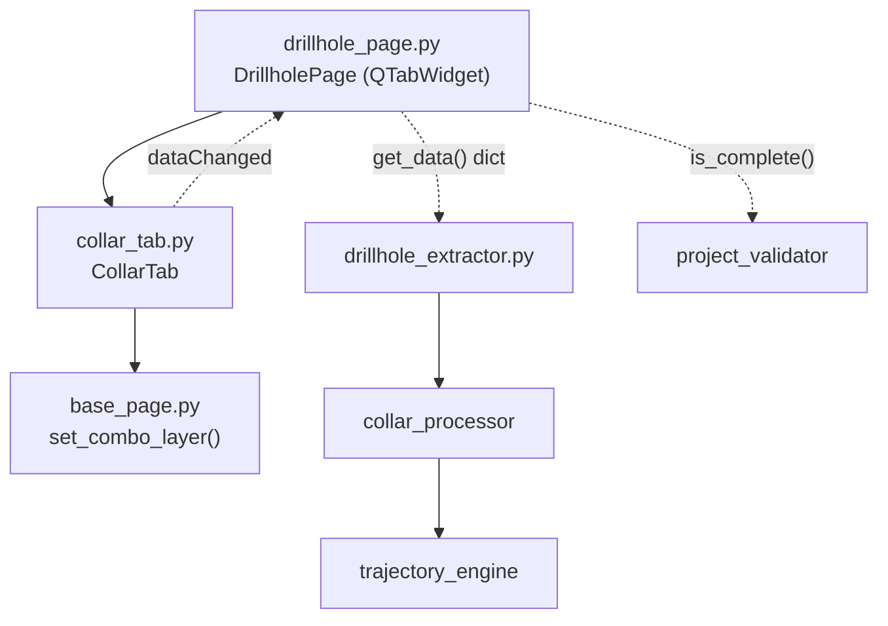

---
tags:
  - secinterp
  - code-walkthrough
  - gui
  - pages
aliases:
  - collar_tab.py
  - CollarTab
cssclass: secinterp-note
---

# `gui/ui/pages/drillhole/collar_tab.py`

> [!abstract] Resumen en una línea
> Pestaña de configuración del collar del sondaje: selector de capa de puntos más mapeo de campos (ID, X, Y, Z, profundidad) con interruptor de uso de geometría, que alimenta el `DrillholeContext` del lado Extract.

**Ruta**: `gui/ui/pages/drillhole/collar_tab.py` (180 líneas)
**Clase principal**: `CollarTab`
**Capa**: GUI (QGIS-dependiente · página secundaria / tab)
**Tags**: #secinterp #gui #pages

---

## 🎯 ¿Por qué existe este archivo?

La página de sondajes necesita tres formularios independientes (collar, survey,
intervalos) que vivan como pestañas dentro de un `QTabWidget`. Este módulo
encapsula solo el primero: dónde están embocados los sondajes y cómo se
identifican.

| Problema | Solución |
|----------|----------|
| El collar mezcla capa + 5 campos + un modo de coordenadas | `CollarTab` agrupa los 7 widgets en un `QGridLayout` propio |
| El usuario puede usar la geometría o dos campos X/Y | `chk_use_geom` alterna el modo y deshabilita X/Y vía `_toggle_xy_fields` |
| La página padre debe agregar tres formularios sin conocer widgets | Contrato `get_data` / `dump` / `load` / `reset` / `connect_signals` / `disconnect_signals` |
| Los combos de campo deben seguir a la capa elegida | `layerChanged` se conecta a los cinco `setLayer` |

> [!important] Nota arquitectónica
> Tab de la fase **Extract**: solo lee widgets QGIS y devuelve primitivos
> (`currentLayer()`, `currentField()`, `isChecked()`). Nunca calcula trayectorias;
> eso lo hacen [[collar_processor]] y [[trajectory_engine]] con el contexto.

---

## 🧬 Diagrama de relaciones



> [!tip] Cómo leer
> Flecha sólida = importa/delega; punteada = callback/flujo de datos hacia el padre
> o hacia el core.

---

## 📦 Imports — lectura arquitectónica

```python
# gui/ui/pages/drillhole/collar_tab.py
from __future__ import annotations
import contextlib
from typing import Any
from qgis.core import Qgis
from qgis.gui import QgsFieldComboBox, QgsMapLayerComboBox
from qgis.PyQt.QtCore import QCoreApplication, pyqtSignal
from qgis.PyQt.QtWidgets import QCheckBox, QGridLayout, QLabel, QWidget
from sec_interp.gui.ui.pages.base_page import set_combo_layer
from sec_interp.logger_config import get_logger
```

| # | Observación |
|---|-------------|
| ① | `from __future__ import annotations` + `QWidget \| None`: sintaxis moderna de tipos. |
| ② | `contextlib` existe solo para `disconnect_signals` (desconexión tolerante a fallos). |
| ③ | `qgis.gui.QgsMapLayerComboBox` / `QgsFieldComboBox`: combos nativos con filtro por capa. |
| ④ | `Qgis.LayerFilter.PointLayer`: el collar solo admite capas de puntos. |
| ⑤ | `pyqtSignal` declara `dataChanged` (sin argumentos) para notificar al padre. |
| ⑥ | `set_combo_layer` de `base_page` restaura la capa bloqueando señales. |
| ⑦ | `get_logger(__name__)` sigue el estándar de logging del plugin. |

---

## 🏗️ Inventario de estructura

**Clase:** `CollarTab(QWidget)` — 1 señal, 9 métodos.

| Miembro | Tipo | Rol |
|---------|------|-----|
| `dataChanged` | `pyqtSignal()` | Aviso al padre de que cambió algún campo |
| `c_layer` | `QgsMapLayerComboBox` | Capa de collares (puntos) |
| `chk_use_geom` | `QCheckBox` | Usar geometría en vez de campos X/Y |
| `c_id` | `QgsFieldComboBox` | Campo Hole ID |
| `c_x` / `c_y` | `QgsFieldComboBox` | Campos Este (X) / Norte (Y) |
| `lbl_x` / `lbl_y` | `QLabel` | Etiquetas que se deshabilitan con X/Y |
| `c_z` | `QgsFieldComboBox` | Campo de elevación (opcional, usa DEM si vacío) |
| `c_depth` | `QgsFieldComboBox` | Campo de profundidad total |

**Métodos:**

| Método | Firma | Propósito |
|--------|-------|-----------|
| `__init__` | `(parent=None) -> None` | Construye y llama `_setup_ui` |
| `tr` | `(message: str) -> str` | Traduce con contexto `"CollarTab"` |
| `_setup_ui` | `() -> None` | Grilla de 7 filas + stretch |
| `_toggle_xy_fields` | `(checked: bool) -> None` | Habilita/deshabilita X/Y |
| `get_data` | `() -> dict[str, Any]` | Valores vivos para validación/extract |
| `dump` | `() -> dict[str, Any]` | Estado persistible (claves `dh_*`) |
| `load` | `(data: dict) -> None` | Aplica estado persistido |
| `reset` | `() -> None` | Vuelve a valores por defecto |
| `connect_signals` | `() -> None` | Cablea capa, campos y checkbox |
| `disconnect_signals` | `() -> None` | Descablea todo sin lanzar |

---

## 📁 Archivos del paquete

| Archivo | Líneas | Rol |
|---|---|---|
| `drillhole/__init__.py` | 9 | Re-exporta `CollarTab`, `IntervalTab`, `SurveyTab` |
| `collar_tab.py` | 180 | Esta nota: formulario del collar |
| `survey_tab.py` | 144 | Formulario de desviaciones (ver [[survey_tab]]) |
| `interval_tab.py` | 144 | Formulario de intervalos (ver [[interval_tab]]) |
| `../drillhole_page.py` | 130 | Padre con `QTabWidget` (ver [[drillhole_page]]) |

---

## 📖 Recorrido método por método

### `__init__` + `tr`

```python
def __init__(self, parent: QWidget | None = None) -> None:
    super().__init__(parent)
    self._setup_ui()

def tr(self, message: str) -> str:
    return QCoreApplication.translate("CollarTab", message)
```

El constructor delega toda la construcción a `_setup_ui`, sin lógica. `tr`
usa el contexto `"CollarTab"` para que las cadenas sean traducibles vía
`update-strings.sh` (ver sección 🌐).

### `_setup_ui`

```python
layout = QGridLayout(self)
layout.setSpacing(6)

layout.addWidget(QLabel(self.tr("Collar Layer:")), 0, 0)
self.c_layer = QgsMapLayerComboBox()
self.c_layer.setFilters(Qgis.LayerFilter.PointLayer)
self.c_layer.setAllowEmptyLayer(True)
self.c_layer.setCurrentIndex(0)
layout.addWidget(self.c_layer, 0, 1)

self.chk_use_geom = QCheckBox(self.tr("Use Layer Geometry for Coordinates"))
self.chk_use_geom.setChecked(True)
layout.addWidget(self.chk_use_geom, 1, 0, 1, 2)
```

| Fila | Widgets | Detalle |
|------|---------|---------|
| 0 | Etiqueta + `c_layer` | Filtro `PointLayer`, permite capa vacía |
| 1 | `chk_use_geom` (span 2) | Marcado por defecto: la geometría manda |
| 2 | Etiqueta + `c_id` | Hole ID, sin campo vacío permitido |
| 3 | `lbl_x` + `c_x` | Permite campo vacío (`setAllowEmptyFieldName(True)`) |
| 4 | `lbl_y` + `c_y` | Igual que X |
| 5 | Etiqueta + `c_z` | Tooltip: vacío ⇒ usa elevación del DEM |
| 6 | Etiqueta + `c_depth` | Profundidad total, opcional |
| 7 | `layout.setRowStretch(7, 1)` | Empuja todo hacia arriba |

> [!note] UI 100 % programática
> No hay archivo `.ui`: cada `QLabel` pasa por `self.tr()` en el momento de
> crearse, y los combos de campo aceptan nombre vacío salvo `c_id`.

### `_toggle_xy_fields`

```python
def _toggle_xy_fields(self, checked: bool) -> None:
    enabled = not checked
    self.lbl_x.setEnabled(enabled)
    self.c_x.setEnabled(enabled)
    self.lbl_y.setEnabled(enabled)
    self.c_y.setEnabled(enabled)
```

Cuando `chk_use_geom` está marcado, los campos X/Y se deshabilitan (pero
conservan su valor). Se invoca una vez con `True` dentro de `connect_signals`
para sincronizar el estado inicial.

### `get_data` — valores vivos

```python
def get_data(self) -> dict[str, Any]:
    return {
        "collar_layer": self.c_layer.currentLayer(),
        "use_geometry": self.chk_use_geom.isChecked(),
        "collar_id": self.c_id.currentField(),
        "collar_x": self.c_x.currentField(),
        "collar_y": self.c_y.currentField(),
        "collar_z": self.c_z.currentField(),
        "collar_depth": self.c_depth.currentField(),
    }
```

Devuelve el **objeto capa vivo** más nombres de campo. Lo consume
`DrillholePage.get_data()` y, desde ahí, `is_complete()` y el extractor que
construye el `DrillholeContext`.

### `dump` — estado persistible

```python
def dump(self) -> dict[str, Any]:
    return {
        "dh_collar_layer": self.c_layer.currentLayer(),
        "dh_collar_id": self.c_id.currentField(),
        "dh_use_geom": self.chk_use_geom.isChecked(),
        "dh_collar_x": self.c_x.currentField(),
        "dh_collar_y": self.c_y.currentField(),
        "dh_collar_z": self.c_z.currentField(),
        "dh_collar_depth": self.c_depth.currentField(),
    }
```

Mismas lecturas que `get_data` pero con claves prefijadas `dh_*`, que son las
que `ConfigService` persiste en `QgsSettings` (ver [[config]]).

### `load` — aplicar estado persistido

```python
def load(self, data: dict[str, Any]) -> None:
    c_layer = data.get("dh_collar_layer")
    if c_layer is not None:
        set_combo_layer(self.c_layer, c_layer)
        for w in (self.c_id, self.c_x, self.c_y, self.c_z, self.c_depth):
            w.setLayer(c_layer)

    for key, combo in [
        ("dh_collar_id", self.c_id),
        ("dh_collar_x", self.c_x),
        ...
    ]:
        field = data.get(key)
        if field:
            combo.setField(field)

    use_geom = data.get("dh_use_geom")
    if use_geom is not None:
        self.chk_use_geom.setChecked(bool(use_geom))
```

| Paso | Comportamiento |
|------|----------------|
| Capa | Solo se aplica si no es `None`; usa `set_combo_layer` (sin emitir señales) |
| Campos | `setLayer` primero, luego `setField` solo si el nombre es no vacío |
| Checkbox | Cast a `bool` defensivo antes de `setChecked` |

### `reset`

```python
def reset(self) -> None:
    self.c_layer.setLayer(None)
    self.chk_use_geom.setChecked(True)
```

Limpia la capa y restaura el modo geometría. No toca los combos de campo: al
quedarse sin capa quedan vacíos por sí solos.

### `connect_signals`

```python
def connect_signals(self) -> None:
    self.c_layer.layerChanged.connect(self.c_id.setLayer)
    self.c_layer.layerChanged.connect(self.c_x.setLayer)
    self.c_layer.layerChanged.connect(self.c_y.setLayer)
    self.c_layer.layerChanged.connect(self.c_z.setLayer)
    self.c_layer.layerChanged.connect(self.c_depth.setLayer)
    self.c_layer.layerChanged.connect(self.dataChanged.emit)

    self.chk_use_geom.toggled.connect(self._toggle_xy_fields)
    self._toggle_xy_fields(True)

    self.c_id.fieldChanged.connect(self.dataChanged.emit)
    ...  # c_x, c_y, c_z, c_depth igual
    self.chk_use_geom.toggled.connect(self.dataChanged.emit)
```

Cinco conexiones `layerChanged → setLayer` mantienen los campos sincronizados
con la capa; cada cambio de capa o campo reemite `dataChanged` hacia
`DrillholePage`, que a su vez lo propaga al diálogo.

### `disconnect_signals`

```python
def disconnect_signals(self) -> None:
    with contextlib.suppress(TypeError, RuntimeError):
        self.c_layer.layerChanged.disconnect(self.c_id.setLayer)
        ...  # 5 más
    with contextlib.suppress(TypeError, RuntimeError):
        self.chk_use_geom.toggled.disconnect(self._toggle_xy_fields)
        ...
```

Siete bloques `suppress(TypeError, RuntimeError)`: desconectar una señal ya
desconectada o un widget destruido no debe lanzar. Cumple la stop-condition
GUI de desconexión explícita.

---

## 🔄 Flujo de datos

| Fase | Entrada | Transformación | Salida |
|------|---------|----------------|--------|
| Setup | `parent` | `_setup_ui` crea grilla + combos | Widgets listos |
| Edición | Clic del usuario | `layerChanged`/`fieldChanged`/`toggled` | `dataChanged` al padre |
| Extract | Widgets | `get_data()` lee capa + campos | `dict` con claves `collar_*` |
| Agregación | Tres tabs | `DrillholePage.get_data()` fusiona | `dict` collar + survey + intervalos |
| Validación | `dict` fusionado | `resolve_layer_metadata` + `ProjectValidator.is_drillhole_complete` | `bool` en `is_complete()` |
| Compute | Contexto | [[collar_processor]] + [[trajectory_engine]] | Trayectorias 3D |
| Persistencia | Widgets | `dump()` con claves `dh_*` | `QgsSettings` vía `ConfigService` |
| Restauración | `QgsSettings` | `load()` con `set_combo_layer` | Widgets restaurados sin señales espurias |

---

## 🏛️ Patrones de diseño presentes

| Patrón | Dónde | Propósito |
|--------|-------|-----------|
| **Composite (tab)** | `DrillholePage` + 3 tabs | El padre trata cada tab con el mismo contrato |
| **Observer** | `dataChanged` | Propagación de cambios tab → página → diálogo |
| **Extract** | `get_data` | La GUI solo extrae; el core computa |
| **Memento** | `dump` / `load` | Estado persistible y restaurable |
| **Guarded disconnect** | `contextlib.suppress` | Desconexión idempotente y segura |

---

## 🧾 Resumen de la API

| Símbolo | Firma / Hereda | Uso típico |
|---------|----------------|------------|
| `CollarTab` | `QWidget` | `DrillholePage.tab_widget.addTab(CollarTab(), ...)` |
| `dataChanged` | `pyqtSignal()` | `tab.dataChanged.connect(self.dataChanged.emit)` |
| `get_data()` | `-> dict[str, Any]` | Lectura viva para validar/extraer |
| `dump()` | `-> dict[str, Any]` | Persistencia (claves `dh_collar_*`) |
| `load(data)` | `(dict) -> None` | Restaurar sesión |
| `reset()` | `-> None` | Limpiar formulario |
| `connect_signals()` | `-> None` | Cablear al mostrar la página |
| `disconnect_signals()` | `-> None` | Descablear al cerrar |

---

## 🛡️ Manejo de errores

No hay `try/except` de dominio: la estrategia es **defensiva por diseño**:

- `load` ignora claves ausentes (`data.get(...) is None`) y nombres de campo
  vacíos, así que un diccionario parcial nunca rompe la UI.
- `set_combo_layer` bloquea señales durante la restauración para evitar
  cascadas de `layerChanged` a medio aplicar.
- `disconnect_signals` suprime `TypeError`/`RuntimeError` (señal inexistente o
  objeto C++ destruido).

---

## 🧪 Tests asociados

No existe un `tests/gui/test_collar_tab.py` dedicado; la cobertura llega a
través de la página padre con mocks QGIS (Mock-first):

- `tests/gui/test_drillhole_page.py::TestDrillholePage::test_tabs_are_composed` — verifica que los tres tabs existen.
- `test_get_data_contract` — claves `collar_*` presentes tras `get_data()`.
- `test_dump_contract` — claves `dh_collar_*` presentes tras `dump()`.
- `test_load_reset_roundtrip` — `load` + `reset` no lanzan con mocks.
- `test_connect_disconnect_signals` — cableado idempotente.
- `test_is_complete_returns_bool` — `is_complete()` con metadatos resueltos.

---

## 🌐 i18n y notas de migración

- Todas las etiquetas pasan por `self.tr()` con contexto `"CollarTab"`.
- El tooltip del campo Z (`"Leave empty to use DEM elevation"`) también es
  traducible.
- Sin imports de `qgis.PyQt` obsoletos: usa `qgis.PyQt` agnóstico 4.x.
- El filtro `Qgis.LayerFilter.PointLayer` es la API moderna (compárese con el
  fallback de `interval_tab`/`survey_tab`).

---

## 👀 Observaciones y notas

> [!success] Fortalezas
> - Contrato simétrico con los otros dos tabs: el padre itera sin casos especiales.
> - `dump`/`get_data` separados: claves de cómputo vs. claves de persistencia.
> - Desconexión exhaustiva con `suppress`: sin fugas de señales.

> [!warning] Puntos de atención
> - `reset` no restaura los combos de campo explícitamente; depende del vaciado por capa.
> - `c_id` no permite campo vacío mientras el resto sí: inconsistencia intencional pero sin documentar.
> - `_toggle_xy_fields(True)` se llama dentro de `connect_signals`, no en `_setup_ui`: el estado inicial depende de conectar.

> [!question] Preguntas abiertas
> - ¿Debería `reset` llamar `_toggle_xy_fields(True)` para garantizar coherencia visual?
> - ¿Convendría validar que `c_id` no esté vacío cuando hay capa (nivel Extract)?

---

## 🔗 Notas relacionadas

- [[Index]] — índice de la bóveda
- [[drillhole_page]] — página padre con el `QTabWidget`
- [[gui_ui_pages_drillhole]] — paquete de tabs de sondajes
- [[survey_tab]] — tab hermano de desviaciones
- [[interval_tab]] — tab hermano de intervalos
- [[collar_processor]] — core que consume el collar
- [[trajectory_engine]] — cálculo de trayectorias 3D
- [[drillhole_extractor]] — adapter Extract hacia `DrillholeContext`
- [[project_validator]] — `is_drillhole_complete` usado por el padre
- [[settings_model]] — `DrillholeSettings` del core

---

*Nota de la bóveda SecInterp Code Walkthrough v2 — v3.8.0*
