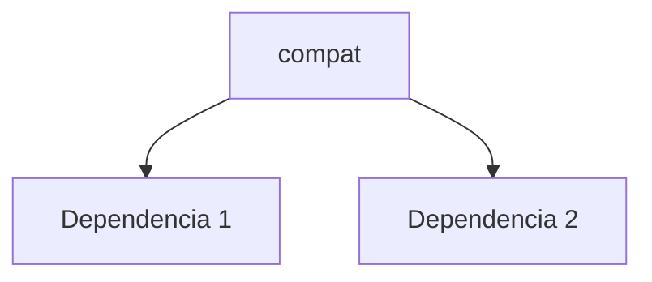

---
tags:
  - secinterp
  - code-walkthrough
  - core      # core | gui | exporters
  - general     # services | managers | renderers | adapters | validation | etc.
aliases:
  - compat.py  # ej. path_resolver.py
  - compat     # ej. resolve_export_path
cssclass: secinterp-note
# note_lines: 700      # opcional: tope > 500 para módulos de importancia alta (máx 700)
---

# `core/services/export/compat.py`

> [!abstract] Resumen en una línea
> Backward compatibility wrappers for ExportService private API. — qué hace este módulo en una frase, sin tocar QGIS si es core.

**Ruta**: `core/services/export/compat.py` (129 líneas)
**Clase/Función principal**: `compat`
**Capa**: core (QGIS-agnóstico / GUI · Tipo)
**Tags**: #secinterp #core #general

---

## 🎯 ¿Por qué existe este archivo?

| Problema | Solución |
|----------|----------|
| (pendiente) | (pendiente) |
| (pendiente) | (pendiente) |

> [!important] Nota arquitectónica
> QGIS-agnóstico (p. ej. "QGIS-agnóstico", "Adapter Extract", "Factory").

---

## 🧬 Diagrama de relaciones



> [!tip] Cómo leer
> Flecha sólida = importa/delega; punteada = callback/injectado.

---

## 📦 Imports — lectura arquitectónica

```python
# compat.py
from __future__ import annotations
from pathlib import Path
from typing import Any
```

| # | Observación |
|---|-------------|
| ① | (pendiente) |
| ② | (pendiente) |

---

## 🏗️ Inventario de estructura

**Clases:** `class ExportServiceCompatMixin` — 7 métodos
**Funciones/Métodos:**
- `ExportServiceCompatMixin._export_topography(def _export_topography(self, folder: Path, data: list[tuple], crs: Any, csv_exporter: Any, msg: list[str], settings: Any | None=None, ext: str='.shp') -> None:)`
- `ExportServiceCompatMixin._export_geology(def _export_geology(self, folder: Path, data: list[Any] | None, crs: Any, csv_exporter: Any, msg: list[str], settings: Any | None=None, ext: str='.shp') -> None:)`
- `ExportServiceCompatMixin._export_structures(def _export_structures(self, folder: Path, data: list[Any] | None, raster_layer: Any | None, crs: Any, csv_exporter: Any, msg: list[str], options: dict[str, Any] | None=None, settings: Any | None=None, ext: str='.shp') -> None:)`
- `ExportServiceCompatMixin._export_drillholes(def _export_drillholes(self, folder: Path, data: list[Any] | None, crs: Any, msg: list[str], settings: Any | None=None, ext: str='.shp') -> None:)`
- `ExportServiceCompatMixin._export_axes(def _export_axes(self, folder: Path, data: list[tuple], crs: Any, msg: list[str], settings: Any | None=None, ext: str='.shp') -> None:)`
- `ExportServiceCompatMixin._export_interpretations(def _export_interpretations(self, folder: Path, data: list[Any] | None, line_layer: Any, crs: Any, msg: list[str], settings: Any | None=None, ext: str='.shp') -> None:)`
- `ExportServiceCompatMixin._get_export_path(def _get_export_path(self, folder: Path, base_name: str, settings: Any | None, ext: str) -> tuple[Path, str]:)`

---

## 📁 Archivos del paquete

- `compat.py` — nota individual de este archivo.

---

## 📖 Recorrido método por método

### `método_1`

```python
# (enriquecer)
```

_(enriquecer leyendo el fuente)_

### `método_2`

```python
# (enriquecer)
```

_(enriquecer leyendo el fuente)_

<!-- Añade una subsección por cada método público del módulo -->

---

## 🔄 Flujo de datos

| Fase | Entrada | Transformación | Salida |
|------|---------|----------------|--------|
| - | - | - | - |
| - | - | - | - |

---

## 🏛️ Patrones de diseño presentes

| Patrón | Dónde | Propósito |
|--------|-------|-----------|
| - | - | - |

---

## 🧾 Resumen de la API

| Símbolo | Firma / Hereda | Uso típico |
|---------|----------------|------------|
| (no symbols) | `-` | - |

---

## 🛡️ Manejo de errores

_(pendiente)_

---

## 🧪 Tests asociados

_(pendiente)_

---

## 👀 Observaciones y notas

> [!success] Fortalezas
> - (skeleton)

> [!warning] Puntos de atención
> - (skeleton)

> [!question] Preguntas abiertas
> - (skeleton)

---

## 🔗 Notas relacionadas

- [[Index]] — índice de la bóveda
- [[Index]] — índice
- [[controller]] — orquestador

---

*Nota de la bóveda SecInterp Code Walkthrough v2 — v3.8.0*
