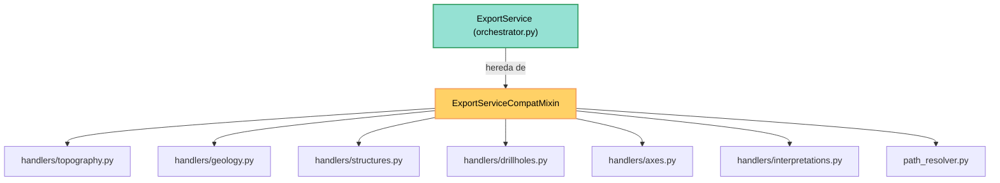

---
tags:
  - secinterp
  - code-walkthrough
  - core
  - export
  - compat
aliases:
  - compat.py
  - ExportServiceCompatMixin
cssclass: secinterp-note
---

# `core/services/export/compat.py`

> [!abstract] Resumen en una línea
> Mixin de **retrocompatibilidad** que conserva la antigua API privada `_export_*` de `ExportService`, delegando cada wrapper al handler correspondiente del paquete `handlers/` sin acoplar tipos QGIS.

**Ruta**: `core/services/export/compat.py` (129 líneas)
**Clase principal**: `ExportServiceCompatMixin`
**Capa**: Core (QGIS-agnóstico, con tipos QGIS tipados como `Any`)
**Tags**: #secinterp #core #export #compat

---

## 🎯 ¿Por qué existe este archivo?

Cuando la lógica de exportación se reorganizó en handlers de nivel módulo
(`topography.py`, `geology.py`, …), los tests y parte del código antiguo seguían
llamando a los métodos privados `_export_*` de `ExportService`. Este mixin mantiene
esa API congelada para no romper a los consumidores:

| Problema | Solución |
|----------|----------|
| Tests antiguos invocan `service._export_topography(...)` | Wrapper `_export_topography` que delega a `topography.export_topography` |
| La API pública cambió de métodos privados a funciones de módulo | Mixin que adapta la firma antigua a la nueva |
| Evitar imports pesados/ circulares en tiempo de carga | Imports **lazy** dentro de cada método |
| Conservar acceso a `controller`/`access_control` sin heredar nada | Mixin que asume atributos definidos por el host (`ExportService`) |

> [!important] Nota arquitectónica
> Es un **compatibility shim** (Mixin/Trait). No define `__init__` ni estado propio:
> depende de que la clase host (`ExportService`, en `orchestrator.py`) aporte
> `self.controller` y `self.access_control`. Por eso cada uso lleva `# type: ignore[attr-defined]`.

---

## 🧬 Diagrama de relaciones



> [!tip] Cómo leer
> Flecha sólida = importa/delega. `ExportService` **incorpora** el mixin; los `_export_*`
> del mixin **delegan** en funciones de módulo de `handlers/` y en `path_resolver`.

---

## 📦 Imports — lectura arquitectónica

```python
# core/services/export/compat.py
"""Backward compatibility wrappers for ExportService private API."""

from __future__ import annotations

from pathlib import Path
from typing import Any
```

```python
# imports lazy dentro de cada método (no en cabecera)
from sec_interp.core.services.export.handlers import topography as topo_h
from sec_interp.core.services.export.handlers import geology as geo_h
from sec_interp.core.services.export.handlers import structures as struct_h
from sec_interp.core.services.export.handlers import drillholes as dh_h
from sec_interp.core.services.export.handlers import axes as axes_h
from sec_interp.core.services.export.handlers import interpretations as interp_h
from sec_interp.core.services.export.path_resolver import get_profile_name, resolve_export_path
```

| # | Observación |
|---|-------------|
| ① | Cabecera mínima: solo `Path` y `Any`. Cero `qgis.*`, cero acoplamiento. |
| ② | Todos los imports de handlers y `path_resolver` son **locales** (dentro del método). |
| ③ | Los tipos QGIS (`crs`, `csv_exporter`, `line_layer`) cruzan como `Any` — frontera limpia. |
| ④ | El `Any | None` en `settings` refleja que la configuración de exportación es opcional. |

> [!note] Imports lazy = desacoplamiento diferido
> Al importar los handlers *dentro* del método, `compat.py` no arrastra el grafo de
> `exporters` ni de `handlers` al importar el paquete. Es la misma técnica que usa
> `orchestrator.py` en `_orchestrate_exports`.

---

## 🏗️ Inventario de estructura

**Clases:** `class ExportServiceCompatMixin` — 7 métodos, sin estado, sin `__init__`.

**Funciones/Métodos (todos delegantes):**
- `_export_topography(folder, data, crs, csv_exporter, msg, settings, ext)` → `topography.export_topography`
- `_export_geology(folder, data, crs, csv_exporter, msg, settings, ext)` → `geology.export_geology`
- `_export_structures(folder, data, raster_layer, crs, csv_exporter, msg, options, settings, ext)` → `structures.export_structures`
- `_export_drillholes(folder, data, crs, msg, settings, ext)` → `drillholes.export_drillholes`
- `_export_axes(folder, data, crs, msg, settings, ext)` → `axes.export_axes`
- `_export_interpretations(folder, data, line_layer, crs, msg, settings, ext)` → `interpretations.export_interpretations`
- `_get_export_path(folder, base_name, settings, ext)` → `resolve_export_path` (vía `get_profile_name`)

**Atributos asumidos (del host):**
- `self.controller` — `ProfileController` (o `None`), para `get_profile_name`.
- `self.access_control` — `AccessControlService`, para el gate 3D de interpretaciones.

---

## 📁 Archivos del paquete

| Archivo | Líneas | Rol |
|---|--:|---|
| `__init__.py` | 9 | Re-exports `ExportService`, `create_map_settings`, `get_profile_name`, `resolve_export_path` |
| `orchestrator.py` | 207 | `ExportService` — fachada que **hereda** este mixin |
| `compat.py` | 129 | `ExportServiceCompatMixin` — wrappers legacy `_export_*` |
| `path_resolver.py` | 60 | `get_profile_name` / `resolve_export_path` |
| `map_settings_factory.py` | 34 | `create_map_settings` — aísla el import de `qgis.core` |
| `handlers/` | ~490 | Siete handlers de exportación por entidad |

---

## 📖 Recorrido método por método

### `_export_topography`

```python
def _export_topography(
    self, folder: Path, data: list[tuple], crs: Any, csv_exporter: Any,
    msg: list[str], settings: Any | None = None, ext: str = ".shp",
) -> None:
    from sec_interp.core.services.export.handlers import topography as topo_h
    topo_h.export_topography(
        folder, data, crs, csv_exporter, msg, self.controller, settings, ext
    )  # type: ignore[attr-defined]
```

Adapta la firma antigua a `topography.export_topography`. Inyecta `self.controller`
como penúltimo argumento. Es el wrapper más directo: los 6 primeros parámetros se
copiaron tal cual, y `controller` se inserta desde el host.

### `_export_geology`

```python
def _export_geology(
    self, folder: Path, data: list[Any] | None, crs: Any, csv_exporter: Any,
    msg: list[str], settings: Any | None = None, ext: str = ".shp",
) -> None:
    from sec_interp.core.services.export.handlers import geology as geo_h
    geo_h.export_geology(folder, data, crs, csv_exporter, msg, self.controller, settings, ext)  # type: ignore[attr-defined]
```

Delega a `geology.export_geology`. `data` es `list[Any] | None` (lista de
`GeologySegment`); si está vacía, el handler retorna sin escribir nada.

### `_export_structures`

```python
def _export_structures(
    self, folder: Path, data: list[Any] | None, raster_layer: Any | None,
    crs: Any, csv_exporter: Any, msg: list[str],
    options: dict[str, Any] | None = None, settings: Any | None = None,
    ext: str = ".shp",
) -> None:
    from sec_interp.core.services.export.handlers import structures as struct_h
    struct_h.export_structures(
        folder, data, raster_layer, crs, csv_exporter, msg,
        options or {}, self.controller, settings, ext,  # type: ignore[attr-defined]
    )
```

Es el wrapper con más parámetros: añade `raster_layer` y `options`. Normaliza
`options or {}` antes de delegar, de modo que el handler siempre reciba un dict.

### `_export_drillholes`

```python
def _export_drillholes(
    self, folder: Path, data: list[Any] | None, crs: Any,
    msg: list[str], settings: Any | None = None, ext: str = ".shp",
) -> None:
    from sec_interp.core.services.export.handlers import drillholes as dh_h
    dh_h.export_drillholes(folder, data, crs, msg, self.controller, settings, ext)  # type: ignore[attr-defined]
```

Delega a `drillholes.export_drillholes` (trazas 2D + intervalos). Nota que aquí **no**
se recibe `csv_exporter`: los sondajes se exportan solo como vectores, no como CSV.

### `_export_axes`

```python
def _export_axes(
    self, folder: Path, data: list[tuple], crs: Any,
    msg: list[str], settings: Any | None = None, ext: str = ".shp",
) -> None:
    from sec_interp.core.services.export.handlers import axes as axes_h
    axes_h.export_axes(folder, data, crs, msg, self.controller, settings, ext)  # type: ignore[attr-defined]
```

Delega a `axes.export_axes` (los ejes del perfil). Solo vector, sin CSV.

### `_export_interpretations`

```python
def _export_interpretations(
    self, folder: Path, data: list[Any] | None, line_layer: Any, crs: Any,
    msg: list[str], settings: Any | None = None, ext: str = ".shp",
) -> None:
    from sec_interp.core.services.export.handlers import interpretations as interp_h
    interp_h.export_interpretations(
        folder, data, line_layer, crs, msg,
        self.controller, settings, ext, self.access_control,  # type: ignore[attr-defined]
    )
```

El único wrapper que pasa **dos** atributos del host: `self.controller` y
`self.access_control`. Este último activa/desactiva la exportación 3D según permisos.

### `_get_export_path`

```python
def _get_export_path(
    self, folder: Path, base_name: str, settings: Any | None, ext: str,
) -> tuple[Path, str]:
    from sec_interp.core.services.export.path_resolver import (
        get_profile_name, resolve_export_path,
    )
    profile_name = get_profile_name(self.controller)  # type: ignore[attr-defined]
    pattern = getattr(settings, "naming_pattern", None) if settings else None
    return resolve_export_path(folder, base_name, profile_name, pattern, ext)
```

Único wrapper que **devuelve** algo: la tupla `(ruta_física, nombre_lógico)`.
Deriva `profile_name` del controller y extrae `naming_pattern` de `settings`
(si existe), delegando la composición final a `resolve_export_path`.

---

## 🤝 Contrato implícito con el host

El mixin no funciona solo: depende de que `ExportService` (el host) defina dos
atributos. Como Python resuelve atributos por **MRO** (Method Resolution Order), el
mixin accede a `self.controller` y `self.access_control` aunque no los declare:

| Atributo | Quién lo define | Qué aporta a los wrappers |
|----------|-----------------|---------------------------|
| `self.controller` | `ExportService.__init__` | `get_profile_name(...)` en `_get_export_path` |
| `self.access_control` | `ExportService.__init__` | gate 3D en `_export_interpretations` |

```python
# host en orchestrator.py
class ExportService(ExportServiceCompatMixin):
    def __init__(self, controller: Any | None = None) -> None:
        self.controller = controller          # ← consumido por el mixin
        self.access_control = AccessControlService()  # ← consumido por el mixin
```

> [!warning] Acoplamiento por convención
> El mixin **asume** que el host tiene esos atributos; si se mezclara en otra clase sin
> `controller`/`access_control`, fallaría en runtime (`AttributeError`). Los
> `# type: ignore[attr-defined]` documentan que el verificador de tipos no puede verlos.

> [!tip] ¿Mixin o herencia normal?
> Se usa mixin porque `ExportService` ya debe heredar de su propia jerarquía y porque la
> API legacy es **opcional**: el trait solo se mezcla donde los tests la requieren, sin
> forzar una relación "es-un" entre el host y la capa de compatibilidad.

---

## 🔄 Flujo de datos

| Fase | Entrada | Transformación | Salida |
|------|---------|----------------|--------|
| Llamada legacy | `service._export_topography(folder, data, crs, …)` | Wrapper inserta `self.controller` | `topo_h.export_topography(...)` |
| Delegación | `(folder, data, crs, csv_exporter, msg)` | `options or {}`, reorden de args | handler del paquete `handlers/` |
| Resolución de rutas | `(folder, base_name, settings, ext)` | `get_profile_name` + `naming_pattern` | `(Path, str)` de `resolve_export_path` |
| Escritura | handler → `exporter.export(...)` | `CSVExporter` / `*VectorExporter` | archivos CSV/SHP/GPKG/DXF |

> [!note] El mixin no escribe nada
> `compat.py` **no produce archivos**: solo reencamina las llamadas. El trabajo real de
> escritura vive en `exporters/` y en los handlers. Ver [[core_services_export_handlers]].

---

## 🏛️ Patrones de diseño presentes

| Patrón | Dónde | Propósito |
|--------|-------|-----------|
| **Mixin / Trait** | `ExportServiceCompatMixin` | Añadir la API legacy sin forzar herencia profunda |
| **Adapter (shim)** | cada `_export_*` | Traducir la firma antigua a la función de módulo nueva |
| **Facade delegation** | wrappers → `handlers/*` | Ocultar el grafo de handlers tras una sola llamada |
| **Lazy import / DI diferida** | imports locales | Evitar dependencias pesadas en tiempo de carga |
| **Compatibility layer** | todo el módulo | Mantener la API privada estable para tests antiguos |

---

## 🧾 Resumen de la API

| Símbolo | Firma / Hereda | Uso típico |
|---------|----------------|------------|
| `ExportServiceCompatMixin` | `(object)` | Clase base del mixin; sin estado |
| `_export_topography` | `(folder, data, crs, csv_exporter, msg, settings=None, ext=".shp") -> None` | Exportar perfil topográfico (legacy) |
| `_export_geology` | `(folder, data, crs, csv_exporter, msg, settings=None, ext=".shp") -> None` | Exportar geología (legacy) |
| `_export_structures` | `(folder, data, raster_layer, crs, csv_exporter, msg, options=None, settings=None, ext=".shp") -> None` | Exportar estructuras (legacy) |
| `_export_drillholes` | `(folder, data, crs, msg, settings=None, ext=".shp") -> None` | Exportar sondajes 2D (legacy) |
| `_export_axes` | `(folder, data, crs, msg, settings=None, ext=".shp") -> None` | Exportar ejes (legacy) |
| `_export_interpretations` | `(folder, data, line_layer, crs, msg, settings=None, ext=".shp") -> None` | Exportar interpretaciones 2D/3D (legacy) |
| `_get_export_path` | `(folder, base_name, settings, ext) -> tuple[Path, str]` | Resolver ruta y nombre de capa |

---

## 🛡️ Manejo de errores

El mixin **no captura excepciones**: deja que se propaguen hacia el llamador.

- Los handlers (`topography.py`, `geology.py`, …) ya envuelven sus fallos en
  `ExportError` (con `raise … from e`), por lo que el error llega tipado al test o a la GUI.
- `_export_interpretations` puede retornar **sin hacer nada** si `data` está vacía
  (el handler hace early-return), sin lanzar excepción.
- `get_profile_name(self.controller)` es tolerante: si `controller` es `None` o no tiene
  `settings.section.layer_name`, devuelve `"profile"` en lugar de fallar.

> [!tip] Sin `try/except` = propagación limpia
> La ausencia de manejo es deliberada: el shim no debe enmascarar el tipo de error real.
> La jerarquía `SecInterpError → ExportError` (ver [[exceptions]]) hace el resto.

---

## 🧪 Tests asociados

Los wrappers se ejercitan de forma indirecta y directa en `tests/core/test_export_service.py`:

- `test_export_data_minimal` — flujo topografía + ejes (usa `_export_topography`/`_export_axes` vía `export_data`).
- `test_export_data_all_types` — geología, estructuras, sondajes e interpretaciones.
- `test_export_topography_error` — llama directamente `self.service._export_topography(...)` y verifica `ExportError`.
- `test_export_geology_error` / `test_export_structures_error` / `test_export_drillholes_error` — rutas de fallo por entidad.

> [!note] Por qué existe este mixin como "API para tests"
> `test_export_topography_error` invoca `service._export_topography` para aislar la
> topografía sin pasar por `export_data`. El mixin conserva esa puerta de entrada.

---

## 👀 Observaciones y notas

> [!success] Fortalezas
> - Imports **lazy**: no arrastra el grafo de exporters al importar el paquete.
> - Firma estable para los tests antiguos: sin breaking change.
> - Sin estado propio: el mixin es trivial de componer y de testear.
> - Delega al 100%: no duplica lógica de escritura.

> [!warning] Puntos de atención
> - Acoplamiento **implícito**: asume `self.controller` y `self.access_control` (definidos en el host).
> - Los `# type: ignore[attr-defined]` enmascaran esa dependencia al verificador de tipos.
> - Duplicación de firmas: cada wrapper repite los parámetros del handler correspondiente.
> - Es código "legacy": si los tests se migran a `export_data`, el mixin puede eliminarse.

> [!question] Preguntas abiertas
> - ¿Migrar los tests a `export_data` y retirar el mixin (y `_export_*`) por completo?
> - ¿Tipar `self.controller` como `ProfileController | None` en lugar de `Any`?
> - ¿Unificar `_export_*` en un único método genérico `_delegate(handler, *args)`?

---

## 🔗 Notas relacionadas

- [[Index]] — índice de la bóveda
- [[orchestrator]] — `ExportService`, la clase host que hereda este mixin
- [[path_resolver]] — `get_profile_name` / `resolve_export_path` usados por `_get_export_path`
- [[core_services_export_handlers]] — paquete `handlers/` al que delega cada wrapper
- [[core_services_export]] — paquete `export/` (re-exports de `__init__.py`)
- [[controller]] — origen de `self.controller` (datos de perfil)
- [[dtos]] — `PreviewParams`, que alimenta `export_data` en [[orchestrator]]
- [[exceptions]] — `ExportError` / `DataMissingError` que propagan los handlers

---

*Nota de la bóveda SecInterp Code Walkthrough v2 — v3.8.0*
