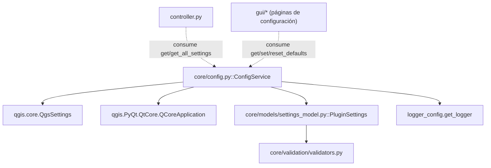

---
tags:
  - secinterp
  - code-walkthrough
  - core
  - config
aliases:
  - config.py
  - ConfigService
cssclass: secinterp-note
---

# `core/config.py`

> [!abstract] Resumen en una línea
> `ConfigService` es el **adaptador de persistencia** de la configuración del plugin: envuelve `QgsSettings`, centraliza los valores por defecto, aplica coerción de tipos (especialmente booleanos como string) y devuelve un `PluginSettings` validado.

**Ruta**: `core/config.py` (253 líneas)
**Clase/Función principal**: `ConfigService`
**Capa**: Core (con dependencia puntual de QGIS — *gray area* documentada)
**Tags**: #secinterp #core #config

---

## 🎯 ¿Por qué existe este archivo?

La configuración del plugin vive en `QgsSettings` (registro persistente de QGIS), pero
el resto del core quiere un **objeto validado y tipado**, no decenas de `get()` dispersos.
`ConfigService` resuelve la tensión entre ambos mundos:

| Problema | Solución |
|----------|----------|
| Las claves de `QgsSettings` son strings frágiles y dispersas | `PREFIX = "SecInterp/"` + métodos `get`/`set` |
| Los valores por defecto ("magic numbers") se repiten por todo el código | Constantes de clase `DEFAULT_*` |
| `QgsSettings` devuelve `"true"`/`"false"` como string | Coerción explícita a `bool` en `get()` |
| El core quiere un modelo tipado, no un dict crudo | `_load_from_qgs_settings()` → `PluginSettings.from_dict()` |
| Recargar todo en cada acceso es caro | Caché interno `_current_settings` con invalidación en `set()` |

> [!important] Nota arquitectónica — *gray area*
> A diferencia del resto del core (que debe ser 100% QGIS-agnóstico según
> `core/AGENTS.md`), `config.py` **sí importa QGIS**: `QgsSettings` y
> `QCoreApplication` (para `tr()`). Es una excepción explícita y razonable: la
> configuración *es* por naturaleza un puerto hacia el almacenamiento de QGIS. Ver
> la sección de imports para el análisis honesto de esta frontera.

---

## 🧬 Diagrama de relaciones



> [!tip] Cómo leer
> Flecha sólida = importa; punteada = es consumido por. `ConfigService` depende del
> mundo QGIS (izquierda) y del modelo `PluginSettings` (que a su vez delega la
> validación en `validators.py`). La GUI y el `controller` lo usan como **única puerta**
> a la configuración persistente.

---

## 📦 Imports — lectura arquitectónica

```python
# core/config.py
from __future__ import annotations

from typing import Any

from qgis.core import QgsSettings
from qgis.PyQt.QtCore import QCoreApplication

from sec_interp.core.models.settings_model import PluginSettings
from sec_interp.logger_config import get_logger

logger = get_logger(__name__)
```

| # | Observación |
|---|-------------|
| ① | `QgsSettings` — dependencia directa de QGIS: es la fuente real de persistencia. |
| ② | `QCoreApplication.translate` — solo para `tr()`; tipado con `# type: ignore[no-any-return]`. |
| ③ | `PluginSettings` — el DTO de salida tipado que el resto del core consume. |
| ④ | `get_logger(__name__)` — logger por módulo, sin dependencias de terceros. |

> [!warning] La excepción a la regla QGIS-agnóstico
> `core/AGENTS.md` prohíbe `from qgis.core import *` en `/core`. `config.py` importa
> `QgsSettings` de forma **explícita y acotada**, no `import *`. Es una *gray area*
> intencional: la configuración persistente es, por definición, un puerto hacia QGIS.
> El resto de módulos del core **no** debe imitar esta excepción.

---

## 🏗️ Inventario de estructura

**Clases:** `class ConfigService` — 7 métodos

**Constantes de clase:**
- `PREFIX = "SecInterp/"` — prefijo de todas las claves.
- `DEFAULT_SCALE = 50000.0`, `DEFAULT_BUFFER_DIST = 100.0`, `DEFAULT_VERT_EXAG = 1.0`
- `DEFAULT_DPI = 300`, `DEFAULT_MAX_POINTS = 10000`, `DEFAULT_DEM_BAND = 1`
- `DEFAULT_SAMPLING_INTERVAL = 10.0`, `DEFAULT_EXPORT_QUALITY = 95`
- `DEFAULT_PREVIEW_WIDTH = 800`, `DEFAULT_PREVIEW_HEIGHT = 600`

**Constantes no persistentes (formatos soportados):**
- `SUPPORTED_IMAGE_FORMATS = [".png", ".jpg", ".jpeg"]`
- `SUPPORTED_VECTOR_FORMATS = [".shp"]`
- `SUPPORTED_DOCUMENT_FORMATS = [".pdf", ".svg"]`

**Métodos:**
- `__init__()`, `get_all_settings(reload=False)`, `tr(message)`
- `_load_from_qgs_settings()`, `get(key, default=None)`, `set(key, value)`, `reset_defaults()`

---

## 📁 Archivos del paquete

- `config.py` — nota individual de este archivo (módulo raíz, no es un paquete).

---

## 📖 Recorrido método por método

### `__init__()`

```python
def __init__(self) -> None:
    self.settings = QgsSettings()
    self._current_settings: PluginSettings | None = None
```

Crea la instancia de `QgsSettings` (sin prefijo: el prefijo se aplica en `get`/`set`) y
el caché interno `_current_settings`. El caché arranca en `None` para forzar la primera
lectura perezosa en `get_all_settings()`.

> [!tip] Caché perezoso
> `_current_settings` solo se puebla la primera vez que se llama a `get_all_settings()`.
> `set()` lo invalida (`None`), de modo que la siguiente lectura recargue del disco.

### `get_all_settings(reload=False)`

```python
def get_all_settings(self, reload: bool = False) -> PluginSettings:
    if reload or self._current_settings is None:
        self._current_settings = self._load_from_qgs_settings()
    return self._current_settings
```

Punto de entrada principal. Devuelve el `PluginSettings` completo, leyendo de
`QgsSettings` solo si se pide recarga o el caché está vacío. Es el método que consume el
`controller` y las páginas de configuración.

### `tr(message)`

```python
def tr(self, message: str) -> str:
    return QCoreApplication.translate("ConfigService", message)  # type: ignore[no-any-return]
```

Traducción de mensajes (logs y errores) usando el contexto `"ConfigService"`. Es una de
las dos razones por las que el módulo importa QGIS. El `# type: ignore` silencia el
retorno `str | None` de `QCoreApplication.translate`.

### `_load_from_qgs_settings()`

```python
def _load_from_qgs_settings(self) -> PluginSettings:
    data = {}
    data["section"] = {"layer_id": self.get("section_layer", ""), ...}
    data["dem"] = {"layer_id": ..., "band": ..., "scale": ..., "vert_exag": ..., "auto_vert_exag": ...}
    data["geology"] = {...}
    data["structure"] = {...}
    data["drillhole"] = {...}
    # Interpretation (JSON parse para custom_fields)
    data["interpretation"] = {...}
    data["preview"] = {...}
    data["export"] = {...}
    data["last_output_dir"] = self.get("last_output_dir", "")
    try:
        return PluginSettings.from_dict(data)
    except (ValueError, TypeError, KeyError):
        logger.exception(self.tr("Failed to validate settings during load. Using defaults."))
        return PluginSettings()
```

Construye un **dict anidado con 8 categorías** (más `last_output_dir`) y lo valida a
través de `PluginSettings.from_dict()`. Es el "Extract" de la configuración: transforma
claves planas de `QgsSettings` en un modelo tipado.

| Categoría | Claves principales |
|-----------|--------------------|
| `section` | `layer_id`, `layer_name`, `buffer_dist` |
| `dem` | `layer_id`, `layer_name`, `band`, `scale`, `vert_exag`, `auto_vert_exag` |
| `geology` | `layer_id`, `layer_name`, `field` |
| `structure` | `layer_id`, `layer_name`, `dip_field`, `strike_field`, `dip_scale_factor` |
| `drillhole` | 3 bloques (collar/survey/interval) + 4 flags `export_3d_*` |
| `interpretation` | `inherit_geol`, `inherit_drill`, `custom_fields` (JSON) |
| `preview` | 5 flags `show_*`, `auto_lod`, `adaptive_sampling`, `max_points` |
| `export` | `default_format`, `naming_pattern`, `overwrite_existing` |

> [!note] `custom_fields` es JSON
> El bloque `interpretation` hace `json.loads(self.get("interp_custom_fields", "[]"))`
> con un `try/except (ValueError, TypeError)` que degrada a `[]` si el JSON está corrupto.
> Un `import json` local evita cargar el módulo si no hace falta.

### `get(key, default=None)`

```python
def get(self, key: str, default: Any = None) -> Any:
    full_key = self.PREFIX + key
    static_defaults = { ... }          # 20+ claves -> valor por defecto
    if default is None:
        default = static_defaults.get(key)
    value = self.settings.value(full_key, None)
    if value is None:
        value = self.settings.value("/SecInterp/" + key, default)
    if isinstance(value, str):
        if value.lower() == "true":
            return True
        if value.lower() == "false":
            return False
    return value
```

Lectura de bajo nivel. Lógica en tres pasos:

1. **Prefijo** — `full_key = "SecInterp/" + key`.
2. **Default** — si no se pasa `default`, se busca en `static_defaults` (mapa interno de
   20+ claves con sus `DEFAULT_*`).
3. **Doble lectura** — primero `SecInterp/key`, y si devuelve `None`, reintenta con el
   prefijo antiguo `"/SecInterp/" + key` (retrocompatibilidad con versiones previas).
4. **Coerción bool** — convierte los strings `"true"`/`"false"` a `True`/`False`.

> [!important] `static_defaults` y `DEFAULT_*` conviven
> Hay dos mecanismos de default: las constantes `DEFAULT_*` (usadas en `_load_from_qgs_settings`)
> y el dict `static_defaults` (usado en `get`). Es un solapamiento menor de diseño que
> conviene mantener sincronizado.

### `set(key, value)`

```python
def set(self, key: str, value: Any) -> None:
    full_key = self.PREFIX + key
    self.settings.setValue(full_key, value)
    self.settings.sync()
    self._current_settings = None
    logger.debug(f"Config set: {full_key} = {value}")
```

Persiste el valor, fuerza `sync()` (escritura inmediata a disco) y **invalida el caché**
(`_current_settings = None`). De este modo la siguiente lectura vuelve a cargar del
registro.

### `reset_defaults()`

```python
def reset_defaults(self) -> None:
    logger.info(self.tr("Configuration reset to defaults initiated"))
    self.set("scale", self.DEFAULT_SCALE)
    self.set("vert_exag", self.DEFAULT_VERT_EXAG)
    ...
    self.set("dem_band", self.DEFAULT_DEM_BAND)
```

Reestablece ~16 claves persistentes a sus valores por defecto llamando a `set()` (que ya
invalida el caché y sincroniza). Es el "botón de reset" de la configuración.

---

## 📐 Referencia de claves y defaults

El dict `static_defaults` (dentro de `get()`) centraliza los defaults de 24 claves. Es el
mapa canónico de "clave → valor por defecto" cuando `QgsSettings` no tiene un valor
persistido:

| Clave | Default | Tipo |
|-------|--------:|------|
| `scale` | `50000.0` | float |
| `vert_exag` | `1.0` | float |
| `auto_vert_exag` | `True` | bool |
| `buffer_dist` | `100.0` | float |
| `dip_scale_factor` | `1.0` | float |
| `last_output_dir` | `""` | str |
| `dpi` | `300` | int |
| `preview_width` | `800` | int |
| `preview_height` | `600` | int |
| `sampling_interval` | `10.0` | float |
| `export_quality` | `95` | int |
| `auto_lod` | `True` | bool |
| `max_preview_points` | `10000` | int |
| `max_points` | `10000` | int |
| `dh_use_geom` | `True` | bool |
| `interp_inherit_geol` | `True` | bool |
| `interp_inherit_drill` | `True` | bool |
| `show_topo` | `True` | bool |
| `show_geol` | `True` | bool |
| `show_struct` | `True` | bool |
| `show_drillholes` | `True` | bool |
| `show_interpretations` | `True` | bool |
| `adaptive_sampling` | `True` | bool |
| `dem_band` | `1` | int |

> [!warning] Solapamiento `static_defaults` ↔ `DEFAULT_*`
> Varias claves tienen **dos** fuentes de default: la constante `DEFAULT_*` (p. ej.
> `DEFAULT_SCALE = 50000.0`) y el dict `static_defaults` (p. ej. `"scale": 50000.0`). El
> valor debe coincidir; de lo contrario `get()` y `_load_from_qgs_settings()` podrían
> divergir. Hay claves que solo viven en `static_defaults` (p. ej. `dpi`,
> `preview_width`, `preview_height`) y no tienen constante `DEFAULT_*` propia pese a que sí
> existen `DEFAULT_DPI`, `DEFAULT_PREVIEW_WIDTH` y `DEFAULT_PREVIEW_HEIGHT` — otro indicio
> de la doble tabla.

---

## 🌐 i18n y notas de migración

- **Traducción**: los mensajes de log/error pasan por `self.tr(...)` con contexto
  `"ConfigService"`. Las claves de configuración **no** se traducen (son identificadores).
- **Retrocompatibilidad**: `get()` reintenta con el prefijo antiguo `"/SecInterp/" + key`
  si el nuevo `"SecInterp/key"` devuelve `None`. Permite migrar de versiones previas.
- **Coerción bool**: `QgsSettings` guarda a veces booleanos como `"true"`/`"false"`; `get()`
  los normaliza. Es la fuente de bugs más común si se olvida.
- **`sync()` explícito**: `set()` llama a `QgsSettings.sync()` para persistir de inmediato;
  en tests se mockea `QgsSettings` para no tocar disco.

---

## 🔄 Flujo de datos

| Fase | Entrada | Transformación | Salida |
|------|---------|----------------|--------|
| Lectura | `QgsSettings` (claves planas) | `get(key, default)` + coerción bool | valores primitivos |
| Validación | dict anidado (8 categorías) | `PluginSettings.from_dict()` + `validate_and_clamp` | `PluginSettings` |
| Caché | `_current_settings is None` | `_load_from_qgs_settings()` | `PluginSettings` cacheado |
| Escritura | `set(key, value)` | `setValue` + `sync` + invalidar caché | persistencia |

---

## 🏛️ Patrones de diseño presentes

| Patrón | Dónde | Propósito |
|--------|-------|-----------|
| **Adapter (Extract)** | `ConfigService` sobre `QgsSettings` | Adaptar el registro de QGIS a un modelo tipado |
| **Service** | `ConfigService` | Única puerta de acceso a la configuración |
| **Cache-aside (lazy)** | `_current_settings` | Evitar releer el registro en cada acceso |
| **Default object / Coalesce** | `get()` con `static_defaults` | Valores por defecto centralizados |
| **Type coercion** | `get()` (`"true"`→`bool`) | Normalizar los tipos que `QgsSettings` degrada |

---

## 🧾 Resumen de la API

| Símbolo | Firma / Hereda | Uso típico |
|---------|----------------|------------|
| `ConfigService.__init__` | `() -> None` | Instanciar el servicio |
| `ConfigService.get_all_settings` | `(reload=False) -> PluginSettings` | Obtener toda la configuración validada |
| `ConfigService.get` | `(key, default=None) -> Any` | Leer una clave con default |
| `ConfigService.set` | `(key, value) -> None` | Persistir una clave |
| `ConfigService.reset_defaults` | `() -> None` | Restaurar valores por defecto |
| `ConfigService.tr` | `(message) -> str` | Traducir mensajes internos |
| `ConfigService._load_from_qgs_settings` | `() -> PluginSettings` | Extract de `QgsSettings` → modelo |

---

## 🛡️ Manejo de errores

| Situación | Comportamiento |
|-----------|----------------|
| JSON `custom_fields` corrupto | `except (ValueError, TypeError)` → `[]` |
| `PluginSettings.from_dict` falla | `except (ValueError, TypeError, KeyError)` → `PluginSettings()` por defecto |
| Clave no encontrada | `get()` devuelve `default` (o `None`) |

> [!note] Degradación silenciosa en la carga
> Si la validación falla, se registra con `logger.exception` y se devuelve un
> `PluginSettings()` fresco (valores por defecto). El plugin nunca se bloquea por una
> configuración corrupta; simplemente arranca con defaults.

---

## 🧪 Tests asociados

Casos puros (mock de `QgsSettings`), mapeados a `tests/core/test_config.py` y
`tests/core/test_config_integration.py`:

- `test_get_default` — clave ausente devuelve el default (`50000.0` para `scale`).
- `test_get_explicit_default` — default explícito tiene prioridad.
- `test_set_value` — `set("scale", 200.0)` → `setValue("SecInterp/scale", 200.0)`.
- `test_reset_defaults` — restaura `scale` y `vert_exag`.
- `test_auto_vert_exag_default` / `test_reset_auto_vert_exag` — toggle Auto VE.
- `test_get_all_settings_mapping` — coerción de tipos (`"10000"`→float, `"false"`→bool).
- `test_cache_invalidation` — `set()` pone `_current_settings` en `None`.
- `test_auto_vert_exag_roundtrip` — `"false"` persiste como `False`.

---

## 👀 Observaciones y notas

> [!success] Fortalezas
> - Única puerta a la configuración: evita claves dispersas por el código.
> - Coerción de bool como string resuelve la limitación clásica de `QgsSettings`.
> - Caché perezoso con invalidación explícita en `set()`.
> - Degradación a defaults ante configuración corrupta.

> [!warning] Puntos de atención
> - **Violación documentada** de la regla QGIS-agnóstico (`QgsSettings` + `QCoreApplication`).
> - Doble mecanismo de defaults (`DEFAULT_*` + `static_defaults`) que hay que mantener sincronizado.
> - `reset_defaults()` no cubre todas las claves (solo ~16 de las 20+ existentes).
> - `get()` usa un `import json` local en `_load_from_qgs_settings`.

> [!question] Preguntas abiertas
> - ¿Mover la persistencia a un `SettingsRepository` con `Protocol` (como `ICacheService`)
>   para poder mockear `QgsSettings` sin `patch` y acercarse a la regla QGIS-agnóstico?
> - ¿Unificar `DEFAULT_*` y `static_defaults` en una sola tabla de defaults?
> - ¿Ampliar `reset_defaults()` para cubrir el 100% de las claves?

---

## 🔗 Notas relacionadas

- [[Index]] — índice de la bóveda
- [[settings_model]] — `PluginSettings` (el modelo que produce `from_dict`)
- [[core_models]] — namespace `core/models/`
- [[data_cache]] — otro servicio core con `tr()` vía `QCoreApplication`
- [[controller]] — consumidor de `get_all_settings()`
- [[core_validation]] / [[validators]] — `validate_and_clamp` usado por `PluginSettings`
- [[exceptions]] — jerarquía de errores (aquí se degrada a defaults en vez de lanzar)

---

*Nota de la bóveda SecInterp Code Walkthrough v2 — v3.9.1*
