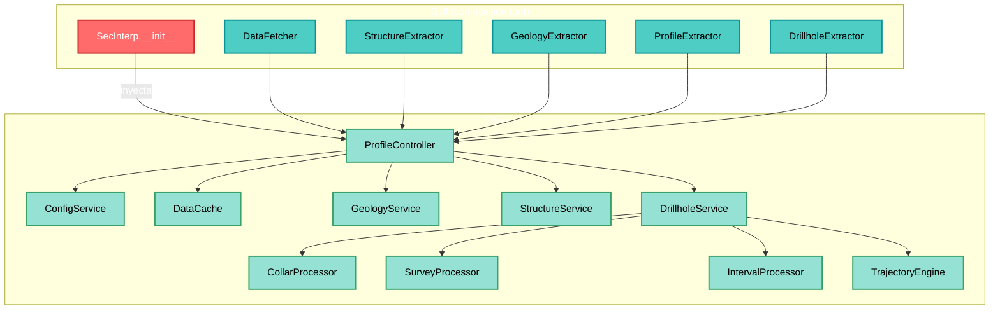
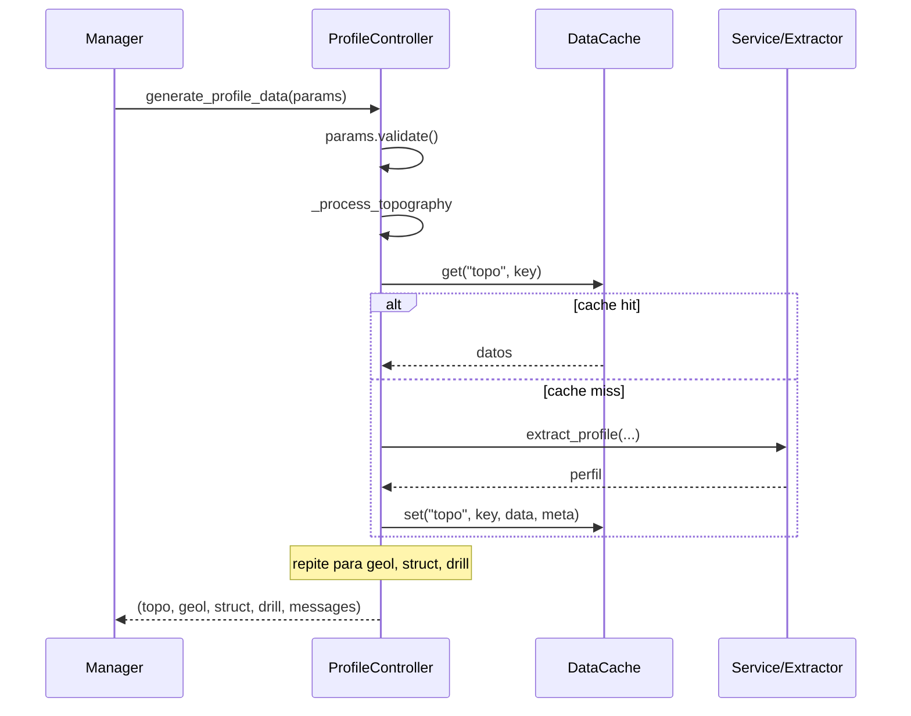

---
tags:
  - secinterp
  - code-walkthrough
  - core
  - orchestrator
  - caching
  - di
aliases:
  - controller.py
  - ProfileController
cssclass: secinterp-note
note_lines: 700
---

# `core/controller.py`

> [!abstract] Resumen en una línea
> Orquestador central del core: coordina los cuatro dominios (topografía, geología, estructuras, sondajes) con **adapters inyectados** y un **caché granular por componente**, devolviendo una tupla unificada de resultados.

**Ruta**: `core/controller.py` (425 líneas)
**Clase principal**: `ProfileController(TranslatableMixin)`
**Capa**: Core (QGIS-agnóstico)
**Tags**: #secinterp #core #orchestrator #caching #di

---

## 🎯 ¿Por qué existe este archivo?

Sin un punto único de orquestación, cada dominio se invocaría por separado y la GUI
tendría que conocer los detalles de cada servicio. El controller centraliza:

| Problema | Solución |
|----------|----------|
| Coordinar 4 dominios de datos con una sola llamada | `generate_profile_data(params)` |
| Evitar recomputar lo que no cambió | Caché granular por namespace (`topo`, `geol`, `struct`, `drill`) |
| No acoplar el core a QGIS | Extractors inyectados por constructor (DI) |
| Acumular estado para la UI sin Qt | Lista `messages` devuelta al final |

> [!important] QGIS-agnóstico verificado
> `controller.py` no importa nada de `qgis.*`. Toda interacción con capas ocurre vía
> los extractors inyectados (`gui/adapters/*`) y los servicios puros. Es el patrón
> **Extract-then-Compute** aplicado en su forma más explícita.

---

## 🧬 Arquitectura de orquestación



---

## 📦 Imports — lectura arquitectónica

```python
import hashlib
import time
from typing import Any

from sec_interp.core.config import ConfigService          # ①
from sec_interp.core.data_cache import DataCache
from sec_interp.core.domain import (                       # ②
    DrillholeProjection, GeologySegment, PreviewParams, StructureMeasurement,
)
from sec_interp.core.exceptions import ProcessingError
from sec_interp.core.utils.i18n import TranslatableMixin
from sec_interp.core.utils.safe_loader import SafeLoader
from sec_interp.logger_config import get_logger
```

| # | Observación |
|---|-------------|
| ① | Solo stdlib + dependencias internas del core. **Cero `qgis.*`**. |
| ② | Los DTOs del dominio (`PreviewParams`, `GeologySegment`…) definen los contratos de datos. |

---

## 🏗️ Inventario de estructura

**Clases:** `class ProfileController(TranslatableMixin)` — 13 métodos

**Funciones/Métodos:**
- `__init__(data_fetcher, structure_extractor, geology_extractor, profile_extractor, drillhole_extractor)`
- `reload_settings()`
- `get_cached_data(inputs)` / `cache_data(inputs, data)`
- `generate_profile_data(params)`
- `_get_cache_sub_key(param_values)`
- `_process_topography(...)`, `_process_geology(...)`, `_process_structures(...)`, `_process_drillholes(...)`

---

## 📖 Recorrido método por método

### `__init__` — Inyección de dependencias

```python
def __init__(
    self,
    data_fetcher=None,
    structure_extractor=None,
    geology_extractor=None,
    profile_extractor=None,
    drillhole_extractor=None,
) -> None:
```

Recibe los cinco adapters desde el composition root (GUI) y los guarda como atributos.
Instancia `ConfigService` y `DataCache` directamente (dependencias propias del core) y
luego **carga de forma lazy** los servicios/procesadores:

```python
self.collar_processor   = SafeLoader.lazy_load("...collar_processor", "CollarProcessor")
self.survey_processor   = SafeLoader.lazy_load("...survey_processor", "SurveyProcessor")
self.interval_processor = SafeLoader.lazy_load("...interval_processor", "IntervalProcessor")
self.trajectory_engine  = SafeLoader.lazy_load("...trajectory_engine", "TrajectoryEngine")

self.geology_service  = SafeLoader.lazy_load("...geology_service", "GeologyService")
self.structure_service = SafeLoader.lazy_load("...structure_service", "StructureService")
self.drillhole_service = SafeLoader.lazy_load(
    "...drillhole_service", "DrillholeService",
    collar_processor=self.collar_processor,
    survey_processor=self.survey_processor,
    interval_processor=self.interval_processor,
    data_fetcher=self.data_fetcher,
    trajectory_engine=self.trajectory_engine,
)
```

> [!tip] Composición de servicios
> `DrillholeService` recibe sus 4 colaboradores por constructor (Facade). Ver
> [[drillhole_service]] para el desglose del sub-sistema.

> [!note] `data_fetcher` cruza capas
> El `DataFetcher` (GUI) se pasa **dos veces**: al controller y a `DrillholeService`.
> Es el adapter de más bajo nivel para obtener features de QGIS.

### `reload_settings`

```python
def reload_settings(self) -> None:
    self.settings = self.config_service.get_all_settings(reload=True)
```

Forza la recarga de settings desde `ConfigService` (QgsSettings). Se llama al final de
`__init__` y cuando la GUI detecta un cambio de configuración.

### `get_cached_data` / `cache_data` — API pública legacy

```python
def get_cached_data(self, inputs: dict[str, Any]) -> dict[str, Any] | None:
    cache_key = self.data_cache.get_cache_key(inputs)
    return self.data_cache.get("main", cache_key)
```

Par público que opera sobre el namespace `main` del caché. Es la **API legacy**:
`generate_profile_data` usa internamente los namespaces granulares (`topo`, `geol`,
`struct`, `drill`), mientras este par expone un caché "todo-o-nada" por `inputs`.

### `generate_profile_data` — Orquestación principal

```python
def generate_profile_data(self, params: PreviewParams) -> tuple[...]:
    params.validate()
    messages: list[str] = []
    cache_meta = {"max_points": params.max_points, "canvas_width": params.canvas_width, "timestamp": time.time()}

    profile_data   = self._process_topography(params, cache_meta, messages)   # 1
    geol_data      = self._process_geology(params, cache_meta, messages)      # 2
    struct_data    = self._process_structures(params, cache_meta, messages)   # 3
    drillhole_data = self._process_drillholes(params, cache_meta, messages)   # 4

    return profile_data, geol_data, struct_data, drillhole_data, messages
```



> [!important] Caché granular por componente
> Cada dominio tiene su **propio namespace**: `topo`, `geol`, `struct`, `drill` (y
> `main`). Si solo cambia la geología, la topografía se sirve de caché — no se recalcula.

### `_get_cache_sub_key` — Clave de caché

```python
def _get_cache_sub_key(self, param_values: list[Any]) -> str:
    hasher = hashlib.md5()  # nosec B324
    for val in param_values:
        if hasattr(val, "id"):
            val = val.id()
        hasher.update(str(val).encode("utf-8"))
    return hasher.hexdigest()
```

| Detalle | Razón |
|---------|-------|
| **MD5** | No es seguridad, es clave de caché → `# nosec B324` (Bandit) |
| `hasattr(val, "id")` | Una capa QGIS se identifica por su `id()`, no por su `repr` |
| `str(val)` | Normaliza int/float/str a texto |

> [!warning] `MD5` y el linter de seguridad
> Bandit marca `hashlib.md5` como `B324`. Aquí no es criptografía: es una clave de
> caché. El comentario `# nosec B324` documenta y suprime la alerta.

### `_process_topography` — Topografía (obligatoria)

```python
topo_key = self._get_cache_sub_key([params.band_num, params.max_points])
profile_data = self.data_cache.get("topo", topo_key)
if profile_data:
    logger.debug("Cache hit: Topography")
else:
    line_lyr = params.line_layer
    raster_lyr = params.raster_layer
    if not line_lyr or not raster_lyr:
        raise ProcessingError(self.tr("Required layers for topography are missing."))
    if not self.profile_extractor:
        raise ProcessingError(self.tr("Topography service failed to load."))
    profile_data = self.profile_extractor.extract_profile(line_lyr, raster_lyr, params.band_num)
    if not profile_data:
        raise ProcessingError(self.tr("No topographic profile data was generated."))
self.data_cache.set("topo", topo_key, profile_data, cache_meta)
messages.append(self.tr("✓ Data processed successfully!\n\nTopography: {0} points").format(len(profile_data)))
```

| Característica | Detalle |
|----------------|---------|
| **Obligatorio** | Lanza `ProcessingError` si falta capa o servicio (a diferencia del resto) |
| **Clave** | `[band_num, max_points]` |
| **Adapter** | `profile_extractor.extract_profile(...)` (fase Extract) |

> [!note] Por qué topografía es "obligatoria"
> Es la base de la sección. Sin perfil topográfico no hay nada que mostrar, por eso
> falla rápido en vez de devolver `None`.

### `_process_geology` — Geología (opcional)

```python
if not params.outcrop_layer:
    return None                       # opcional

geol_key = self._get_cache_sub_key([params.outcrop_layer, params.outcrop_name_field, params.band_num])
geol_data = self.data_cache.get("geol", geol_key)
if geol_data:
    messages.append(self.tr("Geology: {0} segments").format(len(geol_data)))
else:
    if not all([line_lyr, raster_lyr, outcrop_lyr]):
        return None
    if not self.geology_service or not self.geology_extractor:
        messages.append(self.tr("Geology: Service failed to load"))
        return None
    context = self.geology_extractor.extract_context(...)   # EXTRACT
    geol_data = self.geology_service.build_segments(context) # COMPUTE
```

> [!important] Patrón Extract-then-Compute explícito
> `geology_extractor.extract_context(...)` convierte capas QGIS en un *context* puro;
> `geology_service.build_segments(context)` es **cálculo puro**. Ver [[geology_service]].

### `_process_structures` — Estructuras (opcional)

```python
ctx = self.structure_extractor.extract_section_and_structures(line_lyr, struct_lyr, params.buffer_dist)
if ctx is None:
    return None

def elevation_sampler(x: float, y: float) -> float:
    return self.structure_extractor.sample_elevation(raster_lyr, x, y, params.band_num)

struct_data = self.structure_service.project_structures(
    line_points=ctx.line_points,
    struct_data=ctx.structures,
    elevation_sampler=elevation_sampler,   # ← inyección de callback
    line_az=ctx.line_azimuth,
    dip_field=params.dip_field,
    strike_field=params.strike_field,
)
```

> [!tip] Closure como estrategia de muestreo
> `elevation_sampler` es una **closure** que encapsula el acceso al raster. Así
> `structure_service.project_structures` (core puro) obtiene elevaciones **sin conocer
> QGIS**: solo llama `elevation_sampler(x, y)`. Inversión de dependencias en acción.

### `_process_drillholes` — Sondajes (opcional)

```python
if not params.collar_layer:
    return None                       # opcional

drill_key = self._get_cache_sub_key([params.collar_layer, params.survey_layer, params.interval_layer, params.buffer_dist])
drillhole_data = self.data_cache.get("drill", drill_key)
if drillhole_data:
    return drillhole_data

survey_fields   = {"id": ..., "depth": ..., "azim": ..., "incl": ...}
interval_fields = {"id": ..., "from": ..., "to": ..., "lith": ...}

context = self.drillhole_extractor.extract_context(
    params.line_layer, params.buffer_dist, params.collar_layer, params.collar_id_field,
    params.collar_use_geometry, params.collar_x_field, params.collar_y_field,
    params.collar_z_field, params.collar_depth_field, params.survey_layer, survey_fields,
    params.interval_layer, interval_fields, params.raster_layer, params.band_num,
)
if context is None:
    return None

_, drillhole_data = self.drillhole_service.process_context(context)   # COMPUTE
```

| Característica | Detalle |
|----------------|---------|
| **Clave** | `[collar_layer, survey_layer, interval_layer, buffer_dist]` |
| **Campos** | Se agrupan en dicts `survey_fields` / `interval_fields` |
| **Retorno** | `process_context` devuelve `(algo, drillhole_data)`; solo interesa el segundo |

> [!note] Por qué `_, drillhole_data = ...`
> `process_context` devuelve una tupla; `_` descarta explícitamente lo no usado.

---

## 🔄 Flujo de datos

| Fase | Entrada | Transformación | Salida |
|------|---------|----------------|--------|
| Validación | `PreviewParams` | `params.validate()` | lanza `ValidationError` si es inválido |
| Topografía | `line_lyr`, `raster_lyr` | `extract_profile` | `list[(dist, elev)]` |
| Geología | context geológico | `build_segments` | `list[GeologySegment]` |
| Estructuras | context estructural + callback | `project_structures` | `list[StructureMeasurement]` |
| Sondajes | `DrillholeContext` | `process_context` | `list[DrillholeProjection]` |

---

## 🗄️ Estrategia de caché

`DataCache` se usa con **namespaces** y **claves**:

| Namespace | Clave | Contenido |
|-----------|-------|-----------|
| `main` | hash de `inputs` (dict) | Resultado completo (API pública legacy) |
| `topo` | hash `[band_num, max_points]` | Perfil topográfico |
| `geol` | hash `[outcrop_layer, name_field, band_num]` | Segmentos geológicos |
| `struct` | hash `[struct_layer, buffer, dip, strike, band_num]` | Mediciones proyectadas |
| `drill` | hash `[collar, survey, interval, buffer]` | Sondajes proyectados |

> [!important] Cache-aside
> Patrón **consultar → si miss, calcular → almacenar**. `cache_meta`
> (`max_points`, `canvas_width`, `timestamp`) se guarda junto al dato para invalidación
> por LOD.

---

## 🏛️ Patrones de diseño presentes

| Patrón | Dónde | Propósito |
|--------|-------|-----------|
| **Orchestrator / Facade** | `generate_profile_data` | Coordina 4 dominios con una sola entrada |
| **Dependency Injection** | `__init__` | Recibe los extractors desde el composition root |
| **Cache-Aside** | `_process_*` | Consultar / calcular / almacenar |
| **Template Method** | `_process_*` | Misma estructura: key → cache → compute → message |
| **Strategy (callback)** | `elevation_sampler` | Inyecta el muestreo de elevación |
| **Fault-tolerant Factory** | `SafeLoader.lazy_load` | Servicios opcionales sin crash |
| **Mixin** | `TranslatableMixin` | `self.tr()` en mensajes |

---

## 🧾 Resumen de la API

| Método | Tipo | Responsabilidad |
|--------|------|-----------------|
| `__init__(...)` | constructor | DI de extractors + servicios lazy |
| `reload_settings()` | config | Recarga settings desde `ConfigService` |
| `get_cached_data(inputs)` | cache | Lee del namespace `main` |
| `cache_data(inputs, data)` | cache | Escribe en el namespace `main` |
| `generate_profile_data(params)` | principal | Orquesta los 4 dominios |
| `_get_cache_sub_key(values)` | helper | Clave MD5 normalizada |
| `_process_topography(...)` | privado | Topografía (obligatoria) |
| `_process_geology(...)` | privado | Geología (opcional) |
| `_process_structures(...)` | privado | Estructuras (opcional) |
| `_process_drillholes(...)` | privado | Sondajes (opcional) |

---

## 🛡️ Manejo de errores

| Situación | Comportamiento |
|-----------|----------------|
| `params` inválidos | `params.validate()` lanza `ValidationError` |
| Topografía sin capas/servicio | Lanza `ProcessingError` (obligatoria) |
| Geología/Estructuras/Sondajes sin capas | Devuelve `None` (opcionales, no fallan) |
| Servicio lazy no cargado | Mensaje "Service failed to load" + `None` (no crash) |

> [!warning] Inconsistencia "obligatorio" vs "opcional"
> La topografía **lanza**; el resto **devuelve `None`**. Es una decisión intencional
> (topo = base), pero conviene documentarla como política explícita.

---

## 🧪 Tests asociados

Mapeo a `tests/core/test_controller.py` (mock-first, sin QGIS):

- `test_generate_profile_data_full` — los 4 dominios con mocks de extractors.
- `test_topography_missing_layers_raises` — `ProcessingError` sin capas.
- `test_geology_optional_none` — sin `outcrop_layer` → `None`.
- `test_cache_hit_skips_extract` — segunda llamada no invoca el extractor.
- `test_cache_sub_key_layer_id` — la clave usa `layer.id()`.

---

## 👀 Observaciones y notas

> [!success] Fortalezas
> - **Cero QGIS** en el controller → testeable sin entorno QGIS.
> - Caché granular: cambiar un dominio no invalida los demás.
> - DI limpia: los adapters entran por constructor.
> - Inversión de dependencias real (`elevation_sampler`).

> [!warning] Puntos de atención
> - `_process_*` comparten estructura repetitiva (candidatos a un template genérico).
> - `_get_cache_sub_key` usa `md5` (no FIPS-safe); considerar `usedforsecurity=False`.
> - `get_cached_data`/`cache_data` (namespace `main`) parecen legacy frente a las sub-claves.
> - Mezcla "lanza vs `None`" entre topografía y el resto (inconsistente).
> - Los mensajes de UI (`✓ Data processed...`) se construyen en el core; la UI debería formatear.

> [!question] Preguntas abiertas
> - ¿Unificar el manejo "opcional vs obligatorio" con una política explícita?
> - ¿Mover el formateo de mensajes a la capa GUI?
> - ¿Eliminar la API legacy `main` en favor de los namespaces granulares?

---

## 🔗 Notas relacionadas

- [[Index]] — índice de la bóveda
- [[sec_interp_plugin]] — composition root que inyecta los adapters
- [[domain]] — DTOs (`PreviewParams`, `GeologySegment`…)
- [[exceptions]] — `ProcessingError`
- [[preview_service]] / [[geology_service]] / [[drillhole_service]] / [[structure_service]]
- [[gui_adapters]] — extractors de la fase Extract
- [[data_cache]] — caché por buckets
- [[ARCHITECTURE_EN]] — arquitectura general

---

*Nota de la bóveda SecInterp Code Walkthrough v2 — v3.8.0*
