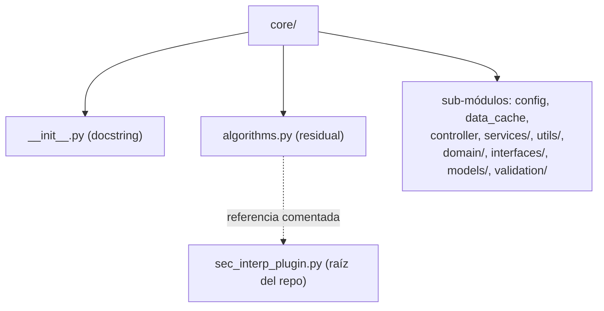

---
tags:
  - secinterp
  - code-walkthrough
  - core
  - general
aliases:
  - core/__init__.py
  - algorithms.py
  - core/
cssclass: secinterp-note
---

# `core/` — Paquete Raíz del Núcleo

> [!abstract] Resumen en una línea
> Paquete `core/` (2 archivos): `__init__.py`, `algorithms.py` — la **raíz del núcleo** de SecInterp: un docstring que marca la capa de negocio QGIS-agnóstica y un módulo `algorithms.py` reservado (residual) para algoritmos puros.

**Ruta**: `core/` (2 archivos, 20 líneas)
**Clase/Función principal**: *(ninguna — paquete de organización)*
**Capa**: Core (QGIS-agnóstico)
**Tags**: #secinterp #core #general

---

## 🎯 ¿Por qué existe este paquete?

`core/` es el **contenedor raíz** de toda la lógica de negocio del plugin. Su `__init__.py`
declara el propósito de la capa, y `algorithms.py` es un marcador residual que recuerda la
separación histórica entre lógica y UI.

| Problema | Solución |
|----------|----------|
| Declarar dónde vive la lógica de negocio | `core/__init__.py` con docstring |
| Separar la clase principal del plugin de la UI | `algorithms.py` apunta a `sec_interp_plugin.py` |
| Marcar el límite Core/GUI | Docstring "business logic, algorithms, utilities" |
| Evitar que la UI contamine el núcleo | Capa `core/` QGIS-agnóstica |

> [!important] Nota arquitectónica — raíz de la capa QGIS-agnóstica
> `core/` es la capa que **no debe** importar QGIS (ver `core/AGENTS.md`). Su `__init__.py`
> es deliberadamente mínimo (solo docstring): no re-exporta sub-módulos, dejando que cada
> consumidor importe el módulo concreto que necesita.

---

## 🧬 Diagrama de relaciones



> [!tip] Cómo leer
> Sólida = contiene. El paquete `core/` contiene el `__init__.py`, `algorithms.py` y todos
> los sub-módulos reales. `algorithms.py` solo **referencia** (en comentario) a
> `sec_interp_plugin.py`, no lo importa.

---

## 📦 Imports — lectura arquitectónica

```python
# core/__init__.py
from __future__ import annotations
"""Core module for SecInterp plugin.

Contains business logic, algorithms, and utilities.
"""

# core/algorithms.py
from __future__ import annotations

# The SecInterp class has been moved to sec_interp_plugin.py
# Import it from there if needed:
# from sec_interp.sec_interp_plugin import SecInterp
```

| # | Observación |
|---|-------------|
| ① | `__init__.py` importa solo `annotations` (sin re-exports ni `__all__`). |
| ② | `algorithms.py` no importa nada funcional: el `import` a `SecInterp` está **comentado**. |
| ③ | Ninguno importa QGIS — la capa raíz es 100% agnóstica. |

---

## 🏗️ Inventario de estructura

**Clases:** ninguna en los dos archivos de esta nota.

**Funciones/Métodos:** ninguno.

**Constantes:** ninguna.

**Contenido:**
- `core/__init__.py` — docstring de paquete (6 líneas).
- `core/algorithms.py` — docstring + referencia comentada (14 líneas).

---

## 📁 Archivos del paquete

| Archivo | Líneas | Rol |
|---------|--:|---|
| [[#__init__.py|__init__.py]] | 6 | Docstring del paquete raíz; sin re-exports |
| [[#algorithms.py|algorithms.py]] | 14 | Marcador residual; apunta a `sec_interp_plugin.py` |

> [!note] Los sub-módulos reales tienen nota propia
> `config.py` ([[config]]), `data_cache.py` ([[data_cache]]), `controller.py`
> ([[controller]]), `services/` ([[core_services]]), `utils/` ([[core_utils]]), `domain/`
> ([[domain]]), `interfaces/` ([[core_interfaces]]), `models/` ([[core_models]]),
> `validation/` ([[core_validation]]). Esta nota cubre solo los dos archivos raíz.

---

## 📖 Recorrido

### `__init__.py`

```python
from __future__ import annotations

"""Core module for SecInterp plugin.

Contains business logic, algorithms, and utilities.
"""
```

Documenta el propósito del paquete en **una frase**: contiene la lógica de negocio, los
algoritmos y las utilidades. Nota estilística: el docstring aparece **después** del
`from __future__ import annotations` (no es un docstring de módulo en sentido estricto,
sino un string literal suelto tras el import).

> [!warning] `from __future__` antes del docstring
> Convencionalmente el docstring de módulo debe ir **antes** de cualquier import. Aquí va
> después de `from __future__ import annotations`, por lo que Python no lo registra como
> `__doc__` del módulo. Es un detalle cosmético sin impacto funcional.

### `algorithms.py`

```python
"""Core algorithms module.

IMPORTANT: The main SecInterp plugin class has been moved to sec_interp_plugin.py
in the plugin root directory to separate UI/QGIS integration logic from core
business logic.

This module is reserved for pure business logic algorithms without UI dependencies.
"""

from __future__ import annotations

# The SecInterp class has been moved to sec_interp_plugin.py
# Import it from there if needed:
# from sec_interp.sec_interp_plugin import SecInterp
```

Módulo **residual/marcador**: su docstring explica que la clase principal `SecInterp` se
movió a `sec_interp_plugin.py` (raíz del repo) para separar la integración UI/QGIS de la
lógica de negocio. El `import` real está **comentado**, de modo que `algorithms.py` no
ejecuta ni importa nada.

> [!important] Evidencia de refactor histórico
> `algorithms.py` es una "nota de migración" viviente: recuerda a futuros desarrolladores
> que la clase `SecInterp` ya no vive aquí. Es el resultado de un refactor que separó la
> lógica (core) de la integración QGIS (plugin raíz). Ver [[sec_interp_plugin]] si existe.

---

## 🔄 Flujo de datos

| Fase | Entrada | Transformación | Salida |
|-------|---------|----------------|--------|
| (conceptual) | — | — | — |

> [!note] Sin flujo de datos propio
> Los dos archivos raíz no procesan datos. El flujo real vive en los sub-módulos
> (`controller`, servicios, etc.), documentados en sus notas.

---

## 🏛️ Patrones de diseño presentes

| Patrón | Dónde | Propósito |
|--------|-------|-----------|
| **Package-by-layer** | `core/` | Agrupar la capa de negocio completa |
| **Package docstring** | `__init__.py` | Documentar el propósito de la capa |
| **Migration marker** | `algorithms.py` | Dejar constancia de dónde se movió la clase |

---

## 🧾 Resumen de la API

| Símbolo | Firma / Hereda | Uso típico |
|---------|----------------|------------|
| *(ninguno)* | — | — |

> [!warning] Sin API en los archivos raíz
> `core/__init__.py` y `core/algorithms.py` **no exportan** nada. La API real del core está
> repartida en los sub-módulos (`ConfigService`, `DataCache`, servicios, etc.).

---

## 🛡️ Manejo de errores

Sin código ejecutable → sin manejo de errores. El único escenario problemático sería que
alguien descomente `from sec_interp.sec_interp_plugin import SecInterp` sin que ese módulo
exista en la ruta esperada, lo que lanzaría `ImportError`.

---

## 🧪 Tests asociados

No hay tests específicos para los archivos raíz. La **frontera arquitectónica** que declaran
sí se testea:

- `tests/core/test_architecture_boundary.py` — verifica que `core/` no importa QGIS.

> [!note] El docstring como contrato implícito
> La frase "Contains business logic, algorithms, and utilities" es el contrato que el test
> de arquitectura hace cumplir: nada de UI/QGIS debe entrar en esta capa.

---

## 📐 Mapa de sub-módulos del core

Vista rápida de qué contiene cada sub-paquete/módulo de `core/`:

| Sub-módulo | Nota | Contenido principal |
|-----------|------|---------------------|
| `config.py` | [[config]] | `ConfigService` (persistencia) |
| `data_cache.py` | [[data_cache]] | `DataCache` (caché) |
| `controller.py` | [[controller]] | `ProfileController` (orquestador) |
| `domain/` | [[domain]] | DTOs, entidades, contextos |
| `interfaces/` | [[core_interfaces]] | Contratos (`I*Service`) |
| `models/` | [[core_models]] | `settings_model` (modelos) |
| `services/` | [[core_services]] | Servicios de negocio |
| `utils/` | [[core_utils]] | Utilidades puras |
| `validation/` | [[core_validation]] | Validadores |

---

## 👀 Observaciones y notas

> [!success] Fortalezas
> - Raíz mínima y clara: solo docstring + marcador residual.
> - `algorithms.py` documenta honestamente el refactor de `SecInterp`.
> - Sin re-exports en el `__init__` (evita acoplamiento de la capa).

> [!warning] Puntos de atención
> - `algorithms.py` es **código muerto** (solo comentarios): candidato a eliminarse.
> - El docstring de `__init__.py` va después de `from __future__` (no se registra como
>   `__doc__`).
> - La frase "algorithms and utilities" es algo vaga: no enumera los sub-módulos.

> [!question] Preguntas abiertas
> - ¿Eliminar `algorithms.py` (código muerto) o convertirlo en un re-export de algoritmos
>   reales?
> - ¿Mover el docstring de `__init__.py` antes de `from __future__` para que sea un
>   docstring de módulo válido?

---

## 📐 Reglas de la capa core (de `core/AGENTS.md`)

El `__init__.py` declara la capa; el `core/AGENTS.md` anidado define sus **restricciones
absolutas**. Este paquete raíz es la frontera donde se aplican:

| Regla (NUNCA) | Motivo |
|---------------|--------|
| `from qgis.core import *` | Mantener la capa QGIS-agnóstica |
| `from qgis.gui import *` | La GUI no puede entrar en el core |
| `QgsProject.instance()` | Sin estado global de QGIS |
| `iface.mapCanvas()` | `iface` es de la GUI |
| `import PyQt5 / PyQt6` | Solo stdlib en el core |

> [!important] Excepciones documentadas
> `config.py` (`QgsSettings`) y `data_cache.py` (`QCoreApplication`) importan QGIS de forma
> **acotada y explícita** (no `import *`). Son *gray areas* descritas en [[config]] y
> [[data_cache]]. El resto del core debe cumplir la regla al 100%.

---

## 🧭 Historia del refactor: `SecInterp` → `sec_interp_plugin.py`

`algorithms.py` es la **cicatriz** de un refactor importante:

1. **Antes**: la clase principal `SecInterp` (que mezclaba lógica y UI) vivía en `core/`.
2. **Refactor**: se movió a `sec_interp_plugin.py` (raíz del repo) para separar la
   integración UI/QGIS de la lógica de negocio.
3. **Ahora**: `algorithms.py` queda como marcador residual que recuerda el cambio y reserva
   el nombre para "algoritmos puros".

> [!note] Por qué no se borró
> Eliminar `algorithms.py` es seguro (no importa nada), pero el equipo lo dejó como
> documentación viviente: cualquier desarrollador que busque la clase `SecInterp` en `core/`
> encuentra la pista que apunta a `sec_interp_plugin.py`.

---

## 📦 Cómo se importa `core` en el código real

Los consumidores importan sub-módulos concretos de `core`, nunca `core` a secas:

```python
from sec_interp.core.config import ConfigService
from sec_interp.core.data_cache import DataCache
from sec_interp.core.controller import ProfileController
from sec_interp.core.domain import GeologyContext
from sec_interp.core.models.settings_model import PluginSettings
```

> [!tip] `core` no es un punto de import
> No existe `from sec_interp.core import ConfigService` (el `__init__.py` no re-exporta).
> El paquete es solo un **contenedor jerárquico**; cada módulo se importa por su ruta.

---

## 🌐 i18n y notas de migración

- **Sin cadenas de usuario** en los archivos raíz: solo docstrings en inglés.
- **`algorithms.py` es candidato a borrado**: si se decide eliminarlo, hay que asegurarse de
  que nada lo importe (hoy no lo importa nadie).
- **Docstring de `__init__.py`**: por ir después de `from __future__`, no se registra como
  `__doc__`; si se quiere exponer vía `help(sec_interp.core)`, conviene moverlo al inicio.

---

## 📂 Árbol de directorios del core

El paquete raíz `core/` contiene, además de los dos archivos de esta nota, toda la capa de
negocio. Vista estructural (módulos, no líneas):

```
core/
├── __init__.py              # docstring del paquete (esta nota)
├── algorithms.py            # marcador residual (esta nota)
├── config.py                # ConfigService
├── controller.py            # ProfileController
├── data_cache.py            # DataCache
├── exceptions.py            # jerarquía de errores
├── performance_metrics.py   # MetricsCollector
├── domain/                  # entidades, DTOs, contextos
│   ├── __init__.py          # facade (__all__)
│   ├── dtos.py / entities.py / task_inputs.py
│   └── enums.py / spatial_meta.py
├── interfaces/              # contratos (I*Service)
├── models/                  # settings_model (namespace)
├── services/                # servicios de negocio
├── utils/                   # utilidades puras
└── validation/              # validadores
```

> [!note] 8 archivos raíz + 6 sub-paquetes
> El core tiene 8 módulos raíz (`__init__`, `algorithms`, `config`, `controller`,
> `data_cache`, `exceptions`, `performance_metrics`) y 6 sub-paquetes (`domain`,
> `interfaces`, `models`, `services`, `utils`, `validation`).

---

## 📐 Cómo crece la capa core

Regla práctica para decidir dónde colocar un módulo nuevo dentro de `core/`:

| Si el módulo… | Ubicación |
|---------------|-----------|
| Define tipos de negocio (entidades/DTOs/contextos) | `core/domain/` |
| Declara un contrato (`I*Service`, `Protocol`, `ABC`) | `core/interfaces/` |
| Implementa un servicio de negocio | `core/services/` |
| Es una utilidad pura sin estado | `core/utils/` |
| Valida entradas/capas/campos | `core/validation/` |
| Representa estado persistente/modelos | `core/models/` |
| Es infraestructura transversal (caché, config, errores) | raíz de `core/` |

> [!tip] La raíz solo para transversales
> Los módulos raíz (`config`, `data_cache`, `exceptions`, `performance_metrics`) son
> **transversales**: los usan varios sub-paquetes. El resto se agrupa por responsabilidad en
> sub-paquetes. Ver [[project_structure]] para el mapa completo.

---

## 🧭 Referencia de los dos archivos raíz

| Archivo | Contenido real | Importancia |
|---------|----------------|-------------|
| `__init__.py` | `from __future__ import annotations` + docstring | Declara la capa |
| `algorithms.py` | docstring + import comentado | Marcador de migración |

> [!note] Ambos son "documentación ejecutable"
> Ninguno aporta lógica: el `__init__` documenta el propósito de la capa y `algorithms.py`
> documenta el refactor de `SecInterp`. Son archivos de **intención**, no de comportamiento.

---

## 🔗 Notas relacionadas

- [[Index]] — índice de la bóveda
- [[config]] / [[data_cache]] / [[controller]] — módulos raíz del core
- [[domain]] / [[core_models]] — paquetes con otras convenciones de `__init__.py`
- [[core_interfaces]] — contratos del core
- [[core_services]] / [[core_utils]] / [[core_validation]] — resto de sub-paquetes
- [[project_structure]] — mapa completo del plugin

---

*Nota de la bóveda SecInterp Code Walkthrough v2 — v3.9.0*
