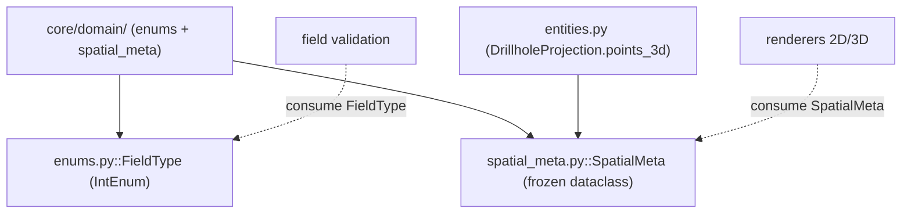

---
tags:
  - secinterp
  - code-walkthrough
  - core
  - domain
aliases:
  - core/domain/
  - enums.py
  - spatial_meta.py
  - FieldType
  - SpatialMeta
cssclass: secinterp-note
---

# `core/domain/` — Enums y Metadatos Espaciales

> [!abstract] Resumen en una línea
> Paquete `core/domain/` (2 archivos): `enums`, `spatial_meta` — los **tipos auxiliares del dominio** que no son entidades ni DTOs: `FieldType` (enum de tipos de campo sin PyQt) y `SpatialMeta` (metadatos espaciales puente entre 2D y 3D).

**Ruta**: `core/domain/` (2 archivos, 70 líneas)
**Clase/Función principal**: `FieldType`, `SpatialMeta`
**Capa**: Core (QGIS-agnóstico)
**Tags**: #secinterp #core #domain

---

## 🎯 ¿Por qué existe este paquete?

El dominio `core/domain/` tiene dos grandes grupos: los **datos de negocio** (entidades,
DTOs, contextos — ya documentados) y los **tipos auxiliares** que les dan soporte. Esta
nota cubre ese segundo grupo:

| Problema | Solución |
|----------|----------|
| Validar tipos de campo sin depender de `QVariant`/PyQt | `FieldType` (`IntEnum` con los valores de `QVariant.Type`) |
| Llevar coordenadas 2D y 3D sin objetos QGIS | `SpatialMeta` (dataclass `frozen`) |
| Puente entre perfil 2D y motores 3D | `SpatialMeta.to_vec3` / `to_vec2_profile` |
| Normalizar vectores de orientación sin capas | `norm_x` / `norm_y` en `SpatialMeta` |

> [!important] Nota arquitectónica — QGIS-agnóstico por diseño
> `FieldType` replica los **valores numéricos** de `QVariant.Type` (de PyQt) como constantes
> propias, para poder validar tipos sin importar PyQt. `SpatialMeta` transporta coordenadas
> y vectores normalizados como primitivos. Ninguno importa QGIS.

---

## 🧬 Diagrama de relaciones



> [!tip] Cómo leer
> Sólida = importa; punteada = consume. `SpatialMeta` es importado por `entities.py`
> (`DrillholeProjection.points_3d`) y consumido por los renderers. `FieldType` lo consumen
> los validadores de campos.

---

## 📦 Imports — lectura arquitectónica

```python
# core/domain/enums.py
from __future__ import annotations
from enum import IntEnum

# core/domain/spatial_meta.py
from __future__ import annotations
from dataclasses import dataclass
from typing import Any
```

| # | Observación |
|---|-------------|
| ① | `enums.py` usa `IntEnum` (los miembros son `int`, comparables con los de `QVariant`). |
| ② | `spatial_meta.py` usa `dataclass(frozen=True)` — inmutabilidad para el DTO. |
| ③ | **Cero imports de QGIS**: solo stdlib (`enum`, `dataclasses`, `typing`). |

---

## 🏗️ Inventario de estructura

**Clases:**
- `class FieldType(IntEnum)` — 8 miembros
- `class SpatialMeta` — dataclass `frozen`, 2 métodos

**Miembros de `FieldType`:** `NULL`, `BOOL`, `INT`, `DOUBLE`, `STRING`, `LONG_LONG`,
`DATE`, `DATE_TIME`

**Métodos de `SpatialMeta`:** `to_vec3()`, `to_vec2_profile()`

---

## 📁 Archivos del paquete

| Archivo | Líneas | Rol |
|---------|--:|---|
| [[#FieldType\|enums.py]] | 22 | `FieldType` — enum de tipos de campo (sin PyQt) |
| [[#SpatialMeta\|spatial_meta.py]] | 48 | `SpatialMeta` — metadatos espaciales 2D/3D |

> [!note] Módulos del paquete con nota propia
> `dtos.py`, `entities.py`, `task_inputs.py` y `__init__.py` tienen notas individuales:
> [[dtos]], [[entities]], [[task_inputs]], [[domain]]. Esta nota cubre solo el grupo
> restante (`enums` + `spatial_meta`).

---

## 📖 Recorrido clase por clase

### FieldType

```python
class FieldType(IntEnum):
    NULL = 0
    BOOL = 1
    INT = 2
    DOUBLE = 6
    STRING = 10
    LONG_LONG = 4
    DATE = 14
    DATE_TIME = 16
```

Enum de **tipos de campo** con los mismos valores numéricos que `QVariant.Type` de PyQt,
pero sin importar PyQt. Permite al core validar el tipo de un campo (p. ej. si un campo es
`INT` o `STRING`) manteniéndose agnóstico.

| Miembro | Valor | Equivalente `QVariant` |
|---------|------:|------------------------|
| `NULL` | 0 | `QVariant.Invalid` |
| `BOOL` | 1 | `QVariant.Bool` |
| `INT` | 2 | `QVariant.Int` |
| `LONG_LONG` | 4 | `QVariant.LongLong` |
| `DOUBLE` | 6 | `QVariant.Double` |
| `STRING` | 10 | `QVariant.String` |
| `DATE` | 14 | `QVariant.Date` |
| `DATE_TIME` | 16 | `QVariant.DateTime` |

> [!note] Valores no contiguos
> Los valores saltan (`2 → 4 → 6 → 10`) porque replican **exactamente** los códigos de
> `QVariant.Type`. No son una secuencia arbitraria: es una tabla de correspondencia
> core-safe con PyQt.

### SpatialMeta

```python
@dataclass(frozen=True)
class SpatialMeta:
    hole_id: str | None = None
    dist_along: float = 0.0
    offset: float = 0.0
    z: float = 0.0
    x_3d: float | None = None
    y_3d: float | None = None
    x_proj: float | None = None
    y_proj: float | None = None
    norm_x: float | None = None
    norm_y: float | None = None
    attributes: dict[str, Any] | None = None

    def to_vec3(self) -> tuple[float, float, float]:
        return (self.x_3d or 0.0, self.y_3d or 0.0, self.z)

    def to_vec2_profile(self) -> tuple[float, float]:
        return (self.dist_along, self.z)
```

DTO **inmutable** (`frozen=True`) que actúa como puente entre el espacio global 3D y el
perfil 2D. Lleva coordenadas, vectores normalizados de orientación y atributos originales.

| Campo | Significado |
|-------|-------------|
| `hole_id` | identificador del sondaje |
| `dist_along` | distancia a lo largo de la línea de sección (estación) |
| `offset` | distancia ortogonal a la línea de sección |
| `z` | elevación / coordenada vertical |
| `x_3d` / `y_3d` | coordenadas globales 3D |
| `x_proj` / `y_proj` | proyección sobre la sección |
| `norm_x` / `norm_y` | componentes normalizados del vector de orientación |
| `attributes` | atributos originales del feature |

> [!tip] `frozen=True` lo hace hashable
> Al ser inmutable, `SpatialMeta` puede usarse como clave de dict o en un `set`, y no hay
> riesgo de mutación accidental en un hilo.

### `SpatialMeta.to_vec3()`

```python
def to_vec3(self) -> tuple[float, float, float]:
    return (self.x_3d or 0.0, self.y_3d or 0.0, self.z)
```

Convierte a vector 3D `(X, Y, Z)`. Los `or 0.0` normalizan los `None` de `x_3d`/`y_3d` a
cero (un punto sin coordenadas globales cae en el origen XY, conservando su Z).

### `SpatialMeta.to_vec2_profile()`

```python
def to_vec2_profile(self) -> tuple[float, float]:
    return (self.dist_along, self.z)
```

Convierte a vector de perfil `(distancia, elevación)`. Es la vista 2D que usan los
renderers de perfil, ignorando las coordenadas globales y el offset.

---

## 🔄 Flujo de datos

| Fase | Entrada | Transformación | Salida |
|------|---------|----------------|--------|
| Validación de campo | tipo de campo de una capa | comparación con `FieldType` | decisión de compatibilidad |
| Proyección 3D | punto a lo largo del sondaje | `SpatialMeta` + `to_vec3` | `(x, y, z)` |
| Render 2D | `SpatialMeta` | `to_vec2_profile` | `(dist, elev)` |

---

## 🏛️ Patrones de diseño presentes

| Patrón | Dónde | Propósito |
|--------|-------|-----------|
| **Value Object** | `SpatialMeta` (`frozen`) | DTO inmutable con helpers |
| **Type Enum** | `FieldType` | Tipos de campo como constantes |
| **Anti-corruption layer** | `FieldType` replica `QVariant` | Evitar dependencia de PyQt |
| **Convenience methods** | `to_vec3` / `to_vec2_profile` | Conversión de espacio sin repetir lógica |

---

## 🧾 Resumen de la API

| Símbolo | Firma / Hereda | Uso típico |
|---------|----------------|------------|
| `FieldType` | `IntEnum` | Validar tipos de campo |
| `FieldType.STRING` / `INT` / `DOUBLE` | miembro (`int`) | Comparación con tipos de capa |
| `SpatialMeta` | dataclass `frozen` | Metadatos espaciales 2D/3D |
| `SpatialMeta.to_vec3` | `() -> (float, float, float)` | Vector 3D global |
| `SpatialMeta.to_vec2_profile` | `() -> (float, float)` | Vector de perfil 2D |

---

## 🛡️ Manejo de errores

Sin manejo de errores propio: ambos son tipos de datos. `SpatialMeta.to_vec3()` resuelve
los `None` con `or 0.0` (nunca lanza). `FieldType` no valida por sí mismo; son los
validadores quienes comparan con sus miembros.

---

## 🧪 Tests asociados

No hay tests unitarios dedicados a `enums.py`/`spatial_meta.py` como archivos separados;
se cubren indirectamente:

- `tests/core/test_entities.py` — `DrillholeProjection.points_3d: list[SpatialMeta]`.
- `tests/core/test_field_validator.py` — usa `FieldType` (validación de campos).

> [!note] Cobertura implícita
> Al ser tipos simples, la cobertura real proviene de sus consumidores. Un test directo de
> `to_vec3`/`to_vec2_profile` sería trivial y de bajo coste, pero no existe hoy.

---

## 👀 Observaciones y notas

> [!success] Fortalezas
> - `FieldType` replica `QVariant.Type` sin importar PyQt: validación de tipos agnóstica.
> - `SpatialMeta` inmutable (`frozen`) y con helpers de conversión de espacio.
> - Cero dependencias de QGIS.

> [!warning] Puntos de atención
> - `FieldType` **duplica** los valores de `QVariant.Type` a mano: si PyQt cambia los
>   códigos, hay que actualizarlos (riesgo de desincronización).
> - `SpatialMeta` mezcla coordenadas globales (`x_3d`) y de perfil (`dist_along`): un solo
>   DTO con dos sistemas de coordenadas.
> - Valores no contiguos en `FieldType` pueden parecer un error si no se conoce el origen.

> [!question] Preguntas abiertas
> - ¿Generar `FieldType` desde `QVariant` dinámicamente en un módulo GUI, y mapear a un
>   enum core-safe?
> - ¿Separar `SpatialMeta` en `ProfileMeta` (2D) y `WorldMeta` (3D)?

---

## 🔢 Ejemplo de uso

```python
from sec_interp.core.domain import FieldType, SpatialMeta

# FieldType: validar que un campo es numérico (sin importar PyQt)
if field_type == FieldType.INT or field_type == FieldType.DOUBLE:
    sample_as_number(field)
elif field_type == FieldType.STRING:
    sample_as_text(field)

# SpatialMeta: un punto a lo largo de un sondaje, listo para 2D y 3D
meta = SpatialMeta(
    hole_id="DH-01",
    dist_along=15.5,
    offset=2.0,
    z=104.2,
    x_3d=500015.5,
    y_3d=4000002.0,
    norm_x=0.707,
    norm_y=0.707,
)

vec3d = meta.to_vec3()           # -> (500015.5, 4000002.0, 104.2)
vec2d = meta.to_vec2_profile()   # -> (15.5, 104.2)
```

> [!tip] El mismo `SpatialMeta` sirve a dos renderers
> Un renderer 3D llama `to_vec3()`, un renderer de perfil 2D llama `to_vec2_profile()`.
> Un solo DTO desacopla ambos motores de las capas originales.

---

## 📐 Tipos auxiliares vs entidades del dominio

`core/domain/` mezcla tres categorías de tipos. Esta nota cubre solo las **auxiliares**:

| Categoría | Archivos | Ejemplos | Nota |
|-----------|----------|----------|------|
| Entidades de negocio | `entities.py` | `GeologySegment`, `StructureMeasurement` | [[entities]] |
| DTOs de transporte | `dtos.py`, `task_inputs.py` | `PreviewParams`, `GeologyContext` | [[dtos]], [[task_inputs]] |
| **Tipos auxiliares** | `enums.py`, `spatial_meta.py` | `FieldType`, `SpatialMeta` | esta nota |

> [!note] Por qué auxiliares y no entidades
> Ni `FieldType` ni `SpatialMeta` representan un resultado geológico *per se*: uno es una
> tabla de tipos de campo, el otro un portador de coordenadas/vectores. Dan **soporte** a
> las entidades y a la validación, por eso se agrupan aparte.

---

## 📐 `FieldType` → escenario de uso

| Miembro | Escenario típico |
|---------|------------------|
| `NULL` | Campo vacío / no reconocido |
| `BOOL` | Flags (p. ej. `dh_use_geom`) |
| `INT` / `LONG_LONG` | Identificadores, contadores |
| `DOUBLE` | Coordenadas, medidas continuas |
| `STRING` | Nombres de unidad, códigos |
| `DATE` / `DATE_TIME` | Timestamps de medición |

> [!tip] El core valida sin conocer `QVariant`
> Gracias a esta tabla, un validador del core puede decir "este campo debe ser numérico"
> comparando con `FieldType.INT`/`DOUBLE`, sin importar PyQt. El mapeo `QVariant → FieldType`
> ocurre en la capa GUI.

---

## 🌐 i18n y notas de migración

- **Sin cadenas de usuario**: ambos tipos son datos; no hay mensajes que traducir.
- **Riesgo de desincronización**: `FieldType` replica manualmente los códigos de
  `QVariant.Type`. Cualquier actualización de PyQt/QGIS que cambie esos códigos exige
  actualizar esta tabla a mano.
- **Inmutabilidad**: `SpatialMeta(frozen=True)` no se puede mutar tras construirse; si un
  flujo necesita actualizar una coordenada, debe crear una nueva instancia.

---

## 🔬 ¿Por qué `IntEnum` y no `Enum`?

`FieldType` hereda de `IntEnum`, no de `Enum`. La diferencia importa:

| Aspecto | `Enum` | `IntEnum` |
|---------|--------|-----------|
| Comparación con `int` | No (`FieldType.INT != 2`) | Sí (`FieldType.INT == 2`) |
| Intercambio con PyQt | No | Sí (comparable con `QVariant.Type`) |
| Serialización | Nombre | Número entero |

> [!tip] `IntEnum` permite comparar con `QVariant.Type` sin importarlo
> Como `QVariant.Type` es también un `IntEnum` de PyQt, ambos comparten la base `int` y son
> comparables por valor. El core puede hacer `field_type == FieldType.INT` sin conocer el
> tipo PyQt real, porque en la GUI se hace el mapeo `QVariant.Type.INT → FieldType.INT`.

---

## 📐 Referencia completa de campos de `SpatialMeta`

| Campo | Tipo | Default | Rol |
|-------|------|---------|-----|
| `hole_id` | `str \| None` | `None` | identificador del sondaje |
| `dist_along` | `float` | `0.0` | distancia a lo largo de la sección |
| `offset` | `float` | `0.0` | distancia ortogonal a la sección |
| `z` | `float` | `0.0` | elevación / coordenada vertical |
| `x_3d` | `float \| None` | `None` | coordenada X global |
| `y_3d` | `float \| None` | `None` | coordenada Y global |
| `x_proj` | `float \| None` | `None` | proyección X sobre la sección |
| `y_proj` | `float \| None` | `None` | proyección Y sobre la sección |
| `norm_x` | `float \| None` | `None` | componente X normalizada |
| `norm_y` | `float \| None` | `None` | componente Y normalizada |
| `attributes` | `dict[str, Any] \| None` | `None` | atributos originales |

> [!note] Dos pares de coordenadas + un par de vectores
> `SpatialMeta` transporta **cuatro** sistemas relacionados: globales (`x_3d`/`y_3d`),
> proyectadas (`x_proj`/`y_proj`), de perfil (`dist_along`/`z`) y el vector normalizado de
> orientación (`norm_x`/`norm_y`). Es la razón por la que sirve de puente entre 2D y 3D.

---

## 🔗 Notas relacionadas

- [[Index]] — índice de la bóveda
- [[entities]] — `DrillholeProjection` usa `list[SpatialMeta]`
- [[domain]] — facade del paquete que re-exporta `FieldType` y `SpatialMeta`
- [[task_inputs]] — contextos que viajan junto a estos metadatos
- [[dtos]] — `PreviewResult`/`PreviewParams`
- [[field_validator]] — validador que usa `FieldType`

---

*Nota de la bóveda SecInterp Code Walkthrough v2 — v3.9.1*
