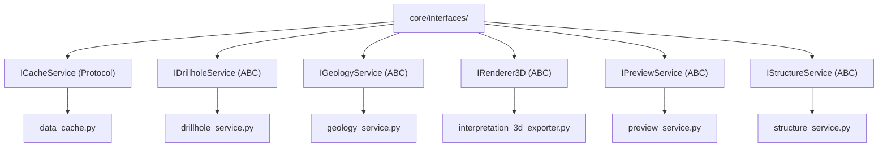

---
tags:
  - secinterp
  - code-walkthrough
  - core
  - interfaces
  - ports
aliases:
  - core/interfaces/
  - ICacheService
  - IDrillholeService
  - IGeologyService
  - IRenderer3D
  - IPreviewService
  - IStructureService
cssclass: secinterp-note
---

# `core/interfaces/` — Contratos de Servicios (Puertos)

> [!abstract] Resumen en una línea
> Paquete que declara los **puertos** (contratos) del core: ABCs y Protocols que definen *qué* debe saber hacer cada servicio, para que `controller`, GUI y exporters dependan de contratos y no de implementaciones.

**Ruta**: `core/interfaces/` (7 archivos, ~148 líneas)
**Clase principal**: `ICacheService`, `IDrillholeService`, `IGeologyService`, `IRenderer3D`, `IPreviewService`, `IStructureService`
**Capa**: Core (QGIS-agnóstico)
**Tags**: #secinterp #core #interfaces #ports

---

## 🎯 ¿Por qué existe este paquete?

La arquitectura Clean exige que el núcleo **no dependa** de clases concretas. Los
interfaces son la frontera de inversión de dependencias:

| Problema | Solución |
|----------|----------|
| El `controller` no debe acoplarse a servicios concretos | Depende de `I*Service` (abstracción) |
| Los exporters/renderers necesitan un contrato estable | `IRenderer3D`, y los servicios vía `I*` |
| El caché debe poder sustituirse sin romper consumidores | `ICacheService` como `Protocol` |

> [!important] Regla de la capa
> Ningún archivo importa `qgis.*`. Los tipos son `Any` o DTOs del dominio
> (`DrillholeContext`, `GeologyContext`, `PreviewResult`). Son **puertos** en el
> patrón Port/Adapter: la GUI implementa el lado "Extract", los servicios el "Compute".

---

## 🧬 Diagrama de relaciones



> [!tip] Cómo leer
> Las flechas de implementación (punteadas) apuntan del contrato al **implementador**
> real. Los consumidores importan solo el contrato (`from ...interfaces import I...`).

---

## 📦 Imports — lectura arquitectónica

```python
# core/interfaces/cache_interface.py
from typing import Any, Protocol, runtime_checkable

# core/interfaces/drillhole_interface.py
from abc import ABC, abstractmethod
from sec_interp.core.domain.task_inputs import DrillholeContext

# core/interfaces/structure_interface.py
from collections.abc import Callable
```

| # | Observación |
|---|-------------|
| ① | `Protocol` + `runtime_checkable` (solo `ICacheService`) → tipado **estructural**. |
| ② | `ABC` + `abstractmethod` (el resto) → tipado **nominal** con herencia. |
| ③ | Las firmas usan DTOs del dominio y `Callable` (callback de elevación), no tipos QGIS. |

> [!note] Dos estilos de contrato conviven
> `ICacheService` es `Protocol` (no requiere heredar; basta con cumplir la forma),
> mientras el resto son `ABC`. Esta mezcla es intencional: el caché es más flexible.

---

## 🏗️ Inventario de estructura

**Clases (contratos):**
- `class ICacheService` — `Protocol`, 5 métodos
- `class IDrillholeService` — `ABC`, 1 método
- `class IGeologyService` — `ABC`, 1 método
- `class IRenderer3D` — `ABC`, 2 métodos
- `class IPreviewService` — `ABC`, 1 método
- `class IStructureService` — `ABC`, 1 método

**Funciones/Métodos:**
- `ICacheService.get(...)`, `.set(...)`, `.invalidate(...)`, `.clear()`, `.get_metadata(...)`
- `IDrillholeService.process_context(...)`
- `IGeologyService.build_segments(...)`
- `IRenderer3D.render_3d(...)`, `.clear()`
- `IPreviewService.generate_all(...)`
- `IStructureService.project_structures(...)`

---

## 📁 Archivos del paquete

| Archivo | Líneas | Rol |
|---|--:|---|
| `__init__.py` | 3 | Docstring del paquete; sin re-exports |
| [[#ICacheService\|cache_interface.py]] | 62 | `ICacheService` — Protocol del caché |
| [[#IDrillholeService\|drillhole_interface.py]] | 26 | `IDrillholeService` — procesamiento de sondajes |
| [[#IGeologyService\|geology_interface.py]] | 26 | `IGeologyService` — segmentos geológicos |
| [[#IRenderer3D\|i_renderer_3d.py]] | 31 | `IRenderer3D` — render 3D |
| [[#IPreviewService\|preview_interface.py]] | 25 | `IPreviewService` — preview consolidado |
| [[#IStructureService\|structure_interface.py]] | 37 | `IStructureService` — proyección estructural |

---

## 📖 Recorrido contrato por contrato

### ICacheService

```python
@runtime_checkable
class ICacheService(Protocol):
    def get(self, bucket: str, key: str) -> Any | None: ...
    def set(self, bucket: str, key: str, data: Any, metadata: dict | None = None) -> None: ...
    def invalidate(self, bucket: str | None = None, key: str | None = None) -> None: ...
    def clear(self) -> None: ...
    def get_metadata(self, bucket: str, key: str) -> dict[str, Any] | None: ...
```

Contrato del caché por **buckets** (namespaces: `topo`, `geol`, `struct`, `drill`).
`runtime_checkable` permite `isinstance(obj, ICacheService)` en tiempo de ejecución.

> [!tip] `get`/`set`/`invalidate` es el patrón cache-aside
> `invalidate(bucket=None, key=None)` admite granularidad: invalidar todo, un bucket,
> o una clave concreta. Lo usa `layer_notification_manager` cuando cambia una capa.

### IDrillholeService

```python
class IDrillholeService(ABC):
    @abstractmethod
    def process_context(self, context: DrillholeContext, feedback: Any | None = None) -> Any: ...
```

Recibe un `DrillholeContext` **ya desacoplado** (salida de la fase Extract) y devuelve
`(geol_data, drillhole_data)`. El parámetro `feedback` propaga **progreso/cancelación**.

### IGeologyService

```python
class IGeologyService(ABC):
    @abstractmethod
    def build_segments(self, context: GeologyContext, feedback: Any | None = None) -> Any: ...
```

Construye `GeologySegment`s a partir de un `GeologyContext` puro. Refuerza el patrón
**Extract-then-Compute**: la GUI extrae el contexto, el core computa los segmentos.

### IRenderer3D

```python
class IRenderer3D(ABC):
    @abstractmethod
    def render_3d(self, data: PreviewResult, **kwargs: Any) -> bool: ...
    @abstractmethod
    def clear(self) -> None: ...
```

Contrato de motores de render 3D. Recibe el `PreviewResult` (que incluye
`SpatialMeta`) y delega opciones vía `**kwargs`. `clear()` libera la escena.

### IPreviewService

```python
class IPreviewService(ABC):
    @abstractmethod
    def generate_all(self, params: Any, transform_context: Any, **kwargs: Any) -> Any: ...
```

Orquestador de preview. `transform_context` es un `QgsCoordinateTransformContext`
(map settings) tipado como `Any` para **no importar QGIS** en el contrato.

### IStructureService

```python
class IStructureService(ABC):
    @abstractmethod
    def project_structures(
        self,
        line_points: list[tuple[float, float]],
        struct_data: list[dict[str, Any]],
        elevation_sampler: Callable[[float, float], float],
        line_az: float,
        dip_field: str,
        strike_field: str,
    ) -> Any: ...
```

El contrato más rico. Recibe vértices de sección, estructuras desacopladas y un
**`elevation_sampler`** (callback) que el core invoca sin conocer el raster.

> [!important] `elevation_sampler` = Strategy/callback
> El core no sabe muestrear elevaciones de un raster; solo llama `elevation_sampler(x, y)`.
> La GUI inyecta un closure que accede al raster. Ver [[structure_service]] y [[controller]].

---

## 🔄 Flujo de datos

| Fase | Entrada | Transformación | Salida |
|------|---------|----------------|--------|
| Contrato | — (solo define forma) | firma del método | — |
| Implementación (GUI) | capas QGIS | Extract → contexto/DTO | `DrillholeContext`, `GeologyContext`, `PreviewResult` |
| Implementación (Core) | contexto/DTO | Compute puro | `GeologySegment`, `StructureData`, `PreviewResult` |

---

## 🧩 Cómo implementar cada puerto

Cada contrato tiene un **implementador real** hoy en el código, y una **dirección** en
la arquitectura:

| Contrato | Implementador real | Lado | Nota |
|----------|--------------------|------|------|
| `ICacheService` | `core/data_cache.py::DataCache` | Core | Único `Protocol`; cumple por forma, no hereda |
| `IDrillholeService` | `core/services/drillhole_service.py::DrillholeService` | Core | Recibe `DrillholeContext` ya desacoplado |
| `IGeologyService` | `core/services/geology_service.py::GeologyService` | Core | `build_segments` es Compute puro |
| `IStructureService` | `core/services/structure_service.py::StructureService` | Core | `elevation_sampler` inyectado por la GUI |
| `IPreviewService` | `core/services/preview_service.py::PreviewService` | Core | Orquesta topo + estructuras |
| `IRenderer3D` | `exporters/interpretation_3d_exporter.py` | Exporters | Render del `PreviewResult` en 3D |

> [!tip] Regla de oro
> El **contexto** (`DrillholeContext`, `GeologyContext`) es la frontera: la GUI lo
> produce (Extract), el core lo consume (Compute). Nunca cruza una `QgsVectorLayer`.

---

## 🔬 `Protocol` vs `ABC` — criterio de elección

| Criterio | `Protocol` (`ICacheService`) | `ABC` (resto) |
|----------|------------------------------|----------------|
| Tipado | Estructural (basta la forma) | Nominal (exige heredar) |
| `isinstance` | Sí, con `runtime_checkable` | Sí, siempre |
| Herencia múltiple | No requerida | Posible vía ABC |
| Cuándo usarlo | Sustituibles por composición (cache, mocks) | Contratos de servicio con firma rígida |

> [!note] `runtime_checkable` solo en `ICacheService`
> Permite `isinstance(obj, ICacheService)` en tiempo de ejecución. El resto, al ser
> `ABC`, ya soporta `isinstance` de forma nativa.

---

## 🏛️ Patrones de diseño presentes

| Patrón | Dónde | Propósito |
|--------|-------|-----------|
| **Port / Adapter (Hexagonal)** | todo el paquete | Desacoplar núcleo de implementaciones |
| **Dependency Inversion** | consumidores del `I*` | Depender de abstracciones |
| **Protocol (structural typing)** | `ICacheService` | Contrato sin herencia obligatoria |
| **Template (abstract base)** | `IDrillholeService`, etc. | Fijar la firma que el servicio debe cumplir |
| **Strategy (callback)** | `elevation_sampler` | Inyectar muestreo de elevación |

---

## 🧾 Resumen de la API

| Símbolo | Firma / Hereda | Uso típico |
|---------|----------------|------------|
| `ICacheService` | `Protocol` | `get/set/invalidate/clear/get_metadata` |
| `IDrillholeService.process_context` | `(context, feedback=None) -> Any` | Procesar sondajes |
| `IGeologyService.build_segments` | `(context, feedback=None) -> Any` | Segmentos geológicos |
| `IRenderer3D.render_3d` / `.clear` | `(data, **kwargs) -> bool` | Render 3D |
| `IPreviewService.generate_all` | `(params, transform_context, **kwargs) -> Any` | Preview consolidado |
| `IStructureService.project_structures` | `(line_points, struct_data, elevation_sampler, ...) -> Any` | Proyección estructural |

---

## 🛡️ Manejo de errores

Los contratos **no manejan errores**: solo declaran firmas. El contrato implícito es:

- El implementador debe lanzar la jerarquía `SecInterpError` en fallos de dominio.
- `feedback` permite **cancelación cooperativa** sin excepciones de control de flujo.

---

## 🧪 Tests asociados

Los tests no ejercitan los interfaces directamente, sino sus implementaciones con
**mocks** de los contratos (Mock-first):

- `tests/core/test_data_cache.py` — verifica que `DataCache` cumple `ICacheService`.
- `tests/core/test_structure_service.py` — mock de `elevation_sampler` inyectado.
- `tests/core/test_geology_service.py` — mock de `GeologyContext` (no QGIS).

---

## 🔄 Feedback y cancelación cooperativa

Tres contratos (`IDrillholeService`, `IGeologyService` y, en la práctica, los demás)
aceptan un `feedback: Any | None`:

| Aspecto | Detalle |
|---------|---------|
| **Origen** | La GUI inyecta el `QgsTask`/feedback real, tipado como `Any` |
| **Progreso** | El servicio reporta avance (`setProgress`) sin importar Qt |
| **Cancelación** | El servicio consulta `isCanceled()` y devuelve resultados parciales |
| **Thread-safety** | El core nunca crea el feedback; solo lo consulta ⇒ seguro en `QgsTask` |

> [!important] Por qué `Any` y no `QgsTask`
> Tipar como `QgsTask` obligaría a importar `qgis.core` en el contrato, rompiendo la
> regla QGIS-agnóstico del core. `Any` + duck typing (`isCanceled`, `setProgress`)
> mantiene la frontera limpia.

---

## ✅ Verificación de conformidad

| Verificación | Mecanismo |
|--------------|-----------|
| Hereda de `ABC` | `issubclass(DrillholeService, IDrillholeService)` |
| Cumple `Protocol` | `isinstance(DataCache(), ICacheService)` (con `runtime_checkable`) |
| Firma correcta | `inspect.signature` / test de `abstractmethod` resuelto |
| Sin QGIS en core | análisis de imports (ruff / analyzer) |

> [!tip] Mock-first
> En tests, los consumidores (p. ej. `controller`) se prueban inyectando **mocks** que
> cumplen el contrato, no las implementaciones reales. Ver `tests/base_test.py`.

---

## 📐 Contratos ↔ DTOs del dominio

Cada contrato "firma" sus parámetros con **un DTO del dominio**:

| Contrato | DTO de entrada | DTO de salida (implícito) |
|----------|----------------|---------------------------|
| `IDrillholeService` | `DrillholeContext` | `(geol_data, drillhole_data)` |
| `IGeologyService` | `GeologyContext` | `GeologyData` (lista de `GeologySegment`) |
| `IStructureService` | `struct_data` + `Callable` | `StructureData` (lista de `StructureMeasurement`) |
| `IPreviewService` | `PreviewParams` (`Any`) | `PreviewResult` |
| `IRenderer3D` | `PreviewResult` | `bool` (éxito del render) |
| `ICacheService` | `bucket` + `key` (primitivos) | `Any` / `None` |

> [!note] Los DTOs son la moneda de cambio del core
> Ver [[domain]] (`DrillholeContext`, `GeologyContext` en `task_inputs.py`;
> `PreviewResult`, `SpatialMeta` en `dtos.py`). Ningún contrato menciona una capa QGIS.

---

## 🧩 Cuándo crear un nuevo contrato

Regla práctica para decidir si un servicio nuevo merece su propia interfaz:

| Criterio | Interfaz | Clase concreta |
|----------|:---:|:---:|
| Tiene múltiples implementaciones | ✅ | — |
| Se mockea en tests de consumidores | ✅ | — |
| Es un punto de extensión externo | ✅ | — |
| Es una utilidad interna de un solo uso | — | ✅ |

> [!tip] Mantén la lista pequeña
> Un interfaz por cada clase genera ruido. Solo añade `I*` cuando haya una razón
> concreta (sustitución, mock, extensión). Por eso el paquete tiene solo 6 contratos.

---

## 👀 Observaciones y notas

> [!success] Fortalezas
> - Separación limpia Core/GUI: los contratos usan DTOs y `Any`, nunca QGIS.
> - `ICacheService` como `Protocol` permite mocks y sustitutos triviales.
> - Documentación por método (docstrings) consistente y completa.

> [!warning] Puntos de atención
> - Mezcla `Protocol` y `ABC` puede confundir: no hay criterio explícito de cuándo usar cada uno.
> - `Any` en retornos (`process_context -> Any`) diluye el tipado; podrían ser DTOs concretos.
> - `transform_context` (un objeto QGIS) cruza al core tipado como `Any`.

> [!question] Preguntas abiertas
> - ¿Unificar todos los contratos a `Protocol` (o a `ABC`) para consistencia?
> - ¿Tipar los retornos con DTOs concretos (`GeologyData`, `StructureData`) en lugar de `Any`?

---

## 🔗 Notas relacionadas

- [[Index]] — índice de la bóveda
- [[layer_core_interfaces]] — nota de capa de este paquete
- [[data_cache]] — implementa `ICacheService`
- [[drillhole_service]] / [[geology_service]] / [[structure_service]] / [[preview_service]] — implementadores
- [[controller]] — consumidor principal de los contratos
- [[domain]] — DTOs usados en las firmas (`DrillholeContext`, `GeologyContext`, `PreviewResult`)

---

*Nota de la bóveda SecInterp Code Walkthrough v2 — v3.9.0*
