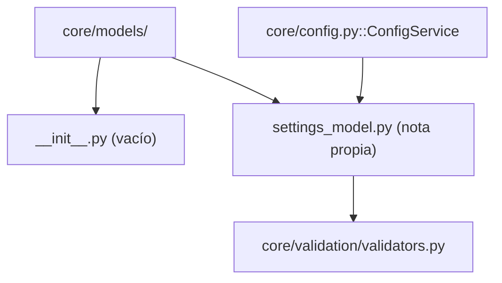

---
tags:
  - secinterp
  - code-walkthrough
  - core
  - models
aliases:
  - core/models/
  - core/models/__init__.py
  - models
cssclass: secinterp-note
---

# `core/models/` — Namespace de Modelos

> [!abstract] Resumen en una línea
> Paquete `core/models/` (1 archivo): `__init__.py` — el **namespace** de los modelos de configuración del core; hoy solo contiene un `__init__.py` vacío porque su único módulo real, `settings_model.py`, tiene nota propia.

**Ruta**: `core/models/` (1 archivo, 0 líneas)
**Clase/Función principal**: *(ninguna — `__init__.py` vacío)*
**Capa**: Core (QGIS-agnóstico)
**Tags**: #secinterp #core #models

---

## 🎯 ¿Por qué existe este paquete?

`core/models/` existe por **organización semántica**, no por necesidad funcional: agrupa los
tipos que representan **estado/modelos de datos** del plugin, diferenciándolos de los
servicios, utilidades y validadores del core.

| Problema | Solución |
|----------|----------|
| Separar "modelos de datos" de "lógica" | Carpeta `core/models/` como namespace |
| El modelo de configuración necesita un hogar | `settings_model.py` vive aquí |
| Evitar mezclar settings con servicios/utils | División por responsabilidad |
| Permitir crecer (más modelos) sin mover nada | Paquete vacío listo para crecer |

> [!important] Nota arquitectónica — namespace, no implementación
> El `__init__.py` está **vacío a propósito**: el paquete no es una fachada (a diferencia de
> `core/domain/__init__.py`, que re-exporta 24 símbolos). Su valor es puramente
> **estructural**: declarar que aquí viven los modelos de datos del core.

---

## 🧬 Diagrama de relaciones



> [!tip] Cómo leer
> Sólida = contiene/importa. El paquete contiene `__init__.py` (vacío) y
> `settings_model.py` (que depende de `validators`). `ConfigService` importa `PluginSettings`
> directamente desde `settings_model.py`, **sin** pasar por el `__init__`.

---

## 📦 Imports — lectura arquitectónica

```python
# core/models/__init__.py
# (vacío — 0 líneas, sin imports ni docstring)
```

| # | Observación |
|---|-------------|
| ① | Sin `from __future__ import annotations` — ni siquiera eso (archivo realmente vacío). |
| ② | Sin re-exports — los consumidores importan `from ...settings_model import ...` directo. |
| ③ | Sin docstring de paquete — a diferencia de `core/domain/__init__.py` y `core/__init__.py`. |

> [!note] Contraste con `core/domain/__init__.py`
> `domain/__init__.py` (68 líneas) es una **fachada** con `__all__`. `models/__init__.py`
> (0 líneas) es un **namespace** puro. Dos estilos de paquete conviven en el core de forma
> intencional.

---

## 🏗️ Inventario de estructura

**Clases:** ninguna (el `__init__.py` no define nada).

**Funciones/Métodos:** ninguno.

**Re-exports:** ninguno.

> [!warning] No fabricar símbolos
> Este paquete **no** define `PluginSettings` ni ningún otro símbolo en su `__init__.py`.
> Todos los símbolos reales viven en `settings_model.py` y están documentados en
> [[settings_model]]. Cualquier import `from sec_interp.core.models import ...` fallaría hoy.

---

## 📁 Archivos del paquete

| Archivo | Líneas | Rol |
|---------|--:|---|
| [[#__init__.py|__init__.py]] | 0 | Marcador de paquete (namespace), vacío |

> [!note] `settings_model.py` está en [[settings_model]]
> El paquete `core/models/` en disco también contiene `settings_model.py` (179 líneas), pero
> ese módulo se documenta en su propia nota (Tier A). Esta nota de paquete solo lista el
> `__init__.py` (0 líneas) para no duplicar contenido.

---

## 📖 Recorrido

### `__init__.py`

```python
# (archivo vacío — 0 líneas)
```

El archivo está **literalmente vacío**: ni imports, ni `__all__`, ni docstring. Su única
función es hacer que `core/models/` sea reconocido como **paquete importable** de Python
(marcador de namespace).

> [!important] Por qué vacío es correcto aquí
> No hay nada que "re-exportar": solo hay un módulo real (`settings_model.py`) y los
> consumidores lo importan por su nombre completo. Un `__init__` con re-exports sería
> redundante y añadiría una capa de indirección sin beneficio.

### ¿Qué vive aquí (en disco)?

Aunque el `__init__.py` está vacío, el paquete en disco contiene:

```
core/models/
└── settings_model.py     # 179 líneas → nota propia [[settings_model]]
```

`settings_model.py` define 9 dataclasses (`PluginSettings` y 8 sub-modelos), documentadas
en profundidad en su nota. Aquí solo se referencia.

### Relación con `settings_model.py`

| Aspecto | Detalle |
|---------|---------|
| **Pertenencia** | `settings_model.py` es el único módulo del namespace `core/models/` |
| **Dependencia** | `settings_model` importa `validate_and_clamp` de `core/validation/validators` |
| **Consumidor** | `ConfigService` (en `core/config.py`) construye `PluginSettings` |
| **Import típico** | `from sec_interp.core.models.settings_model import PluginSettings` |

> [!tip] Import directo, no vía paquete
> A diferencia del dominio (`from sec_interp.core.domain import GeologyContext`), aquí se
> importa **el módulo completo**: `from ...models.settings_model import PluginSettings`. Es
> la consecuencia natural de no tener una fachada en el `__init__`.

---

## 🔄 Flujo de datos

| Fase | Entrada | Transformación | Salida |
|------|---------|----------------|--------|
| (conceptual) | — | — | — |

> [!note] Sin flujo de datos propio
> Al no tener código, el paquete no transforma datos. El flujo real (configuración →
> `PluginSettings` validado) pertenece a [[config]] y [[settings_model]].

---

## 🏛️ Patrones de diseño presentes

| Patrón | Dónde | Propósito |
|--------|-------|-----------|
| **Namespace package (marker)** | `__init__.py` vacío | Declarar `core/models/` como paquete |
| **Package-by-layer** | `core/models/` | Agrupar modelos separados de la lógica |
| **(ausencia de) Facade** | sin `__all__` | Sin re-exports: imports directos al módulo |

> [!note] Package-by-layer vs package-by-feature
> `core/` organiza por **capa/responsabilidad** (`models/`, `services/`, `utils/`,
> `validation/`, `interfaces/`), no por feature. `core/models/` es una pieza más de esa
> estrategia: aquí van los "datos", no la "lógica".

---

## 🧾 Resumen de la API

| Símbolo | Firma / Hereda | Uso típico |
|---------|----------------|------------|
| *(ninguno)* | — | — |

> [!warning] API vacía por diseño
> Este paquete **no expone** ninguna API. La API real de modelos está en [[settings_model]]
> (`PluginSettings`, `SectionSettings`, `DemSettings`, …). No hay que importar nada desde
> `core.models` directamente.

---

## 🛡️ Manejo de errores

Sin código → sin manejo de errores. El único "riesgo" es de **uso incorrecto** por parte de
un desarrollador que asuma que `core.models` re-exporta `PluginSettings` (como hace
`core.domain`). Ese import lanzaría `ImportError`.

---

## 🧪 Tests asociados

No hay `test_core_models.py` para el `__init__.py` vacío (nada que probar). El
comportamiento real del paquete se cubre en:

- `tests/core/test_settings_model.py` — valida `PluginSettings` y sub-modelos.
- `tests/core/test_config.py` / `test_config_integration.py` — usan `PluginSettings` vía `ConfigService`.

---

## 📐 Convenciones de `__init__.py` en el core

Comparación de los `__init__.py` del core para entender cuándo un paquete es fachada y
cuándo es namespace:

| Paquete | `__init__.py` | Estilo |
|---------|--------------|--------|
| `core/` | 6 líneas (docstring) | Docstring de paquete, sin re-exports |
| `core/domain/` | 68 líneas (`__all__`) | **Facade** (re-exporta 24 símbolos) |
| `core/models/` | 0 líneas (vacío) | **Namespace** (marker puro) |
| `core/interfaces/` | 3 líneas (docstring) | Docstring, sin re-exports |

> [!tip] Regla práctica
> - **Facade** si el paquete agrupa muchos tipos que los consumidores quieren importar de
>   una vez (dominio).
> - **Namespace** si solo hay un módulo o los consumidores importan módulos concretos
>   (modelos, interfaces).
> - **Docstring** si conviene describir el propósito del paquete en sí (core raíz).

---

## 🔮 Direcciones de crecimiento

Hoy solo hay un modelo. Si el plugin crece, `core/models/` podría albergar:

- `export_settings.py` — si `ExportSettings` se separa de `settings_model.py`.
- `project_settings.py` — ajustes por proyecto (vs globales).
- Un `__init__.py` con fachada **solo si** surgen múltiples modelos que los consumidores
  quieran importar agrupados.

> [!question] ¿Cuándo dejaría de ser namespace?
> En el momento en que haya **2+ modelos** con consumidores comunes, podría justificarse un
> `__init__.py` con `__all__` (fachada), siguiendo el patrón de `core/domain/`. Mientras
> haya uno solo, el `__init__` vacío es la elección correcta (YAGNI).

---

## 👀 Observaciones y notas

> [!success] Fortalezas
> - Simplicidad máxima: un namespace vacío es imposible de romper.
> - Separa claramente "datos" (modelos) de "lógica" (servicios/utilidades).
> - Sin superficie de API que mantener.

> [!warning] Puntos de atención
> - Asimetría con `core/domain/` (que sí es fachada) puede confundir a desarrolladores
>   nuevos: `from core.models import X` no funciona, pero `from core.domain import X` sí.
> - `__init__.py` sin docstring de paquete (a diferencia de `core/` y `core/domain/`).

> [!question] Preguntas abiertas
> - ¿Añadir un docstring al `__init__.py` (aunque siga sin re-exports) para documentar el
>   propósito del paquete?
> - ¿Documentar esta asimetría facade-vs-namespace en `docs/ARCHITECTURE_EN.md`?

---

## 📐 ¿Namespace o facade? La decisión de diseño

La pregunta clave al mantener este paquete es: **¿debería `core/models/__init__.py`
re-exportar `PluginSettings` como hace `core/domain/`?** Los argumentos:

| Argumento | Facade (`__all__`) | Namespace (vacío) |
|-----------|:---:|:---:|
| Número de módulos | Justifica si hay 2+ | Correcto con 1 módulo |
| Frecuencia de uso del tipo | Alta → fachada ayuda | Baja/media → import directo basta |
| Riesgo de refactor | Fachada lo reduce | Namespace lo expone |
| Coste de mantenimiento | Hay que mantener `__all__` | Cero |

> [!note] La elección actual es Namespace (YAGNI)
> Con un único módulo (`settings_model.py`), un `__init__` con re-exports añadiría una capa
> de indirección sin beneficio tangible. Si en el futuro aparecen más modelos, se puede
> migrar a fachada siguiendo el patrón ya probado en `core/domain/`.

---

## 📦 Cómo se importa `settings_model` en el código real

Los consumidores importan **el módulo completo**, no el paquete. Ejemplos reales del repo:

```python
# core/config.py
from sec_interp.core.models.settings_model import PluginSettings

# tests/core/test_settings_model.py
from sec_interp.core.models.settings_model import (
    DemSettings,
    PluginSettings,
    PreviewSettings,
    SectionSettings,
    StructureSettings,
)
```

| Consumidor | Símbolos importados |
|-----------|---------------------|
| `core/config.py` | `PluginSettings` |
| `tests/core/test_settings_model.py` | `DemSettings`, `PluginSettings`, `PreviewSettings`, `SectionSettings`, `StructureSettings` |

> [!tip] Import del módulo, nunca del paquete
> Nótese que **nadie** escribe `from sec_interp.core.models import PluginSettings` (fallaría).
> El patrón canónico es `from ...models.settings_model import ...`, coherente con un
> `__init__.py` vacío.

---

## 📐 El término "model" en SecInterp

Hay que no confundir `core/models/` con otros usos de "model" en el proyecto:

| Uso de "model" | Dónde | Significado |
|----------------|-------|-------------|
| **Modelos de configuración** | `core/models/settings_model.py` | Dataclasses de settings |
| **Modelo de datos del dominio** | `core/domain/` | Entidades y DTOs (`GeologySegment`, …) |
| **"model" como capa MVC** | GUI | Vista/controlador frente a datos |

> [!note] `core/models/` ≠ `core/domain/`
> `models/` agrupa **estado persistente** (settings), mientras `domain/` agrupa los **tipos
> de negocio** (entidades, DTOs, contextos). Son namespaces distintos con propósitos
> distintos, aunque ambos vivan bajo `core/`.

---

## 🧭 Comparación con otros namespaces del proyecto

| Paquete | Rol | `__init__.py` |
|---------|-----|---------------|
| `core/models/` | Modelos de configuración | Vacío (namespace) |
| `core/domain/` | Tipos de negocio | Facade (`__all__`) |
| `core/interfaces/` | Contratos de servicio | Docstring, sin re-exports |
| `core/` | Raíz de la capa | Docstring |

> [!tip] Tres convenciones de `__init__.py` conviven
> El proyecto no fuerza una única convención: usa **facade** (dominio), **namespace**
> (modelos) y **docstring** (raíz, interfaces). La elección depende del contenido del
> paquete, no de una regla rígida.

---

## 🌐 i18n y notas de migración

- **Sin cadenas de usuario**: el `__init__.py` vacío no traduce nada.
- **Sin superficie de API**: añadir modelos no rompe este paquete; solo se suman módulos.
- **Posible evolución**: si se crean `export_settings.py`, `project_settings.py`, etc., y
  hay consumidores comunes, migrar a fachada (`__all__`) siguiendo `core/domain/`.
- **Documentación**: el vacío es intencional, pero un futuro desarrollador podría confundirlo
  con un "TODO sin completar"; el docstring de paquete ayudaría a evitarlo.

---

## 📂 Árbol del paquete en disco

Vista del estado real del paquete (incluyendo el módulo documentado aparte):

```
core/models/
├── __init__.py          # 0 líneas — marcador de namespace (esta nota)
└── settings_model.py    # 179 líneas — 9 dataclasses (nota: [[settings_model]])
```

> [!note] Solo 2 archivos, uno de ellos vacío
> El paquete es mínimo: un `__init__.py` vacío y un módulo con 9 dataclasses. No hay
> `__pycache__` versionado ni otros módulos. Toda la "sustancia" está en `settings_model.py`.

---

## 🔬 ¿Por qué un paquete y no un módulo suelto?

Cabe preguntarse: si solo hay `settings_model.py`, ¿por qué no dejarlo como
`core/settings_model.py` (módulo suelto) en vez de crear un sub-paquete? Razones:

| Argumento | Detalle |
|-----------|---------|
| **Semántica** | "modelos" es una categoría distinta de "servicios"/"utils" |
| **Crecimiento futuro** | Más modelos se ubicarán aquí sin reorganizar |
| **Simetría** | `core/` ya organiza por capa (`models/`, `services/`, `validation/`, …) |
| **Import legible** | `...models.settings_model` expresa mejor la intención que `...settings_model` |

> [!tip] Coste de un paquete vacío
> El coste de mantener un `__init__.py` vacío es casi nulo, y el beneficio de organización es
> real. Por eso la decisión de usar sub-paquete es razonable incluso con un solo módulo.

---

## 🔗 Notas relacionadas

- [[Index]] — índice de la bóveda
- [[settings_model]] — el único módulo real del paquete (`PluginSettings` y 8 sub-modelos)
- [[config]] — `ConfigService`, consumidor de `PluginSettings`
- [[domain]] — la contraparte: `core/domain/__init__.py` es fachada, no namespace
- [[core]] — el paquete raíz `core/` (otra convención de `__init__.py`)
- [[core_interfaces]] — otro paquete con `__init__.py` sin re-exports

---

*Nota de la bóveda SecInterp Code Walkthrough v2 — v3.9.1*
