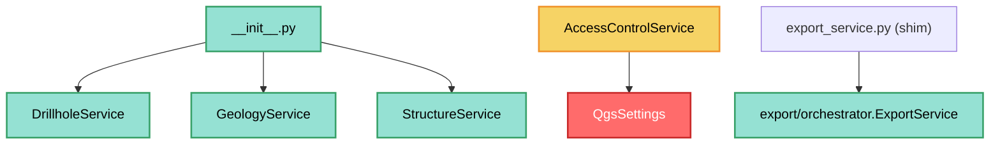

---
tags:
  - secinterp
  - code-walkthrough
  - core
  - services
aliases:
  - core/services/
  - services
  - AccessControlService
  - ExportService
cssclass: secinterp-note
---

# `core/services/` — Servicios de dominio

> [!abstract] Resumen en una línea
> Paquete `core/services/` (3 archivos): el `__init__` re-exporta los servicios principales (`DrillholeService`, `GeologyService`, `StructureService`), `access_control_service` gestiona permisos vía `QgsSettings`, y `export_service` es un shim de compatibilidad.

**Ruta**: `core/services/` (3 archivos, ~68 líneas)
**Clases principales**: `DrillholeService`, `GeologyService`, `StructureService`, `AccessControlService`, `ExportService`
**Capa**: Core (mayormente QGIS-agnóstico; 1 excepción documentada)
**Tags**: #secinterp #core #services

---

## 🎯 ¿Por qué existe este paquete?

Agrupa los servicios de procesamiento geológico. Estos 3 archivos son la **capa de
agrupación y compatibilidad** del paquete, no la lógica en sí:

| Problema | Solución |
|----------|----------|
| Exponer los servicios principales | `__init__.py` re-exporta 3 clases |
| Gestionar permisos de features restringidos | `AccessControlService.can_export_3d()` |
| Mantener imports antiguos funcionando | `export_service.py` (shim) |

> [!important] Nota arquitectónica
> El paquete es **mayormente QGIS-agnóstico**, pero `access_control_service.py` importa
> `qgis.core.QgsSettings` — una **excepción documentada** en
> `tests/core/test_architecture_boundary.py`. Los demás archivos del paquete no tocan QGIS.

---

## 🧬 Diagrama de relaciones



> [!tip] Cómo leer
> `ACS --> QS` (sólida, roja) marca el único acoplamiento a QGIS del grupo. El shim
> `export_service` re-direcciona al `export/orchestrator` real.

---

## 📦 Imports — lectura arquitectónica

```python
# core/services/__init__.py
from .drillhole_service import DrillholeService
from .geology_service import GeologyService
from .structure_service import StructureService

# core/services/access_control_service.py
from qgis.core import QgsSettings

# core/services/export_service.py
from sec_interp.core.services.export.orchestrator import ExportService
```

| # | Observación |
|---|-------------|
| ① | `__init__.py` re-exporta solo 3 servicios (no incluye `PreviewService` ni `VerticalExaggerationService`). |
| ② | `access_control_service.py` importa `QgsSettings` → **acoplamiento real a `qgis.core`**. |
| ③ | `export_service.py` es un **shim**: re-exporta `ExportService` desde `export/orchestrator.py`. |
| ④ | Los servicios re-exportados viven en sus propios módulos (notas individuales). |

---

## 🏗️ Inventario de estructura

**Clases:**
- `class AccessControlService` — 2 métodos
- (re-exports) `DrillholeService`, `GeologyService`, `StructureService`, `ExportService`

**Métodos de `AccessControlService`:**
- `__init__()` — instancia `QgsSettings`
- `can_export_3d() -> bool`

**Re-exports (`__init__.py`):**
- `DrillholeService`, `GeologyService`, `StructureService`

---

## 📁 Archivos del paquete

| Archivo | Líneas | Rol |
|---|--:|---|
| [[#__init__.py\|__init__.py]] | 19 | Re-exporta los 3 servicios principales |
| [[#access_control_service.py\|access_control_service.py]] | 36 | `AccessControlService` — permisos vía `QgsSettings` |
| [[#export_service.py\|export_service.py]] | 13 | Shim de compatibilidad hacia `export/orchestrator` |

---

## 📖 Recorrido archivo por archivo

### __init__.py

```python
"""Services package for geological data processing.
- GeologyService: Geological profile generation
- StructureService: Structural data projection
- DrillholeService: Drillhole projection
"""
from .drillhole_service import DrillholeService
from .geology_service import GeologyService
from .structure_service import StructureService

__all__ = ["DrillholeService", "GeologyService", "StructureService"]
```

Re-exporta los 3 servicios con su docstring descriptivo. Permite `from
sec_interp.core.services import DrillholeService` en lugar de importar el módulo exacto.

> [!note] ¿Por qué no `PreviewService` / `VerticalExaggerationService`?
> No están en `__all__`: se importan por módulo (`from ...preview_service import
> PreviewService`). Refleja que la API "canónica" del paquete son los 3 dominios.

### access_control_service.py

```python
class AccessControlService:
    def __init__(self) -> None:
        self.settings = QgsSettings()

    def can_export_3d(self) -> bool:
        allowed = self.settings.value("SecInterp/enable_3d", True, type=bool)
        if not allowed:
            logger.info("Access denied for restricted feature: 3D Export")
        return bool(allowed)
```

Lee el flag `SecInterp/enable_3d` de `QgsSettings` (default `True`) y decide si el usuario
puede exportar 3D. Es un **gate de permisos** ligado al toggle de la UI.

> [!warning] Zona gris arquitectónica
> Este es **el único** archivo del grupo que importa `qgis.core`. Está listado como
> excepción **conocida** en `tests/core/test_architecture_boundary.py` (línea 49:
> `services/access_control_service.py: {qgis.core}`). Se tolera porque `QgsSettings` es
> la vía canónica de persistencia de settings del plugin.

### export_service.py

```python
"""Export service shim — maintains backward compatibility."""
from sec_interp.core.services.export.orchestrator import ExportService

__all__ = ["ExportService"]
```

**Shim puro**: no define lógica, solo re-exporta `ExportService` del módulo real
(`export/orchestrator.py`) para que los imports antiguos
`from sec_interp.core.services.export_service import ExportService` sigan funcionando.

---

## 🔄 Flujo de datos

| Fase | Entrada | Transformación | Salida |
|------|---------|----------------|--------|
| Import de servicios | módulos internos | `__init__` re-export | `DrillholeService`, etc. |
| Permiso 3D | `QgsSettings` | `can_export_3d` | `bool` |
| Exportación | (shim) | re-export | `ExportService` real |

---

## 🏛️ Patrones de diseño presentes

| Patrón | Dónde | Propósito |
|--------|-------|-----------|
| **Facade (módulo)** | `__init__.py` | API pública del paquete |
| **Shim / Adapter** | `export_service.py` | Compatibilidad de imports |
| **Feature flag / gate** | `AccessControlService` | Permiso de export 3D |

---

## 🧾 Resumen de la API

| Símbolo | Firma / Hereda | Uso típico |
|---------|----------------|------------|
| `DrillholeService` (re-export) | — | Sondajes |
| `GeologyService` (re-export) | — | Geología |
| `StructureService` (re-export) | — | Estructuras |
| `AccessControlService` | — | Permisos |
| `AccessControlService.can_export_3d` | `() -> bool` | Gate de export 3D |
| `ExportService` (shim) | — | Exportación |

---

## 🛡️ Manejo de errores

| Situación | Comportamiento |
|-----------|----------------|
| Flag `SecInterp/enable_3d` ausente | default `True` (habilitado) |
| Flag deshabilitado | `logger.info(...)` + `return False` |

> [!note] Sin excepciones
> El gate de permisos es tolerante: ante ausencia de settings asume habilitado y nunca
> lanza. El shim tampoco maneja errores (solo re-exporta).

---

## 🧪 Tests asociados

Mapeo (mock-first, sin QGIS salvo el gate):

- `tests/core/services/test_access_control.py` — `can_export_3d` con `QgsSettings` mockeado.
- `tests/core/test_export_service.py` — el shim re-exporta `ExportService`.
- `tests/core/test_architecture_boundary.py` — verifica que `access_control_service.py` es la excepción `qgis.core` documentada.

---

## 👀 Observaciones y notas

> [!success] Fortalezas
> - `__init__.py` mantiene una API estable y mínima.
> - El shim `export_service.py` preserva compatibilidad de imports sin duplicar lógica.
> - El gate de permisos centraliza la política de export 3D.

> [!warning] Puntos de atención
> - `access_control_service.py` rompe la regla "100% QGIS-agnóstico" del core (excepción tolerada).
> - `PreviewService` y `VerticalExaggerationService` no están en `__all__` (API asimétrica).
> - El shim obliga a mantener una ruta de import legada a perpetuidad.

> [!question] Preguntas abiertas
> - ¿Mover `AccessControlService` a `gui/` o inyectar un `settings` abstracto para eliminar el acoplamiento?
> - ¿Añadir `PreviewService`/`VerticalExaggerationService` a `__all__`?

---

## 🗂️ El paquete completo de servicios

El directorio `core/services/` contiene **muchos más** archivos que los 3 de este grupo.
Este grupo cubre solo la capa de agrupación/compatibilidad:

| Archivo / subpaquete | ¿En este grupo? | Rol |
|----------------------|:---:|-----|
| `__init__.py` | ✅ | Re-exporta 3 servicios |
| `access_control_service.py` | ✅ | Permisos 3D (gray area) |
| `export_service.py` | ✅ | Shim de compatibilidad |
| `drillhole_service.py` | ❌ | Nota [[drillhole_service]] |
| `geology_service.py` | ❌ | Nota [[geology_service]] |
| `structure_service.py` | ❌ | Nota [[structure_service]] |
| `preview_service.py` | ❌ | Nota [[preview_service]] |
| `vertical_exaggeration_service.py` | ❌ | Nota [[vertical_exaggeration_service]] |
| `drillhole/` (subpaquete) | ❌ | Nota [[core_services_drillhole]] |
| `export/` (subpaquete) | ❌ | Nota [[core_services_export]] |
| `geology/` (subpaquete) | ❌ | — |

> [!note] Por qué solo 3 archivos
> El grupo documentado es la "fachada + compatibilidad + gate". El resto de servicios
> tienen notas individuales por su relevancia geológica.

## 🔐 Acceso 3D y el flag de settings

`AccessControlService` implementa un **gate de permisos** de bajo acoplamiento semántico:

| Aspecto | Detalle |
|---------|---------|
| **Clave** | `"SecInterp/enable_3d"` |
| **Default** | `True` (habilitado) |
| **Persistencia** | `QgsSettings` (settings del plugin) |
| **Consumidor** | botón/toggle de export 3D en la UI |
| **Log** | `logger.info("Access denied...")` solo cuando se deniega |

> [!warning] El precio del gate
> Para leer `QgsSettings` el servicio importa `qgis.core`, lo que lo convierte en la única
> excepción QGIS del core (ver [[#📦 Imports — lectura arquitectónica]]). `test_architecture_boundary.py`
> lo lista explícitamente como excepción tolerada.

## 📦 El shim de exportación

`export_service.py` redirige a `core/services/export/orchestrator.py`, que es la
implementación real. La cadena completa:

```text
sec_interp_plugin.py
  └─ from sec_interp.core.services.export_service import ExportService   (legacy)
       └─ from sec_interp.core.services.export.orchestrator import ExportService  (real)
```

| Archivo | Líneas | Rol |
|---------|-------|-----|
| `export_service.py` | 13 | Shim (re-export) |
| `export/orchestrator.py` | — | `ExportService` real |
| `export/map_settings_factory.py` | — | `create_map_settings` (usa `qgis.core`) |
| `export/path_resolver.py` | — | `resolve_export_path`, `get_profile_name` |

> [!tip] Migración incremental
> El shim permite mover la lógica de exportación a `export/` sin romper los imports
> existentes. Una vez migrados todos los consumidores, `export_service.py` puede
> eliminarse.

## 🔄 Comparación de los servicios principales

Los 3 servicios re-exportados ilustran tres estilos distintos de servicio core:

| Servicio | Estado | Contrato | Colaboradores |
|----------|--------|----------|---------------|
| `GeologyService` | stateless | `IGeologyService` | ninguno (utilidades puras) |
| `StructureService` | stateless | `IStructureService` | callback `elevation_sampler` |
| `DrillholeService` | con DI | `IDrillholeService` | 4 procesadores |

> [!tip] De lo simple a lo compuesto
> La geología es el caso mínimo; los sondajes el caso orquestador; las estructuras el caso
> "inversión de dependencias". Los tres cumplen **cero QGIS**.

## 🧭 Migración QGIS 4.x

| Archivo | Acoplamiento QGIS | Nota de migración |
|---------|-------------------|-------------------|
| `__init__.py` | ninguno | listo para 4.x |
| `export_service.py` | ninguno (shim) | listo para 4.x |
| `access_control_service.py` | `qgis.core.QgsSettings` | revisar si `QgsSettings` cambia en 4.x |

> [!note] `QgsSettings` es estable
> `QgsSettings` persiste settings con Qt; su API es poco probable que cambie, pero al ser
> el único acoplamiento conviene vigilarlo en la migración a 4.x (ver `qgis-migration-4x`).

## 🌐 Notas de i18n

- `AccessControlService` no usa `self.tr()`: el mensaje de log `"Access denied..."` está
  en inglés plano (es un log, no UI).
- El docstring de `__init__.py` es descriptivo pero no se traduce (interno).
- El shim no contiene textos de usuario.

> [!tip] Límite i18n vs log
> Los logs técnicos no se traducen; solo los textos visibles en UI. Este grupo no produce
> textos de UI directamente.

## 🧭 Cuándo añadir un servicio a `__all__`

La regla práctica para decidir si un servicio debe re-exportarse en `__init__.py`:

| Criterio | ¿Re-exportar? |
|----------|:---:|
| Es un dominio central (topo/geol/struct/drill) | ✅ |
| Se importa desde muchos consumidores | ✅ |
| Es un orquestador interno (preview) | ❌ (import por módulo) |
| Es una utilidad especializada (VE) | ❌ (import por módulo) |

> [!tip] Mantén `__all__` pequeño
> Re-exportar todo genera una API ruidosa y acopla a los consumidores a detalles internos.
> Por eso solo 3 servicios están en `__all__`.

## 🧾 El docstring como contrato

El docstring de `__init__.py` documenta informalmente qué hace cada servicio:

```text
- GeologyService: Geological profile generation
- StructureService: Structural data projection
- DrillholeService: Drillhole projection
```

> [!note] Docstring = mapa del paquete
> Aunque el `__init__` no tiene lógica, su docstring sirve de índice legible para quien
> explora `core/services/` sin abrir cada módulo.

## 🔗 Notas relacionadas

- [[Index]] — índice de la bóveda
- [[drillhole_service]] / [[geology_service]] / [[structure_service]] — servicios re-exportados
- [[preview_service]] / [[vertical_exaggeration_service]] — servicios no re-exportados
- [[core_services_export]] — el módulo real `export/orchestrator`
- [[core_services_drillhole]] — subsistema `drillhole/`
- [[config]] — `ConfigService` (settings del plugin)

---

*Nota de la bóveda SecInterp Code Walkthrough v2 — v3.9.0*
