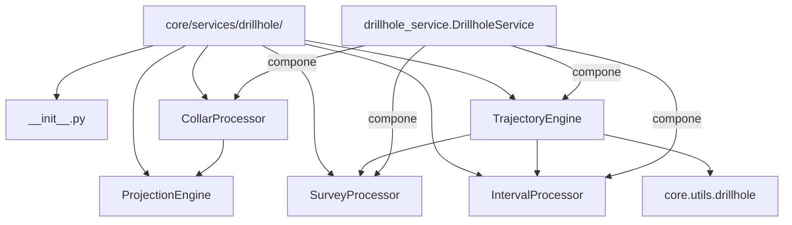

---
tags:
  - secinterp
  - code-walkthrough
  - core
  - services
aliases:
  - core/services/drillhole/
  - drillhole
  - ProjectionEngine
  - SurveyProcessor
  - project_point_to_line
  - determine_final_depth
cssclass: secinterp-note
---

# `core/services/drillhole/` — Paquete de procesadores de sondajes

> [!abstract] Resumen en una línea
> Paquete `core/services/drillhole/` (6 archivos): agrupa los **procesadores puros** del dominio de sondajes — proyección del collar, profundidad final, interpolación de intervalos y orquestación de trayectorias — todos QGIS-agnósticos y consumidos por [[drillhole_service]].

**Ruta**: `core/services/drillhole/` (6 archivos, 309 líneas)
**Clase principal**: `ProjectionEngine`, `SurveyProcessor` (+ `CollarProcessor`, `IntervalProcessor`, `TrajectoryEngine` con nota propia)
**Capa**: Core (QGIS-agnóstico)
**Tags**: #secinterp #core #services

---

## 🎯 ¿Por qué existe este paquete?

Procesar sondajes es un **pipeline de cuatro etapas** (collar → profundidad →
trayectoria → intervalos). Un único servicio monolítico sería ilegible y difícil de
testear; dividirlo en procesadores pequeños y componibles permite probar cada etapa
aislada:

| Problema | Solución |
|----------|----------|
| Cada etapa tiene una responsabilidad distinta | una clase por etapa (procesadores) |
| La trigonometría no debe mezclarse con la orquestación | `ProjectionEngine` aísla la matemática geométrica |
| El consumidor solo quiere "procesar un contexto" | `DrillholeService` compone los procesadores |

> [!important] Regla de la capa
> **100 % QGIS-agnóstico**: ningún archivo importa `qgis.*`. Los tipos son primitivos,
> tuplas y DTOs del dominio (`DrillholeProjection`, `GeologySegment`, `SpatialMeta`).
> El paquete implementa el lado "Compute" del patrón **Extract-then-Compute**: la GUI
> extrae el `DrillholeContext` (ver [[task_inputs]]) y estos procesadores lo computan.

---

## 🧬 Diagrama de relaciones



> [!tip] Cómo leer
> Flecha sólida = importa/delega; punteada = composición. `ProjectionEngine` es usado
> por `CollarProcessor`; `SurveyProcessor` e `IntervalProcessor` son usados por
> `TrajectoryEngine`; `DrillholeService` compone los cuatro.

---

## 📦 Imports — lectura arquitectónica

```python
# __init__.py (el único contenido del paquete además del docstring)
from __future__ import annotations

# projection_engine.py
import math
from sec_interp.core.utils.geometry_utils.measurement import project_point_onto_polyline

# survey_processor.py
from __future__ import annotations
```

| # | Observación |
|---|-------------|
| ① | `__init__.py` **no reexporta** nada: los consumidores importan cada módulo explícitamente (`from ...collar_processor import CollarProcessor`). |
| ② | `projection_engine.py` es el **único** archivo del paquete con `math`: es la única matemática "propia" (el resto delega a `core.utils`). |
| ③ | `project_point_onto_polyline` se importa desde `geometry_utils.measurement`, reutilizando la proyección 2D ya probada (ver [[measurement]]). |
| ④ | `survey_processor.py` no importa nada: pura aritmética `max` sobre listas. |

> [!note] Granularidad deliberada
> Los seis archivos suman 309 líneas. La división no es por tamaño, sino por
> **responsabilidad**: cada procesador es una unidad reemplazable y testeable de forma
> independiente.

---

## 🏗️ Inventario de estructura

**Clases (procesadores):**
- `class ProjectionEngine` — 1 `@staticmethod` (proyección punto-línea)
- `class SurveyProcessor` — 1 método (profundidad final)
- `class CollarProcessor` — 4 métodos (proyección del collar) → [[collar_processor]]
- `class IntervalProcessor` — 1 método (interpolación de tramos) → [[interval_processor]]
- `class TrajectoryEngine` — 3 métodos (orquestación por sondaje) → [[trajectory_engine]]

**Funciones/Métodos (documentados en esta nota):**
- `ProjectionEngine.project_point_to_line(pt, line_points) -> tuple[float, float]`
- `SurveyProcessor.determine_final_depth(given_depth, survey_data, intervals) -> float`

---

## 📁 Archivos del paquete

| Archivo | Líneas | Rol |
|---|--:|---|
| `__init__.py` | 3 | Docstring del paquete; sin re-exports |
| [[#ProjectionEngine\|projection_engine.py]] | 30 | `ProjectionEngine.project_point_to_line` — proyección punto-línea |
| [[#SurveyProcessor\|survey_processor.py]] | 15 | `SurveyProcessor.determine_final_depth` — profundidad final |
| [[collar_processor\|collar_processor.py]] | 100 | `CollarProcessor` — proyección del collar (nota propia) |
| [[interval_processor\|interval_processor.py]] | 50 | `IntervalProcessor` — interpolación de intervalos (nota propia) |
| [[trajectory_engine\|trajectory_engine.py]] | 111 | `TrajectoryEngine` — orquestación por sondaje (nota propia) |

---

## 📖 Recorrido método por método

### ProjectionEngine

```python
class ProjectionEngine:
    @staticmethod
    def project_point_to_line(
        pt: tuple[float, float],
        line_points: list[tuple[float, float]],
    ) -> tuple[float, float]:
        dist_along, nearest = project_point_onto_polyline(pt, line_points)
        offset = math.hypot(pt[0] - nearest[0], pt[1] - nearest[1])
        return dist_along, offset
```

Método estático puro: dada una sección como lista de vértices `(x, y)` y un punto,
devuelve `(dist_along, offset)`.

| Componente | Papel |
|-----------|-------|
| `project_point_onto_polyline` | calcula el **pie** de la perpendicular y la distancia recorrida sobre la línea |
| `math.hypot(dx, dy)` | distancia euclidiana entre el punto y su pie = **offset** perpendicular |

> [!important] Proyección horizontal, base del perfil vertical
> Esta es una proyección **cartesiana en el plano XY**: no manipula `z`. El
> `dist_along` resultante se convierte en el eje horizontal del perfil y el `offset`
> sirve para descartar sondajes desviados lejos de la sección (comparado contra
> `buffer_width` en [[collar_processor]] y [[trajectory_engine]]). Es el cimiento
> geométrico sobre el que se dibujan los sondajes desviados en la sección vertical.

### SurveyProcessor

```python
class SurveyProcessor:
    def determine_final_depth(
        self, given_depth: float, survey_data: list[tuple], intervals: list[tuple]
    ) -> float:
        max_s_depth = max([s[0] for s in survey_data]) if survey_data else 0.0
        max_i_depth = max([i[1] for i in intervals]) if intervals else 0.0
        return max(given_depth, max_s_depth, max_i_depth)
```

Calcula la profundidad final del sondaje como el **máximo** de tres fuentes:

| Fuente | Índice usado | Significado |
|--------|--------------|-------------|
| `given_depth` | — | profundidad declarada en el collar |
| `survey_data` | `s[0]` | profundidad del survey más profundo |
| `intervals` | `i[1]` | `to` del intervalo más profundo |

> [!note] Profundidad *downhole* (medida), no vertical real
> Estas profundidades son **medidas a lo largo del sondaje** (*measured depth*), no
> profundidades verticales verdaderas (*true vertical depth*). La TVD se obtiene
> después, en la trayectoria, por trigonometría (`z` decreciente en
> `calculate_drillhole_trajectory`, ver [[drillhole]]). `determine_final_depth` solo fija
> **hasta dónde llega el sondaje** para poder extrapolar/cerrar la trayectoria.

---

## 🔄 Flujo de datos

| Fase | Entrada | Transformación | Salida |
|------|---------|----------------|--------|
| Proyección punto-línea | `pt` + `line_points` | `project_point_onto_polyline` + `hypot` | `(dist_along, offset)` |
| Profundidad final | `given_depth`, `survey_data`, `intervals` | `max(...)` | `final_depth` |
| (aguas abajo) | `final_depth`, `point` | `TrajectoryEngine` | `DrillholeProjection` |

> [!tip] División de responsabilidades
> `ProjectionEngine` responde "¿dónde cae este punto en la sección?" y
> `SurveyProcessor` "¿hasta dónde llega este sondaje?". Ninguno conoce el contexto
> completo ni al otro. `DrillholeService` y `TrajectoryEngine` los combinan.

---

## 🔬 Profundidad *downhole* vs vertical real

El dominio distingue dos conceptos de profundidad que conviene no confundir:

| Concepto | Dónde se maneja | Definición |
|----------|-----------------|------------|
| **Measured depth (downhole)** | `SurveyProcessor.determine_final_depth` | Longitud recorrida **a lo largo** del sondaje (survey `s[0]`, intervalo `i[1]`) |
| **True vertical depth (TVD)** | `core/utils/drillhole.py` (trigonometría) | Profundidad **vertical** resultante (`z` decreciente) |

> [!important] El `max` es sobre *measured depth*
> `determine_final_depth` devuelve la profundidad **medida** máxima. Esa cifra cierra
> la trayectoria (`total_depth`), y la vertical real (`z`) emerge después por
> trigonometría: en un sondaje vertical `-90°`, measured y vertical coinciden; en uno
> desviado, la vertical es menor que la medida. Ver [[drillhole]].

---

## 📐 Relación con los DTOs del dominio

El paquete consume y produce **solo DTOs puros** (ver [[dtos]] y [[entities]]):

| DTO | Producido/consumido | Campo relevante |
|-----|---------------------|-----------------|
| `DrillholeProjection` | producido por `CollarProcessor` / `TrajectoryEngine` | `distance`, `elevation`, `offset`, `total_depth`, `points_3d`, `segments` |
| `SpatialMeta` | producido por `TrajectoryEngine` | `dist_along`, `offset`, `z`, `x_3d`, `y_3d`, `x_proj`, `y_proj` |
| `GeologySegment` | producido por `IntervalProcessor` | `unit_name`, `points`, `points_3d`, `points_3d_projected` |

> [!note] Ninguna capa QGIS cruza la frontera
> `project_point_to_line` recibe `(x, y)` como tupla y `line_points` como lista de
> tuplas: el extractor ya aplanó toda geometría QGIS. Esto es lo que permite testear el
> paquete sin QGIS (ver Tests asociados).

---

## 🔢 Ejemplo numérico

**Proyección** — `pt = (50, 10)`, `line_points = [(0,0), (100,0)]`:

1. `project_point_onto_polyline((50,10), line)` → `dist_along = 50.0`, `nearest = (50,0)`.
2. `offset = hypot(50-50, 10-0) = 10.0`.
3. Retorno: `(50.0, 10.0)`.

**Profundidad final** — `given_depth = 100`, `survey_data = [(120, 45, 90)]`,
`intervals = [(0, 150, "LithA")]`:

1. `max_s_depth = 120`, `max_i_depth = 150`.
2. `max(100, 120, 150) = 150.0` → la trayectoria se extrapolará hasta 150 m.

---

## 🧩 Encaje en el patrón Extract-then-Compute

| Etapa | Capa | Artefacto |
|-------|------|-----------|
| **Extract** | GUI (`DrillholeExtractor`) | `DrillholeContext` con `collar_data`, `survey_data`, `interval_data`, `line_points`, campos de configuración |
| **Compute** | este paquete | `ProjectionEngine` → `SurveyProcessor` → `TrajectoryEngine` → `IntervalProcessor` |
| **Consolidar** | `DrillholeService` | `(geol_data, drillhole_data)` → `PreviewResult` (ver [[dtos]]) |

> [!tip] El contexto es la frontera
> El `DrillholeContext` (documentado en [[task_inputs]]) transporta los **campos**
> (`collar_id_field`, `collar_z_field`, `collar_depth_field`, `buffer_width`,
> `section_azimuth`) que estos procesadores reciben como parámetros. Nunca cruza una
> `QgsVectorLayer`.

---

## 🏛️ Patrones de diseño presentes

| Patrón | Dónde | Propósito |
|--------|-------|-----------|
| **Static utility (method)** | `ProjectionEngine.project_point_to_line` | Matemática sin estado, sin instancia |
| **Specialist (SRP)** | cada procesador | Una responsabilidad por clase |
| **Composition** | `TrajectoryEngine` / `DrillholeService` | Componer procesadores en un pipeline |
| **Facade** | `DrillholeService` (consumidor) | Una API sobre el paquete |

---

## 🧾 Resumen de la API

| Símbolo | Firma / Hereda | Uso típico |
|---------|----------------|------------|
| `ProjectionEngine.project_point_to_line` | `@staticmethod (pt, line_points) -> (float, float)` | Proyección punto-línea + offset |
| `SurveyProcessor.determine_final_depth` | `(given_depth, survey_data, intervals) -> float` | Profundidad final del sondaje |

---

## 🧩 Cuándo añadir un nuevo procesador

Regla práctica para decidir si una etapa del pipeline merece su propia clase:

| Criterio | Procesador propio | Método privado |
|----------|:---:|:---:|
| Es una responsabilidad de dominio distinta (collar, survey, intervalo, trayectoria) | ✅ | — |
| Se prueba o mockea de forma aislada | ✅ | — |
| Otro procesador lo compone | ✅ | — |
| Es un paso auxiliar interno de un solo uso | — | ✅ |

> [!tip] Mantén el paquete pequeño
> Hoy hay 5 clases para 6 archivos (contando `__init__`). Añadir un procesador solo
> tiene sentido si introduce una responsabilidad nueva y comprobable; si no, un método
> privado dentro de un procesador existente basta.

---

## 🛡️ Manejo de errores

Ambos módulos siguen la filosofía de **degradación segura**:

| Caso | Comportamiento |
|------|----------------|
| `survey_data` o `intervals` vacíos | `max(...)` usa `0.0` como sustituto (guard ternario) |
| `line_points` sin vértices | `project_point_onto_polyline` delega su propio manejo (ver [[measurement]]) |
| Datos no numéricos | no se valida aquí; los errores suben a `DrillholeService` |

> [!note] Sin log ni excepciones propias
> Ninguno de los dos lanza ni registra: su contrato es devolver un número. La captura
> (`ValueError`/`TypeError`/`KeyError`/`SecInterpError`) ocurre en
> `DrillholeService.process_context`.

---

## 🧪 Tests asociados

Mapeo a los tests reales bajo `tests/core/`:

- `tests/core/services/drillhole/test_processors.py::TestSurveyProcessor::test_determine_final_depth` —
  las tres ramas de `max` (todas las fuentes, solo `given`, solo survey).
- `tests/core/test_drillhole_service.py::test_process_context_projects_collar` —
  `ProjectionEngine` ejercitado indirectamente vía `CollarProcessor`.
- `tests/core/test_drillhole_utils.py` — cubre `project_point_onto_polyline` (el util
  que `ProjectionEngine` delega).

> [!note] Cobertura indirecta de `ProjectionEngine`
> No hay un `test_projection_engine.py` dedicado; `project_point_to_line` se cubre a
> través de `CollarProcessor` y del pipeline completo. Es un candidato a un test
> unitario directo (offset e hipotenusa).

---

## ⚡ Rendimiento y complejidad

| Aspecto | Análisis |
|---------|----------|
| **`project_point_to_line`** | `O(m)` en vértices de la línea; `math.hypot` constante |
| **`determine_final_depth`** | `O(s + i)` con dos comprensiones `max`; trivial |
| **Sin estado** | ambas clases son reentrantes y compartibles entre `QgsTask` |

---

## 🌐 i18n y notas de migración

- **Sin cadenas de usuario**: el paquete no hereda `TranslatableMixin` (eso queda en
  [[drillhole_service]]). Ningún mensaje traducible.
- **Thread-safety**: procesadores sin estado ⇒ seguros en `QgsTask`.
- **`__init__.py` vacío**: deliberado; la ausencia de re-exports fuerza imports
  explícitos y evita acoplamientos accidentales.

---

## 👀 Observaciones y notas

> [!success] Fortalezas
> - Separación por responsabilidad: cada procesador es trivial de leer y testear.
> - `ProjectionEngine` como `@staticmethod` elimina cualquier estado implícito.
> - Paquete entero 100 % QGIS-agnóstico y thread-safe.

> [!warning] Puntos de atención
> - `ProjectionEngine` no tiene test directo (solo indirecto vía `CollarProcessor`).
> - `determine_final_depth` no distingue "profundidad ausente" de "cero real".
> - `survey_data`/`intervals` tipados como `list[tuple]` (sin alias) diluyen el tipado.

> [!question] Preguntas abiertas
> - ¿Añadir `test_projection_engine.py` con casos de offset/hipotenusa?
> - ¿Tipar `survey_data`/`intervals` con aliases (`list[SurveyReading]`, `list[Interval]`)?
> - ¿Exponer `densify_step` (fijado hoy en 1 m dentro de [[trajectory_engine]])?

---

## 🔗 Notas relacionadas

- [[Index]] — índice de la bóveda
- [[drillhole_service]] — orquesta los procesadores de este paquete
- [[collar_processor]] — usa `ProjectionEngine` y tiene nota propia
- [[interval_processor]] / [[trajectory_engine]] — procesadores con nota propia
- [[drillhole]] — utilidades puras que el paquete consume (`scu.*`)
- [[measurement]] — `project_point_onto_polyline` (delegado de `ProjectionEngine`)
- [[task_inputs]] — `DrillholeContext`, la entrada desacoplada del paquete

---

*Nota de la bóveda SecInterp Code Walkthrough v2 — v3.8.0*
