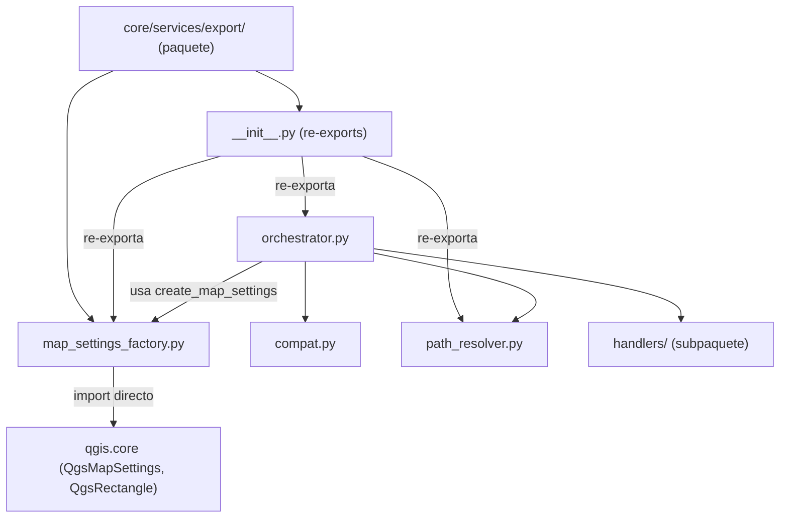
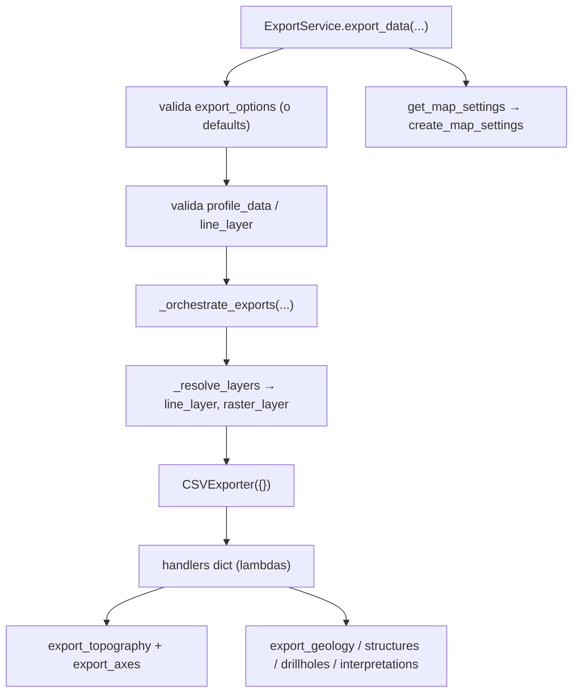

---
tags:
  - secinterp
  - code-walkthrough
  - core
  - export
  - services
aliases:
  - core/services/export/
  - export
  - create_map_settings
  - ExportService
cssclass: secinterp-note
---

# `core/services/export/` — Paquete de exportación

> [!abstract] Resumen en una línea
> Package `core/services/export/` (2 archivos): `__init__.py` re-exporta la API pública (`ExportService`, `create_map_settings`, `get_profile_name`, `resolve_export_path`) y `map_settings_factory.py` aísla la construcción de `QgsMapSettings` en un único módulo.

**Ruta**: `core/services/export/` (2 archivos, ~43 líneas)
**Función principal**: `create_map_settings`
**Capa**: Core (mayoritariamente QGIS-agnóstico; un módulo con QGIS aislado)
**Tags**: #secinterp #core #export #services

---

## 🎯 ¿Por qué existe este paquete?

Toda la exportación de SecInterp (CSV, shapefile, GeoPackage, DXF, imagen, SVG, PDF y
render de mapa) se coordina desde este paquete. Agrupa el orquestador, los handlers, la
resolución de rutas, los shims de compatibilidad y una fábrica de `QgsMapSettings`.

| Problema | Solución |
|----------|----------|
| Exportar datos a múltiples formatos desde un punto | `ExportService` (en `orchestrator.py`) |
| Evitar importar QGIS en todo el core | Aislarlo en `map_settings_factory.py` |
| Mantener compatibilidad con imports antiguos | `__init__.py` re-exporta la API pública |

> [!important] Nota arquitectónica
> Este paquete concentra la **única zona gris** del core: `map_settings_factory.py`
> importa `qgis.core` (necesario para el render de mapa). El resto (`orchestrator.py`
> excepto `QCoreApplication`, `compat.py`, `path_resolver.py`, `handlers/`) es
> QGIS-agnóstico. El grupo Tier C documentado aquí cubre `__init__.py` y
> `map_settings_factory.py`; los módulos restantes tienen nota propia.

---

## 🧬 Diagrama de relaciones



> [!tip] Cómo leer
> `__init__.py` es una fachada que re-exporta símbolos de los módulos internos. La única
> flecha hacia `qgis.core` sale de `map_settings_factory.py`, el módulo gris del core.

---

## 📦 Imports — lectura arquitectónica

```python
# core/services/export/__init__.py
from __future__ import annotations

from .map_settings_factory import create_map_settings
from .orchestrator import ExportService
from .path_resolver import get_profile_name, resolve_export_path

__all__ = ["ExportService", "create_map_settings", "get_profile_name", "resolve_export_path"]
```

```python
# core/services/export/map_settings_factory.py
from __future__ import annotations

from typing import Any

from qgis.core import QgsMapSettings, QgsRectangle
```

| # | Observación |
|---|-------------|
| ① | `__init__.py` define un `__all__` explícito: controla qué expone el paquete. |
| ② | `__init__.py` usa imports **relativos** (`.map_settings_factory`, …): cohesión interna. |
| ③ | `map_settings_factory.py` es el **único** módulo del paquete que importa `qgis.core`. |
| ④ | La firma de `create_map_settings` usa `Any` para `size`/`background_color` (QSize/QColor). |

---

## 🏗️ Inventario de estructura

**Módulos del grupo Tier C:**
- `__init__.py` — re-exports de la API pública (9 líneas).
- `map_settings_factory.py` — función `create_map_settings` (34 líneas).

**Función pública (en `map_settings_factory.py`):**
- `create_map_settings(layers, extent, size, background_color) -> QgsMapSettings`

**Hermanos (nota propia, no en este grupo):**
- `orchestrator.py` → `ExportService`
- `compat.py` → `ExportServiceCompatMixin`
- `path_resolver.py` → `get_profile_name`, `resolve_export_path`
- `handlers/` → subpaquete de handlers (nota propia)

---

## 📁 Archivos del paquete

| Archivo | Líneas | Rol |
|---|--:|---|
| [[#__init__.py|__init__.py]] | 9 | Re-exporta la API pública con `__all__` |
| [[#map_settings_factory.py|map_settings_factory.py]] | 34 | Fábrica de `QgsMapSettings`; aísla la importación de QGIS |

> [!note] Módulos hermanos con nota propia
> `orchestrator.py`, `compat.py`, `path_resolver.py` y el subpaquete `handlers/` forman
> parte de `export/` pero se documentan en sus propias notas (ver Notas relacionadas).

---

## 📖 Recorrido módulo por módulo

### __init__.py

```python
"""Export package — re-exports ExportService and factories."""

from __future__ import annotations

from .map_settings_factory import create_map_settings
from .orchestrator import ExportService
from .path_resolver import get_profile_name, resolve_export_path

__all__ = ["ExportService", "create_map_settings", "get_profile_name", "resolve_export_path"]
```

**Fachada pública del paquete.** Expone cuatro símbolos que son el contrato estable
hacia el resto del sistema:

| Símbolo | Origen real | Consumidor típico |
|---------|-------------|-------------------|
| `ExportService` | `orchestrator.py` | GUI (`QgsTask`) y `export_service.py` (shim) |
| `create_map_settings` | `map_settings_factory.py` | `orchestrator.get_map_settings` |
| `get_profile_name` | `path_resolver.py` | handlers y compat |
| `resolve_export_path` | `path_resolver.py` | handlers y compat |

> [!note] `__all__` explícito
> Aunque no hay `import *` en el proyecto, `__all__` documenta la intención: estos son
> los símbolos que se consideran API pública y estable.

### map_settings_factory.py

```python
"""Factory for QgsMapSettings — isolates QGIS import to one module."""

from __future__ import annotations

from typing import Any

from qgis.core import QgsMapSettings, QgsRectangle


def create_map_settings(
    layers: list[Any],
    extent: QgsRectangle,
    size: Any | None,
    background_color: Any,
) -> QgsMapSettings:
    map_settings = QgsMapSettings()
    map_settings.setLayers(layers)
    map_settings.setExtent(extent)
    if size is not None:
        map_settings.setOutputSize(size)
    map_settings.setBackgroundColor(background_color)
    return map_settings
```

**La zona gris del core.** Es el único módulo de `export/` que importa `qgis.core`, y
lo hace a propósito: construir un `QgsMapSettings` para el render de mapa exige el tipo
real. El resto del core no conoce QGIS.

| Paso | Llamada | Nota |
|------|---------|------|
| 1 | `QgsMapSettings()` | crea el objeto de configuración |
| 2 | `setLayers(layers)` | lista de capas a renderizar |
| 3 | `setExtent(extent)` | extensión espacial de la vista |
| 4 | `setOutputSize(size)` | tamaño de salida (solo si no es `None`) |
| 5 | `setBackgroundColor(background_color)` | color de fondo |
| 6 | `return map_settings` | entrega la configuración lista |

> [!important] Por qué aislar la importación de QGIS
> Al confinar `from qgis.core import ...` en un único módulo, el resto del paquete (y del
> core) sigue testeable sin QGIS. Quien necesite un `QgsMapSettings` pasa por esta
> fábrica en lugar de importar QGIS por su cuenta.

> [!warning] `size`/`background_color` tipados como `Any`
> Son `QSize` y `QColor` respectivamente, pero se declaran `Any` para no arrastrar las
> importaciones de Qt/QGIS a la firma. Es el mismo trade-off de `orchestrator.py`.

---

## 🔄 Flujo de datos

| Fase | Entrada | Transformación | Salida |
|------|---------|----------------|--------|
| Render de mapa | `layers`, `extent`, `size`, `background_color` | `create_map_settings` | `QgsMapSettings` |
| Exportación | `output_folder`, `params`, datos | `ExportService.export_data` | archivos + `list[str]` |
| Resolución de rutas | `folder`, `base_name`, … | `get_profile_name`/`resolve_export_path` | `(Path, nombre_lógico)` |

---

## 🏛️ Patrones de diseño presentes

| Patrón | Dónde | Propósito |
|--------|-------|-----------|
| **Facade** | `__init__.py` | exponer una API pública estable |
| **Factory** | `map_settings_factory.create_map_settings` | crear `QgsMapSettings` configurado |
| **Isolation layer** | `map_settings_factory.py` | confinar la dependencia de QGIS |
| **Facade (orquestador)** | `orchestrator.ExportService` | coordinar handlers y exporters |
| **Adapter (compat)** | `compat.py` | mantener la API privada `_export_*` |

---

## 🧾 Resumen de la API

| Símbolo | Firma / Hereda | Uso típico |
|---------|----------------|------------|
| `create_map_settings` | `(layers, extent, size, background_color) -> QgsMapSettings` | Configurar el render de mapa |
| `ExportService` | `(ExportServiceCompatMixin)` | Orquestar todas las exportaciones |
| `get_profile_name` | `(controller) -> str` | Nombre sanitizado del perfil |
| `resolve_export_path` | `(folder, base_name, profile_name, naming_pattern, ext) -> (Path, str)` | Ruta física + nombre lógico |

---

## 🛡️ Manejo de errores

| Módulo | Comportamiento |
|--------|----------------|
| `__init__.py` | No maneja errores (solo re-exporta) |
| `map_settings_factory.py` | No valida: confía en que `layers`/`extent`/`color` sean correctos |

> [!warning] Fábrica sin validación
> `create_map_settings` asume que `extent` es un `QgsRectangle` válido y que `size`/
> `background_color` son del tipo correcto. Un `None` en `background_color` o un `extent`
> mal formado se propagarán como error de QGIS, no como `ExportError`.

---

## 🧪 Tests asociados

- `tests/core/test_export_service.py::test_get_map_settings` — verifica que
  `ExportService.get_map_settings` delega en `create_map_settings`.
- `tests/core/test_export_service.py::test_export_data_*` — cubren la orquestación que
  arranca en este paquete.
- `tests/integration/test_export_service_e2e.py` — exportación real end-to-end.
- `tests/exporters/test_image_exporter.py` / `test_svg_exporter.py` / `test_pdf_exporter.py` —
  consumen el `QgsMapSettings` producido por la fábrica.

---

## 🔬 Mapa completo de módulos del paquete

El paquete real tiene más de los dos archivos del grupo Tier C; los demás tienen nota
propia. Este es el mapa completo:

| Módulo | Líneas | Rol | Nota |
|--------|--:|---|------|
| [[#__init__.py\|__init__.py]] | 9 | Re-exports de la API pública | esta nota |
| [[#map_settings_factory.py\|map_settings_factory.py]] | 34 | Fábrica de `QgsMapSettings` (zona gris QGIS) | esta nota |
| `orchestrator.py` | 207 | `ExportService` (fachada que delega en handlers) | [[orchestrator]] |
| `compat.py` | 129 | `ExportServiceCompatMixin` (wrappers `_export_*`) | [[compat]] |
| `path_resolver.py` | 60 | `get_profile_name` / `resolve_export_path` | [[path_resolver]] |
| `handlers/` | ~436 | 7 handlers `export_*` por entidad | [[core_services_export_handlers]] |

> [!note] El `__init__.py` no re-exporta `compat.py` ni `handlers/`
> Solo `ExportService`, `create_map_settings`, `get_profile_name` y `resolve_export_path`
> son API pública. El mixin de compatibilidad y los handlers se importan internamente.

## 🔁 Flujo completo de una exportación

Cómo se coordinan los módulos del paquete en una exportación real:



**Secuencia narrativa:**

1. `export_data` aplica `export_options` por defecto (todas `True`) si no llegan.
2. Si ninguna opción está activa, devuelve un mensaje de aviso sin exportar.
3. Valida que `profile_data` exista (`DataMissingError`) y que `params.line_layer` esté.
4. Delega en `_orchestrate_exports`, que resuelve las capas y el CRS.
5. Instancia **un** `CSVExporter` compartido y registra las lambdas en `handlers`.
6. Itera `handlers` y ejecuta solo las opciones activas.
7. `get_map_settings` (API pública) delega en la fábrica para el render de mapa.

## 📐 API pública vs interna

| Símbolo | Visibilidad | Nota |
|---------|-------------|------|
| `ExportService` | pública (`__init__`) | punto de entrada de la exportación |
| `create_map_settings` | pública (`__init__`) | render de mapa/imagen/PDF/SVG |
| `get_profile_name` | pública (`__init__`) | nombre de perfil sanitizado |
| `resolve_export_path` | pública (`__init__`) | ruta física + nombre lógico |
| `ExportServiceCompatMixin` | interna | solo para tests/compatibilidad |
| `handlers/` | interna | se importa por módulo, no por paquete |

> [!important] Frontera estable
> El `__all__` fija el contrato. Cualquier refactor interno (p. ej. mover handlers) no
> debe romper estos cuatro símbolos públicos.

## ✅ Conformidad con la capa core

Cómo se alinea el paquete con las reglas del `core/AGENTS.md`:

| Regla | Estado | Dónde |
|-------|--------|-------|
| Sin `from qgis.core import *` | ⚠️ excepción puntual | `map_settings_factory.py` (tipos concretos) |
| Sin `QgsProject.instance()` | ✅ | ningún módulo |
| Sin `iface.mapCanvas()` | ✅ | ningún módulo |
| Sin `PyQt5`/`PyQt6` directo | ⚠️ `QCoreApplication` | `orchestrator.py` (vía `qgis.PyQt`) |
| Thread-safe | ✅ | el core nunca crea objetos GUI; solo delega |

> [!warning] La "zona gris" es intencional
> `map_settings_factory.py` y el `QCoreApplication` de `orchestrator.py` son concesiones
> mínimas y documentadas para el render y la traducción. El resto del paquete cumple el
> ideal agnóstico.

---

## 🌐 i18n y notas de migración

- **Traducción**: `ExportService.tr` delega en `QCoreApplication.translate` con contexto
  `"ExportService"`; los mensajes de usuario se traducen en el orquestador, no en los
  handlers ni en la fábrica.
- **QGIS en core**: `map_settings_factory.py` es la excepción documentada; el resto del
  paquete evita `qgis.*` (salvo `QCoreApplication` en `orchestrator.py`).
- **Compatibilidad**: `export_service.py` (fuera de este paquete) re-exporta
  `ExportService` para los imports antiguos; `compat.py` conserva `_export_*`.
- **Migración 4.x**: el paquete usa `from qgis.PyQt.QtCore import QCoreApplication`, ya
  alineado con el estilo QGIS 4.x (importación agnóstica vía `qgis.PyQt`).

---

## 👀 Observaciones y notas

> [!success] Fortalezas
> - `__init__.py` con `__all__` da una frontera de paquete clara y estable.
> - Aislar `qgis.core` en `map_settings_factory.py` mantiene al resto del core puro.
> - Estructura coherente: orquestador, handlers, resolver, compat y factory separados.

> [!warning] Puntos de atención
> - La importación de QGIS, aunque confinada, sigue **dentro** de `core/` (rompe el ideal
>   "100% agnóstico" del `AGENTS.md`).
> - `size`/`background_color` como `Any` diluyen el tipado de la fábrica.
> - `create_map_settings` sin validación de argumentos.

> [!question] Preguntas abiertas
> - ¿Mover `map_settings_factory.py` a la capa `exporters/` para purificar el core?
> - ¿Tipar `size`/`background_color` con `QSize`/`QColor` y asumir la importación?

---

## 🔗 Notas relacionadas

- [[Index]] — índice de la bóveda
- [[orchestrator]] — `ExportService`, consumidor de `create_map_settings`
- [[compat]] — mixin de compatibilidad con la API `_export_*`
- [[path_resolver]] — `get_profile_name` / `resolve_export_path`
- [[core_services_export_handlers]] — subpaquete `handlers/`
- [[dtos]] — `PreviewParams` que alimenta a `ExportService.export_data`
- [[controller]] — orquesta el flujo de exportación desde la GUI

---

*Nota de la bóveda SecInterp Code Walkthrough v2 — v3.8.0*
