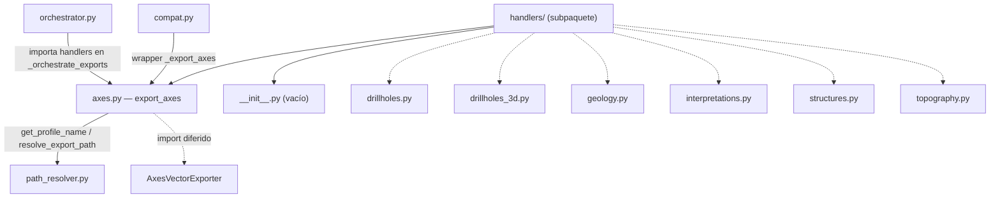

---
tags:
  - secinterp
  - code-walkthrough
  - core
  - export
  - handlers
aliases:
  - core/services/export/handlers/
  - handlers
  - export_axes
cssclass: secinterp-note
---

# `core/services/export/handlers/` — Manejadores de exportación

> [!abstract] Resumen en una línea
> Package `core/services/export/handlers/` (2 archivos): agrupa el handler de **ejes del perfil** (`axes.py`) y un `__init__.py` vacío; los seis handlers por entidad (sondajes, geología, interpretaciones, estructuras, topografía, sondajes 3D) se documentan en notas individuales.

**Ruta**: `core/services/export/handlers/` (2 archivos, ~39 líneas)
**Función principal**: `export_axes`
**Capa**: Core (QGIS-agnóstico)
**Tags**: #secinterp #core #export #handlers

---

## 🎯 ¿Por qué existe este paquete?

El orquestador de exportación necesita un **sitio estable** donde colocar los handlers
que convierten datasets desacoplados en archivos. Separarlos en un subpaquete propio
mantiene a `orchestrator.py` como una fachada fina y da a cada entidad su propio módulo.

| Problema | Solución |
|----------|----------|
| `orchestrator.py` crecería con 8 bloques de exportación | Un módulo por handler en `handlers/` |
| Cada entidad (geología, sondajes, estructuras…) tiene una salida distinta | Handler por entidad (patrón "one handler per entity") |
| Importar handlers al orquestador sin ruido | Import diferido dentro de `_orchestrate_exports` |

> [!important] Nota arquitectónica
> Este subpaquete forma el **patrón handler**: una función `export_*` por entidad,
> todas con la misma "silueta" (resolver ruta → instanciar exporter → exportar → anotar
> `msg`). El grupo Tier C documentado aquí cubre `axes.py`; los seis handlers restantes
> tienen nota propia (ver Notas relacionadas).

---

## 🧬 Diagrama de relaciones



> [!tip] Cómo leer
> Los nodos punteados (`drillholes.py`, `geology.py`, …) son hermanos con nota propia,
> no forman parte del grupo Tier C. `axes.py` es el único módulo documentado a fondo aquí.

---

## 📦 Imports — lectura arquitectónica

```python
# core/services/export/handlers/__init__.py
# (vacío — 0 líneas)
```

```python
# core/services/export/handlers/axes.py
from __future__ import annotations

from pathlib import Path
from typing import Any

from sec_interp.core.exceptions import ExportError
from sec_interp.core.services.export.path_resolver import get_profile_name, resolve_export_path
from sec_interp.logger_config import get_logger
```

```python
# import diferido (dentro de export_axes)
from sec_interp.exporters import AxesVectorExporter
```

| # | Observación |
|---|-------------|
| ① | `__init__.py` vacío: los handlers se importan **directamente** (`from .handlers import axes as axes_h`). |
| ② | `axes.py` solo importa `ExportError` (no `DataMissingError`): no valida datos vacíos. |
| ③ | Sin importación de `qgis.*`: el `crs` viaja como `Any`, igual que en todo el paquete. |
| ④ | `AxesVectorExporter` import diferido, coherente con el resto de handlers. |

---

## 🏗️ Inventario de estructura

**Módulos del grupo Tier C:**
- `__init__.py` — vacío (0 líneas), sin re-exports.
- `axes.py` — una función pública `export_axes`.

**Función pública (en `axes.py`):**
- `export_axes(folder, data, crs, msg, controller, settings, ext) -> None`

**Hermanos (nota propia, no en este grupo):**
- `drillholes.py` → `export_drillholes`
- `drillholes_3d.py` → `export_drillholes_3d`
- `geology.py` → `export_geology`
- `interpretations.py` → `export_interpretations`
- `structures.py` → `export_structures`
- `topography.py` → `export_topography`

---

## 📁 Archivos del paquete

| Archivo | Líneas | Rol |
|---|--:|---|
| [[#__init__.py|__init__.py]] | 0 | Vacío: los handlers se importan por módulo, sin re-exports |
| [[#axes.py|axes.py]] | 39 | `export_axes` — exporta los ejes del perfil como capa vectorial |

> [!note] Los 6 handlers por entidad viven aquí, con nota propia
> `drillholes.py`, `drillholes_3d.py`, `geology.py`, `interpretations.py`,
> `structures.py` y `topography.py` pertenecen a este mismo subpaquete, pero se
> documentan en sus propias notas (ver Notas relacionadas).

---

## 📖 Recorrido módulo por módulo

### axes.py

`axes.py` implementa el handler de los **ejes del perfil** (las líneas de referencia
con cotas que enmarcan la sección). Es el compañero de `topography.py`: el orquestador
los invoca juntos bajo el flag `exp_topo`.

```python
def export_axes(
    folder: Path,
    data: list[tuple],
    crs: Any,
    msg: list[str],
    controller: Any | None,
    settings: Any | None,
    ext: str,
) -> None:
    """Export profile axes."""
    from sec_interp.exporters import AxesVectorExporter

    logger.info("✓ Saving profile axes...")
    try:
        profile_name = get_profile_name(controller)
        pattern = getattr(settings, "naming_pattern", None) if settings else None
        path, path_layer = resolve_export_path(folder, "profile_axes", profile_name, pattern, ext)
        exporter = AxesVectorExporter({})
        ok = exporter.export(path, {"profile_data": data, "crs": crs}, layer_name=path_layer)
        if ok:
            msg.append(f"  - {path.relative_to(folder)}")
        else:
            logger.warning(f"Failed to write profile axes to {path}")
    except Exception as e:
        raise ExportError(f"Profile axes export failed: {e!s}") from e
```

**Análisis paso a paso:**

1. **Sin guard clause** — como `topography.py`, confía en que el orquestador ya validó
   que hay datos. La primera instrucción es el import diferido.
2. **Resolución de ruta** — `base_name="profile_axes"`, único dataset que exporta.
3. **Payload** — `{"profile_data": data, "crs": crs}`: los ejes se construyen a partir
   del mismo `ProfileData` que la topografía.
4. **Reporte** — anota `msg` con la ruta relativa en caso de éxito, `warning` en caso
   contrario.

> [!warning] `except Exception` sin logging
> `export_axes` es el único handler del paquete cuyo `except` **no** llama a
> `logger.exception(...)`: solo re-lanza `ExportError`. El traceback original se pierde
> en el log (aunque se preserva vía `from e`).

### __init__.py

```python
# (archivo vacío — 0 líneas)
```

Sin docstring ni re-exports. Esta elección es deliberada: el orquestador importa los
handlers **por módulo** (`from .handlers import axes as axes_h`), no como un API de
paquete. No hay una interfaz pública que exponer aquí.

---

## 🔄 Flujo de datos

| Fase | Entrada | Transformación | Salida |
|------|---------|----------------|--------|
| Delegación | `exp_topo` en `options` | `orchestrator` llama `topo_handler` | `export_topography` + `export_axes` |
| Ejes | `ProfileData` (`data`), `crs` | `AxesVectorExporter.export` | capa de ejes + `msg` |
| Errores | excepción cruda | `except → ExportError` | excepción de dominio |

---

## 🏛️ Patrones de diseño presentes

| Patrón | Dónde | Propósito |
|--------|-------|-----------|
| **Handler (one per entity)** | todo el subpaquete | un módulo por tipo de entidad exportable |
| **Facade** | funciones `export_*` | ocultar la orquestación tras una firma |
| **Lazy import (deferred)** | `AxesVectorExporter` | ahorrar carga sin necesidad |
| **Exception translation** | `except → ExportError` | normalizar fallos |
| **Package by feature** | estructura `handlers/` | agrupar por dominio de exportación |

---

## 🧾 Resumen de la API

| Símbolo | Firma / Hereda | Uso típico |
|---------|----------------|------------|
| `export_axes` | `(folder, data, crs, msg, controller, settings, ext) -> None` | Exportar ejes del perfil |
| `export_drillholes` | `(folder, data, crs, msg, controller, settings, ext) -> None` | Sondajes 2D (nota propia) |
| `export_drillholes_3d` | `(folder, data, crs, msg, options, controller, settings, ext) -> None` | Sondajes 3D (nota propia) |
| `export_geology` | `(folder, data, crs, csv_exporter, msg, controller, settings, ext) -> None` | Geología (nota propia) |
| `export_interpretations` | `(folder, data, line_layer, crs, msg, controller, settings, ext, access_control) -> None` | Interpretaciones (nota propia) |
| `export_structures` | `(folder, data, raster_layer, crs, csv_exporter, msg, options, controller, settings, ext) -> None` | Estructuras (nota propia) |
| `export_topography` | `(folder, data, crs, csv_exporter, msg, controller, settings, ext) -> None` | Topografía (nota propia) |

---

## 🛡️ Manejo de errores

Cada handler sigue su propio contrato (ver notas individuales), pero la constante del
subpaquete es **traducir fallos a `ExportError`**:

| Handler | Guard `if not data` | `try/except` | Logging en `except` |
|---------|:---:|:---:|:---:|
| `axes.py` | ❌ | `Exception` único | ❌ (solo re-lanza) |
| `topography.py` | ❌ | doble (`OSError/...` + `Exception`) | ✅ |
| `drillholes.py` | ✅ | doble | ✅ |
| `geology.py` | ✅ | doble | ✅ |
| `structures.py` | ✅ | doble | ✅ |
| `interpretations.py` | ✅ (con `logger.info`) | `Exception` único | ✅ |
| `drillholes_3d.py` | ✅ | ❌ (sin wrapper) | ⚠️ solo warning de resultado |

> [!important] Heterogeneidad real
> La tabla muestra que, pese a la "silueta" común, hay variaciones: `axes.py` no loguea
> en el `except` y `drillholes_3d.py` no envuelve en `ExportError`. Son candidatos a
> homogeneizar.

---

## 🧪 Tests asociados

Los handlers se ejercitan a través del `ExportService` (mockeando los exporters) y, en
integración, end-to-end:

- `tests/core/test_export_service.py::test_export_data_minimal` — topo + ejes (llama a
  `AxesVectorExporter`).
- `tests/core/test_export_service.py::test_export_axes_error` — fallo del exporter de
  ejes → `ExportError`.
- `tests/core/test_profile_exporters.py::test_axes_exporter_success` — lógica real de
  `AxesVectorExporter`.
- `tests/core/test_profile_exporters.py::test_axes_exporter_single_point` — un solo
  punto (edge case).
- `tests/integration/test_export_service_e2e.py` — exportación real de todos los tipos.

---

## 🔬 Matriz completa de handlers del subpaquete

Cada handler se mapea a un flag de `options`, un conjunto de `base_name`, exporters y
payloads. Es la guía rápida del subpaquete:

| Módulo | Flag(s) en `options` | `base_name`(s) | Exporter(s) | Payload | Formatos |
|--------|----------------------|----------------|-------------|---------|----------|
| `drillholes.py` | `exp_drill` | `drillhole_traces`, `drillhole_intervals` | `DrillholeTraceVectorExporter`, `DrillholeIntervalVectorExporter` | `drillhole_data`, `crs` | vectorial (`ext`) |
| `drillholes_3d.py` | `exp_drill_3d` + `drill_3d_traces/intervals` + `drill_3d_original/projected` | `drillhole_traces_3d_real/projected`, `drillhole_intervals_3d_real/projected` | `DrillholeTrace3DExporter`, `DrillholeInterval3DExporter` | `drillhole_data`, `crs`, `use_projected` | 3D (`ext`) |
| `geology.py` | `exp_geol` | `geol_profile` | `CSVExporter` (inyectado) + `GeologyVectorExporter` | `headers`/`rows` (CSV), `geology_data`/`crs` (vec) | `.csv` + vectorial |
| `interpretations.py` | `exp_interp` (+ `can_export_3d`) | `interpretations`, `interpretations_3d` | `Interpretation2DExporter`, `Interpretation3DExporter` | `interpretations`, `crs`; + `section_line` (3D) | vectorial + 3D |
| `structures.py` | `exp_struct` | `structural_profile`, `structural_measurements` | `CSVExporter` + `StructureVectorExporter` | `headers`/`rows`; `structural_data`, `crs`, `dip_scale_factor`, `raster_res` | `.csv` + vectorial |
| `topography.py` | `exp_topo` | `topo_profile`, `profile_line` | `CSVExporter` + `ProfileLineVectorExporter` | `headers`/`rows`; `profile_data`, `crs` | `.csv` + vectorial |
| `axes.py` | `exp_topo` (junto a topo) | `profile_axes` | `AxesVectorExporter` | `profile_data`, `crs` | vectorial |

> [!note] CSV compartido vs vectorial propio
> Los handlers con salida CSV reciben el `CSVExporter` **inyectado** (una sola instancia
> compartida); los vectoriales se importan y se instancian de forma diferida dentro de
> cada handler.

## 🧩 La silueta del handler (contrato compartido)

Aunque cada handler difiere en parámetros, todos siguen la misma secuencia de cuatro
pasos. Conocerla permite leer cualquiera de ellos en segundos:

```python
def export_<entidad>(folder, data, crs, ...) -> None:
    if not data:                 # 1. guard clause
        return
    from sec_interp.exporters import <Exporter>   # 2. import diferido
    try:
        profile_name = get_profile_name(controller)
        pattern = getattr(settings, "naming_pattern", None) if settings else None
        path, layer = resolve_export_path(folder, base_name, profile_name, pattern, ext)
        ok = <Exporter>({}).export(path, {payload}, layer_name=layer)  # 3. export
        if ok:
            msg.append(f"  - {path.relative_to(folder)}")             # 4. reporte
        else:
            logger.warning(f"Failed to write <entidad> to {path}")
    except Exception as e:
        raise ExportError(f"<entidad> export failed: {e!s}") from e
```

| Paso | Detalle | Variación posible |
|------|---------|-------------------|
| 1. Guard | `if not data: return` | `topography.py` y `axes.py` lo omiten (el orquestador ya valida) |
| 2. Import diferido | cargar el exporter solo si hay datos | — |
| 3. Export | `resolve_export_path` → `export` → `bool` | payload y exporters distintos por entidad |
| 4. Reporte | `msg.append` (éxito) o `logger.warning` (fallo) | `drillholes_3d.py` añade un `label` al mensaje |

> [!tip] La silueta es el "vocabulario" del subpaquete
> Una vez memorizado este patrón, cualquier handler nuevo solo aporta su payload y su
> `base_name`. Ver [[orchestrator]] para cómo se registran en el diccionario `handlers`.

## 🌐 i18n y notas de migración

- **Sin cadenas traducidas**: los handlers no usan `QCoreApplication.translate`; los
  mensajes de log y warning están en inglés (solo se ven en el log, no en la UI).
- **Mensajes al usuario**: los que sí se muestran (`msg`) los traduce el orquestador
  (`self.tr(...)`); los handlers solo añaden rutas relativas (`path.relative_to(folder)`).
- **Compatibilidad**: los wrappers `_export_*` de [[compat]] conservan las llamadas
  antiguas a estos handlers; no hay que tocar los handlers al migrar consumidores.
- **Extensión**: añadir una entidad exportable = nuevo módulo en `handlers/` + registrar
  su flag en el diccionario `handlers` del orquestador.

## ✅ Convenciones del subpaquete

| Convención | Regla |
|-----------|-------|
| Nombrado | un módulo `export_<entidad>` por tipo de entidad exportable |
| `base_name` | nombre lógico estable, no el nombre de archivo final |
| Payload | dict con clave `*_data` (o `profile_data`/`structural_data`) + `crs` |
| Retorno | `None`; el resultado se comunica mutando `msg` y por el `bool` del exporter |
| Errores | traducir a `ExportError` (con excepciones ya señaladas) |
| QGIS | solo vía `Any`; ningún handler importa `qgis.*` |

> [!note] Regla de oro del subpaquete
> Los handlers **nunca** devuelven archivos ni listas: solo mutan `msg` y delegan la
> escritura real en los exporters (`sec_interp.exporters`). Mantienen el core libre de
> QGIS al transportar todo como DTOs/primitivas + `Any` para los objetos externos.

---

## 👀 Observaciones y notas

> [!success] Fortalezas
> - Separación limpia por entidad: cada handler es pequeño y de una responsabilidad.
> - Silueta consistente (resolver → instanciar → exportar → anotar `msg`) que facilita
>   entender cualquier handler viendo uno solo.
> - `__init__.py` vacío evita acoplar un API de paquete innecesario.

> [!warning] Puntos de atención
> - Heterogeneidad en el manejo de errores (`axes.py` sin log, `drillholes_3d.py` sin
>   `ExportError`).
> - `axes.py` depende de `data` sin guard clause; si se llama aislado puede reventar.
> - Varios handlers duplican la secuencia "resolver ruta + instanciar + exportar".

> [!question] Preguntas abiertas
> - ¿Extraer un helper compartido `_export_layer(...)` para eliminar duplicación?
> - ¿Uniformar el contrato de errores (doble `except` + `logger.exception`) en los 7?

---

## 🔗 Notas relacionadas

- [[Index]] — índice de la bóveda
- [[orchestrator]] — consumidor principal; delega en estos handlers
- [[compat]] — wrappers `_export_*` que invocan a estos handlers
- [[path_resolver]] — `get_profile_name` / `resolve_export_path`
- [[topography]] — handler hermano del mismo flag `exp_topo`
- [[drillholes]] / [[drillholes_3d]] / [[geology]] / [[interpretations]] / [[structures]] — handlers hermanos
- [[core_services_export]] — paquete contenedor `export/`

---

*Nota de la bóveda SecInterp Code Walkthrough v2 — v3.9.1*
