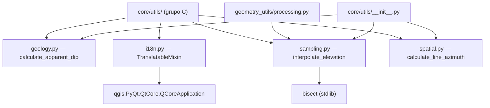

---
tags:
  - secinterp
  - code-walkthrough
  - core
  - utils
aliases:
  - core/utils/
  - geology.py
  - i18n.py
  - sampling.py
  - spatial.py
  - TranslatableMixin
  - interpolate_elevation
  - calculate_apparent_dip
  - calculate_line_azimuth
cssclass: secinterp-note
---

# `core/utils/` — Utilidades puras del core

> [!abstract] Resumen en una línea
> Paquete `core/utils/` (4 archivos del grupo C): `geology` (buzamiento aparente), `i18n` (mixin de traducción), `sampling` (interpolación de cota) y `spatial` (azimut de línea) — helpers atómicos reutilizados por servicios y GUI.

**Ruta**: `core/utils/` (8 archivos en total; este grupo cubre `geology.py`, `i18n.py`, `sampling.py`, `spatial.py`)
**Símbolos clave**: `calculate_apparent_dip`, `TranslatableMixin`, `interpolate_elevation`, `calculate_line_azimuth`
**Capa**: Core (mayormente QGIS-agnóstico; `i18n` es la excepción)
**Tags**: #secinterp #core #utils

---

## 🎯 ¿Por qué existe este paquete?

Las utilidades puras del core concentran la matemática y el *glue* reutilizable que los
servicios no deberían duplicar:

| Problema | Solución |
|----------|----------|
| Repetir trigonometría geológica en cada servicio | `calculate_apparent_dip` centralizado |
| Clases sin `QObject` no tienen `tr()` para i18n | `TranslatableMixin` aporta `self.tr(...)` |
| Muestrear cota en un perfil de forma eficiente | `interpolate_elevation` con `bisect` |
| Calcular orientación de una línea de sección | `calculate_line_azimuth` |

> [!important] Nota arquitectónica
> La regla del core es "100% QGIS-agnóstico", y se cumple en `geology`, `sampling` y
> `spatial` (sólo `math`/`bisect`). **`i18n.py` es la excepción deliberada**: importa
> `qgis.PyQt.QtCore.QCoreApplication` para traducir. El paquete completo (`__init__.py`) se
> documenta en [[core_utils___init___py]].

---

## 🧬 Diagrama de relaciones



> [!tip] Cómo leer
> Tres de los cuatro archivos son hojas puras; `i18n` es el único que cruza la frontera QGIS
> (flecha al `QCoreApplication`). `processing` importa `sampling` de forma local; el
> `__init__` re-exporta `geology`, `sampling` y `spatial` (pero **no** `i18n`).

---

## 📦 Imports — lectura arquitectónica

```python
# core/utils/geology.py
import math

# core/utils/i18n.py
from qgis.PyQt.QtCore import QCoreApplication

# core/utils/sampling.py
import bisect

# core/utils/spatial.py
import math
```

| # | Observación |
|---|-------------|
| ① | `geology`, `sampling` y `spatial` usan **sólo stdlib** (`math`, `bisect`). |
| ② | `i18n` importa `QCoreApplication` — la única dependencia QGIS del grupo. |
| ③ | Ninguno importa a otro módulo del proyecto: son hojas sin acoplamiento interno. |

> [!warning] `i18n` rompe la regla del core
> La decisión de poner `TranslatableMixin` en `core/` (y no en `gui/`) fuerza la importación
> de Qt en una capa que se declara agnóstica. Ver [[core_utils___init___py]] para cómo el `__init__` decide
> **no** re-exportarlo.

---

## 🏗️ Inventario de estructura

**Clases (1):**

- `class TranslatableMixin` (`i18n.py`) — mixin con método `tr()`.

**Funciones (3):**

- `calculate_apparent_dip(true_strike, true_dip, line_azimuth) -> float` (`geology.py`)
- `interpolate_elevation(topo_data, distance) -> float` (`sampling.py`)
- `calculate_line_azimuth(points) -> float` (`spatial.py`)

> [!note] Subconjunto puro
> De los 8 archivos del paquete, estos 4 son los **más atómicos** (una función o clase cada
> uno). Los 4 restantes (`drillhole`, `io`, `parsing`, `rendering`) son más grandes y con
> más responsabilidades, documentados aparte.

---

## 📁 Archivos del paquete

| Archivo | Líneas | Rol |
|---|--:|---|
| [[#calculate_apparent_dip\|geology.py]] | 40 | Buzamiento aparente en sección (puro) |
| [[#TranslatableMixin\|i18n.py]] | 30 | Mixin `tr()` para clases sin `QObject` |
| [[#interpolate_elevation\|sampling.py]] | 43 | Interpolación lineal de cota (puro) |
| [[#calculate_line_azimuth\|spatial.py]] | 30 | Azimut de línea (puro) |

> [!note] El paquete completo tiene 8 archivos
> Además de este grupo, `core/utils/` incluye `drillhole.py`, `io.py`, `parsing.py` y
> `rendering.py`, documentados en sus propias notas ([[drillhole]], [[io]], [[parsing]],
> [[rendering]]) y re-exportados en [[core_utils___init___py]].

---

## 📖 Recorrido archivo por archivo

### `calculate_apparent_dip`

```python
def calculate_apparent_dip(
    true_strike: float, true_dip: float, line_azimuth: float
) -> float:
    alpha = math.radians(true_strike)
    beta = math.radians(true_dip)
    theta = math.radians(line_azimuth)
    app_dip = math.degrees(math.atan(math.tan(beta) * math.sin(alpha - theta)))
    return app_dip
```

Buzamiento aparente: la inclinación de un plano medida en una dirección no perpendicular a
su rumbo. Fórmula `tan(app) = tan(dip) · sin(strike − azimuth)`. Devuelve grados; el signo
puede ser negativo según el cuadrante (el llamador lo normaliza si es preciso).

> [!tip] Sección perpendicular vs paralela
> Si la sección es perpendicular al rumbo (`strike − azimuth ≈ 90°`), el buzamiento aparente
> se aproxima al verdadero; si es paralela (`≈ 0°`), tiende a `0`.

### `TranslatableMixin`

```python
class TranslatableMixin:
    def tr(self, message: str) -> str:
        return QCoreApplication.translate(self.__class__.__name__, message)
```

Mixin que da un `tr()` estándar a clases que **no heredan de `QObject`** (p. ej. DTOs o
validadores). Usa el nombre de la clase como **contexto de traducción** y `QCoreApplication`
como motor. El `# type: ignore[no-any-return]` reconoce que `translate` devuelve `str`.

> [!important] Por qué existe
> En QGIS, `QObject` ya trae `tr()`; las clases puras no. Este mixin permite `self.tr(...)`
> en servicios/core sin heredar de `QObject`, manteniendo el desacoplo estructural.

### `interpolate_elevation`

```python
def interpolate_elevation(
    topo_data: list[tuple[float, float]], distance: float
) -> float:
    if not topo_data:
        return 0.0

    distances = [pt[0] for pt in topo_data]
    idx = bisect.bisect_left(distances, distance)

    if idx == 0:
        return topo_data[0][1]
    if idx >= len(topo_data):
        return topo_data[-1][1]

    dist1, elev1 = topo_data[idx - 1]
    dist2, elev2 = topo_data[idx]

    if dist2 == dist1:
        return elev1

    ratio = (distance - dist1) / (dist2 - dist1)
    return elev1 + (elev2 - elev1) * ratio
```

Interpolación lineal de cota sobre un perfil `(dist, elev)` ordenado. `bisect_left` localiza
el intervalo en `O(log n)`. Casos borde: perfil vacío → `0.0`; fuera de rango → extremo más
cercano; distancias coincidentes → `elev1` (evita división por cero).

### `calculate_line_azimuth`

```python
def calculate_line_azimuth(points: list[tuple[float, float]]) -> float:
    MIN_REQUIRED_POINTS = 2
    if len(points) < MIN_REQUIRED_POINTS:
        return 0

    p1 = points[0]
    p2 = points[1]
    azimuth = math.degrees(math.atan2(p2[0] - p1[0], p2[1] - p1[1]))
    if azimuth < 0:
        azimuth += 360
    return azimuth
```

Azimut (rumbo de brújula, 0–360) de una línea usando sus **dos primeros** puntos. `atan2(dx,
dy)` respeta los cuatro cuadrantes; el ajuste `+360` normaliza valores negativos. Con menos
de 2 puntos devuelve `0`.

---

## 🧩 Cómo se combinan estos helpers

Estos cuatro módulos no se llaman entre sí, pero se **componen** en el pipeline del perfil:

| Escenario | Helpers implicados | Secuencia |
|-----------|--------------------|-----------|
| Construir una sección | `calculate_line_azimuth` → `calculate_apparent_dip` | orientar la línea, luego buzamientos |
| Perfil topográfico | `interpolate_elevation` (vía [[processing]]) | muestrear cota a cada distancia |
| Mensajes de usuario | `TranslatableMixin.tr` | traducir etiquetas del core |

> [!tip] Extract-then-Compute
> La GUI extrae coordenadas/atributos de las capas y entrega primitivos (`list[tuple]`,
> `float`). Estos helpers computan **sin** conocer QGIS, salvo `i18n`, que traduce cadenas.

---

## 🔬 `i18n.py` en detalle — la excepción a la regla

El `core/AGENTS.md` prohíbe `import PyQt5/PyQt6` en el core. `i18n.py` usa
`qgis.PyQt.QtCore.QCoreApplication`, lo que merece una justificación:

| Aspecto | Detalle |
|---------|---------|
| **Motivo** | Las clases puras (DTOs, validadores) necesitan `tr()` sin heredar de `QObject`. |
| **Contexto** | `self.__class__.__name__` fija el contexto de traducción por clase. |
| **Coste** | El core deja de ser 100% agnóstico en cuanto `i18n` se importa. |
| **Mitigación** | No se re-exporta en [[core_utils___init___py]] `__all__`; se importa explícitamente donde se usa. |

> [!warning] Implicación para tests standalone
> Importar `sec_interp.core.utils.i18n` fuera de QGIS puede fallar si `qgis.PyQt` no está
> disponible. Por eso los tests sin QGIS importan los submódulos puros directamente.

---

## 🔄 Flujo de datos

| Fase | Entrada | Transformación | Salida |
|------|---------|----------------|--------|
| Geología | strike/dip/azimut | `atan(tan·sin)` | buzamiento aparente (grados) |
| i18n | `message` | `QCoreApplication.translate` | cadena traducida |
| Sampling | perfil `(dist, elev)` + `distance` | `bisect` + interpolación | cota (float) |
| Espacial | puntos de línea | `atan2` + normalización | azimut (grados) |

---

## 🏛️ Patrones de diseño presentes

| Patrón | Dónde | Propósito |
|--------|-------|-----------|
| **Función pura** | `geology`, `sampling`, `spatial` | determinismo y thread-safety |
| **Mixin** | `TranslatableMixin` | aportar `tr()` sin herencia de `QObject` |
| **Búsqueda binaria** | `sampling` (`bisect`) | interpolación `O(log n)` |
| **Contexto por nombre de clase** | `i18n` (`__class__.__name__`) | contexto de traducción estable |

---

## 🧾 Resumen de la API

| Símbolo | Firma | Uso típico |
|---------|-------|------------|
| `calculate_apparent_dip` | `(true_strike, true_dip, line_azimuth) -> float` | buzamiento en sección |
| `TranslatableMixin.tr` | `(message) -> str` | traducir en clases sin `QObject` |
| `interpolate_elevation` | `(topo_data, distance) -> float` | cota interpolada |
| `calculate_line_azimuth` | `(points) -> float` | orientación de sección |

---

## 📐 Detalle matemático

### Buzamiento aparente

```
apparent_dip = degrees(atan(tan(dip) · sin(strike − azimuth)))
```

| Variable | Rango | Significado |
|----------|-------|-------------|
| `true_strike` | 0–360 | rumbo del plano |
| `true_dip` | 0–90 | buzamiento verdadero |
| `line_azimuth` | 0–360 | azimut de la línea de sección |

### Azimut de línea

```
azimuth = degrees(atan2(x2 − x1, y2 − y1))  mod 360
```

- `atan2(dx, dy)` devuelve `(−180, 180]`; el ajuste `+360` para negativos lo lleva a `[0, 360)`.

### Interpolación lineal

```
elev(d) = elev1 + (elev2 − elev1) · (d − dist1) / (dist2 − dist1)
```

- `bisect_left` garantiza `dist1 <= d < dist2` (o el extremo si `d` cae fuera).

### Ejemplo numérico

| Helper | Entrada | Resultado |
|--------|---------|-----------|
| `calculate_apparent_dip` | strike=90, dip=45, azimut=0 | ≈ 45° (sección perpendicular) |
| `calculate_line_azimuth` | `[(0,0), (0,10)]` | 0° (rumbo norte) |
| `interpolate_elevation` | `[(0,100),(100,150)]`, d=50 | 125.0 |

---

## 🛡️ Manejo de errores

| Archivo | Comportamiento |
|---------|----------------|
| `geology` | no valida rangos (strike 0–360, dip 0–90); `math` acepta cualquier flotante |
| `i18n` | delega en `QCoreApplication`; no captura excepciones |
| `sampling` | perfil vacío → `0.0`; fuera de rango → extremo; `dist2 == dist1` → `elev1` |
| `spatial` | `< 2` puntos → `0` |

> [!note] Validación delegada
> Ninguno lanza `ValidationError`: son funciones de bajo nivel. La validación de rangos
> geológicos corresponde a los servicios que las invocan (ver [[geology_service]]).

---

## 🧪 Tests asociados

- `tests/core/test_utils.py` → `TestApparentDip`, `TestInterpolation`.
- `tests/core/test_utils_standalone.py` → `TestApparentDipStandalone`,
  `TestInterpolationStandalone` (sin QGIS).
- `tests/core/test_spatial_utils.py` → `TestSpatialUtils` (azimut norte/este/sur/oeste).

> [!note] Sin test directo de `i18n`
> `TranslatableMixin` se ejercita a través de las clases que lo usan; no hay un
> `test_i18n.py` dedicado. Su verificación requiere un `QCoreApplication` (entorno QGIS).

---

## 👀 Observaciones y notas

> [!success] Fortalezas
> - Tres de cuatro módulos son puros y trivialmente testables.
> - `interpolate_elevation` es `O(log n)` gracias a `bisect`.
> - `TranslatableMixin` resuelve elegante la i18n en clases puras.

> [!warning] Puntos de atención
> - `i18n.py` importa Qt en el core, rompiendo la regla QGIS-agnóstico.
> - `calculate_apparent_dip` no valida los rangos de entrada.
> - `calculate_line_azimuth` sólo mira los dos primeros puntos (ignora el resto).

> [!question] Preguntas abiertas
> - ¿Mover `TranslatableMixin` a `gui/` o a un módulo `compat` para preservar el core puro?
> - ¿Validar `true_dip` en `[0, 90]` y `line_azimuth` en `[0, 360]`?
> - ¿Unificar el criterio de constantes (`MIN_REQUIRED_POINTS`, `MIN_*`) en una sección común?

---

## 🔗 Notas relacionadas

- [[Index]] — índice de la bóveda
- [[core_utils___init___py]] — fachada `__init__.py` que re-exporta parte de este grupo
- [[drillhole]] / [[io]] / [[parsing]] / [[rendering]] — resto de submódulos del paquete
- [[processing]] — importa `sampling.interpolate_elevation`
- [[geology_service]] — consumidor de `calculate_apparent_dip` e `interpolate_elevation`

---

*Nota de la bóveda SecInterp Code Walkthrough v2 — v3.9.1*
