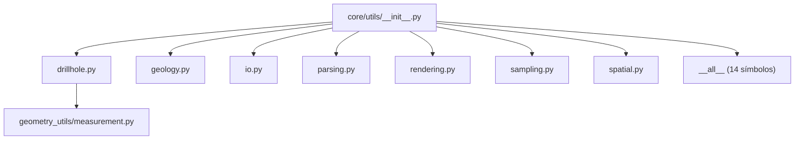

---
tags:
  - secinterp
  - code-walkthrough
  - core
  - utils
aliases:
  - utils
  - core/utils/
  - interpolate_elevation
  - parse_strike
  - calculate_apparent_dip
cssclass: secinterp-note
---

# `core/utils/__init__.py`

> [!abstract] Resumen en una línea
> **Fachada** del paquete `core/utils/`: re-exporta 14 helpers puros (geología, sondajes, parsing, rendering, sampling y espacial) y define `__all__` para que los consumidores hagan `from sec_interp.core import utils as scu`.

**Ruta**: `core/utils/__init__.py` (82 líneas)
**Símbolo principal**: `__all__` (14 re-exports)
**Capa**: Core (QGIS-agnóstico, con excepciones delegadas)
**Tags**: #secinterp #core #utils

---

## 🎯 ¿Por qué existe este archivo?

Los servicios y la GUI necesitan acceder a decenas de utilidades dispersas sin importar cada
submódulo. El `__init__.py` centraliza el acceso:

| Problema | Solución |
|----------|----------|
| Importar cada submódulo por separado es verboso | re-exporta 14 símbolos en un único paquete |
| El orden de import debe ser estable y explícito | `__all__` fija la API pública |
| Los consumidores deben poder hacer `scu.parse_strike(...)` | alias de paquete con notación corta |

> [!important] Nota arquitectónica
> Es un **Facade** sobre 7 submódulos. El archivo en sí no importa `qgis.*`, pero dos de los
> submódulos re-exportados sí lo hacen (`io` → `qgis.core`, `parsing` → objetos feature). La
> regla "core 100% QGIS-agnóstico" se cumple **en los helpers puros**; los adaptadores de I/O
> están acotados a `io.py`/`parsing.py`.

---

## 🧬 Diagrama de relaciones



> [!tip] Cómo leer
> El `__init__` no contiene lógica: sólo agrupa y re-exporta. Las flechas sólidas son los
> `from .submodulo import ...`; `__all__` es la lista blanca que define qué es público.

---

## 📦 Imports — lectura arquitectónica

```python
# core/utils/__init__.py
from __future__ import annotations

from .drillhole import (
    calculate_drillhole_trajectory,
    interpolate_intervals_on_trajectory,
    project_trajectory_to_section,
)
from .geology import calculate_apparent_dip
from .io import create_shapefile_writer
from .parsing import (
    cardinal_to_azimuth,
    extract_feature_attributes,
    parse_dip,
    parse_strike,
)
from .rendering import (
    calculate_bounds,
    calculate_interval,
    create_coordinate_transform,
)
from .sampling import interpolate_elevation
from .spatial import calculate_line_azimuth
```

| # | Observación |
|---|-------------|
| ① | Import **relativos** (`from .x import ...`): el paquete es autocontenido y portable. |
| ② | `i18n.py` **no** se re-exporta (se usa vía `from ...utils.i18n import TranslatableMixin`). |
| ③ | `create_shapefile_writer` es un *shim* deprecado de `io.create_vector_writer`. |

> [!warning] Docstring desactualizado
> El docstring del módulo lista `drillhole, geology, io, parsing, rendering, sampling,
> spatial` pero **omite `i18n`** (que sí existe como submódulo, aunque no se re-exporta).

---

## 🏗️ Inventario de estructura

**Sin clases ni funciones propias** — sólo re-exports.

**`__all__` (14 símbolos, orden alfabético):**

| # | Símbolo | Origen | Dominio |
|---|---------|--------|---------|
| 1 | `calculate_apparent_dip` | `geology.py` | Geología |
| 2 | `calculate_bounds` | `rendering.py` | Render |
| 3 | `calculate_drillhole_trajectory` | `drillhole.py` | Sondajes |
| 4 | `calculate_interval` | `rendering.py` | Render |
| 5 | `calculate_line_azimuth` | `spatial.py` | Espacial |
| 6 | `cardinal_to_azimuth` | `parsing.py` | Parsing |
| 7 | `create_coordinate_transform` | `rendering.py` | Render |
| 8 | `create_shapefile_writer` | `io.py` | I/O |
| 9 | `extract_feature_attributes` | `parsing.py` | Parsing |
| 10 | `interpolate_elevation` | `sampling.py` | Sampling |
| 11 | `interpolate_intervals_on_trajectory` | `drillhole.py` | Sondajes |
| 12 | `parse_dip` | `parsing.py` | Parsing |
| 13 | `parse_strike` | `parsing.py` | Parsing |
| 14 | `project_trajectory_to_section` | `drillhole.py` | Sondajes |

---

## 📁 Archivos del paquete

| Archivo | Líneas | Rol |
|---|--:|---|
| [[#utils|__init__.py]] | 82 | Fachada del paquete y `__all__` |

> [!note] El resto del paquete
> Los 7 submódulos re-exportados se documentan en sus propias notas: [[drillhole]],
> [[io]], [[parsing]], [[rendering]], y en la nota de paquete [[core_utils]] (grupo
> `geology`/`i18n`/`sampling`/`spatial`).

---

## 📖 Recorrido símbolo a símbolo

### Geología — `calculate_apparent_dip`

```python
calculate_apparent_dip(true_strike: float, true_dip: float, line_azimuth: float) -> float
```

Convierte buzamiento verdadero en **buzamiento aparente** en el plano de sección:
`atan(tan(dip) · sin(strike − azimuth))`. Puro, sólo `math`.

### Sondajes — `calculate_drillhole_trajectory`, `project_trajectory_to_section`, `interpolate_intervals_on_trajectory`

```python
calculate_drillhole_trajectory(collar_point, collar_z, survey_data, section_azimuth, densify_step=1.0, total_depth=0.0)
project_trajectory_to_section(trajectory, line_points)
interpolate_intervals_on_trajectory(trajectory, intervals, buffer_width)
```

Tríada para construir la trayectoria 3D de un sondaje, proyectarla sobre la sección y
repartir intervalos litológicos. Ver [[drillhole]].

### Parsing — `parse_strike`, `parse_dip`, `cardinal_to_azimuth`, `extract_feature_attributes`

```python
parse_strike(value) -> float | None
parse_dip(value) -> tuple[float | None, float | None]
cardinal_to_azimuth(text) -> float | None
extract_feature_attributes(feature) -> dict[str, Any]
```

Normalizan notaciones de rumbo/buzamiento (numérico, cuadrantes `"N 30 E"`) y sanitan
atributos de un feature a primitivos Python. Ver [[parsing]].

### Render — `calculate_bounds`, `calculate_interval`, `create_coordinate_transform`

```python
calculate_bounds(topo_data, geol_data=None) -> dict[str, float]
calculate_interval(data_range) -> float
create_coordinate_transform(bounds, view_w, view_h, margin, vert_exag=1.0)
```

Cálculo de envolvente, intervalos "bonitos" de eje y transformación dato → píxel. Ver
[[rendering]].

### Sampling — `interpolate_elevation`

```python
interpolate_elevation(topo_data: list[tuple[float, float]], distance: float) -> float
```

Interpolación lineal de cota sobre un perfil topográfico usando `bisect`. Puro.

### Espacial — `calculate_line_azimuth`

```python
calculate_line_azimuth(points: list[tuple[float, float]]) -> float
```

Azimut (rumbo de brújula) de una línea a partir de sus dos primeros puntos. Puro.

### I/O — `create_shapefile_writer`

```python
create_shapefile_writer(*args, **kwargs) -> QgsVectorFileWriter
```

*Shim* deprecado que delega en `io.create_vector_writer`. Ver [[io]].

---

## 🔄 Flujo de datos

| Fase | Entrada | Transformación | Salida |
|------|---------|----------------|--------|
| Import | `from sec_interp.core import utils as scu` | resolución de `__init__.py` | 14 símbolos accesibles |
| Uso | `scu.parse_strike("N 30 E")` | lógica del submódulo | `30` |
| Frontera | DTO/primitivos (GUI) | helpers puros | DTO/primitivos |

> [!tip] El patrón `scu.`
> Los tests usan `from sec_interp.core import utils as scu` y llaman `scu.parse_strike(...)`.
> El alias corto es la convención interna para acceder a toda la caja de herramientas.

---

## 🏛️ Patrones de diseño presentes

| Patrón | Dónde | Propósito |
|--------|-------|-----------|
| **Facade** | `__init__.py` | unificar el acceso a 7 submódulos |
| **Re-export / barril (barrel)** | `from .x import ...` | API pública en un solo punto |
| **Lista blanca** | `__all__` | controlar qué se considera público |
| **Shim de compatibilidad** | `create_shapefile_writer` | mantener compatibilidad hacia atrás |

---

## 🧾 Resumen de la API

| Símbolo | Firma | Uso típico |
|---------|-------|------------|
| `calculate_apparent_dip` | `(true_strike, true_dip, line_azimuth) -> float` | buzamiento aparente |
| `calculate_drillhole_trajectory` | `(collar_point, collar_z, survey_data, section_azimuth, ...) -> list` | trayectoria 3D |
| `project_trajectory_to_section` | `(trajectory, line_points) -> list` | proyección sobre sección |
| `interpolate_intervals_on_trajectory` | `(trajectory, intervals, buffer_width) -> list` | intervalos litológicos |
| `parse_strike` / `parse_dip` / `cardinal_to_azimuth` | `(value) -> ...` | normalizar rumbo/buzamiento |
| `extract_feature_attributes` | `(feature) -> dict` | sanear atributos |
| `calculate_bounds` / `calculate_interval` / `create_coordinate_transform` | `(...)` | envolvente y proyección |
| `interpolate_elevation` | `(topo_data, distance) -> float` | cota interpolada |
| `calculate_line_azimuth` | `(points) -> float` | azimut de línea |
| `create_shapefile_writer` | `(*args, **kwargs)` | shim de escritura vectorial |

---

## 🛡️ Manejo de errores

El `__init__.py` no maneja errores: sólo importa. El manejo depende de cada submódulo:

| Submódulo | Comportamiento |
|-----------|----------------|
| `parsing` | devuelve `None` ante parseo fallido |
| `sampling` | devuelve `0.0` para perfil vacío |
| `spatial` | devuelve `0` para líneas cortas |
| `io` | lanza `ValueError`/`OSError` en errores de escritura |

> [!warning] Import de `io` en entornos sin QGIS
> `from sec_interp.core import utils` **sí** ejecuta `io.py`, que importa `qgis.core`. Por eso
> los tests *standalone* (`test_utils_standalone.py`) importan las funciones directamente de
> los submódulos puros en lugar del paquete completo.

---

## 🧪 Tests asociados

- `tests/core/test_utils.py` — usa `scu.*` para `parse_strike`, `parse_dip`,
  `cardinal_to_azimuth`, `calculate_apparent_dip`, `interpolate_elevation`.
- `tests/core/test_utils_standalone.py` — mismas funciones sin tocar `io.py` (sin QGIS).
- `tests/core/test_spatial_utils.py` — `calculate_line_azimuth`.
- `tests/core/test_rendering_utils.py` — `calculate_bounds`, `calculate_interval`,
  `create_coordinate_transform`.
- `tests/core/test_drillhole_utils.py` — trayectoria y proyección de sondajes.

---

## 👀 Observaciones y notas

> [!success] Fortalezas
> - Fachada limpia: 14 helpers accesibles con un único import y `scu.` corto.
> - `__all__` explícito evita exportar símbolos internos por accidente.
> - El docstring agrupa por dominio, facilitando el descubrimiento.

> [!warning] Puntos de atención
> - El docstring omite `i18n.py` (existe pero no se re-exporta): discrepancia de documentación.
> - `create_shapefile_writer` es un shim deprecado que oculta `create_vector_writer`.
> - Importar el paquete completo arrastra `qgis.core` (vía `io.py`).

> [!question] Preguntas abiertas
> - ¿Re-exportar `TranslatableMixin` para unificar el acceso a i18n?
> - ¿Eliminar el shim `create_shapefile_writer` y migrar a `create_vector_writer`?
> - ¿Documentar `i18n` en el docstring o eliminarlo del paquete?

---

## 🔗 Notas relacionadas

- [[Index]] — índice de la bóveda
- [[core_utils]] — nota de paquete (grupo `geology`/`i18n`/`sampling`/`spatial`)
- [[drillhole]] / [[io]] / [[parsing]] / [[rendering]] — submódulos re-exportados
- [[geology_service]] / [[controller]] — consumidores típicos vía `scu.*`
- [[core_utils_geometry_utils]] — subpaquete hermano de `geometry_utils/`

---

*Nota de la bóveda SecInterp Code Walkthrough v2 — v3.9.0*
