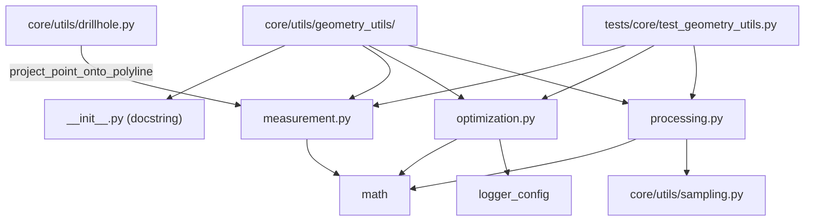

---
tags:
  - secinterp
  - code-walkthrough
  - core
  - utils
aliases:
  - core/utils/geometry_utils/
  - geometry_utils
  - measurement
  - optimization
  - processing
cssclass: secinterp-note
---

# `core/utils/geometry_utils/` — Namespace de geometría pura

> [!abstract] Resumen en una línea
> Paquete `core/utils/geometry_utils/` (4 archivos): `__init__` (marcador de namespace), `measurement` (medición), `optimization` (simplificación) y `processing` (densificación/interpolación) — geometría planar pura para perfiles, sin re-exports en el `__init__`.

**Ruta**: `core/utils/geometry_utils/` (4 archivos, ~416 líneas)
**Símbolo propio**: ninguno — `__init__.py` es un marcador de paquete
**Capa**: Core (QGIS-agnóstico)
**Tags**: #secinterp #core #utils

---

## 🎯 ¿Por qué existe este paquete?

El paquete `core/utils/` crecía con utilidades de geometría mezcladas con I/O, parsing y
rendering. `geometry_utils/` las agrupa bajo un dominio único:

| Problema | Solución |
|----------|----------|
| Utilidades geométricas dispersas en `utils/` | subpaquete `geometry_utils/` dedicado |
| Necesidad de un espacio de nombres estable | `__init__.py` como marcador (docstring) |
| Mantener cada preocupación en un módulo propio | `measurement` / `optimization` / `processing` |

> [!important] Nota arquitectónica
> El `__init__.py` **no re-exporta** nada: los consumidores importan cada submódulo por su
> ruta completa (`from ...geometry_utils.measurement import ...`). Es QGIS-agnóstico al 100%;
> su único "contenido" es una línea de docstring.

---

## 🧬 Diagrama de relaciones



> [!tip] Cómo leer
> El `__init__` no conecta nada: los tres módulos son hojas independientes. `drillhole`
> importa `measurement` por ruta directa; `processing` importa `sampling` de forma local. El
> test `test_geometry_utils.py` es el consumidor que demuestra las rutas de import.

---

## 📦 Imports — lectura arquitectónica

```python
# core/utils/geometry_utils/__init__.py
from __future__ import annotations

"""Utilities for geometry extraction, processing, and filtering."""
```

```python
# ejemplos de import reales en el proyecto
from sec_interp.core.utils.geometry_utils.measurement import project_point_onto_polyline
from sec_interp.core.utils.geometry_utils.optimization import PreviewOptimizer
from sec_interp.core.utils.geometry_utils.processing import densify_line_points
```

| # | Observación |
|---|-------------|
| ① | El `__init__` sólo declara `from __future__ import annotations` y una docstring. |
| ② | **Sin re-exports**: los consumidores usan la ruta completa del submódulo. |
| ③ | No hay import de `qgis.*` en ninguno de los tres submódulos. |

> [!note] Marcador de paquete
> En Python, un `__init__.py` (aunque sea de 3 líneas) convierte el directorio en un
> **paquete importable**. Aquí además fija la docstring del namespace.

---

## 🏗️ Inventario de estructura

**El `__init__.py` no define clases ni funciones.** La API real del paquete es la suma de
sus tres submódulos:

| Submódulo | Símbolos públicos | Dominio |
|-----------|-------------------|---------|
| `measurement.py` | `project_point_onto_polyline`, `calculate_polyline_metrics` | medición |
| `optimization.py` | `PreviewOptimizer` (`.decimate`, `.calculate_curvature`, `.adaptive_sample`) | simplificación |
| `processing.py` | `densify_line_points`, `interpolate_segment_points` | densificación |

> [!note] 7 símbolos públicos en total
> Dos funciones en `measurement`, una clase con 3 métodos en `optimization`, y dos funciones
> en `processing`. Ninguno está re-exportado por el paquete.

---

## 📁 Archivos del paquete

| Archivo | Líneas | Rol |
|---|--:|---|
| [[#__init__\|__init__.py]] | 3 | Marcador de paquete + docstring (sin re-exports) |
| [[measurement\|measurement.py]] | 136 | Proyección punto-polilínea y métricas de perfil |
| [[optimization\|optimization.py]] | 197 | Douglas-Peucker, curvatura y muestreo adaptativo |
| [[processing\|processing.py]] | 80 | Densificación e interpolación de segmentos |

> [!note] Los tres submódulos tienen nota propia
> `measurement`, `optimization` y `processing` se documentan en detalle en sus notas
> individuales. Esta nota de paquete describe el **namespace** y el rol del `__init__`.

---

## 📖 El `__init__.py` en detalle

### `__init__`

```python
from __future__ import annotations

"""Utilities for geometry extraction, processing, and filtering."""
```

| Elemento | Propósito |
|----------|-----------|
| `from __future__ import annotations` | evaluar anotaciones de forma diferida (PEP 563) |
| Docstring | describe el dominio: *extracción, procesamiento y filtrado* de geometría |

> [!important] Por qué no re-exporta
> Re-exportar aquí crearía un acoplamiento innecesario y una API duplicada con
> [[core_utils___init___py]]. La elección es **imports por ruta completa**, que además evitan cargar los tres
> módulos si sólo se necesita uno.

---

## 📖 Visión de los tres submódulos

### `measurement.py` — medir

```python
project_point_onto_polyline(point, polyline) -> tuple[float, tuple[float, float]]
calculate_polyline_metrics(points) -> dict[str, Any]
```

Proyección punto-segmento y resumen de perfil (distancia total/horizontal, cambio de cota,
pendiente media). Es la base que `drillhole.py` usa para proyectar trayectorias. Ver
[[measurement]].

### `optimization.py` — simplificar

```python
PreviewOptimizer.decimate(data, tolerance=None, max_points=1000)
PreviewOptimizer.calculate_curvature(data)
PreviewOptimizer.adaptive_sample(data, ...)
```

Reducción de vértices con **Douglas-Peucker**, curvatura angular y muestreo adaptativo para
LOD en el render. Ver [[optimization]].

### `processing.py` — densificar e interpolar

```python
densify_line_points(points, interval)
interpolate_segment_points(dist_start, dist_end, master_grid_dists, master_profile_data, tolerance)
```

Densificación de polilíneas y conversión de límites de intervalo en puntos `(dist, elev)`.
Ver [[processing]].

---

## 🧭 Cómo importar correctamente

Al no haber re-exports, la forma canónica es importar **por ruta completa**:

```python
# ✅ correcto — ruta completa del submódulo
from sec_interp.core.utils.geometry_utils.measurement import (
    project_point_onto_polyline,
    calculate_polyline_metrics,
)
from sec_interp.core.utils.geometry_utils.optimization import PreviewOptimizer
from sec_interp.core.utils.geometry_utils.processing import densify_line_points

# ❌ incorrecto — el __init__ no expone estos nombres
from sec_interp.core.utils.geometry_utils import PreviewOptimizer  # ImportError
```

| Import | Funciona | Por qué |
|--------|:---:|---------|
| `from ...geometry_utils.measurement import X` | ✅ | submódulo directo |
| `from ...geometry_utils import X` | ❌ | el `__init__` no re-exporta |
| `from ...geometry_utils import measurement` | ✅ | importa el submódulo, no sus símbolos |

> [!tip] Regla nemotécnica
> `geometry_utils` es un **namespace**, no una API. Importa el archivo, no el paquete.

---

## 🔬 Comparación de los tres módulos

| Criterio | `measurement` | `optimization` | `processing` |
|----------|---------------|----------------|--------------|
| **Pregunta que responde** | ¿dónde está el punto más cercano / cuánto mide? | ¿qué puntos puedo descartar sin perder forma? | ¿qué puntos hay entre dos distancias? |
| **Entrada típica** | punto + polilínea | polilínea densa | distancias + malla |
| **Salida típica** | `(dist, nearest)` / dict | polilínea reducida | `[(dist, elev)]` |
| **Algoritmo clave** | proyección paramétrica | Douglas-Peucker | subdivisión `ceil` + `bisect` |
| **Complejidad** | `O(n)` | `O(n log n)` | `O(n)` |
| **Consumidor principal** | `drillhole.py` | render de preview | `geology_service` |
| **Importa a otros del core** | no | no | `sampling` (local) |

> [!note] Independencia deliberada
> Ninguno importa a los otros dos. Esto permite testearlos y reutilizarlos por separado, y
> evita acoplamientos que compliquen la evolución del paquete.

---

## 🧩 Cómo extender el paquete

Para añadir un cuarto módulo (p. ej. `filtering.py`), el criterio de inclusión es:

| Criterio | Regla |
|----------|-------|
| Dominio | geometría planar pura (sin QGIS, sin I/O) |
| Tamaño | una responsabilidad por módulo |
| `__init__` | se mantiene como marcador; **no** se añaden re-exports |
| Test | nuevo caso en `tests/core/test_geometry_utils.py` o archivo propio |

> [!warning] No romper la regla QGIS-agnóstico
> Si un futuro módulo necesita `QgsGeometry`, no pertenece a `geometry_utils/`: debe ir a
> una capa adapter (GUI) o aceptar WKT/primitivos. Ver [[core_interfaces]].

---

## 🧪 Estrategia de test del paquete

El único test del paquete es `tests/core/test_geometry_utils.py`, estructurado por módulo:

| Clase de test | Submódulo cubierto | Enfoque |
|---------------|--------------------|---------|
| `TestGeometryMeasurement` | `measurement` | métricas (vacío, triángulo 3-4-5) |
| `TestGeometryOptimization` | `optimization` | decimación, curvatura, muestreo |
| `TestGeometryProcessing` | `processing` | densificación, interpolación |

- **Mock-first / sin QGIS**: los tests heredan de `BaseTestCase` y no requieren QGIS.
- La cobertura indirecta llega vía `tests/core/test_drillhole_utils.py` (usa `measurement`).

---

## 🔄 Flujo de datos

| Fase | Entrada | Transformación | Salida |
|------|---------|----------------|--------|
| Medición | punto + polilínea | proyección paramétrica | `(dist, nearest)` |
| Simplificación | polilínea densa | Douglas-Peucker / LOD | polilínea reducida |
| Densificación | polilínea + `interval` | subdivisión `ceil` | polilínea densificada |

> [!tip] Un pipeline típico
> `drillhole` → `measurement` (proyectar) → `optimization` (simplificar para render) →
> `processing` (densificar el perfil geológico). Cada módulo resuelve un eslabón.

---

## 🏛️ Patrones de diseño presentes

| Patrón | Dónde | Propósito |
|--------|-------|-----------|
| **Namespace package** | `__init__.py` | agrupar por dominio sin acoplar |
| **Import por ruta completa** | consumidores | cargar sólo lo necesario |
| **Función pura / hoja** | los 3 módulos | sin efectos secundarios, thread-safe |
| **División por responsabilidad** | 3 módulos | medir / simplificar / densificar |

---

## 🧾 Resumen de la API

| Símbolo | Origen | Uso típico |
|---------|--------|------------|
| `project_point_onto_polyline` | `measurement` | proyectar sobre sección |
| `calculate_polyline_metrics` | `measurement` | resumir forma del perfil |
| `PreviewOptimizer.decimate` | `optimization` | simplificar polilínea |
| `PreviewOptimizer.calculate_curvature` | `optimization` | estimar giros |
| `PreviewOptimizer.adaptive_sample` | `optimization` | muestreo sensible a la forma |
| `densify_line_points` | `processing` | garantizar densidad de vértices |
| `interpolate_segment_points` | `processing` | perfil de un intervalo |

---

## 🧪 Cómo ejecutar los tests

```bash
PYTHONPATH=.. uv run python3 -m unittest \
    tests.core.test_geometry_utils -v
```

- Clase única: `tests.core.test_geometry_utils` agrupa los tres submódulos.
- No requiere QGIS (Mock-first): se ejecuta igual que el resto de `tests/core/`.
- `BaseTestCase` aporta el entorno y la limpieza automática.

---

## 🔎 La docstring como contrato implícito

```python
"""Utilities for geometry extraction, processing, and filtering."""
```

| Palabra | A qué apunta hoy |
|---------|------------------|
| `extraction` | `measurement` (proyección/extracción de puntos) |
| `processing` | `processing` (densificación/interpolación) |
| `filtering` | `optimization` (filtrado de vértices vía DP) |

> [!note] Mapeo aproximado
> La docstring no nombra los módulos, pero describe **tres verbos** que se corresponden con
> las tres responsabilidades. Es una pista de diseño, no un contrato formal (`__all__`
> vacío, sin re-exports).

---

## 🛡️ Manejo de errores

El paquete no maneja errores (no tiene lógica). A nivel de submódulos:

| Módulo | Comportamiento |
|--------|----------------|
| `measurement` | retornos defensivos (vacío/un vértice → `0.0`) |
| `optimization` | `try/except` fail-safe en `decimate` |
| `processing` | retorno intacto ante entradas inválidas |

---

## 🧪 Tests asociados

`tests/core/test_geometry_utils.py` cubre los tres submódulos:

- `TestGeometryMeasurement` — `calculate_polyline_metrics` (vacío y triángulo 3-4-5).
- `TestGeometryOptimization` — `decimate`, `calculate_curvature`, `adaptive_sample`.
- `TestGeometryProcessing` — `densify_line_points`, `interpolate_segment_points`.

> [!note] El test importa por ruta completa
> `test_geometry_utils.py` demuestra el patrón de import del paquete:
> `from ...geometry_utils.measurement import ...` (nada vía el `__init__`).

---

## 👀 Observaciones y notas

> [!success] Fortalezas
> - Agrupación limpia por dominio; cada módulo tiene una única responsabilidad.
> - `__init__` mínimo (sin re-exports) evita acoplamiento y API duplicada.
> - 100% QGIS-agnóstico y testeable sin entorno QGIS.

> [!warning] Puntos de atención
> - La docstring ("extraction, processing, and filtering") no menciona `optimization`.
> - Sin re-exports, el descubrimiento de la API depende de conocer los nombres de archivo.
> - El `__init__` no define `__all__` (no lo necesita al no re-exportar).

> [!question] Preguntas abiertas
> - ¿Actualizar la docstring para reflejar los tres módulos actuales?
> - ¿Añadir un re-export selectivo en `core/utils/__init__.py` para los helpers más usados?

---

## 🔗 Notas relacionadas

- [[Index]] — índice de la bóveda
- [[measurement]] / [[optimization]] / [[processing]] — los tres submódulos
- [[core_utils___init___py]] — fachada del paquete padre `core/utils/`
- [[core_utils]] — nota de paquete del grupo `geology`/`i18n`/`sampling`/`spatial`
- [[drillhole]] — consumidor de `measurement.project_point_onto_polyline`

---

*Nota de la bóveda SecInterp Code Walkthrough v2 — v3.9.1*
