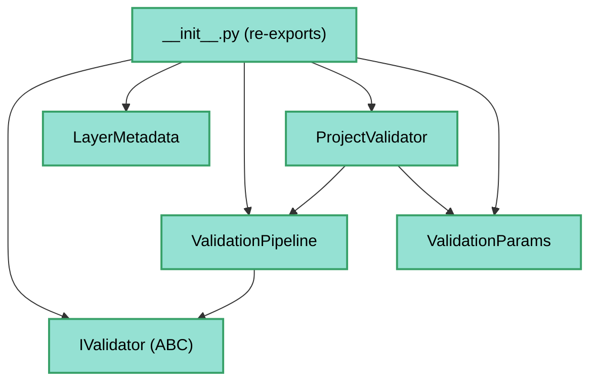

---
tags:
  - secinterp
  - code-walkthrough
  - core
  - validation
aliases:
  - core/validation/
  - validation
  - IValidator
  - LayerMetadata
  - ValidationPipeline
cssclass: secinterp-note
---

# `core/validation/` — Marco de validación

> [!abstract] Resumen en una línea
> Paquete `core/validation/` (4 archivos): declara la interfaz `IValidator`, el DTO `LayerMetadata`, el orquestador `ValidationPipeline` y el `__init__` que re-exporta la API pública de validación, todo QGIS-agnóstico.

**Ruta**: `core/validation/` (4 archivos, ~148 líneas)
**Clases principales**: `IValidator`, `LayerMetadata`, `ValidationPipeline`, `ProjectValidator`, `ValidationParams`
**Capa**: Core (QGIS-agnóstico)
**Tags**: #secinterp #core #validation

---

## 🎯 ¿Por qué existe este paquete?

La validación de un proyecto QGIS (capas, campos, rangos) debe poder ejecutarse sin
entorno QGIS. Este paquete define la **infraestructura** de validación desacoplada:

| Problema | Solución |
|----------|----------|
| Validar sin tocar objetos QGIS | `LayerMetadata` (metadata desacoplada producida por la GUI) |
| Contrato común para validadores | `IValidator` (ABC con `validate`) |
| Ejecutar muchos validadores en cadena | `ValidationPipeline` |
| API pública estable | `__init__.py` re-exporta 15 símbolos |

> [!important] Regla de la capa
> Los 4 archivos de este grupo **no importan `qgis.*`**. `LayerMetadata` usa `FieldType`
> (enum del dominio) en lugar de `QVariant`. El resto del paquete (`field_validator`,
> `layer_validator`, `project_validator`, etc.) consume esta infraestructura.

---

## 🧬 Diagrama de relaciones



> [!tip] Cómo leer
> `pipeline.py` compone `IValidator`s; `project_validator.py` (fuera del grupo) instancia
> la pipeline con validadores concretos. El `__init__.py` es la fachada de exportación.

---

## 📦 Imports — lectura arquitectónica

```python
# core/validation/__init__.py
from .field_validator import (validate_angle_range, validate_field_exists, ...)
from .layer_validator import (validate_crs_compatibility, validate_layer_geometry, ...)
from .path_validator import (validate_output_path, validate_safe_output_path)
from .project_validator import (ProjectValidator, ValidationParams)
from .validation_helpers import validate_reasonable_ranges

# core/validation/base_validator.py
from abc import ABC, abstractmethod
from typing import TYPE_CHECKING

# core/validation/layer_metadata.py
from dataclasses import dataclass, field
from sec_interp.core.domain import FieldType

# core/validation/pipeline.py
from collections.abc import Iterable
from .base_validator import IValidator
```

| # | Observación |
|---|-------------|
| ① | **Cero `qgis.*`** en los 4 archivos del grupo. |
| ② | `base_validator.py` usa `TYPE_CHECKING` para imports circulares (solo tipado). |
| ③ | `layer_metadata.py` importa `FieldType` del dominio (enum, no `QVariant`). |
| ④ | `pipeline.py` depende solo de `IValidator` (inversión de dependencias). |
| ⑤ | `__init__.py` re-exporta funciones de validadores concretos (fuera del grupo). |

---

## 🏗️ Inventario de estructura

**Clases:**
- `class IValidator(ABC)` — 1 método abstracto
- `@dataclass class LayerMetadata` — 9 campos
- `class ValidationPipeline` — 3 métodos

**Constantes (en `layer_metadata.py`):**
- `GEOMETRY_POINT` / `GEOMETRY_LINE` / `GEOMETRY_POLYGON` / `GEOMETRY_UNKNOWN`
- `KIND_VECTOR` / `KIND_RASTER` / `KIND_UNKNOWN`

**Re-exports (en `__init__.py`):**
- `ProjectValidator`, `ValidationParams`
- `validate_angle_range`, `validate_crs_compatibility`, `validate_field_exists`, `validate_field_type`, `validate_integer_input`, `validate_layer_geometry`, `validate_layer_has_features`, `validate_numeric_input`, `validate_output_path`, `validate_raster_band`, `validate_reasonable_ranges`, `validate_safe_output_path`, `validate_structural_requirements`

---

## 📁 Archivos del paquete

| Archivo | Líneas | Rol |
|---|--:|---|
| [[#__init__.py\|__init__.py]] | 45 | Fachada de exportación (15 símbolos públicos) |
| [[#base_validator.py\|base_validator.py]] | 25 | `IValidator` — interfaz base de validadores |
| [[#layer_metadata.py\|layer_metadata.py]] | 49 | `LayerMetadata` — metadata de capa desacoplada |
| [[#pipeline.py\|pipeline.py]] | 29 | `ValidationPipeline` — ejecución encadenada |

---

## 📖 Recorrido archivo por archivo

### __init__.py

```python
from .field_validator import (
    validate_angle_range, validate_field_exists, validate_field_type,
    validate_integer_input, validate_numeric_input,
)
from .layer_validator import (
    validate_crs_compatibility, validate_layer_geometry,
    validate_layer_has_features, validate_raster_band,
    validate_structural_requirements,
)
from .path_validator import validate_output_path, validate_safe_output_path
from .project_validator import ProjectValidator, ValidationParams
from .validation_helpers import validate_reasonable_ranges
```

Define el **API público** del paquete. Los consumidores (`gui/`, `controller`) importan
`from sec_interp.core.validation import ProjectValidator`, no los módulos internos. Los
módulos `field_validator`, `layer_validator`, `path_validator`, `project_validator`,
`validation_helpers` **no forman parte de este grupo** (tienen notas propias).

### base_validator.py

```python
class IValidator(ABC):
    @abstractmethod
    def validate(self, params: ValidationParams, context: ValidationContext) -> None:
        """Execute validation logic."""
        pass
```

Contrato mínimo de un validador: recibe `ValidationParams` (datos) y
`ValidationContext` (acumulador de errores), y no devuelve nada (los errores se acumulan
en el contexto). Usa `TYPE_CHECKING` para tipar sin acoplarse.

> [!tip] Interfaz "void" con acumulador
> El validador no devuelve `bool` ni lanza: **escribe** en `ValidationContext`. Así la
> pipeline puede acumular *todos* los errores antes de presentarlos.

### layer_metadata.py

```python
@dataclass
class LayerMetadata:
    name: str = ""
    is_valid: bool = False
    kind: str = KIND_UNKNOWN
    geometry_type: str | None = None
    field_names: list[str] = field(default_factory=list)
    field_types: dict[str, FieldType] = field(default_factory=dict)
    band_count: int = 0
    feature_count: int = 0
    crs_authid: str | None = None
```

DTO que describe una capa QGIS **sin** el objeto QGIS: nombre, validez, tipo
(vector/raster), geometría, campos (con `FieldType`), bandas, nº de features y CRS. La
produce el adapter `ValidationExtractor` de la GUI para que el core nunca toque `QgsMapLayer`.

### pipeline.py

```python
class ValidationPipeline:
    def __init__(self, validators: Iterable[IValidator] | None = None) -> None:
        self._validators: list[IValidator] = list(validators) if validators else []

    def add_validator(self, validator: IValidator) -> None:
        self._validators.append(validator)

    def execute(self, params: ValidationParams, context: ValidationContext) -> None:
        for validator in self._validators:
            validator.validate(params, context)
```

Orquestador **Composite/Iterator**: ejecuta una lista de `IValidator` en secuencia sobre
el mismo contexto. `ProjectValidator.validate_all` la usa con 6 validadores concretos
(`SectionValidator`, `DEMValidator`, `GeologyValidator`, `StructureValidator`,
`DrillholeValidator`, `OutputValidator`).

---

## 🔄 Flujo de datos

| Fase | Entrada | Transformación | Salida |
|------|---------|----------------|--------|
| Extracción (GUI) | capas QGIS | `ValidationExtractor` | `LayerMetadata` |
| Preparación | metadata + campos | constructor | `ValidationParams` |
| Ejecución | `ValidationParams` | `pipeline.execute` | errores en `ValidationContext` |
| Verificación | `context` | `raise_if_errors` | `ValidationError` |

---

## 🏛️ Patrones de diseño presentes

| Patrón | Dónde | Propósito |
|--------|-------|-----------|
| **Composite/Iterator** | `ValidationPipeline` | Ejecutar validadores en cadena |
| **Template (ABC)** | `IValidator` | Fijar la firma `validate` |
| **DTO desacoplado** | `LayerMetadata` | Metadata sin objetos QGIS |
| **Facade (módulo)** | `__init__.py` | API pública estable |
| **Null Object** | defaults de `LayerMetadata` | Valores seguros por defecto |

---

## 🧾 Resumen de la API

| Símbolo | Firma / Hereda | Uso típico |
|---------|----------------|------------|
| `IValidator` | `ABC` | Base de validadores |
| `IValidator.validate` | `(params, context) -> None` | Ejecutar validación |
| `LayerMetadata` | `@dataclass` | Metadata de capa |
| `ValidationPipeline` | — | Orquestar validadores |
| `ValidationPipeline.add_validator` | `(validator) -> None` | Añadir validador |
| `ValidationPipeline.execute` | `(params, context) -> None` | Ejecutar en cadena |

---

## 🛡️ Manejo de errores

Los validadores **no lanzan**: acumulan en `ValidationContext`. El patrón es:

- `context.add_error(...)` / `context.add_warning(...)` — acumular
- `context.raise_if_errors()` — lanzar `ValidationError` con todos los errores juntos

> [!tip] Fail-fast vs acumulación
> `ProjectValidator.validate_all` acumula todo y lanza al final; los helpers legacy
> (`is_dem_complete`, etc.) solo consultan `context.has_errors` sin lanzar.

---

## 🧪 Tests asociados

Mapeo a los tests del marco de validación (mock-first, sin QGIS):

- `tests/core/validation/test_validation_helpers.py` — `ValidationContext` y acumulación.
- `tests/core/validation/test_validators.py` — validadores concretos.
- `tests/core/validation/test_service_validation.py` — validación de servicios.
- `tests/core/test_validation.py` / `test_validation_refactor.py` — regresión del marco.
- `tests/core/test_project_validator.py` — `ProjectValidator.validate_all`.

---

## 👀 Observaciones y notas

> [!success] Fortalezas
> - **Cero QGIS**: toda la validación de capas se hace sobre `LayerMetadata`.
> - Acumulación de errores (no fail-fast) mejora la UX.
> - `FieldType` (enum) sustituye a `QVariant` sin perder semántica.
> - `__init__.py` centraliza la API pública (consumidores no importan internos).

> [!warning] Puntos de atención
> - El grupo documentado (4 archivos) es solo la **infraestructura**; los validadores concretos viven en otros módulos.
> - `IValidator.validate` devuelve `None` y tipa `ValidationContext` solo en `TYPE_CHECKING`.
> - `LayerMetadata` mezcla strings mágicas (`"point"`, `"vector"`) en lugar de un enum.

> [!question] Preguntas abiertas
> - ¿Convertir `geometry_type`/`kind` de `LayerMetadata` a enums (`FieldType`-like)?
> - ¿Tipar los re-exports de `__init__.py` con `__all__` más estricto (ya lo hace)?

---

## 🧩 El acumulador `ValidationContext`

`IValidator.validate` escribe en un `ValidationContext` (definido en
`validation_helpers.py`, fuera del grupo). Sus métodos clave:

| Miembro | Tipo | Uso |
|---------|------|-----|
| `add_error(message, field_name, **kwargs)` | método | acumular error duro |
| `add_warning(message, field_name, **kwargs)` | método | acumular aviso |
| `has_errors` | property | ¿hay errores duros? |
| `has_warnings` | property | ¿hay avisos? |
| `errors` / `warnings` | property | listas `RichValidationError` |
| `merge(other)` | método | combinar contextos |
| `raise_if_errors()` | método | lanzar `ValidationError` |

> [!tip] Acumular, no fallar
> El contexto permite recopilar **todos** los errores de un formulario antes de mostrarlos,
> en lugar de fallar en el primer campo inválido.

## 🧭 Los 3 niveles de validación

El skill `geological-logic` documenta la validación en 3 niveles; este paquete es la
**infraestructura** del nivel 2:

| Nivel | Qué valida | Dónde |
|-------|-----------|-------|
| 1. Primitivos | tipos y rangos (`buffer_dist`, `band_num`) | `PreviewParams.validate()` (en `dtos.py`) |
| 2. Negocio | dependencias entre capas/campos | `ProjectValidator` + `ValidationPipeline` + `ValidationContext` |
| 3. Cross-layer | consistencia entre capas seleccionadas | `project_validators.py` (concretos) |

> [!important] Capas → `LayerMetadata`
> En el nivel 2/3 las capas QGIS llegan como `LayerMetadata`, no como `QgsMapLayer`. Es lo
> que hace posible ejecutar `ProjectValidator.validate_all` sin entorno QGIS.

## 🗂️ Validadores concretos (fuera del grupo)

`ProjectValidator.validate_all` compone 6 validadores concretos vía la pipeline:

| Validador | Módulo | Objetivo |
|-----------|--------|----------|
| `SectionValidator` | `project_validators.py` | Línea de sección |
| `DEMValidator` | `project_validators.py` | Raster DEM + banda |
| `GeologyValidator` | `project_validators.py` | Capa/campo de afloramientos |
| `StructureValidator` | `project_validators.py` | Capa/campos estructurales |
| `DrillholeValidator` | `project_validators.py` | Collar/survey/intervalo |
| `OutputValidator` | `project_validators.py` | Ruta de salida |

> [!note] Separación infraestructura vs reglas
> Este grupo (4 archivos) define el *cómo* (interfaz, DTO, pipeline); los validadores
> concretos definen el *qué* (reglas de negocio). Ver [[project_validators]].

## 🧾 Superficie de validación re-exportada

El `__init__.py` agrupa la API funcional por familia:

| Familia | Funciones | Propósito |
|---------|-----------|-----------|
| `field_validator` | `validate_angle_range`, `validate_field_exists`, `validate_field_type`, `validate_integer_input`, `validate_numeric_input` | Validar campos |
| `layer_validator` | `validate_crs_compatibility`, `validate_layer_geometry`, `validate_layer_has_features`, `validate_raster_band`, `validate_structural_requirements` | Validar capas |
| `path_validator` | `validate_output_path`, `validate_safe_output_path` | Validar rutas |
| `project_validator` | `ProjectValidator`, `ValidationParams` | Orquestación |
| `validation_helpers` | `validate_reasonable_ranges` | Avisos de rangos extremos |

> [!tip] API "funcional" + "de clases"
> Conviven funciones sueltas (validaciones unitarias) con clases (`ProjectValidator`).
> Los consumidores suelen usar `ProjectValidator.validate_all`, no las funciones sueltas.

## 🌐 Notas de i18n

- Los mensajes de error de los validadores se traducen **en el punto de lanzamiento** (con
  `self.tr(...)` en la GUI o en los validadores), no en la infraestructura de este grupo.
- `RichValidationError.__str__` prefija `[WARNING]`/`[ERROR]` y el `field_name`, facilitando
  la presentación en el UI sin acoplar a Qt.

> [!note] Sin strings mágicas en la infraestructura
> `base_validator.py`, `layer_metadata.py` y `pipeline.py` no contienen textos de usuario:
> la infraestructura es neutral; los mensajes viven en los validadores concretos.

## 🧭 Consistencia con `PreviewParams.validate()`

La validación del proyecto convive con la validación **nativa** de primitivos en
`dtos.py`:

| Validación | Dónde | Tipo de error |
|------------|-------|---------------|
| `buffer_dist >= 0` | `PreviewParams.validate()` | `ValueError` |
| `band_num >= 1` | `PreviewParams.validate()` | `ValueError` |
| Cross-layer (nivel 2/3) | `ProjectValidator` + pipeline | `ValidationError` |

> [!note] `ValueError` vs `ValidationError`
> `PreviewParams.validate()` lanza `ValueError` (histórico), mientras el marco de
> validación usa `ValidationError` (ver [[exceptions]]). Es una inconsistencia conocida.

## 🔗 Notas relacionadas

- [[Index]] — índice de la bóveda
- [[field_validator]] / [[layer_validator]] / [[path_validator]] — validadores re-exportados
- [[project_validator]] — `ProjectValidator` y `ValidationParams` (consumidor de la pipeline)
- [[validation_helpers]] — `ValidationContext`, `RichValidationError`
- [[validators]] / [[project_validators]] — validadores concretos
- [[domain]] — `FieldType` (enum usado en `LayerMetadata`)
- [[exceptions]] — `ValidationError`
- [[controller]] — valida `PreviewParams` antes de computar

---

*Nota de la bóveda SecInterp Code Walkthrough v2 — v3.9.1*
