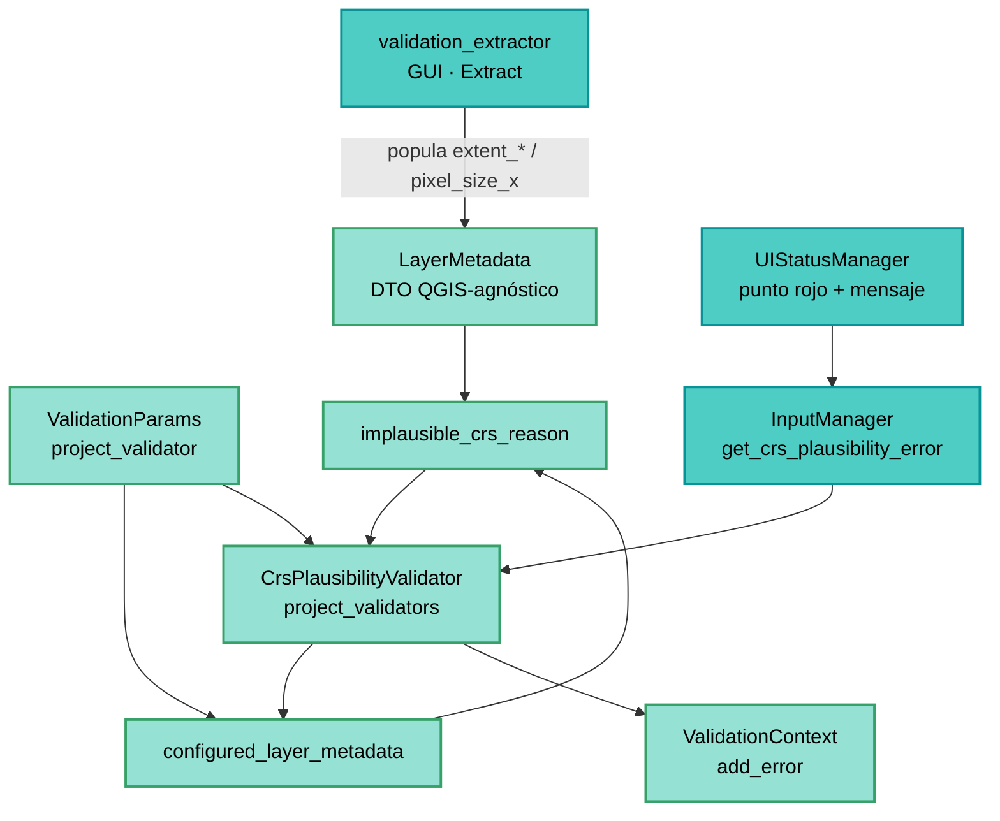

---
tags:
  - secinterp
  - code-walkthrough
  - core
  - validation
aliases:
  - crs_plausibility.py
  - implausible_crs_reason
  - configured_layer_metadata
cssclass: secinterp-note
---

# `core/validation/crs_plausibility.py`

> [!abstract] Resumen en una línea
> Heurística conservadora y 100% QGIS-agnóstica que detecta CRS mal etiquetados comparando la extensión (o el píxel ráster) de un `LayerMetadata` contra el tipo de CRS declarado.

**Ruta**: `core/validation/crs_plausibility.py` (99 líneas)
**Funciones principales**: `configured_layer_metadata`, `implausible_crs_reason`
**Capa**: core (QGIS-agnóstico · Validation)
**Tags**: #secinterp #core #validation

---

## 🎯 ¿Por qué existe este archivo?

Un CRS mal etiquetado **no se puede leer del metadato**: QGIS confía en la declaración.
Pero suele delatarse en los valores de coordenada. Este módulo convierte esa intuición
en una regla conservadora que evita perfiles silenciosamente erróneos:

| Problema | Solución |
|----------|----------|
| El metadato declara un CRS, pero la declaración es errónea y QGIS la cree | Inferir de la extensión: fuera de límites lon/lat, o tamaños imposibles en unidades proyectadas |
| La reproyección al vuelo oculta el error y produce salidas incorrectas sin avisar | Error duro que bloquea preview/export antes de generar nada |
| Revisar a mano la extensión de 7 capas es tedioso y fácil de olvidar | `configured_layer_metadata` recorre las capas configuradas y filtra las ausentes |
| Un metadato incompleto no debe bloquear trabajo legítimo | La heurística se calla (`return ""`) cuando no puede juzgar: *fail-open* |

> [!important] Nota arquitectónica
> **QGIS-agnóstico puro.** Consume el DTO [[layer_metadata]] (`LayerMetadata`), ya
> extraído por el adaptador GUI [[validation_extractor]]. No importa `qgis.*`, ni Qt,
> ni hace I/O: es una función de decisión testeable sin QGIS. El `ValidationParams` se
> importa solo bajo `TYPE_CHECKING` para no crear un ciclo con [[project_validator]].

---

## 🧬 Diagrama de relaciones



> [!tip] Cómo leer
> El extractor GUI rellena `LayerMetadata`; el core solo lee primitivos (`extent_*`,
> `pixel_size_x`, `crs_is_geographic`) y devuelve un `str`. El validador convierte un
> motivo no vacío en error de contexto, y la GUI lo presenta como bloqueo.

---

## 📦 Imports — lectura arquitectónica

```python
# core/validation/crs_plausibility.py
from __future__ import annotations

from typing import TYPE_CHECKING

from sec_interp.core.validation.layer_metadata import LayerMetadata

if TYPE_CHECKING:
    from .project_validator import ValidationParams
```

| # | Observación |
|---|-------------|
| ① | Solo importa el DTO `LayerMetadata`: cero dependencias de `qgis.*` o Qt. |
| ② | `ValidationParams` bajo `TYPE_CHECKING`: la anotación existe, el import en runtime no (evita ciclo). |
| ③ | `from __future__ import annotations` mantiene el estándar del proyecto para tipos compuestos. |
| ④ | Sin logger, sin estado, sin efectos laterales: función total de decisión. |

> [!note] Frontera Core/UI
> Este módulo es el ejemplo canónico del patrón *Extract-then-Compute*: la GUI extrae
> (`extent_xmin`, `crs_is_geographic`, `pixel_size_x`) y el core solo compara números.

---

## 🏗️ Inventario de estructura

**Constantes** (umbrales de plausibilidad):

| Constante | Valor | Significado |
|-----------|-------|-------------|
| `GEOGRAPHIC_X_LIMIT` | `180.0` | Longitud máxima creíble en grados |
| `GEOGRAPHIC_Y_LIMIT` | `90.0` | Latitud máxima creíble en grados |
| `MIN_PROJECTED_SPAN` | `1.0` | Extensión proyectada mínima creíble (unidades del mapa) |
| `MIN_PROJECTED_PIXEL` | `1e-3` | Píxel proyectado mínimo creíble (unidades del mapa) |

**Funciones:**

- `configured_layer_metadata(params: ValidationParams) -> list[LayerMetadata]`
- `_extent(metadata: LayerMetadata) -> tuple[float, float, float, float] | None`
- `implausible_crs_reason(metadata: LayerMetadata | None) -> str`

---

## 📁 Archivos del paquete

| Archivo | Rol respecto a la heurística |
|---|---|
| `gui/adapters/validation_extractor.py` | Extract GUI: rellena `extent_*` y `pixel_size_x` en el DTO |
| `core/validation/layer_metadata.py` | DTO consumido (ver [[layer_metadata]]) |
| `core/validation/project_validators.py` | `CrsPlausibilityValidator` (ver [[project_validators]]) |
| `core/validation/project_validator.py` | `ValidationParams` + pipelines + `crs_plausibility_error` |
| `gui/ui_status_manager.py` | Presenta el bloqueo: punto rojo y mensaje crítico |

---

## 📖 Recorrido método por método

### `configured_layer_metadata` — el filtro de capas

```python
def configured_layer_metadata(params: ValidationParams) -> list[LayerMetadata]:
    """Return the detached metadata of every configured layer."""
    candidates = (
        params.raster_layer,
        params.line_layer,
        params.outcrop_layer,
        params.struct_layer,
        params.collar_layer,
        params.survey_layer,
        params.interval_layer,
    )
    return [m for m in candidates if m is not None]
```

| Decisión | Detalle |
|----------|---------|
| Tupla fija de 7 | Mismo orden que el resto de `ValidationParams`: DEM, línea, geología, estructuras, collar, survey, intervalos |
| Filtro `is not None` | Las capas no configuradas se omiten: no hay error por capa ausente |
| Sin lógica de CRS | Solo selecciona candidatos; la heurística decide después |

### `_extent` — la puerta «todo o nada»

```python
def _extent(metadata: LayerMetadata) -> tuple[float, float, float, float] | None:
    """Return the populated extent tuple, or None when incomplete."""
    xmin = metadata.extent_xmin
    ymin = metadata.extent_ymin
    xmax = metadata.extent_xmax
    ymax = metadata.extent_ymax
    if xmin is None or ymin is None or xmax is None or ymax is None:
        return None
    return xmin, ymin, xmax, ymax
```

Una extensión parcial (`xmin` presente, `ymax` ausente) se descarta por completo: la
heurística exige las cuatro esquinas para calcular span y máximo.

### `implausible_crs_reason` — la heurística

```python
def implausible_crs_reason(metadata: LayerMetadata | None) -> str:
    if metadata is None or metadata.crs_is_geographic is None:
        return ""
    extent = _extent(metadata)
    if extent is None:
        return ""
    xmin, ymin, xmax, ymax = extent

    span_x = abs(xmax - xmin)
    span_y = abs(ymax - ymin)
    if span_x == 0 and span_y == 0:
        return ""

    max_x = max(abs(xmin), abs(xmax))
    max_y = max(abs(ymin), abs(ymax))
    within_geographic_bounds = max_x <= GEOGRAPHIC_X_LIMIT and max_y <= GEOGRAPHIC_Y_LIMIT

    if metadata.crs_is_geographic:
        if max_x > GEOGRAPHIC_X_LIMIT or max_y > GEOGRAPHIC_Y_LIMIT:
            return (
                f"Layer '{metadata.name}' is declared with a geographic CRS but its "
                f"coordinates exceed lon/lat bounds (x up to {max_x:.3g}, y up to "
                f"{max_y:.3g}); the data may actually be projected."
            )
        return ""

    tiny_span = max(span_x, span_y) < MIN_PROJECTED_SPAN
    tiny_pixel = (
        metadata.pixel_size_x is not None and 0 < metadata.pixel_size_x < MIN_PROJECTED_PIXEL
    )
    if within_geographic_bounds and (tiny_span or tiny_pixel):
        return (
            f"Layer '{metadata.name}' is declared with a projected CRS but its extent "
            f"({xmin:.4g}, {ymin:.4g} : {xmax:.4g}, {ymax:.4g}) looks like degrees; "
            "the data may be geographic (e.g. EPSG:4326) with a wrong CRS label. "
            "Fix it with 'Assign Projection' (not 'Reproject')."
        )
    return ""
```

#### Guardas previas — *fail-open*

| Guarda | Efecto |
|--------|--------|
| `metadata is None` | Silencio: no hay nada que juzgar |
| `crs_is_geographic is None` | El CRS no pudo clasificarse en el extractor → silencio |
| `_extent(...) is None` | Extensión incompleta o vacía → silencio |
| `span_x == 0 and span_y == 0` | Extensión degenerada (punto) no es evidencia → silencio |

> [!important] Solo dispara con contradicción
> El mensaje nunca especula: se emite únicamente cuando la declaración y los valores
> observados se contradicen. Ante la duda, `""` (no bloquea).

#### Rama geográfica — declarado grados, valores proyectados

Si `crs_is_geographic=True` y `max_x > 180` **o** `max_y > 90`, los valores no caben en
lon/lat y se devuelve el motivo «may actually be projected». Ejemplo del test:
`extent = (500000, 4000000 : 510000, 4010000)` con CRS geográfico → bloqueado.

#### Rama proyectada — declarado metros, valores en grados

Para CRS proyectado se calculan dos señales de «esto son grados»:

- `tiny_span`: mayor span `< 1.0` unidad de mapa (una capa real proyectada tendría
  cientos/miles de unidades).
- `tiny_pixel`: `0 < pixel_size_x < 1e-3` (un píxel ráster menor que 1 mm es absurdo).

Solo si **además** la extensión cae dentro de límites lon/lat
(`within_geographic_bounds`) se emite el motivo. El test lo fija: `(0, 0 : 2, 2)` con
píxel `1e-4` se marca; `(0, 0 : 200, 200)` se acepta.

> [!warning] Cuidado 0–360 y otros falsos positivos
> - **Convención 0–360**: algunas capas geográficas legítimas usan longitudes 0–360
>   (Pacífico). `max_x` puede llegar a 360 > 180 y se marcaría un falso positivo.
> - **Unidades no métricas**: `MIN_PROJECTED_PIXEL = 1e-3` y `MIN_PROJECTED_SPAN = 1.0`
>   se interpretan en unidades del mapa. Un CRS en kilómetros o pies con un píxel
>   pequeño podría rozar el umbral.
> - **Rejilla local diminuta**: una capa proyectada con coordenadas cercanas a cero y
>   píxel sub-milimétrico (p. ej. una malla sintética) caería en la rama proyectada.

---

## 🔄 Flujo de datos

| Fase | Entrada | Transformación | Salida |
|------|---------|----------------|--------|
| Extract (GUI) | `QgsMapLayer` | `validation_extractor` rellena `extent_*`, `crs_is_geographic`, `pixel_size_x` | `LayerMetadata` |
| Selección | `ValidationParams` | `configured_layer_metadata` filtra `None` | lista de DTOs |
| Normalización | `LayerMetadata` | `_extent` exige las 4 esquinas | tupla o `None` |
| Decisión | tupla + CRS | ramas geográfica/proyectada | motivo `str` o `""` |
| Agregación | motivos | `CrsPlausibilityValidator` añade error por motivo | `ValidationContext` |
| Presentación | error de contexto | `UIStatusManager` pinta rojo y avisa | preview/export bloqueados |

---

## 🏛️ Patrones de diseño presentes

| Patrón | Dónde | Propósito |
|--------|-------|-----------|
| **Extract-then-Compute** | módulo completo | El core solo consume DTOs, nunca QGIS |
| **Fail-open / conservador** | guardas de `implausible_crs_reason` | Ante duda, no bloquear trabajo legítimo |
| **Predicate returning reason** | `implausible_crs_reason` | `""` = plausible; texto = motivo humano |
| **Single-responsibility** | `configured_layer_metadata` vs `_extent` | Selección, normalización y decisión separadas |
| **Named constants** | umbrales | La política de plausibilidad es auditable y ajustable |

---

## 🧾 Resumen de la API

| Símbolo | Firma | Uso típico |
|---------|-------|------------|
| `configured_layer_metadata` | `(params: ValidationParams) -> list[LayerMetadata]` | Capas configuradas para validar |
| `implausible_crs_reason` | `(metadata: LayerMetadata \| None) -> str` | Motivo de mislabel, o `""` |
| `_extent` | `(metadata) -> tuple[float, float, float, float] \| None` | Normalizar extensión completa |
| `GEOGRAPHIC_X_LIMIT` … | constantes `float` | Umbrales de plausibilidad |

---

## 🛡️ Manejo de errores

| Situación | Comportamiento |
|-----------|----------------|
| `metadata=None` | `""` (silencio) |
| `crs_is_geographic=None` | `""` (no clasificable) |
| Extensión parcial/vacía | `""` (no hay evidencia) |
| Extensión degenerada (span 0) | `""` (un punto no prueba nada) |
| Contradicción clara | Motivo no vacío → **error duro** en el pipeline |

> [!note] Sin excepciones propias
> El módulo no lanza excepciones: toda incertidumbre se representa como cadena vacía.
> La severidad (bloquear) la decide `CrsPlausibilityValidator`.

---

## 🧪 Tests asociados

- `tests/core/test_crs_plausibility.py` — 8 casos sobre `implausible_crs_reason`.

| Caso | Entrada | Esperado |
|------|---------|----------|
| Proyectado con extensión en grados | `extent ≈ (-99, 22.7 : -98.99, 23)` | marcado (`"degrees"`) |
| Proyectado con píxel diminuto | `pixel=1e-4`, `extent=(0,0:2,2)` | marcado |
| Proyectado normal | `extent=(500000, 4e6 : 510000, 4.01e6)` | `""` |
| Proyectado fuera de lon/lat | `extent=(0,0:200,200)` | `""` |
| Geográfico correcto | `extent ≈ (-99, 22.7 : -98.99, 23)` | `""` |
| Geográfico con proyección | `extent=(500000, 4e6 : 510000, 4.01e6)` | marcado |
| Sin extensión / sin CRS | varios | `""` |
| Extensión degenerada | `extent=(0,0:0,0)` | `""` |

> [!tip] Cobertura natural
> Función pura: `assertEqual`/`assertIn` sobre `LayerMetadata` construido con kwargs.
> No requiere QGIS (ver [[layer_metadata]] para el DTO).

---

## 👀 Observaciones y notas

> [!success] Fortalezas
> - Cero dependencias QGIS: portable y testeable con `tests/core`.
> - Conservadora por diseño: solo bloquea ante contradicción evidente.
> - Mensaje de remediación explícito («Assign Projection», no «Reproject»).
> - Umbrales nombrados: la política es legible y ajustable en un solo lugar.

> [!warning] Puntos de atención
> - La convención 0–360 puede producir falsos positivos en la rama geográfica.
> - Los umbrales asumen unidades métricas; CRS en km/pies son más frágiles.
> - No detecta ambos errores simétricos a la vez ni capas sin extensión válida.
> - Un píxel ráster no fiable (`pixel_size_x=None`) desactiva esa señal sin avisar.

> [!question] Preguntas abiertas
> - ¿Normalizar longitudes a −180..180 antes de comparar para tolerar 0–360?
> - ¿Escalar `MIN_PROJECTED_PIXEL`/`MIN_PROJECTED_SPAN` según las unidades del CRS?
> - ¿Convertir la detección en advertencia cuando la certeza sea baja en lugar de error duro?

---

## 🔗 Notas relacionadas

- [[Index]] — índice de la bóveda
- [[layer_metadata]] — DTO consumido (`extent_*`, `crs_is_geographic`, `pixel_size_x`)
- [[project_validators]] — `CrsPlausibilityValidator` que convierte el motivo en error
- [[project_validator]] — `ValidationParams` y pipelines `validate_all` / `validate_preview_requirements`
- [[validation_extractor]] — adaptador GUI que puebla el DTO
- [[ui_status_manager]] — presentación del bloqueo (punto rojo + mensaje)

---

*Nota de la bóveda SecInterp Code Walkthrough v2 — v3.9.0*
