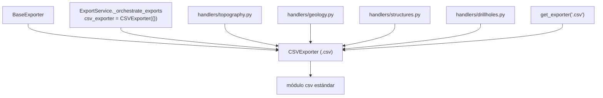

---
tags:
  - secinterp
  - code-walkthrough
  - exporters
  - tabular
aliases:
  - csv_exporter.py
  - CSVExporter
cssclass: secinterp-note
---

# `exporters/csv_exporter.py`

> [!abstract] Resumen en una línea
> Exporter tabular puro en Python estándar: escribe `headers` + `rows` a `.csv` UTF-8 sin tocar QGIS, y es el respaldo exacto que acompaña a cada archivo vectorial de los handlers.

**Ruta**: `exporters/csv_exporter.py` (58 líneas)
**Clase principal**: `CSVExporter(BaseExporter)`
**Capa**: Exporters (100 % QGIS-agnóstico: solo `csv` + `pathlib`)
**Tags**: #secinterp #exporters #tabular

---

## 🎯 ¿Por qué existe este archivo?

Cada entidad exportada (topografía, geología, estructuras, sondajes, interpretaciones)
necesita una representación **legible y auditable** además del binario geoespacial.
El CSV cumple ese rol:

| Problema | Solución |
|----------|----------|
| Inspeccionar números sin abrir un SIG | Tabla `headers` + `rows` en texto plano UTF-8 |
| El SHP trunca campos a 10 caracteres; el DXF trunca anchos | El CSV guarda los valores **exactos** como respaldo |
| Trazabilidad de lo calculado por el core | Cada handler vuelca sus DTOs a CSV junto al vectorial |
| Exportar sin inicializar QGIS | Módulo `csv` estándar: cero imports QGIS |

> [!important] Nota arquitectónica
> Es el **único exporter 100 % puro** del paquete (ni siquiera `qgis.PyQt`). El
> orquestador lo instancia una vez (`CSVExporter({})`) y lo comparte entre todos los
> handlers de una corrida (ver [[orchestrator]]), así que su `export()` debe ser
> reentrante y sin estado.

---

## 🧬 Diagrama de relaciones



> [!tip] Cómo leer
> Una sola instancia de `CSVExporter` sirve a todos los handlers de la corrida: las
> flechas de los handlers son usos compartidos, no propiedad. `layer_name` se acepta
> por contrato pero se ignora (un CSV no tiene capas).

---

## 📦 Imports — lectura arquitectónica

```python
# exporters/csv_exporter.py
from __future__ import annotations

import csv
from pathlib import Path
from typing import Any

from sec_interp.logger_config import get_logger

from .base_exporter import BaseExporter
```

| # | Observación |
|---|-------------|
| ① | `csv` estándar: sin dependencias, sin QGIS, testeable en cualquier intérprete. |
| ② | Ni `qgis.PyQt` siquiera: es el módulo más portable de todo `exporters/`. |
| ③ | `get_logger(__name__)`: el único efecto colateral permitido es el log de fallo. |
| ④ | Herencia de `BaseExporter` solo por **contrato** (`export`, `validate_path`, `get_setting`); no usa `validate_export_path` internamente. |

---

## 🏗️ Inventario de estructura

**Clases:** `class CSVExporter(BaseExporter)` — 1 clase, 2 métodos.

**Métodos:**

- `get_supported_extensions() -> list[str]` — `[".csv"]`
- `export(output_path: Path, data: dict[str, Any], layer_name: str | None = None) -> bool` — escritura tabular (`layer_name` ignorado por contrato)

**Contrato de `data`:**

| Clave | Tipo | Rol |
|-------|------|-----|
| `headers` | `list[str]` | Fila de cabecera |
| `rows` | `list[tuple] \| list[list]` | Una fila por registro del dominio |

---

## 📁 Archivos del paquete

| Archivo | Líneas | Rol |
|---|--:|---|
| `__init__.py` | 81 | `get_exporter()`: `.csv` → `CSVExporter` |
| `base_exporter.py` | 137 | Contrato heredado (ver [[base_exporter]]) |
| `csv_exporter.py` | 58 | `CSVExporter` (esta nota) |
| `vector_exporter.py` | 122 | Gemelo vectorial: cada SHP/GPKG tiene su CSV hermano |
| `dxf_exporter.py` | 126 | El DXF también sale acompañado de su CSV exacto |

> [!note] Pareja inseparable
> En los handlers, cada `export_topography` / `export_geology` / `export_structures`
> escribe **dos** archivos: el vectorial (vía `VectorExporter`) y el tabular (vía esta
> clase). Si el DBF trunca un nombre, el CSV conserva el original.

---

## 📖 Recorrido método por método

### `get_supported_extensions`

```python
def get_supported_extensions(self) -> list[str]:
    """Get supported CSV extension."""
    return [".csv"]
```

Una sola extensión. `validate_path()` heredado rechaza cualquier otra, y la factoría
`get_exporter(".csv", {})` devuelve directamente esta clase.

### `export` — escritura tabular

```python
def export(
    self, output_path: Path, data: dict[str, Any], layer_name: str | None = None
) -> bool:
    """Export tabular data to CSV.

    Args:
        output_path: Output file path.
        data: A dictionary containing 'headers' (list of strings)
              and 'rows' (list of tuples or lists).
        layer_name: Optional conceptual name for the layer (ignored for CSV).

    Returns:
        True if export successful, False otherwise

    """
    if not data:
        return False

    try:
        headers = data.get("headers")
        rows = data.get("rows")
        if not headers or not rows:
            return False

        with output_path.open("w", newline="", encoding="utf-8") as f:
            writer = csv.writer(f)
            writer.writerow(headers)
            writer.writerows(rows)

    except Exception:
        logger.exception(f"CSV export failed for {output_path}")
        return False
    else:
        return True
```

| Paso | Detalle |
|------|---------|
| Guardia 1 | `data` vacío/`None` → `False` sin tocar disco |
| Guardia 2 | `headers` o `rows` ausentes o vacíos → `False` (un CSV sin cabecera o sin filas no se escribe) |
| Apertura | `"w"`, `newline=""` (exigido por el módulo `csv` para no duplicar `\r`), `encoding="utf-8"` |
| Escritura | `writerow(headers)` + `writerows(rows)`; tuplas o listas indistintamente |
| Cierre | El `with` garantiza flush aunque `writerows` falle a medias |
| Fallo | `logger.exception` con traceback + `False`; el handler lo eleva a `ExportError` |

> [!tip] `newline=""` es load-bearing
> Sin él, en Windows cada fila termina en `\r\r\n`. Es un requisito documentado del
> módulo `csv`, no un detalle estético.

> [!warning] Sin cabecera no hay archivo
> Si `rows` existe pero `headers` es `[]`, se devuelve `False`. Los handlers deben
> garantizar cabeceras incluso para datos mínimos.

---

## 🔄 Flujo de datos

| Fase | Entrada | Transformación | Salida |
|------|---------|----------------|--------|
| DTOs | `PreviewResult` / listas del dominio | el handler aplana a `headers` + `rows` | `dict` tabular |
| Guardias | `data`, `headers`, `rows` | dos chequeos de vacío | `False` temprano o continuar |
| Escritura | `(headers, rows)` | `csv.writer` con UTF-8 | archivo `.csv` |
| Resultado | éxito/fracaso | `bool` (+ `ExportError` en el handler) | mensaje en `result_msg` |

---

## 🧩 CSV como respaldo de exactitud

| Riesgo del formato vectorial | Cómo lo cubre el CSV |
|------------------------------|----------------------|
| SHP trunca nombres de campo a 10 caracteres | Cabeceras completas en la primera fila |
| DBF sin `NULL` real ni enteros 64-bit | Valores originales como texto |
| DXF aplana Z y trunca anchos de atributo | Cotas exactas en columnas |
| GPKG requiere visor geoespacial | El CSV se abre en cualquier hoja de cálculo |

---

## 🏛️ Patrones de diseño presentes

| Patrón | Dónde | Propósito |
|--------|-------|-----------|
| **Template Method** | `export()` sobre [[base_exporter]] | Mismo esqueleto, escritura tabular |
| **Shared instance** | `CSVExporter({})` único en `_orchestrate_exports` | Sin estado: reentrante entre handlers |
| **Guard Clauses** | Doble guardia de vacío | Rechazar `data` incompleto sin anidar |
| **Fail-soft** | `except Exception → False` | No romper la corrida por un CSV |

---

## 🧾 Resumen de la API

| Símbolo | Firma / Hereda | Uso típico |
|---------|----------------|------------|
| `CSVExporter` | `(BaseExporter)` | `CSVExporter({})` compartido |
| `export` | `(output_path: Path, data: dict[str, Any], layer_name: str \| None = None) -> bool` | `export(path, {"headers": h, "rows": r})` |
| `get_supported_extensions` | `() -> list[str]` | `[".csv"]` |

---

## 🛡️ Manejo de errores

| Situación | Comportamiento |
|-----------|----------------|
| `data` vacío/`None` | `return False` |
| `headers` o `rows` ausentes/vacíos | `return False` |
| Carpeta inexistente o sin permiso | `logger.exception` + `False` (el `open` lanza) |
| Fila con tipo no serializable | `logger.exception` + `False` (puede dejar archivo parcial) |
| `False` aguas arriba | El handler lanza `ExportError` (ver [[compat]]) |

> [!warning] Archivo parcial posible
> Si `writerows` falla a mitad de las filas, el `with` cierra el archivo pero lo ya
> escrito queda. No hay escritura atómica (temporal + renombre): es una mejora
> candidata si los CSV crecen.

---

## 🧪 Tests asociados

Cobertura directa en `tests/exporters/test_exporters.py`:

- `test_get_supported_extensions` — declara `[".csv"]`.
- `test_export_valid_data` — `headers` + `rows` válidos → `True` y contenido correcto.
- `test_export_empty_data` — `data` vacío → `False`.
- `test_export_missing_headers` — sin `headers` → `False`.
- `test_export_missing_rows` — sin `rows` → `False`.

Cobertura de contrato e integración:

- `test_get_setting_with_default` / `test_get_setting_no_default` — helpers heredados.
- `tests/integration/test_export_service_e2e.py` — `test_export_topography_creates_csv` y hermanos: CSV reales escritos por el orquestador.
- `tests/integration/test_export_workflow.py` — flujo completo con CSV por entidad.

---

## 👀 Observaciones y notas

> [!success] Fortalezas
> - Cero dependencias QGIS: el exporter más simple, rápido y testeable del paquete.
> - Instancia compartida sin estado: reentrante y segura entre handlers.
> - UTF-8 + `newline=""`: portátil entre Linux y Windows.
> - Respaldo exacto frente a truncados SHP/DXF: valor forense real.

> [!warning] Puntos de atención
> - Sin escritura atómica: un fallo a medias deja un CSV parcial con `True` nunca devuelto, pero el archivo existe.
> - `rows` se consume de una vez (`writerows`): datasets gigantes viven enteros en memoria (los genera el handler de todos modos).
> - `layer_name` ignorado en silencio: un llamador que espere multicapa no recibe aviso.
> - Sin opción de delimitador (`;` para Excel europeo): el `csv.writer` usa `,` fijo.

> [!question] Preguntas abiertas
> - ¿Escritura atómica (temporal + `os.replace`) para evitar parciales?
> - ¿Parámetro `delimiter` vía settings para locales con `,` decimal?
> - ¿Validar que `len(row) == len(headers)` por fila antes de escribir?

---

## 🔗 Notas relacionadas

- [[Index]] — índice de la bóveda
- [[base_exporter]] — contrato heredado
- [[exporters]] — nota de capa del paquete
- [[orchestrator]] — instancia única `CSVExporter({})` compartida
- [[compat]] — wrappers legacy que reciben el `csv_exporter`
- [[vector_exporter]] — gemelo vectorial de cada CSV
- [[dtos]] — `PreviewResult`, origen de `headers`/`rows`
- [[controller]] — provee los datos que los handlers aplanan
- [[dialog_export_manager]] — GUI que dispara la corrida
- [[exceptions]] — `ExportError` destino de los `False`

---

*Nota de la bóveda SecInterp Code Walkthrough v2 — v3.9.0*
