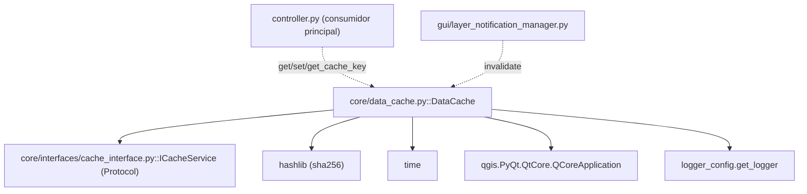

---
tags:
  - secinterp
  - code-walkthrough
  - core
  - cache
aliases:
  - data_cache.py
  - DataCache
cssclass: secinterp-note
---

# `core/data_cache.py`

> [!abstract] Resumen en una línea
> `DataCache` es el **caché en memoria** del core: una implementación de `ICacheService` por buckets (`topo`, `geol`, `struct`, `drill`) con expiración TTL, claves hash deterministas y metadatos arbitrarios (LOD).

**Ruta**: `core/data_cache.py` (169 líneas)
**Clase/Función principal**: `DataCache`
**Capa**: Core (con dependencia puntual de `QCoreApplication` solo para `tr()`)
**Tags**: #secinterp #core #cache

---

## 🎯 ¿Por qué existe este archivo?

Procesar un perfil (topografía, geología, estructura, sondajes) es costoso. Si el usuario
cambia un parámetro que no afecta a un dominio ya calculado, no hay por qué recalcularlo.
`DataCache` evita ese trabajo redundante:

| Problema | Solución |
|----------|----------|
| Recalcular dominios costosos sin necesidad | Caché por `bucket` (`topo`/`geol`/`struct`/`drill`) |
| Invalidar selectivamente cuando cambia una capa | `invalidate(bucket=None, key=None)` granular |
| Claves estables independientes del orden de dict | `get_cache_key()` con `sorted()` + SHA-256 |
| Entradas obsoletas (stale) | TTL con `expiry` y barrido perezoso en `get()` |
| Contrato desacoplado | Implementa `ICacheService` (`Protocol`) |

> [!important] Nota arquitectónica — implementa un puerto
> `DataCache(ICacheService)` es el **implementador real** del `Protocol`
> `ICacheService` (definido en `core/interfaces/cache_interface.py`). Cumple el contrato
> por **forma estructural**, no por herencia nominal. Consumidores como `controller`
> dependen del contrato, no de esta clase concreta.

---

## 🧬 Diagrama de relaciones



> [!tip] Cómo leer
> Sólida = importa; punteada = es usado por. `DataCache` **implementa** `ICacheService`
> (flecha de cumplimiento) y lo consume el `controller` (guarda/recupera resultados de
> perfil) y el `layer_notification_manager` (invalida cuando cambia una capa).

---

## 📦 Imports — lectura arquitectónica

```python
# core/data_cache.py
from __future__ import annotations

import hashlib
import time
from typing import Any

from qgis.PyQt.QtCore import QCoreApplication

from sec_interp.core.interfaces.cache_interface import ICacheService
from sec_interp.logger_config import get_logger

logger = get_logger(__name__)
```

| # | Observación |
|---|-------------|
| ① | `hashlib` + `time` — solo stdlib: hashing de claves y timestamps TTL. |
| ② | `QCoreApplication` — única dependencia QGIS, para `tr()` (traducción de logs). |
| ③ | `ICacheService` — el contrato `Protocol` que esta clase implementa. |
| ④ | No importa DTOs ni entidades: el caché es **genérico** (almacena `Any`). |

> [!warning] Otra *gray area*: `QCoreApplication`
> Como `config.py`, `data_cache.py` importa `QCoreApplication` para `tr()`. Es la
> excepción mínima posible: no toca geometría ni capas, solo traduce mensajes de log.
> La lógica de caché en sí es 100% agnóstica.

---

## 🏗️ Inventario de estructura

**Clases:** `class DataCache(ICacheService)` — 9 métodos

**Constantes de clase:** `DEFAULT_TTL_SECONDS = 3600` (1 hora)

**Estado interno:**
- `_buckets: dict[str, dict[str, dict[str, Any]]]` — estructura `bucket → key → entry`.
- Buckets iniciales: `"topo"`, `"geol"`, `"struct"`, `"drill"`.
- Cada `entry` tiene: `data`, `expiry`, `metadata`, `timestamp`.

**Métodos:**
- `tr()`, `__init__(default_ttl=3600)`, `get_cache_key(params)`, `get(bucket, key)`
- `set(bucket, key, data, metadata=None)`, `invalidate(bucket=None, key=None)`
- `clear()`, `get_metadata(bucket, key)`, `get_cache_size()`

---

## 📁 Archivos del paquete

- `data_cache.py` — nota individual de este archivo (módulo raíz, no es un paquete).

---

## 📖 Recorrido método por método

### `__init__(default_ttl=3600)`

```python
def __init__(self, default_ttl: int = DEFAULT_TTL_SECONDS) -> None:
    self._buckets: dict[str, dict[str, dict[str, Any]]] = {
        "topo": {}, "geol": {}, "struct": {}, "drill": {},
    }
    self.default_ttl = default_ttl
```

Crea los **4 buckets predefinidos** (uno por dominio geológico) y guarda el TTL por
defecto. `set()` también puede crear buckets nuevos sobre la marcha si recibe uno
desconocido.

### `tr(message)`

```python
def tr(self, message: str) -> str:
    return QCoreApplication.translate("DataCache", message)  # type: ignore[no-any-return]
```

Traducción de mensajes con contexto `"DataCache"`. Único uso de QGIS en el módulo.

### `get_cache_key(params)`

```python
def get_cache_key(self, params: dict[str, Any]) -> str:
    key_parts = []
    for k, v in sorted(params.items()):
        if hasattr(v, "id"):
            key_parts.append(f"{k}:{v.id()}")
        elif hasattr(v, "source"):
            key_parts.append(f"{k}:{v.source()}")
        else:
            key_parts.append(f"{k}:{v!s}")
    return hashlib.sha256("".join(key_parts).encode("utf-8")).hexdigest()
```

Genera una **clave hash determinista** a partir de un dict de parámetros:

1. **Orden estable** — `sorted(params.items())` hace la clave independiente del orden.
2. **Normalización de objetos** — si el valor tiene `.id()` (una capa QGIS) usa su id; si
   tiene `.source()` usa su ruta; si no, su `str()`.
3. **SHA-256** — hashea la concatenación de `"k:v"`.

> [!warning] Docstring vs implementación
> El docstring dice *"MD5 hash key"*, pero el código usa `hashlib.sha256`. Es un error de
> documentación menor (el algoritmo real es SHA-256, más seguro).

### `get(bucket, key)`

```python
def get(self, bucket: str, key: str) -> Any | None:
    if bucket not in self._buckets:
        return None
    entry = self._buckets[bucket].get(key)
    if not entry:
        return None
    expiry = entry.get("expiry")
    if expiry and time.time() > expiry:
        logger.debug(f"Cache miss (TTL expired): {bucket}/{key}")
        del self._buckets[bucket][key]
        return None
    return entry.get("data")
```

Recuperación con **barrido perezoso**: si la entrada está expirada, la borra y devuelve
`None`. No hay un hilo de limpieza; la expiración ocurre al intentar leer.

> [!tip] `expiry = None` significa "sin caducidad"
> Si el TTL de la entrada fue `<= 0`, `expiry` se guarda como `None` y la entrada **nunca**
> expira (se mantiene hasta `invalidate`/`clear`).

### `set(bucket, key, data, metadata=None)`

```python
def set(self, bucket: str, key: str, data: Any, metadata: dict | None = None) -> None:
    if bucket not in self._buckets:
        self._buckets[bucket] = {}
    ttl = (metadata or {}).get("ttl", self.default_ttl)
    expiry = time.time() + ttl if ttl > 0 else None
    self._buckets[bucket][key] = {
        "data": data,
        "expiry": expiry,
        "metadata": metadata or {},
        "timestamp": time.time(),
    }
```

Almacena la entrada con 4 campos. El TTL puede venir **por entrada** vía
`metadata["ttl"]` (útil para LOD: entradas más detalladas con TTL distinto). Crea el
bucket si no existe.

### `invalidate(bucket=None, key=None)`

```python
def invalidate(self, bucket: str | None = None, key: str | None = None) -> None:
    if bucket and bucket in self._buckets:
        if key:
            if key in self._buckets[bucket]:
                del self._buckets[bucket][key]
        else:
            self._buckets[bucket].clear()
    elif not bucket:
        for _b_name, b_data in self._buckets.items():
            b_data.clear()
```

Invalidación **granular** en tres niveles:

| Llamada | Efecto |
|---------|--------|
| `invalidate()` | limpia **todos** los buckets |
| `invalidate(bucket="topo")` | limpia **un** bucket |
| `invalidate(bucket="topo", key="abc")` | borra **una** entrada |

### `clear()`

```python
def clear(self) -> None:
    self.invalidate()
```

Atajo de conveniencia: equivale a `invalidate()` (limpia todo). Forma parte del contrato
`ICacheService`.

### `get_metadata(bucket, key)`

```python
def get_metadata(self, bucket: str, key: str) -> dict[str, Any] | None:
    if bucket in self._buckets and key in self._buckets[bucket]:
        return self._buckets[bucket][key].get("metadata")
    return None
```

Devuelve solo los metadatos de una entrada (sin tocar el TTL). Lo usa el `controller`
para leer el estado de LOD sin recuperar los datos completos.

### `get_cache_size()`

```python
def get_cache_size(self) -> dict[str, int]:
    return {name: len(items) for name, items in self._buckets.items()}
```

Método **extra** (no está en `ICacheService`): reporta cuántas entradas hay por bucket.
Útil para diagnóstico/tests. Evidencia que un implementador puede añadir métodos más allá
del contrato.

---

## 🔄 Flujo de datos

| Fase | Entrada | Transformación | Salida |
|------|---------|----------------|--------|
| Clave | `params` dict (capas/campos) | `get_cache_key()` → SHA-256 | clave estable |
| Escritura | `bucket, key, data, metadata` | `set()` con `expiry` | entrada cacheada |
| Lectura | `bucket, key` | `get()` + check TTL | `data` o `None` |
| Invalidación | `bucket?, key?` | `invalidate()` | buckets vaciados |

---

## 🔢 Ejemplo — ciclo de vida de una entrada

Dado un `DataCache` recién creado y un dict de parámetros:

```python
cache = DataCache(default_ttl=3600)

# 1. Generar la clave (determinista)
params = {"layer": layer, "buffer": 100.0, "band": 1}
key = cache.get_cache_key(params)          # -> "a1b2c3..." (SHA-256)

# 2. Escribir con TTL por entrada (LOD)
cache.set("geol", key, geol_data, metadata={"ttl": 60, "lod": 2})

# 3. Leer antes de expirar
assert cache.get("geol", key) is geol_data

# 4. Leer metadatos sin deserializar los datos
meta = cache.get_metadata("geol", key)     # -> {"ttl": 60, "lod": 2}

# 5. Invalidar selectivamente cuando cambia la capa de geología
cache.invalidate("geol")
assert cache.get("geol", key) is None
```

El flujo refleja exactamente el uso en `controller.py`: se calcula una clave por parámetros,
se escribe con metadatos de LOD, se lee, y `layer_notification_manager` invalida el bucket
cuando el usuario modifica la capa correspondiente.

---

## 🌐 i18n y notas de migración

- **Traducción**: solo los mensajes de log usan `self.tr(...)` (contexto `"DataCache"`).
  Los nombres de bucket (`topo`, `geol`, `struct`, `drill`) **no** se traducen.
- **Algoritmo de hash**: el docstring dice "MD5", pero la implementación usa SHA-256 desde
  el inicio. No hace falta migración; solo corregir el docstring.
- **Bucket `"main"`**: `controller.py` usa además un bucket `"main"` (no declarado en
  `__init__`), lo que confirma que `set()` crea buckets dinámicamente.

---

## 🏛️ Patrones de diseño presentes

| Patrón | Dónde | Propósito |
|--------|-------|-----------|
| **Cache-aside** | `get`/`set`/`invalidate` | Caché explícito gestionado por el consumidor |
| **Port / Adapter** | `ICacheService` → `DataCache` | Contrato desacoplado de la implementación |
| **Time-To-Live (TTL)** | `expiry` + barrido perezoso | Expiración sin hilo de limpieza |
| **Key normalization** | `get_cache_key` | Claves deterministas e independientes del orden |
| **Bucket partitioning** | `_buckets` por dominio | Aislamiento de dominios (`topo`, `geol`, …) |

---

## 🧾 Resumen de la API

| Símbolo | Firma / Hereda | Uso típico |
|---------|----------------|------------|
| `DataCache.get_cache_key` | `(params) -> str` | Generar clave hash determinista |
| `DataCache.get` | `(bucket, key) -> Any \| None` | Recuperar con TTL |
| `DataCache.set` | `(bucket, key, data, metadata=None) -> None` | Almacenar entrada |
| `DataCache.invalidate` | `(bucket=None, key=None) -> None` | Invalidación granular |
| `DataCache.clear` | `() -> None` | Limpiar todo |
| `DataCache.get_metadata` | `(bucket, key) -> dict \| None` | Leer metadatos (LOD) |
| `DataCache.get_cache_size` | `() -> dict[str, int]` | Diagnóstico (extra) |

---

## 🛡️ Manejo de errores

Sin excepciones propias: el caché **nunca lanza**. Ante bucket/clave inexistentes,
`get`/`get_metadata` devuelven `None`. La robustez se logra por diseño:

- `set()` crea el bucket si no existe (nunca `KeyError`).
- `invalidate()` comprueba existencia antes de `del`.
- `get()` borra la entrada expirada antes de devolver `None`.

> [!note] Consistencia con el contrato
> El contrato `ICacheService` no declara excepciones; `DataCache` lo cumple fielmente.

---

## 🧪 Tests asociados

Casos puros mapeados a `tests/core/test_data_cache_fix.py`:

- `test_get_cache_key` — mismo dict en distinto orden produce la misma clave; dicts
  distintos producen claves distintas.
- `test_set_and_get` — round-trip por buckets (`topo`/`geol`/`struct`) y aislamiento
  entre buckets (leer `geol` tras escribir en `topo` devuelve `None`).
- `test_get_missing` — clave inexistente → `None`.

---

## 👀 Observaciones y notas

> [!success] Fortalezas
> - Contrato `ICacheService` cumplido por forma estructural (`Protocol`).
> - Claves deterministas e independientes del orden (ideal para cachear por params).
> - Invalidación granular (todo / bucket / entrada).
> - TTL por entrada vía `metadata["ttl"]` (flexible para LOD).

> [!warning] Puntos de atención
> - Docstring dice "MD5" pero se usa SHA-256 (docstring desactualizado).
> - `_buckets` es mutable y compartido: no hay locks; en un escenario multithread (varios
>   `QgsTask`) podría haber condiciones de carrera.
> - `get_cache_size()` no forma parte de `ICacheService` (acoplamiento opcional).
> - Dependencia `QCoreApplication` para `tr()` (gray area).

> [!question] Preguntas abiertas
> - ¿Añadir un `threading.Lock` por bucket para garantizar thread-safety?
> - ¿Unificar el prefijo de buckets para que `invalidate` no dependa de strings mágicos?
> - ¿Documentar/renombrar el hash a SHA-256 en el docstring?

---

## 🔗 Notas relacionadas

- [[Index]] — índice de la bóveda
- [[cache_interface]] — `ICacheService` (el contrato que implementa)
- [[core_interfaces]] — paquete de contratos del core
- [[controller]] — consumidor principal (`get`/`set`/`get_cache_key`)
- [[layer_core_interfaces]] — capa de interfaces
- [[settings_model]] — contraparte: el otro estado persistente (config vs caché)
- [[config]] — `ConfigService` (también usa `QCoreApplication` para `tr`)

---

*Nota de la bóveda SecInterp Code Walkthrough v2 — v3.8.0*
