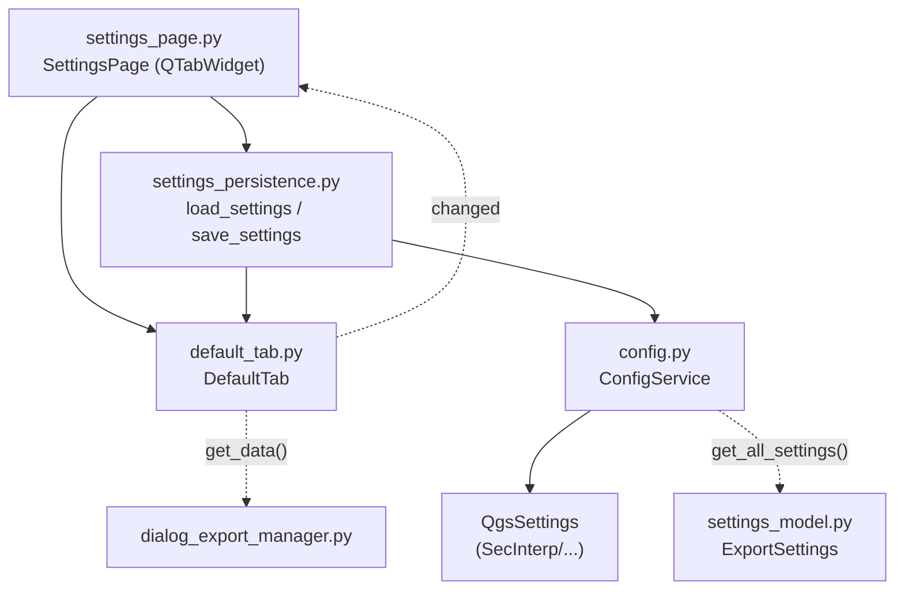

---
tags:
  - secinterp
  - code-walkthrough
  - gui
  - pages
aliases:
  - default_tab.py
  - DefaultTab
cssclass: secinterp-note
---

# `gui/ui/pages/settings/default_tab.py`

> [!abstract] Resumen en una línea
> Pestaña por defecto de ajustes: selección de qué datos generar al guardar (5 checkboxes), formato vectorial, patrón de nombrado y botón de reset, con autoguardado vía `ConfigService`.

**Ruta**: `gui/ui/pages/settings/default_tab.py` (178 líneas)
**Clase principal**: `DefaultTab`
**Capa**: GUI (QGIS-dependiente · página secundaria / tab)
**Tags**: #secinterp #gui #pages

---

## 🎯 ¿Por qué existe este archivo?

Al pulsar "Save", el plugin puede generar hasta cinco productos. Este tab deja
elegir cuáles, en qué formato y con qué nombre, separando la rutina diaria de
las funciones 3D restringidas ([[advanced_tab]]).

| Problema | Solución |
|----------|----------|
| Cinco productos conmutables + formato + naming en un tab | `DefaultTab` con secciones y sub-layouts horizontales |
| Los nombres de checkbox se repiten en reset/desconexión | Tupla `_EXPORT_CHECKBOXES` como fuente única |
| Cada cambio debe persistir sin botón "Aplicar" | Señal `changed` → padre → `save_settings` |
| El usuario puede dejar la selección en estado inútil | `btn_reset_export` restaura todo a defaults |

> [!important] Nota arquitectónica
> Tab de **configuración pura**: no toca capas. Sus valores viajan a
> `ConfigService.set()` (`SecInterp/exp_*`, `export_format`, `export_naming`)
> y el modelado tipado vive en `ExportSettings` (ver [[settings_model]]).

---

## 🧬 Diagrama de relaciones



> [!tip] Cómo leer
> Flecha sólida = importa/llama; punteada = señal o consumo diferido (export).

---

## 📦 Imports — lectura arquitectónica

```python
# gui/ui/pages/settings/default_tab.py
from __future__ import annotations
import contextlib
from typing import Any
from qgis.PyQt.QtCore import QCoreApplication, pyqtSignal
from qgis.PyQt.QtWidgets import (
    QCheckBox,
    QComboBox,
    QHBoxLayout,
    QLabel,
    QLineEdit,
    QPushButton,
    QVBoxLayout,
    QWidget,
)
from sec_interp.logger_config import get_logger
```

| # | Observación |
|---|-------------|
| ① | Import más ancho del paquete settings: combo, línea de texto y botón. |
| ② | Sin `qgis.core`/`qgis.gui`: configuración pura, sin selectores de capa. |
| ③ | `QHBoxLayout` anidados para formato y naming (etiqueta + control). |
| ④ | Señal `changed` (vocabulario settings, igual que `AdvancedTab`). |
| ⑤ | `logger` sí se usa aquí (`logger.info` en el reset). |

---

## 🏗️ Inventario de estructura

**Clase:** `DefaultTab(QWidget)` — 1 señal, 1 constante de módulo, 8 métodos.

| Miembro | Tipo | Rol |
|---------|------|-----|
| `changed` | `pyqtSignal()` | Aviso al padre para autoguardar |
| `chk_exp_topo` | `QCheckBox` | Generar perfil topográfico |
| `chk_exp_geol` | `QCheckBox` | Generar perfil geológico |
| `chk_exp_struct` | `QCheckBox` | Generar datos estructurales |
| `chk_exp_drill` | `QCheckBox` | Generar datos de sondajes |
| `chk_exp_interp` | `QCheckBox` | Generar interpretaciones 2D |
| `combo_format` | `QComboBox` | Shapefile / GeoPackage / DXF |
| `txt_naming` | `QLineEdit` | Patrón `{filename}_{profile}` |
| `btn_reset_export` | `QPushButton` | Restaura defaults del tab |

**Constante:** `_EXPORT_CHECKBOXES` — tupla con los 5 nombres de atributo.

**Métodos:**

| Método | Firma | Propósito |
|--------|-------|-----------|
| `__init__` | `(parent=None) -> None` | Construye y llama `_setup_ui` |
| `tr` | `(message: str) -> str` | Traduce con contexto `"DefaultTab"` |
| `_setup_ui` | `() -> None` | Secciones + sub-layouts + stretch |
| `get_data` | `() -> dict[str, Any]` | Lectura defensiva con `hasattr` |
| `reset_to_defaults` | `() -> None` | Defaults + log informativo |
| `connect_signals` | `() -> None` | Checks + botón + formato + naming |
| `disconnect_signals` | `() -> None` | Delega en dos helpers privados |
| `_disconnect_checkboxes` | `() -> None` | 5 checks + botón, con `suppress` |
| `_disconnect_format_settings` | `() -> None` | Combo + texto, con `hasattr` |

---

## 📁 Archivos del paquete

| Archivo | Líneas | Rol |
|---|---|---|
| `settings/__init__.py` | 9 | Re-exporta `AdvancedTab`, `DefaultTab`, `build_info_tab` |
| `advanced_tab.py` | 106 | Funciones 3D (ver [[advanced_tab]]) |
| `default_tab.py` | 178 | Esta nota: selección de exportación |
| `info_tab.py` | — | Pestaña informativa (`build_info_tab`) |
| `settings_persistence.py` | 75 | `load/save_settings` (ver [[settings_persistence]]) |
| `../settings_page.py` | 124 | Padre con `QTabWidget` (ver [[settings_page]]) |

---

## 📖 Recorrido método por método

### `__init__` + `tr` + `_EXPORT_CHECKBOXES`

```python
_EXPORT_CHECKBOXES = (
    "chk_exp_topo",
    "chk_exp_geol",
    "chk_exp_struct",
    "chk_exp_drill",
    "chk_exp_interp",
)


class DefaultTab(QWidget):
    changed = pyqtSignal()

    def __init__(self, parent: QWidget | None = None) -> None:
        super().__init__(parent)
        self._setup_ui()

    def tr(self, message: str) -> str:
        return QCoreApplication.translate("DefaultTab", message)
```

La tupla evita repetir los cinco nombres en `reset_to_defaults` (bucle) y
documenta el conjunto canónico de productos exportables.

### `_setup_ui`

```python
layout = QVBoxLayout(self)

layout.addWidget(QLabel(self.tr("<b>Export Selection (Save)</b>")))
layout.addWidget(
    QLabel(self.tr("<i>Select which data to generate when clicking Save.</i>"))
)

self.chk_exp_topo = QCheckBox(self.tr("Topographic Profile"))
self.chk_exp_geol = QCheckBox(self.tr("Geological Profile"))
self.chk_exp_struct = QCheckBox(self.tr("Structural Data"))
self.chk_exp_drill = QCheckBox(self.tr("Drillhole Data"))
self.chk_exp_interp = QCheckBox(self.tr("Interpretations (2D)"))
...
```

| Bloque | Contenido |
|--------|-----------|
| Cabecera | Título en negrita + subtítulo en cursiva |
| 5 checks | Un producto cada uno |
| Formato | `QHBoxLayout`: etiqueta + `combo_format` (Shapefile, GeoPackage, DXF) + stretch |
| Naming | `QHBoxLayout`: etiqueta + `txt_naming` (placeholder `{filename}_{profile}`, tooltip de placeholders) |
| Botón | `QHBoxLayout` con stretch + `btn_reset_export` (tooltip de re-habilitado) |
| Cierre | `addStretch()` |

> [!note] Sin estado inicial explícito
> Como en `AdvancedTab`, el estado lo hidrata `load_settings` tras la creación.

### `get_data` — lectura defensiva

```python
def get_data(self) -> dict[str, Any]:
    return {
        "exp_topo": (self.chk_exp_topo.isChecked() if hasattr(self, "chk_exp_topo") else True),
        "exp_geol": (self.chk_exp_geol.isChecked() if hasattr(self, "chk_exp_geol") else True),
        ...
        "export_format": (
            self.combo_format.currentText() if hasattr(self, "combo_format") else "Shapefile"
        ),
        "export_naming": (
            self.txt_naming.text() if hasattr(self, "txt_naming") else "{filename}_{profile}"
        ),
    }
```

| Clave | Fallback | `QgsSettings` |
|-------|----------|---------------|
| `exp_topo/geol/struct/drill/interp` | `True` | `SecInterp/exp_*` (defecto `True`) |
| `export_format` | `"Shapefile"` | `SecInterp/export_format` |
| `export_naming` | `"{filename}_{profile}"` | `SecInterp/export_naming` |

Ocho claves que `SettingsPage.get_data()` fusiona con las cinco de advanced.

### `reset_to_defaults`

```python
def reset_to_defaults(self) -> None:
    for attr in _EXPORT_CHECKBOXES:
        widget = getattr(self, attr, None)
        if widget is not None:
            widget.setChecked(True)

    if hasattr(self, "combo_format"):
        index = self.combo_format.findText("Shapefile")
        if index >= 0:
            self.combo_format.setCurrentIndex(index)

    if hasattr(self, "txt_naming"):
        self.txt_naming.setText("{filename}_{profile}")
    logger.info("Export options reset to defaults.")
```

Todo marcado + Shapefile + patrón canónico. El `findText >= 0` protege ante
modelos de combo alterados. Es el único reset del paquete que loguea.

### `connect_signals`

```python
def connect_signals(self) -> None:
    self.chk_exp_topo.stateChanged.connect(self.changed.emit)
    ...  # 4 checks más
    self.btn_reset_export.clicked.connect(self.reset_to_defaults)

    if hasattr(self, "combo_format"):
        self.combo_format.currentIndexChanged.connect(self.changed.emit)
    if hasattr(self, "txt_naming"):
        self.txt_naming.textChanged.connect(self.changed.emit)
```

Nueve conexiones: cada cambio persiste vía el padre. Nótese que el botón
conecta a `reset_to_defaults`, y el reset dispara `changed` ⇒ autoguardado en
cascada (igual que en advanced).

### `disconnect_signals` + helpers

```python
def disconnect_signals(self) -> None:
    self._disconnect_checkboxes()
    self._disconnect_format_settings()

def _disconnect_checkboxes(self) -> None:
    with contextlib.suppress(TypeError, RuntimeError):
        self.chk_exp_topo.stateChanged.disconnect(self.changed.emit)
    ...  # 4 checks + botón

def _disconnect_format_settings(self) -> None:
    if hasattr(self, "combo_format"):
        with contextlib.suppress(TypeError, RuntimeError):
            self.combo_format.currentIndexChanged.disconnect(self.changed.emit)
    if hasattr(self, "txt_naming"):
        with contextlib.suppress(TypeError, RuntimeError):
            self.txt_naming.textChanged.disconnect(self.changed.emit)
```

Único tab que factoriza la desconexión en dos privados: selección vs.
formato. Patrón más legible que los bloques planos de los hermanos.

---

## 🔄 Flujo de datos

| Fase | Entrada | Transformación | Salida |
|------|---------|----------------|--------|
| Setup | `parent` | `_setup_ui` con secciones | Widgets sin estado |
| Hidratación | `QgsSettings` | `load_settings(settings, default_tab, advanced_tab)` | Checks + formato + naming |
| Edición | Clic/escritura | `stateChanged`/`currentIndexChanged`/`textChanged → changed` | Señal al padre |
| Autoguardado | `changed` | `_on_settings_changed` → `save_settings` | `ConfigService.set(...)` × 8 |
| Lectura | Widgets | `get_data()` defensivo | `dict` de 8 claves |
| Modelo | `QgsSettings` | `ConfigService._load_from_qgs_settings` | `ExportSettings` |
| Reset | `btn_reset_export` | `reset_to_defaults()` + log | Defaults + autoguardado |
| Cierre | Diálogo | `disconnect_signals()` en dos fases | Sin señales colgadas |

---

## 📐 Mapeo tab → SettingsModel → QgsSettings

| Widget | `get_data()` | `QgsSettings` (`SecInterp/…`) | Modelo |
|--------|--------------|-------------------------------|--------|
| `chk_exp_topo` | `exp_topo` | `exp_topo` | Flag de selección de exportación |
| `chk_exp_geol` | `exp_geol` | `exp_geol` | Flag de selección de exportación |
| `chk_exp_struct` | `exp_struct` | `exp_struct` | Flag de selección de exportación |
| `chk_exp_drill` | `exp_drill` | `exp_drill` | Flag de selección de exportación |
| `chk_exp_interp` | `exp_interp` | `exp_interp` | Flag de selección de exportación |
| `combo_format` | `export_format` | `export_format` | `ExportSettings.default_format` |
| `txt_naming` | `export_naming` | `export_naming` | `ExportSettings.naming_pattern` |

---

## 🏛️ Patrones de diseño presentes

| Patrón | Dónde | Propósito |
|--------|-------|-----------|
| **Composite (tab)** | `SettingsPage` + tabs | Contrato uniforme default/advanced |
| **Observer** | `changed` | Autoguardado reactivo |
| **Fuente única** | `_EXPORT_CHECKBOXES` | Evita divergencias reset/desconexión |
| **Programación defensiva** | `hasattr`/`getattr` | Soporta dobles parciales |
| **Método plantilla** | `disconnect_signals` → helpers | Desconexión por fases |
| **Guarded disconnect** | `contextlib.suppress` | Desconexión idempotente |
| **Fachada de persistencia** | `settings_persistence` | Tabs sin `QgsSettings` directo |

---

## 🧾 Resumen de la API

| Símbolo | Firma / Hereda | Uso típico |
|---------|----------------|------------|
| `DefaultTab` | `QWidget` | `SettingsPage.tab_widget.addTab(DefaultTab(), ...)` |
| `changed` | `pyqtSignal()` | `tab.changed.connect(self._on_settings_changed)` |
| `get_data()` | `-> dict[str, Any]` | 8 claves de selección/formato |
| `reset_to_defaults()` | `-> None` | Restaurar + log |
| `connect_signals()` | `-> None` | Cablear al mostrar |
| `disconnect_signals()` | `-> None` | Descablear en dos fases |
| `_EXPORT_CHECKBOXES` | `tuple[str, ...]` | Iterar los 5 productos |

---

## 🛡️ Manejo de errores

- `get_data`/`reset`/`connect`/`disconnect` toleran atributos ausentes.
- `findText("Shapefile") >= 0` antes de `setCurrentIndex`: combo alterado ⇒ no-op.
- Desconexión suprimida (`TypeError`/`RuntimeError`) en cada señal.
- Sin validación del patrón de naming (placeholders libres): el exportador
  resuelve `{filename}`/`{profile}` al generar.

---

## 🧪 Tests asociados

Sin `tests/gui/test_default_tab.py` dedicado; cobertura vía páginas y diálogo:

- `tests/gui/test_settings_page.py::TestSettingsPage::test_load_settings` — hidratación de checks, formato y naming.
- `test_save_settings` — persistencia de las 8 claves vía `ConfigService`.
- `test_get_data` — fusión default + advanced en `SettingsPage.get_data()`.
- `test_initialization` — widgets expuestos por `_expose_tab_widgets`.
- `tests/gui/test_main_dialog_settings.py` — parseo y persistencia global de settings.

---

## 🌐 i18n y notas de migración

- Contexto `"DefaultTab"`; cabeceras HTML y tooltips traducidos.
- Los ítems del combo (`"Shapefile"`, `"GeoPackage"`, `"DXF"`) se añaden sin
  `tr()`: son identificadores de formato, no texto libre (criterio correcto).
- El placeholder `{filename}_{profile}` no se traduce: es sintaxis, no prosa.
- Sin `qgis.core`/`qgis.gui`: a salvo de cambios de API 3.x → 4.x.

---

## 👀 Observaciones y notas

> [!success] Fortalezas
> - `_EXPORT_CHECKBOXES` como fuente única: reset y docs no divergen.
> - Desconexión factorizada en dos helpers, la más limpia del paquete.
> - Formato/naming con fallbacks sensatos para dobles parciales.

> [!warning] Puntos de atención
> - Nada impide desmarcar los 5 productos: "Save" no generaría nada sin aviso.
> - El naming no se valida (placeholders desconocidos pasan en silencio).
> - `logger.info` en cada reset puede ensuciar el log si se abusa del botón.

> [!question] Preguntas abiertas
> - ¿Advertir si los 5 productos están desmarcados al guardar?
> - ¿Validar el patrón de naming (al menos `{filename}` presente)?

---

## 🔗 Notas relacionadas

- [[Index]] — índice de la bóveda
- [[settings_page]] — página padre con el `QTabWidget`
- [[gui_ui_pages_settings]] — paquete de tabs de ajustes
- [[advanced_tab]] — tab hermano de funciones 3D
- [[settings_persistence]] — `load/save_settings` que hidratan este tab
- [[settings_model]] — `ExportSettings` y `PluginSettings`
- [[config]] — `ConfigService` (`get`/`set`, prefijo `SecInterp/`)
- [[dialog_export_manager]] — consumidor de la selección al guardar

---

*Nota de la bóveda SecInterp Code Walkthrough v2 — v3.9.0*
