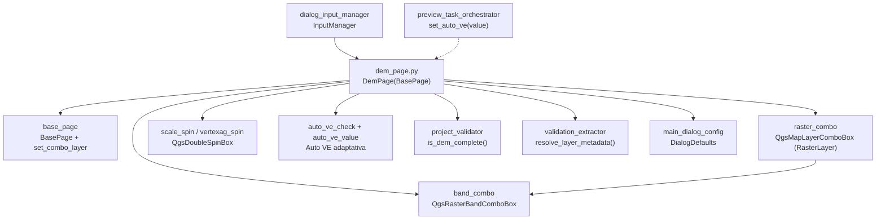

---
tags:
  - secinterp
  - code-walkthrough
  - gui
  - pages
aliases:
  - dem_page.py
  - DemPage
cssclass: secinterp-note
---

# `gui/ui/pages/dem_page.py`

> [!abstract] Resumen en una línea
> Página de configuración del ráster DEM: selector de capa y banda, resolución auto-calculada, escala sugerida y exageración vertical manual o adaptativa (Auto VE con etiqueta de valor en vivo).

**Ruta**: `gui/ui/pages/dem_page.py` (271 líneas)
**Clase principal**: `DemPage(BasePage)`
**Capa**: GUI (presentación programática · Extract hacia `ValidationParams`)
**Tags**: #secinterp #gui #pages

---

## 🎯 ¿Por qué existe este archivo?

El perfil topográfico es la columna vertebral de la sección: sin DEM no hay
elevaciones que muestrear ni escala de dibujo. Esta página concentra todo lo que
el diálogo necesita saber del ráster antes de previsualizar.

| Problema | Solución |
|----------|----------|
| El usuario debe elegir ráster, banda, escala y exageración vertical sin perderse entre diálogos QGIS | Una sola página con selección de ráster + banda + resolución + ajustes de perfil |
| La resolución y la escala dependen del ráster elegido y hay que recalcularlas al cambiar de capa | `_update_resolution()` recalcula al recibir `layerChanged` |
| Una VE fija deforma Perfiles suaves o aplana relieves abruptos | Toggle Auto/Manual: en Auto el pipeline adaptativo calcula la VE y `set_auto_ve()` la muestra en vivo |

> [!important] Nota arquitectónica
> Extract puro: `get_data()` entrega la capa viva y primitivos; `is_complete()`
> convierte la capa a `LayerMetadata` con `resolve_layer_metadata` y delega en
> `ProjectValidator.is_dem_complete`. El core nunca ve un `QgsRasterLayer`.

---

## 🧬 Diagrama de relaciones



> [!tip] Cómo leer
> Flecha sólida = importa/delega; punteada = el orquestador de preview inyecta la VE calculada.

---

## 📦 Imports — lectura arquitectónica

```python
# gui/ui/pages/dem_page.py
from __future__ import annotations

from typing import Any

from qgis.core import Qgis, QgsUnitTypes
from qgis.gui import QgsDoubleSpinBox, QgsMapLayerComboBox, QgsRasterBandComboBox
from qgis.PyQt.QtCore import QCoreApplication
from qgis.PyQt.QtWidgets import QCheckBox, QGridLayout, QGroupBox, QHBoxLayout, QLabel, QLineEdit

from sec_interp.core.validation.project_validator import ProjectValidator, ValidationParams
from sec_interp.gui.adapters.validation_extractor import resolve_layer_metadata
from sec_interp.gui.main_dialog_config import DialogDefaults

from .base_page import BasePage, set_combo_layer
```

| # | Observación |
|---|-------------|
| ① | `qgis.gui` aporta los tres combos especializados: capa ráster, banda ráster y spin flotante con etiqueta de unidad. |
| ② | `Qgis.LayerFilter.RasterLayer` filtra el combo a rásteres; `QgsUnitTypes` traduce las unidades del CRS a texto (`toString`). |
| ③ | `QCoreApplication.translate` solo se usa para el título del grupo; el resto de etiquetas usa `self.tr()`. |
| ④ | Importa el validador core y el extractor que desacopla la capa a `LayerMetadata`: la frontera Extract-then-Compute en dos líneas. |
| ⑤ | `DialogDefaults` centraliza los valores iniciales (`SCALE`, `VERTICAL_EXAGGERATION`, `AUTO_VERTICAL_EXAGGERATION`, `DEFAULT_BAND`). |
| ⑥ | `set_combo_layer` de la base: `load()` restaura la capa sin disparar `layerChanged`. |

---

## 🏗️ Inventario de estructura

**Clase `DemPage(BasePage)`** — `layer_keys = frozenset({"dem_layer"})`:

Construcción y layout:

- `__init__(self, iface: Any = None, parent: Any = None) -> None`
- `_setup_ui(self) -> None` — `QGridLayout` + 3 bloques
- `_setup_raster_selection(self) -> None` — fila 0: etiqueta, combo ráster, testigo
- `_setup_band_and_resolution(self) -> None` — fila 1: banda, resolución, unidades
- `_setup_profile_settings(self) -> None` — grupo anidado con escala y VE

Exageración vertical adaptativa:

- `_on_auto_ve_toggled(self, checked: bool) -> None`
- `set_auto_ve(self, value: float | None) -> None`
- `_update_resolution(self) -> None`

Protocolo `BasePage`:

- `get_data`, `dump`, `load`, `reset`, `validate`, `is_complete`, `connect_signals`, `disconnect_signals`

**Widgets (nombres exactos del código):**

| Widget | Tipo | Rol |
|--------|------|-----|
| `raster_combo` | `QgsMapLayerComboBox` | Ráster DEM (filtro `RasterLayer`, permite vacía) |
| `lbl_raster_status` | `QLabel` 16×16 | Testigo visual de estado del ráster |
| `band_combo` | `QgsRasterBandComboBox` | Banda del ráster (ancho mínimo 150) |
| `res_edit` | `QLineEdit` solo lectura | Resolución nativa auto-calculada |
| `units_edit` | `QLineEdit` solo lectura, ancho 50 | Unidades del mapa (`QgsUnitTypes.toString`) |
| `settings_group` | `QGroupBox` | Grupo anidado "Profile Settings" |
| `scale_spin` | `QgsDoubleSpinBox` 1–1000000, 0 decimales | Escala 1:N (defecto `DialogDefaults.SCALE`) |
| `vertexag_spin` | `QgsDoubleSpinBox` 0.1–100, paso 0.5, 1 decimal | VE manual (defecto `VERTICAL_EXAGGERATION`) |
| `auto_ve_check` | `QCheckBox` "Auto" | Activa la VE adaptativa (defecto `True`) |
| `auto_ve_value` | `QLabel` "—" | Muestra la VE calculada (`"2.5×"`) |

---

## 📖 Recorrido método por método

### `__init__` — guarda `iface` y título traducido

```python
def __init__(self, iface: Any = None, parent: Any = None) -> None:
    self.iface = iface
    super().__init__(QCoreApplication.translate("DemPage", "Digital Elevation Model"), parent)
    self.iface = iface
```

Acepta `iface` opcional (hoy sin uso: `_update_resolution` no lo necesita) y pasa el
título traducido a la base. La doble asignación de `self.iface` es redundante pero
inofensiva. Es la única página con `iface`; [[main_window]] la crea como `DemPage(iface)`.

### `_setup_ui` — rejilla de 3 bloques

```python
def _setup_ui(self) -> None:
    super()._setup_ui()

    self.group_layout = QGridLayout(self.group_box)
    self.group_layout.setSpacing(6)

    self._setup_raster_selection()
    self._setup_band_and_resolution()
    self._setup_profile_settings()
```

Instala un `QGridLayout` (espaciado 6) sobre el `group_box` heredado y delega en tres
constructores privados. El patrón `_setup_*` se repite en [[preview_page]] y facilita
testear cada bloque por separado.

### `_setup_raster_selection` — combo de ráster con filtro

```python
self.raster_combo = QgsMapLayerComboBox()
self.raster_combo.setFilters(Qgis.LayerFilters(Qgis.LayerFilter.RasterLayer))
self.raster_combo.setAllowEmptyLayer(True)
self.raster_combo.setToolTip(self.tr("Select the raster DEM layer"))
self.raster_combo.setCurrentIndex(0)
```

El filtro `RasterLayer` oculta vectoriales; `setAllowEmptyLayer(True)` permite el
estado "sin selección", que `validate()` rechaza con `"Raster layer is required"`.
El testigo `lbl_raster_status` (16×16) queda reservado para el semáforo de
validez que gestiona el diálogo desde fuera.

### `_setup_band_and_resolution` — banda y resolución de solo lectura

```python
self.band_combo = QgsRasterBandComboBox()
self.band_combo.setMinimumWidth(150)
...
self.res_edit = QLineEdit()
self.res_edit.setReadOnly(True)
self.units_edit = QLineEdit()
self.units_edit.setReadOnly(True)
self.units_edit.setMaximumWidth(50)
```

La banda sigue automáticamente a la capa (`layerChanged → band_combo.setLayer`,
ver `connect_signals`). Resolución y unidades son informativas: las calcula
`_update_resolution()` y el usuario no puede editarlas, evitando inconsistencias
entre el valor mostrado y el ráster real.

### `_setup_profile_settings` — grupo anidado antes del stretch

```python
self.settings_group = QGroupBox(self.tr("Profile Settings"))
settings_layout = QGridLayout(self.settings_group)
# ... escala + VE manual + Auto inicializados desde DialogDefaults ...
self._on_auto_ve_toggled(self.auto_ve_check.isChecked())

count = self.main_layout.count()
self.main_layout.insertWidget(count - 1, self.settings_group)
```

Crea el sub-grupo "Profile Settings" con escala y VE, y lo inserta **antes** del
stretch (penúltima posición) para que quede pegado a los controles superiores en
vez de flotar abajo. La llamada final a `_on_auto_ve_toggled` sincroniza el
estado inicial del spin manual con el checkbox (activo por defecto).

### `_on_auto_ve_toggled` — conmutador Auto/Manual

```python
def _on_auto_ve_toggled(self, checked: bool) -> None:
    self.vertexag_spin.setEnabled(not checked)
    self.auto_ve_value.setVisible(checked)
```

En modo Auto el spin manual se deshabilita (no se puede fijar una VE que el
pipeline va a ignorar) y aparece la etiqueta con el valor calculado; en manual
ocurre lo inverso. Es el mismo idioma visual que el toggle LOD de
[[preview_page]] (`_toggle_lod_spin`).

### `set_auto_ve` — etiqueta en vivo de la VE adaptativa (2026-09-21)

```python
def set_auto_ve(self, value: float | None) -> None:
    self.auto_ve_value.setText("—" if value is None else f"{value:.1f}×")
```

Punto de inyección del pipeline de preview: cuando el orquestador calcula la
exageración vertical adaptativa, la muestra aquí formateada con un decimal y el
símbolo `×` (`"2.5×"`); `None` (aún sin preview) restaura el guion. La página no
calcula nada: solo exhibe el valor que el core/GUI de preview le entrega.

### `_update_resolution` — resolución nativa y escala sugerida

```python
def _update_resolution(self) -> None:
    layer = self.raster_combo.currentLayer()
    if not layer:
        self.res_edit.clear()
        self.units_edit.clear()
        return

    res = layer.rasterUnitsPerPixelX()
    units = layer.crs().mapUnits()
    # ... muestra la resolución con 2 decimales (fallback a str) ...
    # ... traduce unidades con QgsUnitTypes.toString(units) ...
    # ... si son metros: escala sugerida round((res*2000)/1000)*1000 ...
```

Lee `rasterUnitsPerPixelX()` y las unidades del CRS, las muestra con 2 decimales
y, si las unidades son metros, sugiere una escala redondeada al millar
(`round((res*2000)/1000)*1000`). Sin capa, limpia ambos campos (no deja valores
obsoletos). El `try/except` cubre rásteres que devuelven resoluciones no
numéricas. Nótese que también pisa `scale_spin`: por eso `load()` bloquea sus
señales durante la llamada y restaura el valor persistido después.

### `get_data` — lectura con la capa viva

```python
def get_data(self) -> dict[str, Any]:
    return {
        "raster_layer": self.raster_combo.currentLayer(),
        "selected_band": self.band_combo.currentBand(),
        "scale": self.scale_spin.value(),
        "vertexag": self.vertexag_spin.value(),
        "auto_vert_exag": self.auto_ve_check.isChecked(),
    }
```

Devuelve la capa viva (la desacopla `InputManager` con `resolve_layer_metadata`)
y primitivos. `currentBand()` es `int` (1-based); `DialogDefaults.DEFAULT_BAND`
es `1`, consistente con `reset()`.

### `dump` / `load` — persistencia con renombrado de claves

```python
def dump(self) -> dict[str, Any]:
    return {
        "dem_layer": self.raster_combo.currentLayer(),
        "dem_band": self.band_combo.currentBand(),
        "scale": self.scale_spin.value(),
        "vert_exag": self.vertexag_spin.value(),
        "auto_vert_exag": self.auto_ve_check.isChecked(),
    }
```

`dump` renombra `raster_layer → dem_layer`, `selected_band → dem_band` y
`vertexag → vert_exag`: el namespace de sesión (`layer_keys = {"dem_layer"}`)
difiere del de lectura. `load()` restaura capa (con `set_combo_layer` + propaga
al `band_combo`), banda, escala, VE y Auto, re-sincroniza el toggle y recalcula
la resolución con señales bloqueadas… para reimponer al final la escala
persistida por encima de la sugerida.

### `reset` — defecto de `DialogDefaults`

```python
def reset(self) -> None:
    self.raster_combo.setLayer(None)
    self.band_combo.setBand(DialogDefaults.DEFAULT_BAND)
    self.scale_spin.setValue(float(DialogDefaults.SCALE))
    self.vertexag_spin.setValue(float(DialogDefaults.VERTICAL_EXAGGERATION))
    self.auto_ve_check.setChecked(bool(DialogDefaults.AUTO_VERTICAL_EXAGGERATION))
    self._on_auto_ve_toggled(self.auto_ve_check.isChecked())
```

Vacía la capa, restaura banda 1, escala `"50000"`, VE `"1.0"` y Auto activado,
cerrando con la sincronización del toggle. Nótese `setLayer(None)` directo (sin
`set_combo_layer`): aquí las cascadas son bienvenidas porque limpian banda y
resolución.

### `validate` / `is_complete` — dos niveles de chequeo

```python
def validate(self) -> tuple[bool, str]:
    if not self.raster_combo.currentLayer():
        return False, self.tr("Raster layer is required")
    return True, ""

def is_complete(self) -> bool:
    data = self.get_data()
    params = ValidationParams(raster_layer=resolve_layer_metadata(data["raster_layer"]))
    return ProjectValidator.is_dem_complete(params)
```

`validate()` (Nivel 1, mensaje i18n para el diálogo) solo exige capa; `is_complete()`
(Nivel 2, para el estado del sidebar/botones) pasa por `DEMValidator` vía
`is_dem_complete`, que además exige banda válida. La capa viva se convierte a
`LayerMetadata` antes de cruzar al core.

### `connect_signals` / `disconnect_signals` — cableado capa→banda→resolución

```python
def connect_signals(self) -> None:
    self.raster_combo.layerChanged.connect(self.band_combo.setLayer)
    self.raster_combo.layerChanged.connect(self._update_resolution)
    self.auto_ve_check.toggled.connect(self._on_auto_ve_toggled)
# disconnect_signals revierte las tres con un único try/except (TypeError, RuntimeError).
```

Una señal (`layerChanged`) alimenta dos slots: sincronizar la banda y recalcular
resolución+escala. La desconexión usa un único `try/except` para las tres (a
diferencia del `contextlib.suppress` por línea de otras páginas): si la primera
falla, las restantes no se intentan — asimetría conocida, ver observaciones.

---

## 🔄 Flujo de datos

| Fase | Entrada | Transformación | Salida |
|------|---------|----------------|--------|
| Selección | proyecto QGIS | filtro `RasterLayer` + capa vacía permitida | `raster_combo.currentLayer()` |
| Cascada | `layerChanged` | `band_combo.setLayer` + `_update_resolution` | banda, resolución, unidades, escala sugerida |
| VE adaptativa | pipeline de preview | cálculo de VE (fuera de la página) | `set_auto_ve(v)` → etiqueta `"2.5×"` |
| Lectura | widgets | `get_data()` | `raster_layer/selected_band/scale/vertexag/auto_vert_exag` |
| Validación | capa viva | `resolve_layer_metadata` + `is_dem_complete` | `bool` para el diálogo |
| Persistencia | widgets | `dump()` | `dem_layer/dem_band/scale/vert_exag/auto_vert_exag` |
| Restauración | dict + capas resueltas | `load()` + `set_combo_layer` | widgets + resolución recalculada |

---

## 🏛️ Patrones de diseño presentes

| Patrón | Dónde | Propósito |
|--------|-------|-----------|
| **Template Method** | `_setup_ui` → 3× `_setup_*` | Subdividir construcción por bloques testeables |
| **Observer (Qt signals)** | `layerChanged` → banda + resolución | Cascada automática al cambiar de ráster |
| **Strategy (Auto/Manual)** | `_on_auto_ve_toggled` + `set_auto_ve` | VE fijada por usuario o calculada por pipeline |
| **Extract-then-Compute** | `get_data` + `is_complete` | GUI extrae, `ProjectValidator` decide |
| **Supresión de señales** | `load` + `set_combo_layer` | Restaurar sin cascadas intermedias |

---

## 🧾 Resumen de la API

| Símbolo | Firma / Hereda | Uso típico |
|---------|----------------|------------|
| `DemPage` | `(BasePage)`, `iface` opcional | `DemPage(iface)` en [[main_window]] |
| `layer_keys` | `frozenset({"dem_layer"})` | Namespace de persistencia |
| `get_data` | `raster_layer/selected_band/scale/vertexag/auto_vert_exag` | Lectura para `InputManager` |
| `dump` | `dem_layer/dem_band/scale/vert_exag/auto_vert_exag` | Persistencia multi-sesión |
| `set_auto_ve` | `(float \| None) -> None` | Etiqueta en vivo desde el preview |
| `validate` | capa obligatoria | Puerta de export/preview |
| `is_complete` | vía `is_dem_complete` | Estado del sidebar |

---

## 🛡️ Manejo de errores

- Sin capa: `_update_resolution` limpia los campos (no muestra basura); `validate` devuelve `(False, mensaje)`; `is_complete` es `False` por guarda `if not params.raster_layer`.
- Resolución no numérica: `try/except (ValueError, TypeError)` con fallback a `str(res)`.
- Escala sugerida solo si `scale > 0` y unidades en metros: evita pisar la escala con basura en CRS geográficos.
- `disconnect_signals` traga `TypeError`/`RuntimeError` (doble desconexión al reconectar y cerrar).

---

## 🧪 Tests asociados

Cobertura directa real en `tests/gui/test_dem_page.py` (`TestDemPage`, con
`QApplication` en `setUpClass` y `BaseTestCase`):

- Contrato `get_data`: claves `raster_layer/selected_band/scale/vertexag/auto_vert_exag`.
- Contrato `dump`: claves `dem_layer/dem_band/scale/vert_exag/auto_vert_exag`.
- Toggle Auto/Manual de VE (`_on_auto_ve_toggled` + `set_auto_ve`).
- `validate` sin capa → `(False, …)`; `is_complete` con mocks de capa.

Cobertura indirecta:

- `tests/gui/test_dialog_input_manager.py` — `InputManager.get_all_values()` y `get_validation_params()` consumen `get_data()` del DEM.
- `tests/gui/test_main_dialog_validation_manager.py` — reglas `dem` del diálogo.
- `tests/gui/test_multi_session_persistence.py` — round-trip `dump/load` con `dem_layer`.
- `tests/gui/test_signal_restoration.py` — las conexiones `layerChanged` sobreviven a reconexiones.

---

## 🌐 i18n y notas de migración

- Todas las etiquetas y tooltips usan `self.tr(...)` (`"Raster Layer *"`, `"Band"`, `"Resolution"`, `"Profile Settings"`, `"Scale 1:"`, `"Vert. Exag."`, `"Auto"`…); el título usa `QCoreApplication.translate("DemPage", …)`.
- El formato `f"{value:.1f}×"` de `set_auto_ve` no es traducible (número + símbolo universal): correcto no envolverlo en `tr()`.
- `QgsUnitTypes.toString(units)` ya localiza el nombre de la unidad vía la API QGIS.

---

## 👀 Observaciones y notas

> [!success] Fortalezas
> - Cascada capa→banda→resolución→escala en dos conexiones claras, con limpieza defensiva cuando no hay capa.
> - VE adaptativa bien separada: la página exhibe (`set_auto_ve`), el pipeline calcula; ningún acoplamiento inverso.
> - `load()` cuidadoso: bloquea señales, recalcula y reimpone la escala persistida por encima de la sugerida.

> [!warning] Puntos de atención
> - `disconnect_signals` con un solo `try/except` global: si falla la primera desconexión, las otras dos no se intentan. El resto de páginas usa `suppress` por línea.
> - `self.iface = iface` duplicado en `__init__`; además `iface` hoy no se usa (`_update_resolution` no lo necesita).
> - `load()` invoca `_update_resolution()` que pisa `scale_spin`, y luego restaura la escala: funciona, pero el orden es frágil si alguien reordena.
> - La escala sugerida solo contempla metros; en CRS en pies o grados no sugiere nada (silencio, no error).

> [!question] Preguntas abiertas
> - ¿Unificar `disconnect_signals` al estilo `contextlib.suppress` por línea como [[geology_page]] y [[structure_page]]?
> - ¿Eliminar el `iface` sin uso o cablearlo al cálculo de resolución (p. ej. CRS del canvas)?

---

## 🔗 Notas relacionadas

- [[Index]] — índice de la bóveda
- [[base_page]] — protocolo `get_data/dump/load/reset` y `set_combo_layer`
- [[gui_ui_pages]] — paquete de páginas y su ensamblaje
- [[main_window]] — instancia `DemPage(iface)` en el `QStackedWidget`
- [[sidebar]] — entrada "DEM / Raster" (`mIconRaster.svg`)
- [[dialog_input_manager]] — consume `get_data()` y construye `ValidationParams`
- [[project_validator]] — `is_dem_complete` / `DEMValidator`
- [[validation_extractor]] — `resolve_layer_metadata` (capa viva → `LayerMetadata`)
- [[main_dialog_config]] — `DialogDefaults` (escala, VE, banda)
- [[preview_task_orchestrator]] — inyecta la VE adaptativa vía `set_auto_ve`
- [[vertical_exaggeration_service]] — cálculo de la VE que la etiqueta exhibe
- [[section_page]] — la otra página obligatoria para previsualizar

---

*Nota de la bóveda SecInterp Code Walkthrough v2 — v3.9.1*
