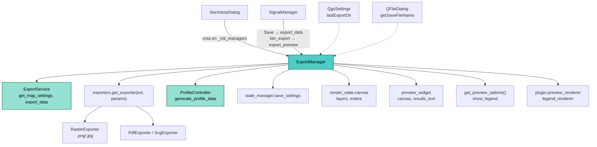

---
tags:
  - secinterp
  - code-walkthrough
  - gui
  - managers
aliases:
  - dialog_export_manager.py
  - ExportManager
cssclass: secinterp-note
---

# `gui/dialog_export_manager.py`

> [!abstract] Resumen en una línea
> `ExportManager` concentra las dos salidas del diálogo: exporta la imagen de la vista previa (PNG/JPG/PDF/SVG vía `get_exporter`) y orquesta la exportación de datos (SHP/CSV vía `ExportService`), con diálogos de guardado, dimensiones de alta resolución y autoguardado de ajustes.

**Ruta**: `gui/dialog_export_manager.py` (218 líneas)
**Clase principal**: `ExportManager`
**Capa**: GUI · Manager de `SecInterpDialog` (presentación y delegación a exporters)
**Tags**: #secinterp #gui #managers

---

## 🎯 ¿Por qué existe este archivo?

Exportar mezcla diálogos de fichero, ajustes de mapa, factorías de formato y
orquestación de datos. Sin este manager, todo ese código viviría en el diálogo:

| Problema | Solución |
|----------|----------|
| El diálogo no debe conocer formatos ni resoluciones | `ExportManager` decide dimensiones y factoría por extensión |
| Recordar la última carpeta visitada | `QgsSettings("SecInterp/lastExportDir")` en `_get_save_path` |
| La exportación de datos toca controller + servicio + UI | `export_data` orquesta validar → generar → exportar → informar |
| Exportar sin vista previa confunde al usuario | Guardas tempranas con `push_message` de aviso |

> [!important] Nota arquitectónica
> Manager de presentación: **extrae** (lienzo, capas, opciones) y **delega** el trabajo
> real a `ExportService` (map settings + datos) y a la factoría `get_exporter`. No
> escribe ficheros por sí mismo.

---

## 🧬 Diagrama de relaciones



> [!tip] Cómo leer
> Flecha sólida = crea/llama; punteada = servicio del sistema (ajustes, diálogo de fichero).

---

## 📦 Imports — lectura arquitectónica

```python
# gui/dialog_export_manager.py
from __future__ import annotations

from pathlib import Path            # ①
from typing import TYPE_CHECKING    # ②

from qgis.core import Qgis, QgsSettings        # ③
from qgis.PyQt.QtCore import QSize             # ④
from qgis.PyQt.QtGui import QColor             # ④
from qgis.PyQt.QtWidgets import QFileDialog    # ⑤

import sec_interp                                # ⑥
from sec_interp.core.exceptions import SecInterpError  # ⑦
from sec_interp.core.performance_metrics import MetricsCollector, PerformanceTimer  # ⑧
from sec_interp.core.services.export_service import ExportService  # ⑨
from sec_interp.exporters import get_exporter    # ⑩
from sec_interp.logger_config import get_logger

if TYPE_CHECKING:                                # ②
    pass
```

| # | Observación |
|---|-------------|
| ① | `pathlib.Path` en toda la API pública (`_get_save_path`, `_execute_preview_export`): rutas tipadas, no `str`. |
| ② | Bloque `TYPE_CHECKING` vacío (marcador para futuros tipos sin coste de import). |
| ③ | `Qgis.MessageLevel` para notificaciones y `QgsSettings` para persistir la última carpeta. |
| ④ | `QSize` (tamaño de salida raster) y `QColor` (fondo blanco de exportación). |
| ⑤ | `QFileDialog.getSaveFileName` estático: el diálogo de guardado vive aquí, no en `main_dialog`. |
| ⑥ | `import sec_interp` raíz para anotar `dialog: sec_interp.gui.main_dialog.SecInterpDialog` sin import circular en tiempo de ejecución. |
| ⑦ | `SecInterpError` distingue el fallo de dominio esperado del error inesperado. |
| ⑧ | `MetricsCollector` + `PerformanceTimer("Total Preview Export Time")` miden la exportación. |
| ⑨ | `ExportService(controller)` construido con el controller del plugin: map settings y datos. |
| ⑩ | Factoría `get_exporter(ext, export_params)`: el manager no conoce las clases concretas por formato. |

---

## 🏗️ Inventario de estructura

**Clases:** `class ExportManager` — 7 métodos.

**Métodos:**

- `__init__(dialog)` — guarda el diálogo, crea métricas y `ExportService(controller)`.
- `export_preview() -> bool` — exporta la imagen actual (guardas + diálogo + ejecución).
- `_show_export_error(message)` — aviso estandarizado vía `push_message` (nivel Warning).
- `_get_save_path() -> Path | None` — `QFileDialog` con filtro de 4 formatos + `QgsSettings`.
- `_execute_preview_export(path, layers) -> bool` — dimensiones, parámetros, map settings, factoría.
- `_get_export_dimensions(ext) -> tuple[int, int, int]` — 3× @ 300 dpi en raster; tamaño de lienzo @ 96 en vectorial.
- `export_data() -> bool` — pipeline completo SHP/CSV: validar → autoguardar → generar → exportar.

---

## 📖 Recorrido método por método

### `__init__` — Referencia al diálogo y servicio

```python
def __init__(self, dialog: sec_interp.gui.main_dialog.SecInterpDialog) -> None:
    self.dialog = dialog
    self.metrics = MetricsCollector()
    self.export_service = ExportService(self.dialog.plugin_instance.controller)
```

A diferencia de `PreviewManager` (que usa `Any`), aquí el diálogo se anota con la
ruta completa gracias a `import sec_interp`: sin ciclo porque el acceso real ocurre
en tiempo de ejecución. El servicio se construye con el controller del plugin.

### `export_preview` — Imagen con guardas tempranas

```python
def export_preview(self) -> bool:
    self.metrics.clear()
    try:
        if not self.dialog.render_state.canvas:
            self._show_export_error(
                self.dialog.tr("No preview available to export. Generate a preview first.")
            )
            return False

        layers = self.dialog.render_state.canvas.layers()
        if not layers:
            self._show_export_error(self.dialog.tr("No layers to export."))
            return False

        output_path = self._get_save_path()
        if not output_path:
            return False

        with PerformanceTimer("Total Preview Export Time", self.metrics):
            success = self._execute_preview_export(output_path, layers)
            if success:
                self.dialog.push_message(
                    self.dialog.tr("Success"),
                    self.dialog.tr("Preview exported to {}").format(output_path.name),
                    level=Qgis.MessageLevel.Success,
                )
            return success
    except Exception as e:
        self.dialog.handle_error(e, self.dialog.tr("Export Error"))
        return False
```

| Guarda | Mensaje |
|--------|---------|
| Sin lienzo (`render_state.canvas` es `None`) | "No preview available to export. Generate a preview first." |
| Lienzo sin capas | "No layers to export." |
| Usuario cancela el diálogo | `return False` silencioso (no es error) |

Contrato `bool` simple para el slot de `btn_export`. Solo muestra el mensaje de
éxito si la exportación tuvo éxito; cualquier excepción cae a `handle_error`.

### `_show_export_error` — Aviso estandarizado

```python
def _show_export_error(self, message: str) -> None:
    self.dialog.push_message(
        self.dialog.tr("Export Error"), message, level=Qgis.MessageLevel.Warning
    )
```

Centraliza título ("Export Error") y nivel (`Warning`): las guardas no repiten el
formato del aviso.

### `_get_save_path` — Diálogo de guardado con memoria

```python
def _get_save_path(self) -> Path | None:
    settings = QgsSettings()
    last_dir = settings.value("SecInterp/lastExportDir", "", type=str)
    default_path = str(Path(last_dir) / "preview.png") if last_dir else "preview.png"

    file_filter = (
        "PNG Image (*.png);;JPEG Image (*.jpg *.jpeg);;PDF Document (*.pdf);;SVG Vector (*.svg)"
    )

    path_str, _ = QFileDialog.getSaveFileName(
        self.dialog, self.dialog.tr("Export Preview"), default_path, file_filter
    )
    if not path_str:
        return None

    path = Path(path_str)
    settings.setValue("SecInterp/lastExportDir", str(path.parent))
    return path
```

Recuerda la última carpeta en `QgsSettings` y propone `preview.png` dentro de ella.
El filtro ofrece los cuatro formatos soportados por la factoría. Si el usuario
cancela, devuelve `None` y el llamante sale en silencio.

### `_execute_preview_export` — Parámetros, mapa y factoría

```python
def _execute_preview_export(self, path: Path, layers: list) -> bool:
    ext = path.suffix.lower()
    width, height, dpi = self._get_export_dimensions(ext)

    opts = self.dialog.get_preview_options()
    export_params = {
        "width": width,
        "height": height,
        "dpi": dpi,
        "background_color": QColor(255, 255, 255),
        "show_legend": opts.get("show_legend", True),
        "legend_renderer": getattr(self.dialog.plugin_instance, "preview_renderer", None),
        "title": self.dialog.tr("Section Interpretation Preview"),
        "description": self.dialog.tr("Generated by SecInterp QGIS Plugin"),
        "extent": self.dialog.render_state.canvas.extent(),
    }

    map_settings = self.export_service.get_map_settings(
        layers,
        export_params["extent"],
        self.dialog.preview_widget.canvas.size(),
        export_params["background_color"],
    )

    if ext in [".png", ".jpg", ".jpeg"]:
        map_settings.setOutputSize(QSize(width, height))

    exporter = get_exporter(ext, export_params)
    return exporter.export(path, map_settings)
```

| Paso | Detalle |
|------|---------|
| Extensión normalizada | `path.suffix.lower()`: decide dimensiones y factoría. |
| Opciones del diálogo | `get_preview_options()` (p. ej. `show_legend`, por defecto `True`). |
| Renderer de leyenda | `getattr(plugin, "preview_renderer", None)`: tolera su ausencia. |
| Map settings | Delegados a `ExportService` con extent del lienzo y tamaño del canvas. |
| Tamaño de salida | Solo se fija en raster (`QSize(width, height)`); el vectorial usa el tamaño base. |
| Factoría | `get_exporter(ext, export_params).export(path, map_settings)` devuelve `bool`. |

### `_get_export_dimensions` — Resolución por formato

```python
def _get_export_dimensions(self, ext: str) -> tuple[int, int, int]:
    canvas_width = self.dialog.preview_widget.canvas.width()
    canvas_height = self.dialog.preview_widget.canvas.height()

    if ext in [".png", ".jpg", ".jpeg"]:
        return canvas_width * 3, canvas_height * 3, 300
    return canvas_width, canvas_height, 96
```

Raster a triple resolución (300 dpi, apto para informe) y vectorial (PDF/SVG) a
tamaño de lienzo con 96 dpi: el escalado vive en el exportador, no en píxeles.

### `export_data` — Pipeline SHP/CSV completo

```python
def export_data(self) -> bool:
    try:
        # 1. Validate inputs via dialog
        params = self.dialog.plugin_instance._get_and_validate_inputs()
        if not params:
            return False

        # Auto-save current valid settings
        self.dialog.state_manager.save_settings()

        # Get values for output path (still needed from dialog/values)
        values = self.dialog.get_selected_values()
        output_folder = Path(values["output_path"])

        # 2. Generate data via controller
        self.dialog.preview_widget.results_text.setPlainText(
            self.dialog.tr("✓ Generating data for export...")
        )
        profile_data, geol_data, struct_data, drillhole_data, _ = (
            self.dialog.plugin_instance.controller.generate_profile_data(params)
        )

        if not profile_data:
            self.dialog.push_message(
                self.dialog.tr("Error"),
                self.dialog.tr("No profile data generated."),
                level=Qgis.MessageLevel.Critical,
            )
            return False

        num_interps = len(self.dialog.interpretations)
        logger.info(f"Exporting data: found {num_interps} interpretation(s) in dialog.")

        # Extract export settings
        export_options = {
            "exp_topo": values.get("exp_topo", True),
            "exp_geol": values.get("exp_geol", True),
            "exp_struct": values.get("exp_struct", True),
            "exp_drill": values.get("exp_drill", True),
            "exp_interp": values.get("exp_interp", True),
            "drill_3d_traces": values.get("drill_3d_traces", True),
            "drill_3d_intervals": values.get("drill_3d_intervals", True),
            "drill_3d_original": values.get("drill_3d_original", True),
            "drill_3d_projected": values.get("drill_3d_projected", False),
        }

        result_msg = self.export_service.export_data(
            output_folder, params, profile_data, geol_data, struct_data,
            drillhole_data, interp_data=self.dialog.interpretations,
            export_options=export_options,
        )

        self.dialog.preview_widget.results_text.setPlainText("\n".join(result_msg))
    except SecInterpError as e:
        self.dialog.handle_error(e, self.dialog.tr("Data Export Error"))
        return False
    except Exception as e:
        self.dialog.handle_error(e, self.dialog.tr("Unexpected Data Export Error"))
        return False
    else:
        return True
```

Cinco fases: (1) validar entradas; (2) **autoguardar** ajustes válidos antes de
exportar; (3) generar datos con `controller.generate_profile_data` (los mensajes
del controller se descartan con `_`); (4) exigir perfil topográfico (sin topo no
hay nada que exportar → mensaje `Critical`); (5) delegar en
`ExportService.export_data` con las interpretaciones del diálogo y publicar el
resumen línea a línea en `results_text`.

> [!note] `export_options` con defaults
> Cada bandera usa `values.get(clave, default)`; solo `drill_3d_projected` vale
> `False` por defecto. Así un diccionario de valores parcial no rompe la llamada.

---

## 🔄 Flujo de datos

| Fase | Entrada | Transformación | Salida |
|------|---------|----------------|--------|
| Guardas | `render_state.canvas` | lienzo y capas presentes | `layers` o aviso |
| Destino | `QgsSettings` + `QFileDialog` | carpeta recordada + filtro | `Path` o `None` |
| Imagen | capas + extent + opciones | `get_map_settings` + `get_exporter(ext)` | fichero PNG/JPG/PDF/SVG |
| Validar | widgets | `_get_and_validate_inputs` | `PreviewParams` o `False` |
| Autoguardar | estado del diálogo | `state_manager.save_settings()` | ajustes persistidos |
| Generar | `params` | `controller.generate_profile_data` | 4 dominios + mensajes |
| Datos | dominios + interpretaciones | `ExportService.export_data` | ficheros SHP/CSV + resumen |

---

## 🏛️ Patrones de diseño presentes

| Patrón | Dónde | Propósito |
|--------|-------|-----------|
| **Manager (descomposición de diálogo)** | clase completa | Sacar la exportación de `SecInterpDialog` |
| **Factory** | `get_exporter(ext, export_params)` | Elegir exportador por extensión |
| **Facade de servicio** | `ExportService` | Ocultar map settings y escritura de datos |
| **Guard clauses** | `export_preview`, `export_data` | Salir pronto ante lienzo/capas/params vacíos |
| **Memento implícito** | `QgsSettings lastExportDir` | Recordar la última carpeta |

---

## 🧾 Resumen de la API

| Símbolo | Firma | Uso típico |
|---------|-------|------------|
| `ExportManager(dialog)` | constructor | Creado en `main_dialog._init_managers` |
| `export_preview()` | `-> bool` | Slot de `btn_export` (vía `SignalManager`) |
| `export_data()` | `-> bool` | Botón Save del `button_box` (vía `SignalManager`) |
| `_get_save_path()` | `-> Path \| None` | Destino de la imagen (`None` = cancelado) |
| `_execute_preview_export(path, layers)` | `-> bool` | Núcleo de exportación de imagen |
| `_get_export_dimensions(ext)` | `-> tuple[int, int, int]` | `(width, height, dpi)` por formato |

---

## 🛡️ Manejo de errores

| Situación | Comportamiento |
|-----------|----------------|
| Sin lienzo o sin capas | Aviso `Warning`, `False` (no excepción) |
| Usuario cancela el guardado | `False` silencioso |
| `SecInterpError` en datos | `handle_error` + título "Data Export Error" |
| Excepción inesperada | `handle_error` + títulos "Export Error" / "Unexpected Data Export Error" |
| Sin perfil topográfico | Mensaje `Critical` "No profile data generated.", `False` |

---

## 🌐 i18n

Títulos y mensajes pasan por `self.dialog.tr()`: "Export Preview", "Success",
"Preview exported to {}", "Section Interpretation Preview", "Generated by SecInterp
QGIS Plugin", "✓ Generating data for export..." y los títulos de error. El filtro
del `QFileDialog` queda en inglés (nombres de formato estándar).

---

## 🧪 Tests asociados

Cobertura real en `tests/gui/test_dialog_export_manager.py` (mock-first, sin QGIS):

- `test_export_preview_no_canvas` / `test_export_preview_no_layers` — guardas tempranas.
- `test_export_preview_success` / `test_export_preview_canceled` — éxito con factoría mockeada y cancelación silenciosa.
- `test_export_preview_exception` — caída a `handle_error`.
- `test_execute_preview_export_formats` — dimensiones y factoría por extensión.
- `test_export_data_validation_fail` / `test_export_data_no_profile` — salidas tempranas del pipeline.
- `test_export_data_success` / `test_export_data_sec_interp_error` — delegación y error de dominio.

---

## 👀 Observaciones y notas

> [!success] Fortalezas
> - Las dos salidas (imagen y datos) conviven con contratos `bool` homogéneos.
> - Autoguardado de ajustes antes de exportar: lo exportado coincide con lo visible.
> - Factoría por extensión: añadir un formato no toca el manager.
> - Raster 3× @ 300 dpi frente a vectorial 1×: decisión de calidad documentada en código.

> [!warning] Puntos de atención
> - `export_data` accede al privado `plugin._get_and_validate_inputs()` y a `dialog.interpretations` directamente: acoplamiento al plugin y al `InterpretationManager`.
> - Los mensajes del controller se descartan (`_`) en lugar de mostrarse: se pierde contexto útil.
> - `export_preview` captura solo `Exception` genérico (sin nivel `SecInterpError`): el exportador debería distinguir el fallo de dominio.
> - `background_color` blanco fijo y `extent` del lienzo actual: la exportación refleja el zoom, no toda la sección.

> [!question] Preguntas abiertas
> - ¿Pasar por `InputManager`/`get_selected_values` en vez del privado del plugin?
> - ¿Mostrar los mensajes del controller junto al resumen de exportación?
> - ¿Añadir `SecInterpError` al `except` de `export_preview` como en `export_data`?

---

## 🔗 Notas relacionadas

- [[Index]] — índice de la bóveda
- [[main_dialog]] — crea el manager; `get_preview_options`, `get_selected_values`
- [[dialog_signal_manager]] — Save → `export_data`, `btn_export` → `export_preview`
- [[dialog_preview_manager]] — produce el lienzo y las capas que se exportan
- [[dialog_state_manager]] — `save_settings` invocado antes de exportar datos
- [[core_services_export]] — `ExportService` (map settings y exportación de datos)
- [[controller]] — `generate_profile_data` en el pipeline de datos
- [[preview_renderer]] — `preview_renderer` como `legend_renderer`
- [[main_dialog_config]] — configuración del diálogo

---

*Nota de la bóveda SecInterp Code Walkthrough v2 — v3.8.0*
